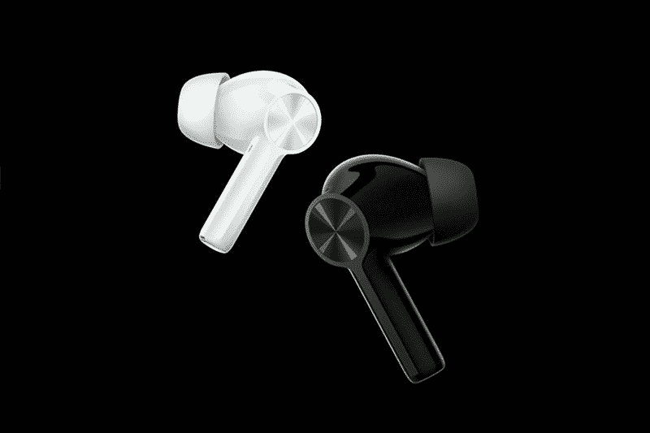

# 一加 9RT 和 Buds Z2 以实惠的价格带来卓越的功能

> 原文：<https://www.xda-developers.com/oneplus-9rt-buds-z2-launch-china/>

虽然一加[今年不会推出其旗舰车型](https://www.xda-developers.com/oneplus-9t-officially-canceled/)[一加 9](https://www.xda-developers.com/oneplus-9/) 的“T”型变体，但价格实惠的一加 9R 已经获得了中期更新。它的继任者一加 9RT 带来了几项改进，包括更强大的 SoC，稍微更新的设计和更好的摄像头。随着一加 9RT，一加发布了新的负担得起的 TWS 耳塞-一加芽 Z2。与去年的[一加耳塞 Z](https://www.xda-developers.com/oneplus-buds-z-affordable-true-wireless-earbuds-fast-charging/) 相比，这款耳塞也带来了一些值得注意的改进。

## 一加 9RT:规格

| 

规格

 | 

一加 9RT

 |
| --- | --- |
| **构建** | 

*   IP68 防尘防水等级

 |
| **尺寸&重量** | 

*   163.2 x 73.2 x 8.7mm 毫米
*   197g

 |
| **显示** | 

*   6.62 英寸 FHD+三星 E4 AMOLED
*   120 赫兹刷新率
*   600Hz 触摸采样率
*   1300 尼特峰值亮度
*   1000000:1 对比度
*   100% DCI-P3 覆盖率
*   HDR10+

 |
| **SoC** | 

*   高通骁龙 888
    *   1 个 Kryo 680(基于 ARM Cortex X1)Prime core @ 2.84 GHz
    *   3 个 Kryo 680(基于 ARM Cortex A78)性能内核@ 2.4GHz
    *   4 个 Kryo 680(基于 ARM Cortex A55)高效内核@ 1.8GHz
*   Adreno 660 GPU

 |
| **闸板&存放** | 

*   8GB LPDDR5 + 128GB UFS 3.1
*   8GB + 256GB
*   12GB + 256GB

 |
| **电池&充电** | 

*   4500 毫安时
*   65W 快充支持

 |
| **安全** | 显示指纹扫描仪 |
| **后置摄像头** | 

*   主要:50MP 索尼 IMX 766 f/1.8，OIS
*   超宽:16MP
*   宏:不适用

 |
| **前置摄像头** | 16MP |
| **端口** | USB 类型-C |
| **音频** | 立体声扬声器 |
| **连通性** | 

*   5G
*   长期演进
*   无线网络 6
*   蓝牙 5.1
*   国家足球联盟
*   全球定位系统/A-GPS

 |
| **软件** | 基于 Android 11 的 ColorOS 12 |
| **其他特性** | 

*   用于冷却的大型蒸汽室
*   高达 7GB 的虚拟扩展内存

 |

* * *

正如在过去几周的各种泄露中所见，新款一加 9RT 采用了略微更新的设计，配备了类似旗舰一加 9 的新相机模块。它装有高通的旗舰产品骁龙 888 芯片，这是对其前身骁龙 870 的一大进步，再加上高达 12GB 的内存和 256GB 的存储空间。一加还在设备中包括了一个更大的蒸汽室，以提供更强大的芯片组更好的散热。

一加 9RT 采用 6.62 英寸 FHD+120 赫兹三星 E4 AMOLED 显示屏，带有用于自拍相机的左对齐打孔切口，所有侧面都有最小的边框。该面板提供了令人印象深刻的 600 赫兹触摸采样率，这在一加是第一次。

一加 9RT 的主摄像头是对之前型号的又一次重大升级，因为它现在采用了 50MP 索尼 IMX 766 传感器，而不是 48MP 索尼 IMX 586 传感器。这与旗舰产品一加 9 duo 的超广角相机中的传感器相同，所以你可以期待这款手机提供一些令人印象深刻的结果。主摄像头配有一个 16MP 超宽摄像头和一个微距摄像头。在正面，该设备配有一个 16MP 自拍相机。

其他规格基本保持不变。该设备仍然具有 4500 毫安时电池，支持 65 瓦快速充电，USB Type-C 端口，显示指纹扫描仪，双立体声扬声器和一加标志性的警报滑块。对于无线连接，一加 9RT 提供 5G 支持、LTE、Wi-Fi 6、NFC 和蓝牙 5.1。

就软件而言，一加 9RT 出人意料地运行基于 Android 11 的 ColorOS 12。看起来一加甚至不会为未来中国市场的 HydrogenOS 产品费心。我们希望该设备在国际市场推出基于 Android 12 的 OxygenOS 12。

## 一加芽 Z2:规格

| 

规格

 | 

一加芽 Z2

 |
| --- | --- |
| **建造** | 不适用的 |
| **尺寸&重量** | 不适用的 |
| **扬声器驱动器** | 

*   11 毫米动态驱动器
*   针对低音再现进行了调整

 |
| **麦克风** | 三麦克风阵列 |
| **连通性** | 蓝牙 5.2 |
| **电池&充电** | 

*   仅耳塞:
    *   ANC on:最长 5 小时
    *   ANC 关闭:最长 7 小时
*   耳塞+外壳:
    *   ANC 开启:最长 27 小时
    *   ANC 关闭:最长 35 小时
*   快速充电支持
    *   充电 10 分钟可增加 5 小时的综合播放时间

 |
| **其他特性** | 

*   IP55 认证(仅耳塞)
*   杜比大气
*   Dirac 音频调谐器
*   支持主动噪声消除(40dB 峰值)
*   用于充电的 USB 型端口

 |
| **颜色** | 

*   黑曜石黑
*   珍珠白

 |

* * *

一加耳塞 Z2 与最初的一加耳塞 z 相比有一些值得注意的改进。最新的 TWS 耳塞具有更大的 11 毫米动态驱动器、主动噪音消除(ANC)支持和更长的电池寿命。虽然一加没有改变太多的设计，但耳塞确实采用了新的黑曜石黑色配色。

 <picture></picture> 

OnePlus Buds Z2

一加芽 Z2 提供蓝牙 5.2 支持，三麦克风阵列，防水等级为 IP55。ANC 打开时，耳塞可连续播放 5 小时，ANC 关闭时可连续播放 7 小时。使用充电盒，在 ANC 打开的情况下，耳塞一次充电可持续 27 小时，在 ANC 关闭的情况下可持续 35 小时。

耳塞还支持快速充电，一加声称快速充电 10 分钟将增加 5 小时的播放时间。

## 定价和可用性

一加 9RT 将于 10 月 19 日开始在中国销售。它将有银色和黑色两种颜色，起价为 3299 元人民币(约合 512 美元)。更高端的 8GB/256GB 和 12GB/256GB 版本的价格分别为 3499 元人民币(约 543 美元)和 3799 元人民币(约 590 美元)。一加 Buds Z2 也将于 10 月 19 日在该地区上市。耳塞也将有两种颜色可供选择——黑曜石黑和珍珠白。这款耳塞将花费你 499 元人民币(约 77 美元)。

目前，一加尚未透露国际市场的定价和供货细节。一旦公司透露更多信息，我们会尽快通知您。