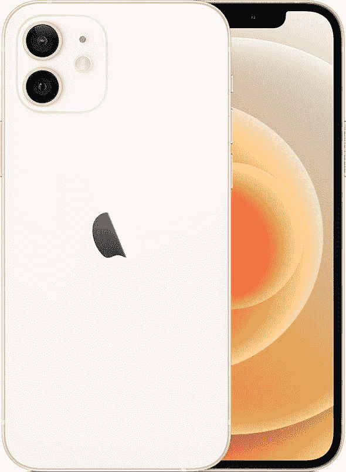

# 一加 9RT vs 苹果 iPhone 12:你该买哪款智能手机？

> 原文：<https://www.xda-developers.com/oneplus-9rt-vs-apple-iphone-12/>

随着每一款新手机的发布，与选择购买智能手机相关的困境只会变得更加复杂。随着公司全年推出新手机，消费者有大量的品牌、型号和质量可供选择。根据你的预算，你会发现自己面对着几个价格相同但功能不同的设备。一加 9RT 是一款价格适中的新手机，起价约 512 美元。花同样多的钱，你可以买一部二手 iPhone 12，或者多花 200 美元买一部新的。那么哪款手机适合你呢？我们可以通过分解规格并列出每个规格的细节来帮助您做出相应的判断和决定。这是[一加 9RT](https://www.xda-developers.com/oneplus-9rt-buds-z2-launch-china/) 对苹果的 iPhone 12——两款截然不同的手机之间的战争。

## 一加 9RT vs 苹果 iPhone 12:规格

|  | 

一加 9RT

 | 

苹果 iPhone 12

 |
| --- | --- | --- |
| **CPU** | 

*   高通骁龙 888
    *   1 个 Kryo 680(基于 ARM Cortex X1)Prime core @ 2.84 GHz
    *   3 个 Kryo 680(基于 ARM Cortex A78)性能内核@ 2.4GHz
    *   4 个 Kryo 680(基于 ARM Cortex A55)高效内核@ 1.8GHz

 |  |
| **正文** | 

*   163.2 x 73.2 x 8.7mm 毫米
*   197g

 | 

*   146.7×71.5×7.4 毫米
*   164 克

 |
| **显示** | 

*   6.62 英寸 FHD+三星 E4 AMOLED
*   2400 x 1080p 像素
*   120 赫兹刷新率
*   600Hz 触摸采样率
*   1300 尼特峰值亮度
*   HDR10+

 | 

*   6.1 英寸 Super Retina XDR 有机发光二极管显示屏
*   2532 x 1170p 像素
*   60Hz 刷新率
*   HDR10
*   杜比视觉
*   陶瓷屏蔽

 |
| **摄像机** | 

*   初级:50MP，f/1.8
*   超宽:16MP，f/2.2
*   宏:2MP，f/2.4
*   前置:1600 万像素，f/2.4

 | 

*   初级:12MP，f/1.6
*   超宽:12MP，f/2.4，120 FoV
*   前置:12MP，f/2.2

 |
| **内存** | 

*   8GB/12GB 内存
*   128GB/256GB 存储空间

 | 

*   4GB 内存
*   64GB/128GB/256GB 存储空间

 |
| **电池** | 

*   4500 毫安时
*   65W 快速充电

 | 

*   2815 毫安时
*   20W 有线快速充电
*   7.5W Qi 无线充电
*   15W MagSafe 充电

 |
| **连通性** | 

*   5G
*   4G LTE
*   无线网络 6
*   蓝牙 5.1

 | 

*   Sub6/mmWave 5G
*   4G LTE
*   Wi-Fi 802.11 a/b/g/n/ac/6
*   蓝牙 5.0
*   超宽带

 |
| **水**水**阻力** | IP68 | IP68 |
| **安全** | 显示指纹扫描仪 | Face ID |
| **操作系统** | 基于 Android 11 的 ColorOS 12 | iOS 15 |
| **颜色** |  | 

*   黑色
*   怀特（姓氏）
*   (产品)红色
*   格林（姓氏）；绿色的
*   蓝色
*   紫色

 |
| **材质** |  | 

*   玻璃背面
*   铝制框架

 |
| **价格** | 起价 512 美元 | 起价 699 美元 |

## 建造和设计

一加 9RT 和苹果的 iPhone 12 在构造和设计上有很大不同。首先，一加手机是塑料的，而 iPhone 12 是铝制的。不过，这两款手机都有玻璃后盖，所以你必须小心意外跌落。iPhone 在这里获得了额外的加分，因为它是铝制的，而一加手机是塑料的，

一加 9RT 的背面是哑光的，而 iPhone 12 的背面是闪亮的。这给一加手机加分，因为指纹和划痕不会那么明显。不过，值得一提的是，由于整洁明亮的玻璃平板，iPhone 看起来更高档。它让我们想起了 iPhone 4 时代，拥有高端的外观和握持感。

说到设计，这两款手机都有一个垂直排列的后置摄像头，有一个可见的凸起。如果我们看前面，一加 9RT 的前面有一个打孔相机，而苹果的有一个长缺口。它们都有薄边框，但一加手机有一个底部下巴。当谈到打孔/切口的争论时，这个问题纯粹是主观的。有些人喜欢前者，而有些人更快适应后者。最终，这些设备看起来完全不同——哪一个对你有吸引力取决于你的个人品味。不过，值得注意的是，iPhone 有六种颜色，而一加 9RT 只有两种。

## 显示

正如我们上面提到的，这两款平价手机有着明显的正面差异。一加 9RT 包括一个打孔相机，而 iPhone 12 的功能与以前的 Face ID iPhone 型号相同。这两款设备都有全屏的窄边框显示屏，使观看内容或游戏变得身临其境。有些人觉得凹口很碍眼，而有些人觉得它比打孔设计更干净。哪种显示器看起来更自然，更符合你的使用模式，这完全取决于你自己。

说到质量，iPhone 12 客观上击败了一加 9RT。前者的分辨率为 2532 x 1170 p，高于后者的 2400 x 1080，但你在日常使用中不太可能注意到这些额外的像素。然而，一加手机在其他一些方面比 iPhone 12 更出色。

一加 9RT 配备了更大的 6.62 英寸显示屏，击败了苹果的 6.1 英寸显示屏。此外，它还具有 120 赫兹的刷新率，是 iPhone 60 赫兹刷新率的两倍。这使得滚动列表和一些动画更流畅。不过，有些人可能会认为更大的显示器是个骗局。因此，这真的取决于你的优先事项和你在手机屏幕上寻找什么，以决定哪部手机的显示屏更适合你。

说到显示器，一加 9RT 配备了一个光学显示器内指纹传感器。这允许你通过将注册的指尖放在实际的屏幕上来解锁你的手机。另一方面，Face ID 是苹果 iPhone 12 的保证。考虑到我们正处于一个要求我们戴口罩的疫情，很多人会更喜欢指纹识别器而不是面部识别。然而，如果你深入苹果生态系统，当你戴着面具时，你可以用苹果手表解锁你的 Face ID iPhone。

## 表演

说到性能，我们必须考虑很多方面。虽然 iPhone 12 已经推出一年多了，但你不应该削弱苹果 A14 仿生芯片的功能。此外，虽然一加手机是最近发布的，但它的处理器也有一年多的历史了。我们已经通过基准测试来比较 A14 Bionic 和骁龙 888，以突出每个处理器的优势和劣势。如果我们看总的芯片分数，A14 仿生赢了。然而，骁龙 888 确实有一些优于苹果的优点。

A14 Bionic 在单核和多核 CPU 性能测试中击败了骁龙 888。此外，它在电池消耗方面效率更高，CPU 时钟速度提高了 9%。然而，骁龙 888 在游戏性能上击败了 A14 仿生。在游戏和 OpenCL/Vulcan 中的 GPU 性能方面，它的得分更高。此外，它还多了两个内核，支持 20%的更高内存带宽，并显示出高达 10%的更好的 AnTuTu 分数(同时消耗更多电池)。

如果你打算积极使用你的新手机玩游戏，那么你可能要考虑一加 9RT。不过，这并不是说 iPhone 12 不是一款出色的游戏手机。A14 仿生芯片仍然有更高的综合得分，对你宝贵的电池电量会更温和。最终，它们都是 2020 年末发布的旗舰处理器——所以它们不是最新的，但它们仍然强大而有能力。

## 摄像机

相机可以成为某一类用户的主要卖点。我个人遇到过这样的人，他们只是问“它拍的照片好吗？”就在购买设备之前(如果他们从卖家那里得到肯定的答复)。在表面水平上，我们有一个明显的赢家——一加 9RT。为了分解这两款设备的摄像头，让我们从正面开始。两款手机都有一个前置摄像头。一加 9RT 的 16MP 击败了苹果的 12MP，但苹果的光圈为 f/2.2，击败了一加手机的 f/2.4。

说到后置摄像头，一加手机有三个，而 iPhone 只有两个。它们都有主镜头和超宽镜头，但一加 9RT 有一个微距镜头作为奖励。iPhone 12 上的普通镜头被评为 12MP，而一加分别将它们提高到 50MP 和 16MP。不过，iPhone 12 的主摄像头光圈更大。

一加 9RT 配有一个 200 万像素的微距镜头。此外，由于前置摄像头明显更好，它可以拍摄精彩的自拍。因此，如果你想拍出更好的照片，你可能会考虑购买一加手机，因为它有更多更好的相机。

## 电池寿命和充电

与 iPhone 12 相比，一加 9RT 的电池更大，支持更高的有线充电功率。然而，前者缺乏无线充电功能，这对许多人来说可能是一个障碍。除了 Qi 无线充电，iPhone 12 还支持 MagSafe 无线充电和配件。

苹果表示，iPhone 12 一次充电可以播放长达 65 小时的音频和 17 小时的离线视频。显然，这些数字会根据您的设置、环境和使用情况而有所不同。一加没有分享类似的统计数据，但可以肯定的是，你不需要每天给这两种设备充电超过一次。最终，它们都没有坏的电池寿命。考虑到 iPhone 的无线充电功能和一加 9RT 更快的有线充电，这一轮是平局——因为一些用户将更喜欢更快的有线充电而不是 Qi 支持，反之亦然。

## 一加 9RT vs iPhone 12:你该买哪个？

我们已经分解了每种设备的主要特性和规格。你应该买哪一个，完全看你的喜好和轻重缓急。如果你想要一部拍照效果更好的手机，你可以考虑买一加。如果你想要一部速度更快的手机，它只能工作，并通过软件更新在更长时间内得到支持，那么 iPhone 12 就是你的选择。有些人有操作系统偏好。因此，如果你在苹果生态系统中，并且只会购买 iPhone，那么 iPhone 12 显然是正确的选择。同样，如果你不能忍受库比蒂诺巨人及其围墙花园和生态系统，那么一加 9RT 是你应该看看的。不过，iPhone 的起价为 699 美元，比一加 9RT 512 美元的价格还要贵。所以如果你的预算有限，你可能要考虑一下。

 <picture></picture> 

OnePlus 9RT

##### 一加 9RT

一加 9RT 由高通的骁龙 888 芯片驱动，运行 ColorOS 12(基于 Android 11)。它有三个后置摄像头和一个令人惊叹的前置摄像头。

 <picture></picture> 

Apple iPhone 12

##### 苹果 iPhone 12

iPhone 12 搭载 A14 仿生芯片，运行最新的 iOS 15。它更快，更紧凑，显示更清晰。

考虑到一加 9RT 仅限于少数几个市场，你可能也别无选择，只能在这些地区购买 iPhone 12。

*这两款价格实惠的手机你会买哪一款，为什么？请在下面的评论区告诉我们。*