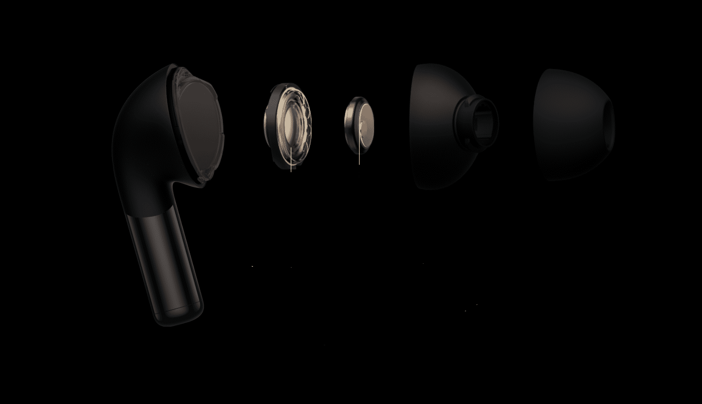
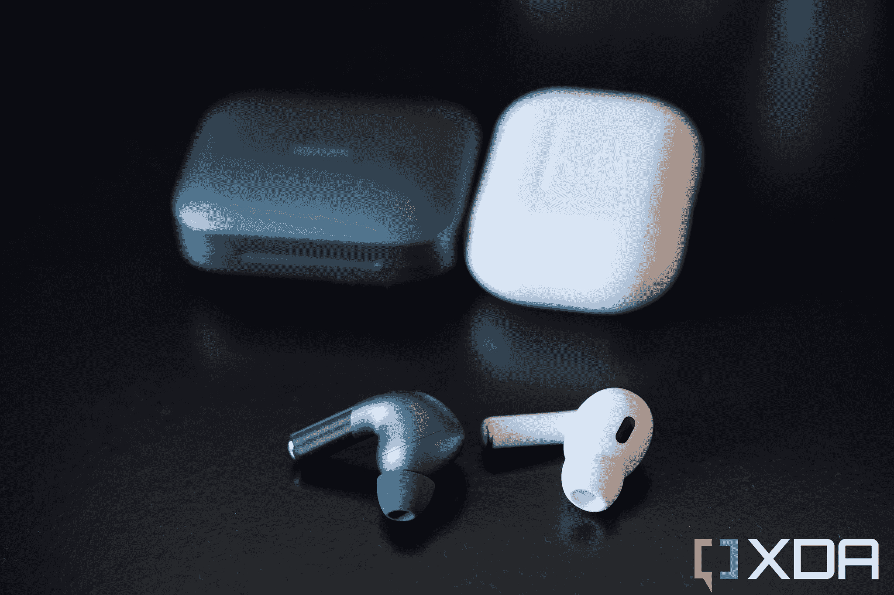

# 一加芽临 2 审查:伟大的声音和外观，但缺乏 ANC

> 原文：<https://www.xda-developers.com/oneplus-buds-pro-2-review/>

一加最近推出了一款新手机，名为[一加 11](https://www.xda-developers.com/oneplus-11-review/) ，价格合理，性能超越同价位手机。那么，与这款手机同时推出的一加 Buds Pro 2 的表现是否相似呢？

我已经使用耳塞大约三个星期了，我认为它们看起来和听起来都很棒，但是主动噪音消除功能让我觉得不够好。尽管如此，179 美元，还是比苹果、三星和谷歌对他们的[最好的耳塞](https://www.xda-developers.com/best-wireless-earbuds/)的要价要低——这么低的价格够了吗？

***关于这篇评测*** *:一加给我们发了一双 the Buds Pro 2，在发布前没有看到这篇评测的内容。*

##### 一加芽亲 2

由于 MelodyBoost 双驱动器、空间音频、改进的 ANC 等，一加 Buds Pro 2 带来了令人印象深刻的音质。

**Battery Life**

9 hours (earbuds only), 39 hours (earbuds with case)

**Brand**

OnePlus

**Frequency Response**

10 Hz-40K Hz

**Weight**

Earbuds - 4.9g, Case - 47.3g

**Dimensions**

24.30 x 20.85 x 32.18mm

**Noise Cancellation**

Yes

**Connectivity**

Bluetooth 5.3 LE Audio

**IP rating**

IP55

**Charging**

USB-C

**Pros**

*   轻质外壳和耳塞
*   支持多点和快速配对
*   良好的音频性能

**Cons**

*   低于平均 ANC
*   根本控制不了音量

## 一加芽亲 2:价格和可用性

*   耳塞有两种颜色:绿色或黑色
*   它将于 2 月 16 日发售。

一加 Buds Pro 2 的售价为 179 美元，现在可以通过亚马逊或一加的在线商店预订。该产品将于 2 月 16 日上市。你可以买到绿色的，你会在下面所有的照片中看到，还有黑色的。

## 硬件和设计:时尚精致

*   时尚轻巧的外壳
*   支持多点、快速配对和无线充电

像最初的一加 Buds Pro 一样，第二代版本采用光滑的外壳，打开时就像一个订婚戒指盒。我喜欢我的耳塞的绿色，它非常适合华丽的一加 11 号。最小包装包括一根 USB-A 至 USB-C 充电电缆(典型的一加红色和白色)和三个通常尺寸(长、米、秒)的硅头。我希望看到第四个 XS 尺寸，因为我的耳道经常发现即使是“小尺寸”的硅头在一个小时左右后佩戴也很烦人。

耳塞采用典型的 AirPods 风格设计，带有细长的耳塞杆。茎部比第一代薄得多，但它的平放位置使它比像 AirPods Pro 那样直立打开的外壳更难取出。

每个花蕾仅重 4.9 克，顶部有一层哑光涂层，而茎则有一层反光涂层。阀杆装有触摸电容面板，只能记录轻敲，不能记录轻扫。我的耳道相对较小，所以我使用了最小的硅头，它们很合适，但正如我所说，我更喜欢更小的尺寸(苹果的第二代 AirPods Pro 提供了它)以供长时间使用。

我认为耳塞看起来不错。耳塞柄没有突出我的耳朵太多，而且它们比华为 FreeBuds Pro 2 或 [Bose QC 耳塞 2](https://www.xda-developers.com/bose-quietcomfort-earbuds-2-review/) 的块状耳塞柄更短、更弯曲。每个耳塞内置一个 11 毫米驱动器和一个 6 毫米高音扬声器。每个驱动器都有一个独立的圆顶，一加说这有助于在高音、中音和低音之间建立分离，同时组合起来获得更饱满的声音。

 <picture></picture> 

A render provided by OnePlus showing the internals of the earbuds, along with the two drivers in the middle. 

耳塞使用蓝牙 5.3，支持 SBC、AAC 和 LHDC 4.0 无损编解码器。每个芽也有三个麦克风，所以通话质量很好，至少根据我测试中的另一方。芽有 IP55 保护，而情况下得到 IPX4。这意味着耳塞可以承受长达 55 分钟的灰尘和连续的水溅(如雨水甚至淋浴)。与此同时，这种外壳只能承受一段时间的水溅。

 <picture></picture> 

The OnePlus Buds Pro 2 next to the second gen Apple AirPods Pro. 

每个 bud 内部都有一个 60 毫安时的电池，可以在有源噪声消除(ANC)打开的情况下播放音频 6 个小时，在 ANC 关闭的情况下播放音频 9 个小时。此案还包含另外四项指控。与我最近刚刚评测的 Bose QC 耳塞 2 不同，一加为这些耳塞提供了无线充电支持，以及多点功能，这意味着耳塞 Pro 2 可以连接到两个设备，甚至可以同时播放两个设备的音频。

## 软件:你应该试试这个应用程序

*   配套应用程序提供了比大多数其他耳塞配套应用程序更多的定制和控制选项
*   支持与任何 Android 设备快速配对

我一直是一加软件的粉丝——是的，我甚至喜欢 OxygenOS 的当前版本，它本质上是穿着风衣的 ColorOS 因为我发现它很快，并且充满了聪明的定制选项。事实上，谷歌和三星最近才提供的许多技巧，如定制用户界面的颜色主题或用手指手势启动应用程序和动作，长期以来一直是 OxygenOS(和 ColorOS)的功能。同样，我很高兴地报告一加芽专业 2 有一个伟大的伴侣应用程序。

不要误会我的意思，你可以不用应用程序使用耳塞，它们会工作得非常好。Buds Pro 2 支持 Android 的 Fast Pair，因此连接到任何最新的 Android 手机都只需点击屏幕上的提示。但这款名为 HeyMelody 的应用提供了如此多的其他控件。你可以做所有预期的事情，比如定制 tap 控制和调整 EQ，但你也可以配置耳塞来控制智能手机的相机快门或打开空间音频。

## 性能:很好的声音，平均 ANC，和一个令人困惑的遗漏

*   出色的音频和通话性能
*   但 ANC 落后于苹果 AirPods Pro 2 或 Bose QC 耳塞 2 等重量级产品
*   缺少滑动控制意味着你不能调节音量

我发现一加巴德的性能价格比不错，有温暖的音频，易于使用的控制，和舒适的配合。与 Bose QC 耳塞 2 不同，它的默认调谐令人失望，一加耳塞 Pro 2 开箱后听起来很棒。然而，我的同事亚当·康威觉得低音有点重。

stems 的触摸面板工作良好，每次按压都发出令人满意的咔哒声。然而，它缺乏对滑动的支持意味着花蕾失去了其他人提供的一个重要功能:通过滑动茎来调节音量。事实上，没有办法纯粹通过耳塞来控制音量。你必须在电话上调整它，这是一个重大的疏忽，因为一加的许多竞争对手都提供它。

你只能在应用程序中打开的空间音频包括头部跟踪，这意味着如果我移动我的头部，音乐将从我的角度“转移”，就好像音乐来自我周围的一个有形的、真实的位置。冒着听起来像是在打死马的风险，我发现一加的产品不错，但没有苹果的好。使用 AirPods Pro，即使是最轻微的头部转动，空间音频也非常精确。在这里，我必须侧着身子才能注意到音乐的任何变化。

一加芽的性能是好的价格，温暖的音频，易于使用的控制，和舒适的配合。

然后是主动噪音消除(ANC)，这应该是对最初的一加耳塞的改进(我从未测试过，但我的同事测试过)，但仍然低于我测试过的苹果、三星、谷歌和 Bose 等知名品牌最近的耳塞。如果我在一家咖啡店，周围都是聊天的朋友，一加 Buds Pro 2 只能消除一些噪音，而不能像苹果和 Bose 的耳塞一样消除大多数聊天。你应该能够调整 ANC 的强度，但即使在最高设置下，我发现耳塞也没有我最近测试的 Bose、苹果、三星或华为的耳塞那样消除声音。如果要给一个百分比，我会说这里的 ANC 是苹果的 50%，可能是 Boses 的三分之一。公平地说，一加的 Buds Pro 2 比所有这些都便宜，所以妥协是意料之中的。透明模式稍微好一点，因为噪音会自然通过，听起来不会太数字化，但它们不像 AirPods Pro 那样自然，听起来好像我什么都没穿。

电池寿命，如前所述，在六个或九个小时是好的，取决于 ANC 模式。除了比平时弱的噪音消除，我对这些耳塞没有任何疑虑。

## 你应该买一加芽 Pro 2 吗？

**你应该买一加芽 Pro 2 如果:**

*   你想要一副时尚好看的耳塞，配一个优秀的配套应用程序
*   你想要价格低于 200 美元的高性能耳塞，拥有出色的音质和无线充电功能

**如果:**你不应该买一加芽 Pro 2

*   你真的需要强大的 ANC
*   你可以多花一点钱

一加 Buds Pro 2 的定价为 179 美元，其策略似乎与一加 11 相同:试图以更低的价格提供几乎与知名竞争对手一样好的产品。对于不想要苹果或三星 250 美元要价的消费者来说，这可能行得通，但谷歌 Pixel Buds Pro 的售价为 200 美元，只是略高一些。我确实认为一加的芽实际上听起来更好，但谷歌的芽有更强的 ANC。如果你能多付一点钱，三星的 Galaxy Buds 2 Pro 在各方面都很出色。如果 ANC 真的对你很重要，你不妨多付一点钱，买一台 [AirPods Pro 2](https://www.xda-developers.com/airpods-pro-2-review/) 。不过，一加芽 Pro 2 是一个不错的选择。

##### 一加芽亲 2

由于 MelodyBoost 双驱动器、空间音频、改进的 ANC 等，一加 Buds Pro 2 带来了令人印象深刻的音质。