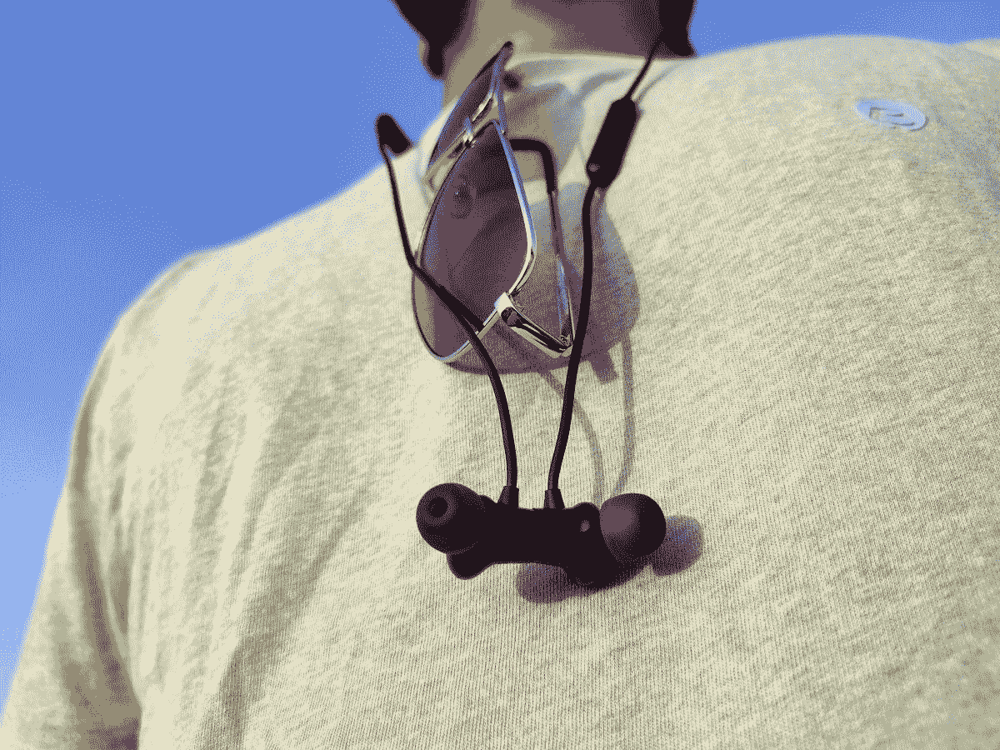
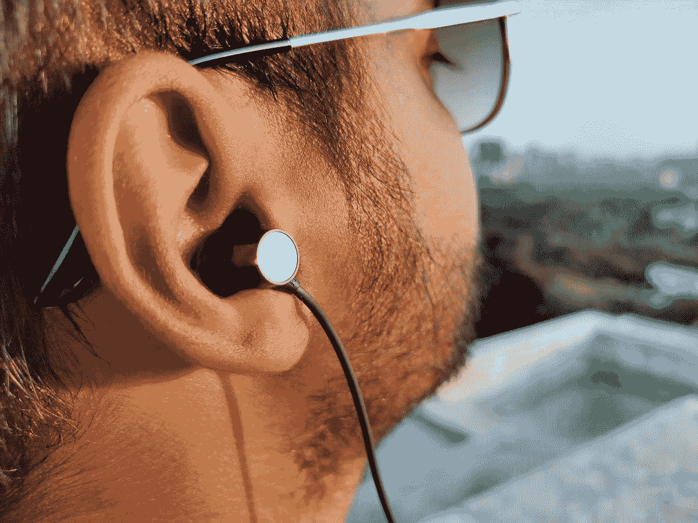
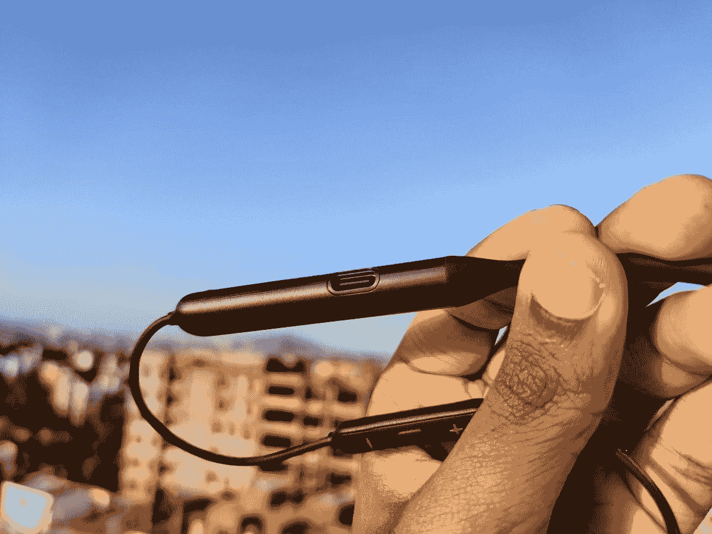

# 一加子弹无线 Z 审查:非常舒适，恒星电池寿命

> 原文：<https://www.xda-developers.com/oneplus-bullets-wireless-z-earphones-review/>

一加子弹无线 Z 是入门级的蓝牙耳机，建立在一加的理念，以具有竞争力的价格提供独特的产品体验。[4 月](https://www.xda-developers.com/oneplus-bullets-wireless-z-announced-ip55/)与一加 8 系列一同推出的新款无线颈带耳塞保留了更高端的子弹无线 2 的一些关键功能，同时也带来了自身的改进。售价仅为₹1,999 或 49.95 美元的子弹无线 z 是目前市场上最物有所值的蓝牙无线耳塞之一——至少在纸面上是如此。但是它们符合规格表吗？我们在这篇综述中找到答案。

*免责声明:我个人购买了一对子弹无线 z。一加也发送了一个审查单位到阿米尔，我们使用的比较，以证实我们的调查结果。*

## 一加子弹无线 Z:规格

| 

规格

 | 

子弹无线 Z

 |
| --- | --- |
| **身材和体重** | 

*   塑料耳罩和橡胶项圈
*   IP55 防水防尘
*   28g

 |
| **驱动程序设置** | 

*   单个 9.2 毫米动态驱动器

 |
| 连通性 | 

*   蓝牙 5.0
*   编解码器:SBC、ACC
*   低延迟模式—在一加 8 和一加 7 系列上提供

 |
| **电池&充电** | 

*   一次充电可播放 20 小时
*   USB 型端口
*   曲速充电:10 小时播放，10 分钟充电

 |
| **在盒子里** | 

*   一对子弹无线 Z
*   3x 硅耳塞
*   USB 充电线
*   用户指南
*   安全和保修卡

 |

**购买一加子弹无线 Z** : [亚马逊印度(代销商)](https://www.amazon.in/s?k=bullets+wireless+z+earphones&crid=1G37HKV0NIH92&sprefix=Bullets+W%2Caps%2C405&ref=nb_sb_ss_i_1_9%2F%3Ftag%3Dxdaportalin-21)| | |[OnePlus.com 美国](https://onepluscom.pxf.io/c/2233363/916678/12532?subId1=UUxdaUeUpU28895&subId2=exda&u=https%3A%2F%2Fwww.oneplus.com%2Fus%2Fproduct%2Foneplus-bullets-wireless-z&ourl=https%3A%2F%2Fwww.oneplus.com%2Fproduct%2Foneplus-bullets-wireless-z)| | |[OnePlus.com 英国](https://onepluscom.pxf.io/c/2233363/916678/12532?subId1=UUxdaUeUpU28895&subId2=exda&u=https%3A%2F%2Fwww.oneplus.com%2Fuk%2Fproduct%2Foneplus-bullets-wireless-z)

## **设计&舒适**

子弹无线 Z 看起来几乎像是子弹无线 2 的复制品。如果它们并排躺在一张桌子上，你可能无法从远处分辨出它们。然而，它们是由不同的材料制成的。与使用金属外壳的子弹无线 2 不同，子弹无线 Z 选择了全塑料结构。身体的其余部分保持不变，两个耳塞都使用柔软、灵活的橡胶项圈，两侧的塑料模块容纳电池、音频芯片和其他电路。左侧模块外侧刻有[新一加标志](https://www.xda-developers.com/oneplus-unveils-new-logo-brand-visual-identity-refresh/)。就在它下面，你会发现一个微型 LED 和圆形多功能按钮。同时，USB Type C 端口位于靠近徽标的边缘。

线内控制与单个麦克风一起封装在左侧电线上的一个小条中。控制键易于操作，可用于调节音量、播放/暂停/更换曲目以及接听/挂断电话。子弹无线 Z 是令人难以置信的舒适，由于其轻量级的建设，可以穿上几个小时没有刺激你的耳朵。其符合人体工程学的设计提供了完美的贴合感，在锻炼或其他身体活动中不会突出。子弹无线 Z 可能不像现在市场上的一些真正的无线耳塞那样具有未来感，但在我们看来，它们仍然有自己的说法。

子弹无线 Z 感觉真的很坚固，看起来他们可以承受一些虐待。IP55 防护更是锦上添花。它超越了大多数耳塞提供的标准防汗性能，允许您在水边使用它们。我在细雨中短暂使用了两次，之后没有遇到中断/掉线或任何故障。额外的保护也使耳塞成为锻炼和跑步等身体要求较高的活动的理想选择——你不会冒险用子弹无线 2 进行这些活动，因为它们没有官方的 IP 等级。

与其前辈类似，子弹无线 Z 具有磁性锁，允许您通过简单地分离耳罩和将它们扣合在一起来打开和关闭耳塞。这个机制很健壮，我从来没有遇到过它们被意外分离(从而无意中连接到我的手机)的问题。盒子里没有手提箱，但我不认为这是个问题。当我不使用花蕾时，我只是简单地将它们扣在一起，让它们挂在我的脖子上。

 <picture></picture> 

Image courtesy: Aamir Sididiqui

我最喜欢的子弹无线 Z 的功能之一是快速切换，让您快速切换配对设备之间的活动蓝牙连接。例如，如果您正在笔记本电脑上听音乐，并想用手机接电话，您不必断开当前设备的连接，进入配对模式来交换连接。只需双击多功能按钮，子弹无线 Z 就会自动连接到你的手机——无需触摸手机，打开蓝牙设置。

## **声音&通话质量**

子弹无线 2 和子弹无线 Z 之间的相似之处仅止于视觉效果。当谈到音频质量和驱动器设置时，这两款耳机之间有着明显的差异——当我们考虑到价格差距时，这并不奇怪。子弹无线 2 具有两个处理人声和高音的诺尔斯平衡电枢驱动器和一个处理低音的 10 毫米动态驱动器。子弹无线 Z 不享受同样的豪华，因为它的价格更紧，只有一个 9.2 毫米的动态驱动器。

子弹无线 Z 不仅有一个低劣的驱动程序设置，但他们也没有高品质的蓝牙编解码器，如 aptX 高清和 LDAC。你只能得到 AAC 和 SBC 编解码器，比拥有 aptX HD 支持的 Bullets Wireless 2 明显下降了一步。与 AAC 和 SBC 相比，所有上述编解码器都提供了更高的比特率吞吐量和更低的延迟。值得一提的是，一加表示，这款耳机确实支持一加设备上的低延迟模式，通过手机的动态游戏模式。

 <picture></picture> 

Image courtesy: Aamir Siddiqui

谈到音频质量，子弹无线 Z 有一个温暖的，低音前进的声音，适合流行音乐，电子音乐和嘻哈音乐。中音有点放松，但仍然干净，不会被强调的低音所掩盖。这一点在听驯服的黑斑羚的《迷失在昨天的 T2》时表现得非常明显，凯文·帕克的声音穿透了厚重的低音。高音性能，另一方面，缺乏火花和活力。在过于明亮的轨道上，这可能会产生积极的影响，因为它会降低一些刺耳的声音，使声音更容易被耳朵接受。然而，当听原声音乐和古典音乐时，它往往缺乏活力，失去了更好的细节。

虽然子弹无线 Z 的低音占据了中心舞台，但它不是特别平衡。亚低音感觉无处不在，缺乏令人满意的冲击力。有些人可能喜欢提升的低端低音，但我个人更喜欢更紧的打击，只在需要时才发挥作用，不会停留太久。

子弹无线 Z 有一个狭窄的声场，位于用户的头部。没有使用太多乐器的轨道听起来会很好，您将能够很容易地识别不同的乐器。平克·弗洛伊德的融合了多种平移效果，脚步从一边移动到另一边，脉冲合成器声音渐强渐弱，所有这些都被子弹无线 z 忠实地再现了

### 完整测试播放列表

1.  *时间* —平克·弗洛伊德
2.  【逃亡中的 —平克·弗洛伊德
3.  *白花钱* —水深火热
4.  *爱情之谜* —苏菲洋·斯蒂文斯
5.  *直觉* —梅杰
6.  *非广场舞蹈* —戴夫·布鲁贝克
7.  *当晨光照耀在*里——丹·罗默(《孤岛惊魂 5》)
8.  *哑剧演员的舞蹈* —罗琳娜·麦肯尼特
9.  *迷失在昨天*——驯服黑斑羚
10.  带走我的呼吸 —柏林
11.  *洛克* —皮洛特

Bullets Wireless Z 可能不是无线耳机类别中声音最好的产品，但由于其强调的低音和干净的中音，它们确实有助于获得出色的电影观看体验，让你的耳朵有一种家庭影院般的感觉。

总体而言，子弹无线 Z 的音质好坏参半。对我来说，它们听起来不如我信赖的子弹 V2。子弹 V2 的声音有一种平滑和兴奋，这是我在子弹无线 z 上发现的缺失。子弹 V2 的中性声音也使他们成为一种广泛的音乐类型的绝佳选择。使用 Bullets Wireless Z，您的体验将在很大程度上取决于您所听的音乐类型。带有简单低音线和少量乐器的歌曲会很好，但是任何复杂和多层次的东西都会失去清晰度，听起来很模糊。

子弹无线 Z 的通话质量是可维护的。在没有辅助麦克风或基于软件的降噪解决方案的情况下，当我在城市交通和嘈杂的环境中时，语音通话另一端的呼叫者经常抱怨背景噪音。

### 隔声

子弹无线 Z 提供了非常好的被动噪声隔离。只需戴上耳机，就能有效阻挡相当多的外界噪音，包括发动机的轰鸣声和吊扇的嗡嗡声。一旦你开始演奏音乐，就很难理解你周围发生了什么。为了实现完美的隔离，尝试不同的耳塞，并选择能够提供完美密封的耳塞，这一点至关重要。对我来说，最小的耳塞提供了最佳的贴合性和密封性。逐一尝试每个尺码，自己决定哪一个适合你。

## 蓝牙范围和延迟

子弹无线 Z 提供蓝牙 5.0 连接，并向后兼容旧的蓝牙规范。信号范围非常好，正如你对任何蓝牙 5.0 音频配件的期望。对我来说，这是我的森海塞尔 HD 4.50 的一大进步，它使用蓝牙 4.2，当我在远离手机的另一个房间时，很容易掉线。有了 Bullets Wireless Z，我不必确保清晰的视线，也不必担心物理障碍物会干扰我的音频播放。我可以把手机插在卧室的充电器上，在家里的不同地方漫游，但没有任何音乐或电话掉线或清晰度下降的迹象。

缺少 aptX 或其他高质量的蓝牙音频编解码器意味着子弹无线 Z 的延迟并不令人印象深刻。使用[音频测试器](https://play.google.com/store/apps/details?id=barum.life.audiotester)应用程序，我们测得延迟超过 300 毫秒，这对于游戏来说远非理想。虽然一加确实提供了一种低延迟模式来减少延迟的游戏体验，但它只能在自己的手机上使用 Fnatic 模式，这种模式可以在[一加 8](https://forum.xda-developers.com/oneplus-8) 、[一加 8 Pro](https://forum.xda-developers.com/oneplus-8-pro) 、[一加 7](https://forum.xda-developers.com/oneplus-7) 系列、[一加 7T](https://forum.xda-developers.com/oneplus-7t) 、[一加 7T Pro](https://forum.xda-developers.com/7t-pro) 和 OnePlus 6T 上使用(OnePlus 6 将在 8 月通过 OTA 接收)。阿米尔能够在他的[一加 7 Pro](https://forum.xda-developers.com/oneplus-7-pro) 上测试低延迟模式，并发现它确实显著降低了 PUBG Mobile 的延迟。它不太接近有线解决方案——如果你仔细听，你仍然可以发现延迟——但它比你开箱即用的要好得多。对于非一加手机用户来说，购买这些耳机主要是为了玩游戏，我们建议坚持使用有线耳机，或者寻找其他至少支持 aptX 编解码器的耳机。

## 电池性能和充电速度

电池性能是 Bullets Wireless Z 最强的方面。该公司声称一次充电可以不间断播放音乐长达 20 小时，比 Bullets Wireless 2 声称的 14 小时有了明显的改善。根据我的经验，子弹无线 Z 的电池寿命确实符合这一说法。在我三周的大量使用中，包括几个小时的音乐收听、观看 YouTube 视频和接电话，我只需要给耳机充三次电。

 <picture></picture> 

Image courtesy: Aamir Siddiqui

子弹无线 Z 惊人的电池寿命伴随着同样惊人的 Warp Charge 有线快速充电技术，它可以在一瞬间充满空电池。一加说，10 分钟的充电足以让你播放 10 个小时的音乐。为了测试这一说法，我给 Bullets Wireless Z 充了 10 分钟电，并让耳机在播放列表中循环播放，音量设置为 50%。耳塞在断开之前持续了 10 小时 55 分钟。这个好于预期的结果是因为我使用了 5V/2A 适配器，这高于一加使用 5V/0.6A 充电器的最低要求。我们进行了类似的循环测试，以检查 20 小时的续航能力。同样，耳塞兑现了他们的承诺，并在最终死亡前设法持续了 20 小时 8 分钟。

谈到电池性能，一加子弹无线 Z 简直令人难以置信。在这个价格范围内，市场上很少有蓝牙无线耳机能够在一次充电后提供如此长的电池续航时间。

## 一加子弹无线 Z:结论

子弹无线 Z 成功地实现了它的目标，提供一个实用的，物有所值的无线音频包，不会烧一个洞在你的口袋里。子弹无线 2 是一种旨在提供优质音频体验的利基产品，一加通过降低价格障碍并保留去年模型中一些最有用的功能，对子弹无线 Z 采取了更主流的方法。

一加子弹 Z 是神奇的入门级蓝牙耳机，钉在基本面。它们具有可靠的制造质量，可以承受粗暴的搬运，符合人体工程学的设计，佩戴时间长，电池续航时间长。音质对于日常聆听来说还过得去，但肯定不是同类中最好的。如果音质是你的首要任务，你也许应该看看 OPPO Enco M31 耳塞，它的价格与 Bullets Wireless Z 相同，但经过高分辨率认证，提供 LDAC 编解码器支持，并具有中性的声音特征。我购买无线子弹 Z 主要是为了取代有线子弹 V2，希望通过蓝牙的便利享受类似的音频体验。虽然我不能说我对整体音质感到满意，但我完全可以看到自己在听 EDM 和 trance 时享受额外的低音。除此之外，我还发现它们提供的便利和舒适对日常使用非常有帮助。

**购买一加子弹无线 Z** : [亚马逊印度(代销商)](https://www.amazon.in/s?k=bullets+wireless+z+earphones&crid=1G37HKV0NIH92&sprefix=Bullets+W%2Caps%2C405&ref=nb_sb_ss_i_1_9%2F%3Ftag%3Dxdaportalin-21)| | |[OnePlus.com 美国](https://onepluscom.pxf.io/c/2233363/916678/12532?subId1=UUxdaUeUpU28895&subId2=exda&u=https%3A%2F%2Fwww.oneplus.com%2Fus%2Fproduct%2Foneplus-bullets-wireless-z&ourl=https%3A%2F%2Fwww.oneplus.com%2Fproduct%2Foneplus-bullets-wireless-z)| | |[OnePlus.com 英国](https://onepluscom.pxf.io/c/2233363/916678/12532?subId1=UUxdaUeUpU28895&subId2=exda&u=https%3A%2F%2Fwww.oneplus.com%2Fuk%2Fproduct%2Foneplus-bullets-wireless-z)

**购买一加子弹无线 Z** : [亚马逊印度(代销商)](https://www.amazon.in/s?k=bullets+wireless+z+earphones&crid=1G37HKV0NIH92&sprefix=Bullets+W%2Caps%2C405&ref=nb_sb_ss_i_1_9%2F%3Ftag%3Dxdaportalin-21)| | |[OnePlus.com 美国](https://onepluscom.pxf.io/c/2233363/916678/12532?subId1=UUxdaUeUpU28895&subId2=exda&u=https%3A%2F%2Fwww.oneplus.com%2Fus%2Fproduct%2Foneplus-bullets-wireless-z&ourl=https%3A%2F%2Fwww.oneplus.com%2Fproduct%2Foneplus-bullets-wireless-z)| | |[OnePlus.com 英国](https://onepluscom.pxf.io/c/2233363/916678/12532?subId1=UUxdaUeUpU28895&subId2=exda&u=https%3A%2F%2Fwww.oneplus.com%2Fuk%2Fproduct%2Foneplus-bullets-wireless-z)