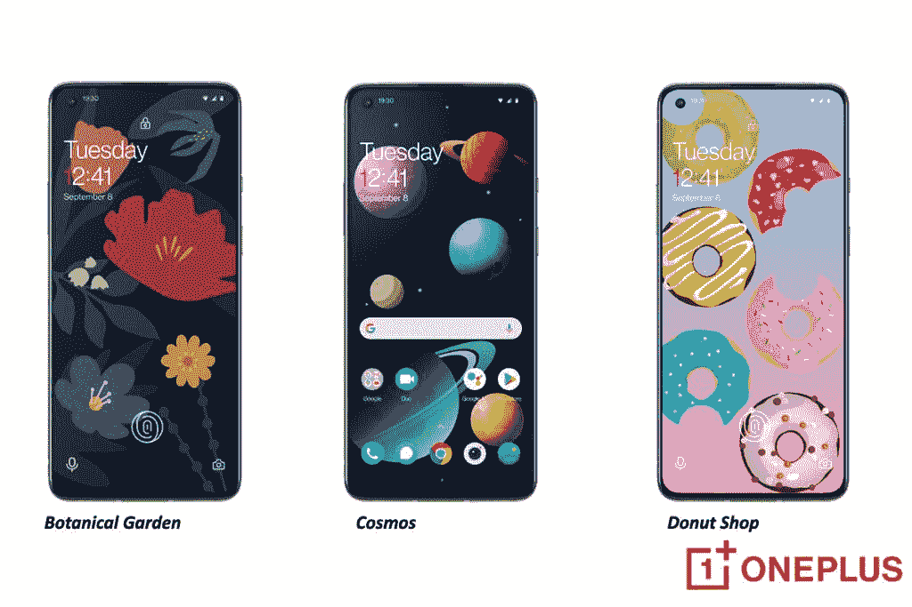

# 一加数字报纸应用程序提供了新的外观，增加了三个新的壁纸

> 原文：<https://www.xda-developers.com/oneplus-digital-wellpaper-app-update/>

# 一加数字报纸应用程序提供了新的外观，增加了三个新的壁纸

一加更新了它的数字健康应用程序 WellPaper。这款应用将于 2022 年上市，拥有全新的外观和三种新壁纸。

去年，一加通过其创新中心 OneLab 宣布为 Android 智能手机发布一款新的数字健康应用。[数字报纸应用](https://www.xda-developers.com/digital-wellpaper-oneplus-wallpaper-app/)的独特之处在于，它通过创造性地将屏幕时间和智能手机使用作为一个元素显示在有机动态壁纸上，让 Android 用户微妙地意识到他们的活动，如屏幕时间和智能手机使用。看起来一加正在加倍投资其数字健康应用，为 2022 年提供更新。

一加没有试图用数字报纸重新发明轮子，而是专注于它的应用程序。但它确实给它的应用涂上了一层全新的油漆。该应用程序还将添加三种新壁纸:植物园、宇宙和甜甜圈店。你可以在上图中看到这些新壁纸的样子。

除了新的和视觉上吸引人的方式来检查你的使用统计数据，更新后的应用程序将提供对侧加载应用程序的支持。用户可以将六个不同类别中的一个分配给一个侧装应用程序，这样它就可以被跟踪。当然，如果你不想跟踪应用程序的活动，你可以选择将应用程序归类到“不跟踪”类别。如果你担心数据隐私问题，OneLab 会留意，将数据计算局限在你的手机上。然而，该应用程序需要互联网连接才能了解“每个应用程序的 Google Play 类别”。

## OneLab 一直很用心，将数据计算局限于你的手机。

显然，去年更受欢迎的功能之一是点击主屏幕上的空白区域，获得设备总屏幕时间使用的全局读数。这以前是有限的，但现在可以通过任何壁纸访问。如果这听起来很有趣，你可以从谷歌 Play 商店或者下面的链接下载数字报纸。

[EMBED _ APP]https://play . Google . com/store/apps/details？id = studio . onelab . wallpaper[/EMBED _ APP]