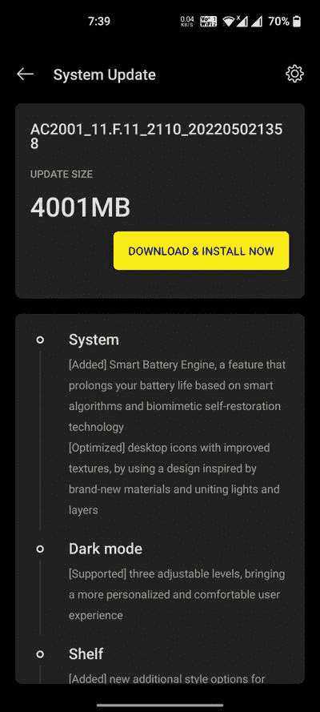

# 一加诺德终于获得了稳定的 Android 12 与 OxygenOS 12 更新

> 原文：<https://www.xda-developers.com/oneplus-nord-android-12-oxygenos-12-stable-update/>

一加最近为一加北部发布了 Android 12 的第三个公开测试版本。那个版本主要是为了提高系统的稳定性，除此之外还有一些错误修正。现在，该公司已经将 OxygenOS 12 的稳定版本以分阶段展示的形式发布到了一加北部。

 <picture></picture> 

Screenshot courtesy: OnePlus Community member Dhanabalan.T

根据一加社区论坛上最近的一篇帖子，OEM 已经开始为一加诺德的印度版本播种稳定的 OxygenOS 12 更新。欧洲车型的 OTA 正在等待额外的验证。然而，关于全球版的更新路线图还没有官方消息。

虽然没有明确提到，但 OxygenOS 层的底层版本是这个版本中的 *12.1* 。该版本还包含 2022 年 4 月的 Android 安全补丁。这是一加北部 OxygenOS 12 的完整更新日志:

### 一加北部 OxygenOS 12 变更日志

*   **系统**
    *   [新增]智能电池引擎，一种基于智能算法和仿生自我修复技术延长电池寿命的功能
    *   [优化]桌面图标具有改进的纹理，采用了受全新材料启发的设计，并将光线和图层结合在一起
*   **黑暗模式**
    *   【支持】三种可调级别，带来更个性化、更舒适的用户体验
*   **货架**
    *   [添加]卡片的新的附加样式选项，使数据内容更加直观和易于阅读
    *   [新增]访问书架上的一加童军，允许您搜索手机上的多个内容，包括应用程序、设置、媒体数据等
*   **工作生活平衡**
    *   [新增]工作生活平衡功能，让您通过快速设置轻松在工作和生活模式之间切换
    *   [支持]根据具体位置、Wi-Fi 网络和时间，自动切换工作/生活模式，并根据个性化设置带来定制的应用程序通知配置文件
*   **画廊**
    *   [支持]使用双指挤压手势在不同布局之间切换，智能识别最佳质量的图片，并根据内容裁剪缩略图，使图片库布局更加美观
*   **画布 AOD**
    *   [添加]新的多样线条和颜色风格，带来更具个性化的锁屏体验和令人振奋的视觉效果
    *   [新增]多种画笔和笔触，并支持颜色调整
    *   [优化的]软件算法和改进的面部识别，以更好地识别不同人物的特征和肤色
*   **游戏**
    *   [新增] HyperBoost 端到端帧速率稳定器
    *   [新增]语音效果预览，让您可以录制您的语音效果或实时检查您的语音效果

事实上，一加诺德的公开 Beta 3 版本和 OxygenOS 12 的第一个稳定版本完全相同。不仅内部版本号相同( **F.11** )，OTA 有效载荷包的内容也是逐字节一致的。因此，OB3 软件的已知问题列表也适用于稳定版本。

*   **已知问题**
    1.  设置中某些页面的显示会与系统不同。
    2.  打电话时，屏幕会在特定情况下出现毛刺。
    3.  在人像模式下拍摄照片时，相机可能会崩溃。
    4.  连拍时缩略图显示异常。
    5.  在来宾模式下，快速设备连接显示异常。

**[一加诺德 XDA 论坛](https://forum.xda-developers.com/c/oneplus-nord.11081/)**

* * *

## 为一加北部下载稳定的 OxygenOS 12

如果你拥有一加诺德并且想要立即安装 OxygenOS 12，你可以使用下面的链接下载完整的 OTA 包进行更新。当我们得到新的下载链接时，我们会更新这篇文章。

*   北一加
    *   印度(AC2001_11。F.11)
    *   全球(AC2003_11。F.11)

如果您希望在某个时候降级到 OxygenOS 11 版本，您可以从下面的链接下载回滚包。请记住，这将擦除您的所有数据，因此您应该在继续之前进行备份。

*感谢 XDA 资深会员 [Some_Random_Username](https://forum.xda-developers.com/m/some_random_username.8234677/) 的下载链接！*

* * *

**来源:** [一加社区论坛](https://forums.oneplus.com/threads/1581895/)