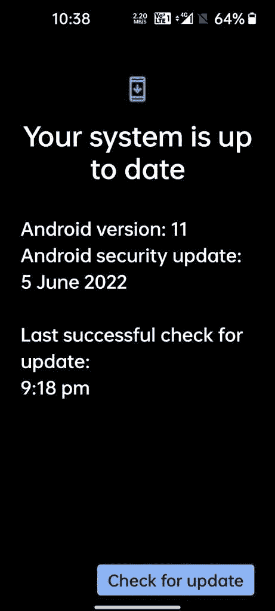

# 一加诺德 CE 2 收到 2022 年 6 月最新更新的安全补丁

> 原文：<https://www.xda-developers.com/oneplus-nord-ce-2-june-2022-security-patches/>

# 一加诺德 CE 2 收到 2022 年 6 月最新更新的安全补丁

一加已经开始为一加诺德 CE 2 推出 OxygenOS A.13，并于 2022 年 6 月推出安全补丁和系统稳定性改进。

在上周为一加诺德 2 号推出 2022 年 6 月的安卓安全补丁后，一加现在将一加诺德 2 号更新到相同的安全补丁级别。该公司已经开始向该设备推出 OxygenOS A.13，其中包括【2022 年 6 月安全补丁和一些系统稳定性改进。

面向一加诺德 CE 2 的 OxygenOS A.13 目前正在向印度用户推出。根据用户在一加社区论坛上分享的截图，此次更新基于 OxygenOS 11 版本，就像上周在一加诺德 2 推出的版本一样。

 <picture></picture> 

Credit: [Nareshkp](https://forums.oneplus.com/members/nareshkp.5907243/) on the OnePlus Community Forums

以下是更新的完整变更日志:

*   系统
    *   提高系统稳定性
    *   Android 安全补丁更新至 2022.6

一加还没有在其论坛上宣布推出，所以在你的设备上弹出 OTA 通知可能还需要一段时间。如果您不想等待，您可以从下面提供的链接下载增量更新包，并手动刷新更新。请注意，一加通常以分阶段的方式发布软件更新，以便在更广泛的推广之前发现版本中的任何错误。因此，如果你把你的一加诺德 CE 2 作为日常驱动，我们不建议你手动安装更新。

**[一加诺德 CE 2 XDA 论坛](https://forum.xda-developers.com/f/oneplus-nord-ce-2.12541/)**

## 下载适用于一加诺德 CE 2 的 OxygenOS A.13

如上所述，我们目前只能从 OxygenOS A.12 获得印度地区的增量更新包。我们将尽快更新这篇文章，提供完整 OTA 包的链接。

*您的一加诺德 CE 2 收到 OxygenOS A.13 了吗？它包括任何其他变化吗？请在下面的评论区告诉我们。*

* * *

*感谢 XDA 公认开发者 [mlgmxyysd](https://forum.xda-developers.com/m/mlgmxyysd.8430637/) 和 XDA 资深会员 [Some_Random_Username](https://forum.xda-developers.com/m/some_random_username.8234677/) 的下载链接！*