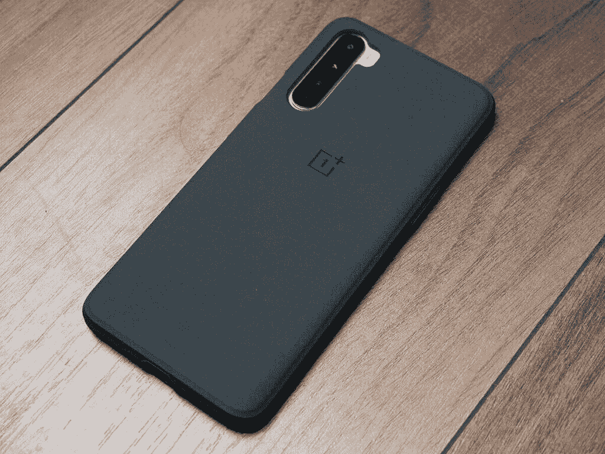

# 一加诺德手把手:真正的 OnePlus X 继任者

> 原文：<https://www.xda-developers.com/oneplus-nord-hands-on/>

一加是一个以追求性能极限而闻名的智能手机品牌。该公司每年都推出新的旗舰智能手机，采用最新的 Snapdragon 800 系列处理器，海量内存，并对其 OxygenOS 软件进行了新的优化。随着每年都有新的硬件进步，一加智能手机变得越来越贵。不过，一加是从更实惠的智能手机开始它的旅程的。正是他们创造了“[旗舰杀手](https://www.xda-developers.com/ditching-snapdragon-865-best-way-make-flagship-killer-2020/)”这个词，现在用来形容任何价格可能扰乱市场的高性能智能手机。一加现在似乎回归了它的根源，推出了一加诺德，这是该品牌多年来在 T2 推出的第一款平价中档智能手机。

Nord 并不是一加首次涉足中端智能手机。该公司之前在 5 年前就有过这个想法，推出了 [OnePlus X](https://www.xda-developers.com/oneplus-x-review-beauty-but-not-the-beast/) ，它在 [OnePlus 2](https://www.xda-developers.com/oneplus-releases-community-build-of-oxygen-3-0-for-the-oneplus-2/) 之后不久推出。不幸的是，该公司“永不妥协”的咒语又回来咬他们，他们不得不做出多大的妥协来交付一加 x。随着 5 年来硬件的大幅进步，一加现在可以轻松地重返中端智能手机领域，推出一款理论上不会做出太大妥协的设备。一加诺德是 OnePlus X 的真正继任者吗？我已经拥有这款设备近一周了，虽然我们的全面评测将在稍后进行，但现在，我可以给你我对这款设备的第一手印象。

*注:**2020 年 7 月 15 日收到一加寄来的蓝色大理石一加诺德(12GB 内存+ 256GB 存储)。自从收到这款设备后，我就把它作为我的日常驾驶。*

* * *

## 一加北部:规格

| 

规格

 | 

北一加

 |
| --- | --- |
| **尺寸&重量** | 

*   158.3 x 73.8 x 8.2 毫米
*   184 克

 |
| **显示** | 

*   6.44 英寸 FHD+液态 AMOLED
*   20:9 宽高比
*   90Hz 刷新率
*   sRGB 和显示 P3 的支持
*   康宁大猩猩玻璃 5
*   双孔穿孔机

 |
| **SoC** | 

*   高通骁龙 765 克:
    *   1 个 Kryo 475(基于 ARM Cortex-A76)Prime core @ 2.4 GHz
    *   1 个 Kryo 475(基于 ARM Cortex-A76)性能内核@ 2.2GHz
    *   6 倍(基于 ARM Cortex-A55)效率内核@ 1.8GHz
    *   7 纳米 EUV 工艺
*   肾上腺素 620

 |
| **闸板&存放** | 

*   8GB LPDDR4X + 128GB UFS 2.1
*   12GB LPDDR4X + 256GB UFS 2.1

 |
| **电池&充电** | 

*   4，115 毫安时电池
*   翘曲充电 30T (5V/6A)用于快速充电

 |
| **指纹传感器** | 展示中 |
| **后置摄像头** | 照片:

*   **初级** : 48MP 索尼 IMX586，0.8 m，f/1.75，OIS，EIS
*   **辅助**:800 万像素广角摄像头，f/2.25，119 FoV
*   **第三级** : 5MP 深度传感器，f/2.4
*   **四进制** : 2MP 宏观传感器，f/2.4

视频:

*   4K @ 30fps
*   1080p @ 30/60/240fps

 |
| **前置摄像头** |  |
| **其他功能** |  |
| **安卓版本** | 搭载 OxygenOS 10.5 的 Android 10 |

* * *

## 一加诺德设计公司

虽然一加诺德标志着该公司要走的新道路，但其设计令人想起该公司以前的设备。玻璃背面印有一加标志，侧面有警示滑块，最小的边框都是一加设计语言的标志。当一加诺德还只是一加 8 Lite 或者一加 Z 的时候，它有着完全不同的设计。这一事实得到了 Carl Pei 的证实，他最近在接受 MKBHD 采访时表示，一加诺德的设计在最后一刻进行了更改，其他一些原型也进行了展示，这些原型对现有的一加智能手机并不熟悉。

一加诺德的 1080p AMOLED 面板上有一个双摄像头，可以将通知图标推过屏幕的四分之一。这或多或少是一种完全无边框的体验，就像其他一加设备一样，这里没有耳机插孔。这款手机不会吸引任何指纹，重量分布感觉从上到下都一样。它的背面有光滑的玻璃感，我大多数时候都选择在箱子里使用我的，因为它有点滑。显示屏也不会变得很亮，所以在阳光直射下使用有点困难。

同样，这里也没有其他花哨的东西。你得到的唯一端口是 USB-C 端口，你得到的唯一按钮是电源按钮和音量摇杆。该设备的右侧还有令人垂涎的一加提醒滑块。

设备背面的四摄像头排列产生了相当明显的摄像头凸起，盒子中给出的清晰案例有助于缓解这种情况。这个透明的盒子背面有一个箭头，表示指向北方。然而，那个透明的盒子还带有一个充电口的盖子，我很快就会把它撕掉。

我们的主编米莎尔·拉赫曼收到了这款黑色缟玛瑙设备。

* * *

## 一加·诺德案例

除了一加诺德，该公司还推出了三种不同的外壳，你可以为你的新设备购买。盒子里还有一个透明硅胶盒。出售的箱子有蓝色砂岩箱子、透明凝胶箱子和黑色砂岩箱子。今年早些时候，蓝色砂岩表壳与一加 8 系列一同亮相，而另外两个表壳多年来一直是一加品牌的一部分。

### 蓝色砂岩

### 

最初的 OnePlus One 有一个砂岩背，从那以后，人们一直在争夺复出。虽然一加似乎不打算在短期内推出带有砂岩外壳的智能手机，但该公司多年来一直在发布砂岩外壳。一加 8 系列首次推出了蓝色砂岩表壳，这也来到了一加北部。

### 透明凝胶

一加包括一个相当整洁的盒子，但也有一个透明的凝胶盒，增加了更多的保护，你也可以拿起。它也是完全透明的，而盒子里的那个却不是。

### 黑色砂岩

### 

它和蓝色砂岩一模一样，只是它是黑色的。

### 内含凝胶盒

就我个人而言，我喜欢盒子里的包装盒，除了一件事...那个很烦人的充电挡板。一旦进去就很难撬出来，而且感觉完全没有必要。将来我可能会切断我的。

* * *

## 一加诺德的定价和可用性

OnePlus Nord 可以在欧洲、英国和印度购买，8GB 内存和 128GB 存储版本的起价为 379/₹27,999€399 英镑。支付 499/ 469/₹29,999 的€可以获得 12GB 的内存和 256GB 的存储空间，不过这取决于你是否值得。从 8 月 4 日起，您可以在欧洲、印度和亚洲从 nord.oneplus.com 订购蓝色大理石或灰色缟玛瑙材质的 Nord。虽然这次不会在美国发布，但一加[邀请了 50 人](https://forums.oneplus.com/threads/oneplus-nord-beta-program-us-ca.1260553/#post-21850652)参加测试项目来体验这款设备。

* * *

你对一加诺德有什么看法？请在下面的评论中告诉我们！