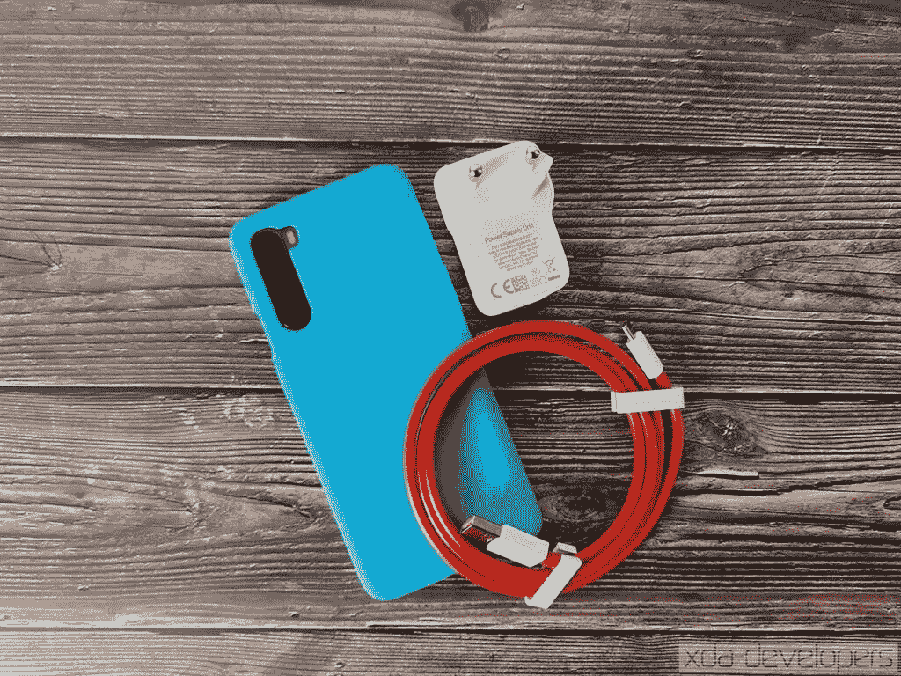

# 一加·诺德评论:性价比高

> 原文：<https://www.xda-developers.com/oneplus-nord-review/>

自 2014 年 OnePlus One 以来，每款一加智能手机都配备了旗舰高通骁龙 800 系列芯片组。高通最新芯片的使用已经成为一加营销的一部分，这从一加为 OnePlus 6(“你需要的速度”)、一加 6T(“解锁速度”)、一加 6T 迈凯轮版(“向速度致敬”)、一加 7(“超越速度”)和一加 8(“以速度领先”)选择的口号中可以看出)从业绩的角度来看，一加从未背离其“永不妥协”的口号。然而，凭借新的一加诺德芯片，该公司使用的是高通的中档骁龙 765G SoC，而不是旗舰产品骁龙 865。Nord 是一加自 2015 年 OnePlus X 以来的第一款中端智能手机，也是该公司第一款不使用 Snapdragon 800 系列芯片的设备。

根据规格表，有人可能会说，一加正在牺牲性能以提供更低的价格，这是他们多年来没有做过的事情。然而，一加品牌的长期粉丝会说“终于！”有了一加诺德，一加正回归本源，推出更实惠的智能手机。虽然 Nord 不提供旗舰规格，但它以“旗舰杀手”的价格提供“旗舰杀手”规格。一加已经安定下来了，我对此没意见。以下是我对新一加北部的评论，解释了其中的原因。

**T3【一加】诺德论坛 **

### 一加诺德规格。点击/单击以展开。

| 

规格

 | 

北一加

 |
| --- | --- |
| **尺寸&重量** | 

*   158.3 x 73.8 x 8.2 毫米
*   184 克

 |
| **显示** | 

*   6.44 英寸 FHD+液态 AMOLED
*   20:9 宽高比
*   90Hz 刷新率
*   sRGB 和显示 P3 的支持
*   康宁大猩猩玻璃 5
*   双孔穿孔机

 |
| **SoC** | 

*   高通骁龙 765 克:
    *   1 个 Kryo 475(基于 ARM Cortex-A76)Prime core @ 2.4 GHz
    *   1 个 Kryo 475(基于 ARM Cortex-A76)性能内核@ 2.2GHz
    *   6 倍(基于 ARM Cortex-A55)效率内核@ 1.8GHz
    *   7 纳米 EUV 工艺
*   肾上腺素 620

 |
| **闸板&存放** | 

*   6GB LPDDR4X + 64GB UFS 2.1
*   8GB LPDDR4X + 128GB UFS 2.1
*   12GB LPDDR4X + 256GB UFS 2.1

 |
| **电池&充电** | 

*   4，115 毫安时电池
*   翘曲充电 30T (5V/6A)用于快速充电

 |
| **指纹传感器** | 展示中 |
| **后置摄像头** | 照片:

*   **初级** : 48MP 索尼 IMX586，0.8 m，f/1.75，OIS，EIS
*   **副**:800 万像素广角摄像头，f/2.25，119 FoV
*   **第三级** : 5MP 深度传感器，f/2.4
*   **四进制** : 2MP 微距传感器，f/2.4

视频:

*   4K @ 30fps
*   1080p @ 30/60/240fps

 |
| **前置摄像头** | 

*   **主** : 32MP 索尼 IMX616，f/2.45，0.8 m，定焦，EIS
*   **二级** : 8MP 广角，f/2.45，105 FoV

 |
| **其他功能** |  |
| **安卓版本** | 搭载 OxygenOS 10.5 的 Android 10 |

***关于这篇评论**:我在 2020 年 7 月 10 日收到了来自一加的 12GB 内存和 256GB 存储的灰色缟玛瑙欧洲一加诺德。该设备在推出前已经收到了几次更新，目前正在运行基于 Android 10 的 OxygenOS 版本 10.5.2.AC01BA，具有 2020 年 7 月 1 日的 Android 安全补丁级别。一加对这次审查的内容没有任何投入。*

* * *

## 一加·诺德:设计

一加将诺德设计成两种颜色:蓝色大理石和灰色缟玛瑙。蓝色似乎是北欧的标志性颜色，因为它也是新一加花蕾的流行色。然而，我收到了灰色缟玛瑙完成的一加诺德，它仍然看起来令人惊叹，手感惊人。虽然整体设计和零件放置使一加诺德看起来像步步高电子公司最近推出的其他智能手机(如 Realme X50 Pro)，但诺德的颜色、材料和表面处理都有一加的签名。灰色缟玛瑙模型摸起来很软，但确实有点像塑料。虽然从视觉上看，玻璃下闪耀的微妙的金属光泽消除了手机看起来廉价的任何担忧。与金属框架相比，塑料侧栏是一种受欢迎的变化，金属框架摸起来往往感觉很冷。

一加诺德的高度为 158.3 毫米，比许多旗舰智能手机都短，如[一加 8 Pro](https://forum.xda-developers.com/oneplus-8-pro) 、 [OPPO Find X2 Pro](https://forum.xda-developers.com/find-x2-pro) 或[三星 Galaxy S20 Ultra](https://forum.xda-developers.com/galaxy-s20) ，但它不是一款紧凑型设备。不过，Nord 仍然很小，我可以用一只手纵向握着它，或者用两只手横向握着它。在纵向模式下，手机不会太宽，以至于我无法伸出拇指从左到右或者从右到左，但我希望一加带回 [OxygenOS 的单手模式](https://www.xda-developers.com/oneplus-7t-pro-oxygenos-open-beta-5-one-handed-mode-dark-mode-shortcut-more/)，这样我就可以够到屏幕顶部的按钮。我很感激整体尺寸在大多数伸缩游戏控制器的限制范围内，比如我的新宠 [Razer Kishi](https://www.xda-developers.com/razer-kishi-review-google-stadia-nvidia-geforce-now-steam-link-emulators/) 。此外，这款手机相当轻便，至少与许多 2020 年的旗舰手机相比是如此。我在 Nord 上看了很多小时的视频，玩了很多游戏，拿着它感觉很舒服。

四摄像头凸起在后部突出了不少，所以一加诺德不会平放在桌子上。幸运的是，它不会在桌子周围滑动，因为尾部不够滑，不会发生这种情况。

在底部，一加诺德有一个双 nano-SIM 卡托盘，麦克风，USB 2.0 Type-C 充电和数据端口，以及底部发射扬声器。Nord 没有双扬声器——尽管我们确信我们论坛上的某些人会发明一种模式，将耳机变成辅助扬声器。顶部有另一个麦克风，但没有别的。左侧是音量按钮，右侧是电源按钮和提醒滑块。提醒滑块仍然执行与上一代一加设备相同的三个功能——顶部位置将手机置于静音模式，中间位置将手机置于振动模式，底部位置打开铃声。

将手机正面翻转过来，你会发现 6.44 英寸的有机发光二极管显示屏。与一加 8 和 8 Pro 一样，一加诺德在左上角有一个打孔切口。不过，这个切口比一加 8 系列的大，因为它有两个前置摄像头。切口似乎是一个单一的单位，而不是像红米 K30/波科 X2 两个离散的孔[。这使得它在视觉上有点分散注意力，但我个人在观看视频或玩游戏时没有遇到任何问题。大多数视频不会一直延伸到两侧，因为它们的长宽比为 16:9。至于游戏，我玩过的很多游戏都避免在角落里放置关键的 UI 元素，所以最多，你会在角落里错过一点点信息。](https://www.xda-developers.com/poco-x2-review-better-than-poco-f1/#gallery-1-294245:~:text=In%20the%20images%2C%20you%20can%20also,separate%20holes%20for%20each%20front%20camera.)

我的一加诺德评论单元带有一个预先应用的屏幕保护装置，我把它拿掉了。不过，我不知道 Nord 是否会在每个地区都预先安装屏幕保护器。

### 案例

一加给我发了 3 个北欧的案例。我收到了砂岩保险杠的情况下，在北部的蓝色和砂岩黑色。我还收到了清晰的保险杠外壳。这三个，我最喜欢的是诺德蓝砂岩保险杠的情况。沙砾状的材料提供了极好的抓地力。脊状边缘使我的拇指和中指可以清楚地握住手机。最后，蓝色在视觉上令人惊叹，也很适合我的[诺德蓝一加花蕾](https://www.xda-developers.com/oneplus-buds-review/)。

* * *

## 一加·诺德:展示

一加诺德的显示器忠于其在中端市场的定位，在经济型和中端市场比更便宜的液晶显示器和有机发光二极管高出一步。理论上，这种显示与 2019 年的旗舰甚至 2020 年的一些旗舰(如一加 8)不相上下。显示屏的对角线尺寸为 6.44 英寸(不包括圆角)，分辨率为 2400x1080，长宽比为 20:9。这对于原生显示电影视频内容(21:9)来说不够高，对于标准视频内容(16:9)来说也太高。然而，这种长宽比现在在智能手机行业相当普遍，因此大多数应用程序都进行了更新以适应。

在去年一加 7T 在印度的发布会上，一加联合创始人 Carl Pei 宣布，未来所有一加智能手机都将采用该公司的“流体显示”技术。这意味着该公司的每部智能手机都将支持至少 90Hz 的显示刷新率。一加信守承诺，在 Nord 上安装了一个 90Hz 的面板。[像其他一加智能手机](https://www.xda-developers.com/oneplus-7-pro-true-90hz-display-mode/)一样，一加诺德也有高刷新率显示屏，但它并不总是将显示屏保持在最高 90Hz 刷新率。相反，你必须使用 ADB 命令[或 AutoHz 应用](https://www.xda-developers.com/autohz-android-app-control-per-app-refresh-rate-oneplus-8-pro/)来强制显示器在每个应用中以 90Hz 模式运行。

[与一加 8 Pro](https://www.xda-developers.com/oneplus-8-pro-display-analysis-premium-hardware-at-a-cost) 不同，一加诺德没有配备 [PixelWorks 的 Iris 5 显示处理器](https://www.xda-developers.com/pixelworks-iris-5-visual-processor-android-display-experience-oppo-find-x2/)来实现舒适色调和运动图形平滑等功能，但它确实具有许多与标准一加 8 相同的显示功能。这些功能包括增加视频饱和度的鲜艳色彩效果，将屏幕变成单色或褐色的阅读模式，以及过滤蓝光的夜间模式。

在亮度方面，一加自夸 Nord 有 2048 级自动亮度调节。这意味着该设备支持基于环境照明的相当精细的亮度调节。一加的自动亮度曲线在旧款智能手机上还有很多不足之处，但该公司已经通过一加 8 和现在的一加诺德大大改善了亮度调节。Nord 在最低亮度级别变得足够暗，结合夜间模式，我可以在晚上舒适地浏览内容。一加表示，Nord 的显示器峰值亮度为 1000 尼特，尽管只有在强烈的环境照明下高亮度模式自动启动时，显示器才会达到这种亮度。我在户外清晰度方面没有任何问题，我不能说每个设备都一样，比如谷歌的第二次重大更新之前的 [Pixel 4。](https://www.xda-developers.com/pixel-feature-drop-second-features-list/)

对于那些订阅流媒体服务的人，你会很高兴地知道，一加诺德是 HDR10+认证。至少根据 HDR10+技术的[网站是这样说的。我可以确认一加诺德支持在 YouTube 和网飞播放 HDR。](https://hdr10plus.org/certified-products/)

在显示屏底部附近，一加诺德公司有一个隐藏式指纹扫描仪。这是 Goodix 的光学指纹扫描仪，它的速度和响应速度与我的一加 7 Pro 上的一样快。然而，模块的位置对我来说有点太低了，迫使我在单手握着手机的同时，以一个尴尬的角度弯曲拇指来扫描它。

由于我没有任何显示器测量工具，我只能提供我对显示器质量的主观观察。当正面观看 Nord 时，颜色是充满活力的，正如有机发光二极管展示所预期的那样。对我来说，颜色似乎也很准确，没有明显偏向任何特定的颜色。在低亮度水平下，我没有注意到任何黑色粉碎或颗粒感。我也没有看到任何垂直条带，尽管我在极端视角下看到了一些彩虹效应，这通常是廉价偏光器的表现。最后，在黑色剪裁和对比度的典型测试中，我可以看到第 8 个图块。

相比一加诺德，我更喜欢 OPPO Find X2 Pro 和一加 8 Pro 的显示屏，但这两款设备的价格只有一半，我可以接受诺德的显示屏。它不是 2020 旗舰级，但比我预期的要好很多。

* * *

## 一加诺德:基准测试、游戏性能、用户界面流畅性

虽然一加诺德没有高通最强大的 SoC，但它拥有高通最强大的中端处理器:高通骁龙 765g T3。骁龙 765G 有一个 1+1+6 核心配置的八核心 CPU。1 个主频为 2.4GHz 的 ARM Cortex-A76“Prime”内核与 1 个主频为 2.2GHz 的 ARM Cortex-A76“Performance”内核和 6 个主频为 1.8GHz 的 ARM Cortex-A55“Efficiency”内核相结合。GPU 是高通的 Adreno 620 GPU，位于骁龙 720G/730/730G 的 Adreno 618 GPU 和骁龙 845 的 Adreno 630 GPU 之间。该 SoC 采用三星的 7 纳米 EUV 工艺制造。

尽管骁龙 765G 在峰值 CPU 或 GPU 性能方面无法与骁龙 865 匹敌，但该处理器提供的 CPU 和 GPU 能力足以处理日常任务和中重度游戏。一加为骁龙 765G 配备了高达 12GB 的 LPDDR4X 内存和高达 256GB 的 UFS 2.1 存储，因此一加诺德也不会在内存或存储性能上令人失望。为了证明这一点，下面是 Android 上一些比较流行的基准测试的一些结果。

### 最佳性能

首先，在 Geekbench 5.0 中，一加诺德在单核和多核测试中分别获得了 607 分和 1920 分。相比之下，华硕 ROG 手机 3(采用高通骁龙 865+处理器)在单核和多核测试中分别获得了 982 分和 3340 分。高通骁龙 765G 和高通骁龙 865+之间的 CPU 性能明显存在重大差异，这显然是因为骁龙 865 拥有 4 个 ARM Cortex-A77 内核，而骁龙 765G 只有 2 个 ARM Cortex-A76 内核。在 AndroBench 上，一加诺德的存储性能[明显不如华硕 ROG Phone 3 及其 UFS 3.1 芯片](https://www.xda-developers.com/asus-rog-phone-3-review/#gallery-10:~:text=The%20AndroBench%20results%20show%20that%20the,random%20read%2C%20and%20random%20write%20speeds)，尽管这种差异对普通用户来说意义不大。一加诺德公司的 USB Type-C 端口是一个 USB 2.0 端口，所以数据囤积者不应该指望这里有超快的传输速度。诺德的 Work 2.0 在 PCMark 2.0 中的性能得分是令人尊敬的 9206，比华硕 ROG Phone II 的高通骁龙 855+还要高[。这个成绩对我来说并不奇怪，因为一加诺德像冠军一样处理日常任务，如网页浏览，文档编辑和照片编辑。](https://www.xda-developers.com/qualcomm-snapdragon-865-benchmarks-cpu-gpu-performance-vs-kirin-990-snapdragon-855-snapdragon-845/)

然而，没有软件优化可以弥补 GPU 性能的不足。一加北部的 Adreno 620 被高通骁龙 865 手机中的 Adreno 650 轻松击败。在 GFXBench 的 1080p Manhattan OpenGL ES 3.1 屏幕外测试和 1440p Aztec 废墟 Vulkan 屏幕外测试中，我的一加诺德渲染的帧数不到我的华硕 ROG 手机 3 的一半。虽然 Nord 足够强大，可以在默认质量设置下处理大多数 Android 游戏，但不要指望能够将每个游戏都推到最高设置——这也包括 90fps 的游戏。不过，正如我将在下面的真实世界游戏部分展示的，一加诺德可以用于一些密集型游戏。

### 持续性能

之前的基准测试都展示了一加诺德理论上的最高性能。我还完成了一些基准测试，以展示 Nord 持续的 CPU 和 GPU 性能。在 CPU 节流测试中，我用合成负载对 Nord 的 CPU 施加了 30 分钟的压力。Nord 的峰值和平均性能都比华硕 ROG Phone 3 低 100，000 GIPS(每秒十亿条指令)，但 Nord 的 CPU 在 30 分钟内只节流到峰值性能的 90%左右。同样，在 GFXBench 的 Manhattan OpenGL ES 3.1 电池寿命测试中，一加诺德在 30 次迭代中渲染了 2130 到 2140 帧。这意味着 Nord 的 GPU 几乎没有节流，事实上，我们可以看到电池温度的峰值只有大约 38°c。因此，虽然一加诺德不会提供与旗舰骁龙 865 智能手机相同的峰值性能，但它将能够在持续负载期间保持非常可观的性能。

### 应用启动速度测试

XDA 的 Mario Serrafero 和我使用 Android 的 ActivityManager shell 接口创建了一个应用启动速度测试脚本，以测量 12 个应用的主活动从冷启动(即当不在存储器中时)。这 12 个应用程序是谷歌浏览器、脸书、Gmail、谷歌地图、信息、网飞、谷歌照片、谷歌 Play 商店、推特、WhatsApp、XDA 和 YouTube。我们在 15 次和 30 次迭代中启动了这 12 个活动(并在启动之间终止了每个应用程序)以减少差异。作为参考，我包括了由高通骁龙 865 驱动的三星 Galaxy S20 的结果。

正如你所看到的，中端设备和旗舰设备之间的应用程序启动速度仍有相当大的差距。我的一加诺德有 12GB 的内存，所以我很少需要冷启动大多数应用程序。此外，OxygenOS 的 RAM boost 功能使用机器学习来预测哪些应用程序和数据要预加载到 RAM 中，从而减少了冷应用程序的启动次数。不过，如果你把一加诺德和一加 8 放在一起，你可能会注意到一加 8 启动应用程序更快。当我们谈论毫秒时，这不是一个巨大的差异，但我希望看到未来中端智能手机在这方面有所改善。

### UI 口吃/邱建测试

一加诺德有一个 90Hz 的刷新率显示屏，但这款手机实际上能保持 90fps 吗？一加表示，他们在 OxygenOS 中进行了“近 300 项优化”来提高速度，但他们没有提供确切的优化列表。不过，在浏览 Twitter 等图片和视频多的应用程序时，我注意到了很多微型统计器。我最近刚刚评测了 ROG 的 144 赫兹([160 赫兹)的 Phone 3。](https://www.xda-developers.com/asus-rog-phone-3-hidden-160hz-refresh-rate-mode/))显示器，这样的口吃对我来说尤其刺耳。

为了量化一加诺德在现实场景中保持 90fps 的能力，我们运行了谷歌开源 JankBench 基准的修改版。该基准测试模拟了您将在日常应用中看到的一些常见任务，包括滚动带文本的列表视图、滚动带图像的列表视图、滚动带阴影效果的网格视图、滚动低命中率文本渲染视图、滚动高命中率文本渲染视图、用键盘输入和编辑文本、用卡片重复透支以及上传位图。我们的脚本记录了测试过程中每一帧的绘制时间，最终在一个图中绘制出所有帧及其绘制时间，以及几条代表 4 种常见显示器刷新率(60Hz、90Hz、120Hz 和 144Hz)的目标帧绘制时间的水平线。)

立即突出的结果之一是位图上传测试。在那次测试中，一加诺德的表现令人难以置信，67.32%的帧没有达到 90Hz 的目标。Nord 在其他 6 项测试中表现非常好，使用<1% of frames missing the 90Hz target in 5 of the 6 remaining tests. These JankBench results suggest that if the Nord had a 120Hz display, then between 2-7% of all frames would miss the 120Hz target. Those low percentages don't sound too bad on paper but keep in mind that any frame missing the target leads to a microstutter. For anyone sensitive to them (like I am), that can ruin the experience. The OnePlus Nord (mostly) maintains its 90Hz refresh rate with minimal microstutters, which is more than you can ask for from a mid-range smartphone.

### 真实世界游戏

While the OnePlus Nord's Adreno 620 GPU is outclassed by the GPU of most flagship smartphones on the market, it's still more than capable of handling most Android games. In *PUBG Mobile* ，我能够在高清质量设置下保持近乎完美的 30 fps(HDR 和超高清对我来说不可用)。)在我大约 20 分钟的 *PUBG Mobile* 比赛中，中值绝对偏差*为 0.2 fps，这表明 fps 稳定性近乎完美。

转到 CPU 密集型游戏，我测试了两种不同的游戏控制台模拟器:Dolphin 模拟器和 Citra 模拟器。在 Dolphin Emulator 中，我玩了大约 20 分钟的*塞尔达传说:黄昏公主*从最初控制 Link 到在奥登村拿到弹弓。图表中的 FPS 峰值可以归因于加载屏幕，大多数实际游戏都达到了 30fps 的目标。有一些与游戏性相关的下降，例如当相机在攀爬或呼叫老鹰时缩小。不过，总体而言，0.7fps 的中值绝对偏差*表明，一加诺德和高通骁龙 765G 比任天堂 GameCube 模拟能力更强。至于任天堂 3DS 仿真，我玩了大约 24 分钟的*塞尔达传说:Majora 的面具*，从我第一次进入时钟镇后的一个保存点开始，然后一直玩到我从骷髅头小子那里取回时间的陶笛。Citra 的帧率下降了一点，这是意料之中的，因为模拟器的第一个正式版本[最近才上传到 Google Play](https://www.xda-developers.com/official-citra-for-android-released/) ，游戏必须在加载新模型的同时动态生成着色器缓存。不过，这款游戏的可玩性更强，MAD*仅为 2.7fps。

*我们计算 MAD(中位数绝对偏差)来代替方差。为什么？对于不同的 FPS 范围(即 60 FPS 与 144Hz 游戏)，差异变得不那么直观。方差公式的误差(样本与样本均值的距离)呈二次方增长，因此对于 144Hz 的游戏，误差之和会迅速增加。我们的 MAD 统计要简单得多:我们从平均值(对于我们的例子，不是中位数)计算绝对误差的集合，然后获取集合的中位数。在游戏的上下文中，我们可以把这解释为“所有 FPS 波动的中间值”。举个简单的例子，如果我们有一个[49，60，51，52，60，60，59]的样本，样本均值是 58.5。所以绝对误差变成[9.5，1.5，7.5，6.5，1.5，1.5，0.5]，这个集合的中值，我们的 MAD 值，是 1.5。这意味着我们的游戏平均运行速度为 58.5 FPS，一半的帧波动等于或低于 1.5。由于我们的样本中的平均 FPS 通常非常接近目标 FPS，因此 MAD 为我们提供了大多数丢帧的大概情况。

* * *

## 一加·诺德:电池寿命和充电

 <picture></picture> 

It would have been nice for the charging cable to come in blue, but OnePlus has to stick to its "Red Cable Club."

一加诺德有一个 4115 毫安的电池。与一些旗舰智能手机的电池相比，这似乎很小，但请记住，一加诺德只有 FHD 显示屏和功率更低的高通骁龙 765G 及其集成的骁龙 X52 5G 调制解调器。显示器、处理器和调制解调器是智能手机电池消耗的最大来源，因此一加诺德拥有一个不太耗电的显示器和处理器应该有利于电池寿命。的确如此。

在一加诺德工作期间，我记录了平均 7.5-8 小时的屏幕打开时间，最高时接近 9 小时。我甚至在整整两天的适度使用中做到了 5.5 小时的屏幕打开时间。我的典型用法包括在 Reddit 和 Twitter 上浏览社交媒体，在 Slack、Discord、Telegram、Skype、微信和 WhatsApp 上给朋友和同事发消息，在 VLC 观看视频，在谷歌 Chrome 上浏览网页，以及从 YouTube Music 上听音乐。如果你的手机使用率超过这个水平，你的平均屏幕使用时间将会比我的低。由于新冠肺炎的原因，我不经常外出，所以我无法将导航/定位服务对我平均电池寿命的影响计算在内。我也没有将我的三星 Galaxy 手表与我的一加诺德手表配对，我知道这会大大缩短电池寿命。屏幕打开时间并不是一个非常有用的比较指标，但总的来说，我对一加诺德的日常电池寿命感到满意。

为了了解一加诺德在玩图形密集型游戏时可以持续多长时间，我使用了 GFXBench 的 Manhattan OpenGL ES 3.1 电池寿命测试。这项测试对 Manhattan 3.1 基准测试进行了总共 30 次渲染，然后根据 30 次迭代期间消耗的电池电量来计算手机应该可以使用多长时间。基准测试自动将亮度设置为最大值，尽管由于我在室内，手机没有达到峰值 1000 尼特的亮度；我很确定大多数人不会在阳光直射下玩游戏，所以这个警告我没意见。在任何情况下，GFXBench 估计 Nord 将持续 310 分钟，或 5 小时多一点，而游戏。将这一指标作为一个下限，而不是一个平均值，因为曼哈顿 3.1 是相当图形密集。因此，一加诺德应该为你提供至少 5 个小时的连续游戏时间，即使是在玩你能想到的图形最密集的游戏时。

一旦你的一加诺德没电了，你可以用附带的 Warp Charge 30T 充电器给手机充电。这为手机充电 5V/6A，有线快速充电 30W。不过，你必须使用曲速充电 30 吨充电砖和曲速充电电缆才能达到最大充电速度。如果你这样做，你就可以在 50 分钟内将一加诺德电池从 5%充到 100%。充电电路确保热量不会积聚在手机电池附近，因此您甚至可以在手机充电时继续玩游戏。一加正在研究一种更快的 65W 充电技术，但是在下一代一加智能手机问世之前，我们不会看到这种技术。

如果你担心快速充电对电池寿命的影响，你可以在电池设置中启用“优化充电”功能。启用后，当电池电量达到 80%时，一加诺德将禁用充电。充电会在你下一次闹铃前或手机认为你要再次使用手机前几分钟恢复，所以当你需要时，你会一直有一个充满电的手机。

* * *

## 一加·诺德:相机性能

四摄像头阵列已经进入了中端市场，一加诺德也不例外。主摄像头是索尼的 48MP IMX586 图像传感器，配有 f/1.75 光圈镜头，0.8 m 像素大小，支持 OIS 和 EIS。副摄像头为 8MP 超广角摄像头，119°视野，f/2.25 光圈镜头。第三个摄像头是一个 5MP 深度传感器和一个 f/2.4 光圈镜头。最后，四元相机是一个 200 万像素的微距传感器，配有 f/2.4 光圈镜头。

在正面，一加诺德有两个摄像头下方的大打孔切口。主相机是 32MP 索尼 IMX616 图像传感器，具有 f/2.45 光圈定焦镜头，0.8 m 像素大小，以及 EIS。辅助摄像头是一个 8MP 广角摄像头，具有 105°视野和 f/2.45 光圈镜头。默认情况下，主自拍相机的图像会被压缩到 800 万像素。夜景模式在较长的曝光时间内堆叠图像，适用于主摄像头和超广角摄像头，但不适用于前置摄像头。

主后置摄像头拍摄的照片在我看来色彩准确，细节保留良好，边缘平滑度极低。当从主镜头变焦 2 倍时，质量几乎没有损失，尽管由于缺乏专用的长焦镜头，随着变焦因子的增加，细节变得越来越不清晰。白平衡对我来说看起来很准确，结果是水和天空看起来和我肉眼看到的一样蓝。不过，超广角相机拍摄的照片与主相机相比，颜色配置和白平衡似乎略有不同。以牺牲真实感为代价，色彩看起来更有活力。由于较低的百万像素传感器，细节也不太清晰。微距相机玩起来很有趣，但它最终只是一个噱头，因为超广角最终可以达到同样的目的。

视频质量出奇地好，前置摄像头的分辨率高达 4K，每秒 60 帧。Ultra Steady 允许在行走时保持万向节式的稳定性，而 21:9 的宽高比记录允许制作电影视频。慢动作视频可以以高达 1080p 的分辨率和 240fps 的速度录制——720 p 960 fps 不像一加 7T 那样可用。不幸的是，一加诺德不支持从前置广角摄像头录制视频，这可能会让任何有抱负的视频博客爱好者失望。此外，主前置摄像头没有 OIS，辅助广角前置摄像头也没有 OIS 或 EIS。

最后，我应该指出，一加诺德公司推出了新版本的一加相机应用程序，通过拖动手势可以快速将最近拍摄的照片分享到社交媒体应用程序。不过，安卓 11 测试版中的[完全更新的一加相机应用程序还不可用，所以缩放用户界面还是和以前一样。](https://www.xda-developers.com/oneplus-camera-5-4-10-adds-quick-share-social-media-burst-photos-video-shutter-long-press-more-android-11-beta-1-oneplus-8-pro/)

**一加诺德相机样品** - [米莎尔的谷歌相册](https://photos.google.com/share/AF1QipMc3gwrgiXAxT27IESnLJC5rtnnPCppTK1FzGoD1UMGhip_DGxu7CfZsxS9WlDgyQ?key=WEV1VC1PV1ROV0hsejljQ3FZdEtmREltbERJdVVB) ||| [亚当的谷歌相册](https://photos.google.com/share/AF1QipNx0npsX8jOK_JMvmXd0wV3Q3-V43q6Hp595FnzQSNZbEycw7a70j6hdjQ2YyYC1g?key=WEtMS00xX0lrR3lYYnhmZ2ZtaTlGU0Y0RjRQSnJn)

* * *

## 一加·诺德:音频和振动

虽然 Nord 是一款中端智能手机，但它没有 3.5 毫米耳机插孔。这令人失望，但最终并不令人惊讶，因为一加自一加 6T 以来就没有提供 3.5 毫米音频端口。一加最终以一加耳塞的形式提供了 TWS 耳塞，所以如果你一直在寻求完全无线化，那么一加现在提供了这种选择。为了调整音频，一加与瑞典音频公司 Dirac 合作，他们过去曾与该公司合作过。Dirac 的音频调谐可以通过 3 种基于场景的增强功能在设置中进行轻微定制:动态、电影和音乐。当您将耳塞与 Nord 配对时，除了一加耳塞专用设置之外，没有均衡器设置或耳机专用定制。其他与音频相关的功能包括耳机模式，以自定义音量、电话、音乐播放和通知提醒的行为。还有谷歌的实时字幕功能，可以从设备上播放的视频和其他内容转录英语音频。

虽然一加诺德只有一个底部的扬声器，但电话的声音大得惊人。但是，扬声器的音频缺少低音。

线性振动电机提供细微的振动，可以在设置中定制模式和强度。我对振动马达没有具体的抱怨，但它不如一加旗舰产品或谷歌 Pixel 4 上的那款好。

* * *

## 一加北部的 OxygenOS 10.5

OxygenOS 10.5 基于 Android 10，它在很大程度上被 Android 爱好者认为是谷歌 Pixel 软件之外 Android 最好的味道。一加没有给 OxygenOS 添加任何 Nord 特有的功能，任何在 Nord 上看起来新的功能都已经在最近的 OxygenOS beta 更新或最近的系统应用程序更新中出现了。尽管如此，我还是要总结一下 OxygenOS 10.5 在一加诺德身上我喜欢和不喜欢的部分。

### 用户界面和定制

用户界面一如既往的干净整洁。OxygenOS 有其独特的外观和感觉，这是一致的，不会偏离许多人认为的“股票 Android”太远。一加提供了大量的用户界面定制功能，从各种锁屏/环境显示时钟风格到指纹动画到强调颜色等等。一加启动器充满了各种功能，可以说是最好的 OEM 启动器之一，包括隐藏空间、负一屏幕上的 Google Feed、向下滑动手势、图标包定制等选项。最近的应用程序界面经过智能设计，以改善多任务处理，这要归功于底部的一排应用程序图标，它可以在应用程序之间快速切换，而无需水平滚动。

### 特征

一加还在 AOSP 的基础上增加了许多功能。有一个滚动屏幕截图功能和一个支持录制内部音频的屏幕录制器，这两个功能对于编写这样的评论都非常有用！此外还有:RAM Boost，可加速常用应用程序的应用程序启动；游戏空间，可帮助您管理已安装的游戏并减少游戏中的干扰 Fnatic 模式，可提高游戏时的系统和网络性能；快速手势，可帮助您更快地启动您最喜爱的应用程序；快速启动，可在您按住指纹解锁按钮时添加一个简洁的快捷菜单；数据使用控制，可帮助您控制后台网络使用；面部解锁，可让您极其快速地解锁手机，等等。

我喜欢的一个较小的功能是任何应用程序的强制黑暗模式；一加实验室的这一实验性设置将 Android 10 的强制黑暗模式选择性地应用于你选择的任何应用程序，这对尚未添加黑暗主题的应用程序非常有用。还有横向快速回复功能，当你在横向模式下收到通知时，它会在一个浮动窗口中打开选择的消息应用程序。

所有这些特性为 OxygenOS 增加了许多实用性。其中一些功能可以使用第三方应用程序复制，但最好是在操作系统中本地支持这些功能。总的来说，OxygenOS 有很多让人喜欢的地方，也很容易理解为什么 Android 爱好者会对它赞不绝口。除了一个地方。

### 来自某些应用程序的通知不会按时到达

OxygenOS 中有一个长期存在的缺陷，它会阻止某些应用程序的通知按时到达。我个人在使用 Hangouts、Slack 和 Discord 等消息应用时遇到过这个问题。OxygenOS 有两个主要设置你应该关闭，以提高你的通知准时到达的机会:睡眠待机优化和智能控制。

然而，即使禁用了这些功能，也不能保证延迟通知问题会得到解决。尽管在分别进行了 4 小时和 6 小时的测试后，DontKillMyApp 基准测试给了我的一加诺德 100%的分数，但我仍然面临一些消息应用程序延迟通知的问题。

这个令人难以置信的恼人问题已经困扰 OxygenOS 一年多了，而且似乎还没有解决的迹象。一加在过去甚至已经承认了这个问题，我们在*和*的朋友已经一次又一次地提出这个问题。在一加解决这个通知问题之前，我不放心宣布 OxygenOS 是我最喜欢的 Android 皮肤。如果这个问题得到解决，那么我会重新考虑。

* * *

## 结论:一加的中档复出提供了难以置信的价值

这个曾经以其“旗舰杀手”智能手机而闻名的品牌现在只是以其旗舰产品而闻名。凭借 Nord，一加开始在平价智能手机领域重新站稳脚跟。**Nord 代表了一加的中档回归，而且是相当成功的回归。**如此成功，事实上，现在几乎没有理由购买旗舰产品一加 8 而不是一加诺德。OnePlus 8 售价 699 美元/ 599/€699/₹41,999，比 OnePlus Nord 在 379/€399/₹27,999.的起价贵了不少一加 8 相对于一加诺德的最大升级是高通骁龙 865，但正如我在这篇评论中所示，高通骁龙 765G 在处理日常任务和移动游戏方面绰绰有余。

虽然一加诺德羞辱一加 8，但它不会立即掩盖其所有的中端竞争。去年，中档智能手机变得更好，一加诺德公司本身就证明了这一点。我认为与 Nord 直接竞争的 3 款中端 Android 智能手机是[Moto G 5G Plus](https://www.xda-developers.com/moto-g-5g-plus-48mp-quad-cameras-90hz-display/)(€6/64 售价 349，€6/128 售价 399)；[小米 Mi 10 Lite](https://www.xda-developers.com/xiaomi-mi-10-lite-5g-announced/)(€6/64 售价 349)；[Realme X50 5G](https://www.xda-developers.com/realme-x50-buds-q-europe-launch/)(€6/128 售价 349)。这些智能手机都比 Nord 有一些优势:Moto G 5G Plus 有 3.5 毫米耳机插孔和更大的 5000 毫安时电池；小米 Mi 10 Lite 的显示屏更大；而 Realme X50 5G 的显示屏为 120Hz。然而，一加诺德以可比的价格提供了更多的内存和存储空间(与所有 3 款相比)，拥有高质量的有机发光二极管显示屏而不是液晶显示屏(与 Realme X50 相比)，拥有更高分辨率的主前置摄像头(与所有 3 款相比)，拥有广角自拍摄像头(与小米 Mi 10 Lite 和 Realme X50 5G 相比)，充电速度更快(与 Moto G 5G Plus 和小米 Mi 10 Lite 相比)，软件支持更好(与所有 3 款相比)。最后一点不应该被忽视，因为一加是少数几家真正兑现承诺提供 2 年软件更新和 3 年安全更新的原始设备制造商之一，即使更新有时有点问题或延迟。

如果你不考虑该设备由骁龙 7XX 层处理器驱动的事实，那么 Nord 在任何其他年份都很容易被认为是一加的旗舰产品。除了骁龙 765G，它的规格类似于普通的 2019 年旗舰，在 2020 年购买 2019 年旗舰肯定没有错。我对一加在 Nord 取得的成就感到兴奋，并期待着他们新的平价智能手机系列如何成功。

**[一加诺德论坛](https://forum.xda-developers.com/oneplus-nord)**

以下是一加诺德在欧洲、英国和印度的定价信息，供有兴趣购买智能手机的朋友参考:

*   欧洲:
    *   8GB + 128GB: €399
    *   12GB + 256GB: €499
*   联合王国:
    *   8GB + 128GB: 379
    *   12GB + 256GB: 469
*   印度:
    *   6GB + 64GB: ₹24,999(仅在 9 月推出灰色缟玛瑙款式)
    *   8GB + 128GB: ₹27,999
    *   12GB + 256GB: ₹29,999

虽然一加北部在北美不可用，但一加接受 50 名申请人参加一个测试项目，该项目将允许美国和加拿大居民有机会参观北部。在 2020 年 7 月 28 日美国东部时间晚上 10:30 之前，您可以在此报名参加该计划。值得一提的是，我在美国一直毫无困难地使用欧洲版本。我甚至可以在 T-Mobile 上同时使用 VoLTE 和 VoWiFi，这意味着我[不会在几个月后被踢出网络](https://www.xda-developers.com/t-mobile-att-require-volte-phone-calls-shut-down-3g/)。然而，您的里程数可能会因您居住的地区而异，所以在将手机进口到美国之前，请务必做好调查

在欧洲和亚洲，一加诺德将于 2020 年 8 月 4 日开始在 OnePlus.com 和合作伙伴网站上发售，有蓝色大理石和灰色缟玛瑙两种款式。印度得到了一个特殊的 6/64 变种，开始在₹24,999—however，这种模式将在今年 9 月下旬开始销售。作品中也可能有[灰灰色](https://www.xda-developers.com/oxygenos-hints-new-gray-ash-color-oneplus-nord/)，但一加并未证实其存在。

以下是在英国、印度和欧洲购买一加诺德的链接:

**购买一加诺德** : [约翰路易斯(英国)](https://www.johnlewis.com/search?search-term=OnePlus%20Nord) ||| [亚马逊(印度)](https://www.amazon.in/b?ie=UTF8&node=21676199031)| | |[OnePlus.com(欧洲)](https://onepluscom.pxf.io/c/2233363/916678/12532?subId1=UUxdaUeUpU29194&subId2=exda&u=https%3A%2F%2Fwww.oneplus.com%2Fus%2Foneplus-nord%3Ffrom%3Dnord&ourl=https%3A%2F%2Fwww.oneplus.com%2Foneplus-nord%3Ffrom%3Dnord)

最后，看看亚当·康威的视频评论。他报道了北欧一些最适合在视频上展示的日常事务。