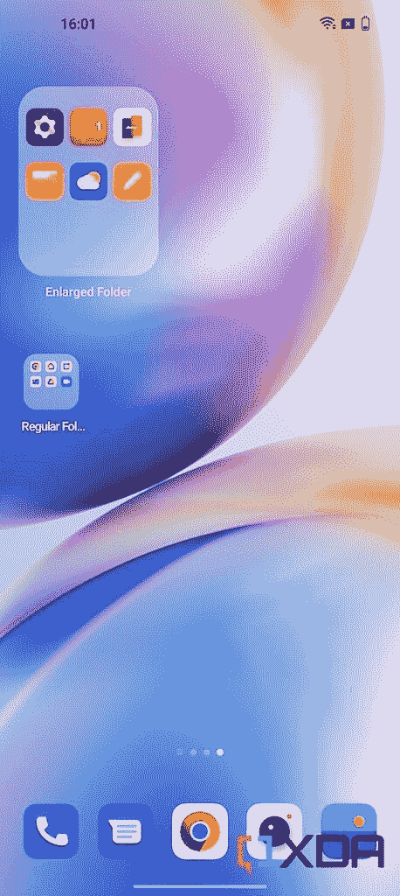

# OxygenOS 13 公开测试版:一加智能手机的官方 Android 13

> 原文：<https://www.xda-developers.com/oneplus-oxygenos-13-open-beta-hands-on/>

一加因将其软件代码库与 Oppo 的 ColorOS 合并而在软件领域失手，面临着强烈的反对。随后的软件版本漏洞百出，甚至稳定的更新——包括一加 9 系列在内的许多一加设备都受到了影响——感觉像是事后想起的，有许多不一致之处。此后不久，该公司决定收回一些更改，表明 OxygenOS 13 将纠正已经做的错误，并将恢复 OxygenOS UI 过去的样子。好吧，作为该公司开放测试计划的一部分，应该提供“熟悉的 OxygenOS 体验”的更新终于来了。没错，我已经在一台[一加 10 Pro](https://www.xda-developers.com/oneplus-10-pro-review/) 上侧装了基于 Android 13 的 OxygenOS 13 开放测试版，下面是我注意到的一些第一件事:

## OxygenOS 13 新特性和重新设计

以下是 OxygenOS 13 的一些新功能和重新设计的 UI 元素:

### 新材料你的颜色

现在可以看到谷歌新的和改进的调色板在 OxygenOS 13 版本上全面运行。有更多的颜色供系统选择，这些是由你的壁纸动态生成的。OxygenOS 13 现在会给你一个选项，允许手机根据你设置的壁纸自动选择颜色。注意快速设置图标是如何根据上面截图中使用的壁纸改变颜色的？对于支持[材质的应用来说也是如此，所以它们会根据你当前在手机上运行的主题来改变颜色。谷歌新改进的材料 You 是我最喜欢的功能之一，因为它在手机的用户界面上提供了一致的外观和感觉。](https://www.xda-developers.com/material-you/)

### Oppo 的许多功能和设计元素占据了中心位置

这可能并不令人惊讶，但 OxygenOS 13 将聚光灯转向了 Oppo 的许多功能。这些是你过去可能在 Oppo 手机上看到的。我最近评测了一下 [Oppo Reno 8 Pro](https://www.xda-developers.com/oppo-reno-8-pro-review/) ，所以我可以立刻认出这些功能。我指的是 O-Haptics，Omoji 等。OxygenOS 将许多这些功能放在前面和中间，以确保您不会错过它们。你可以在下面的设置应用中看到这样的例子:

**奥莫治**

Omoji，顾名思义，类似于苹果的 Memoji。你可以创建自己的 Omoji，并像使用苹果的 Memojis 一样使用它。在 Oppo 的辩护中，它工作得非常好，我可以看到很多人实际上在使用它。我个人更喜欢 Oppo 的 O-Haptics 功能，所以下面会详细介绍。

**O 型触觉传感器**

O-Haptics 将通过出色的触觉反馈改善您使用设备的体验。这已经是 OxygenOS 12 的一部分，但你可以获得一个额外的设置，让你设置触摸的感觉。OxugenOS 13 已经进行了调整，让你现在可以在 UI 的更多地方感受到触觉，从手机获得反馈感觉很好，很放心。例如，在一加货架内将所有东西滚动到顶部或底部，现在会触发触觉反馈，这是目前运行 OxygenOS 12 的[一加 10T](https://www.xda-developers.com/oneplus-10t-first-impressions/) 所不具备的。

变更日志中还提到了一些新的模式，比如儿童空间。你可以在设置里的特殊功能选项里找到它和一些其他的模式(**设置>特殊功能**)。这些是 OxygenOS 13 的新功能，但在 ColorOS 12.1 中已经有了。

### 水形设计

OxygenOS 13 正在转向一加所说的“水形设计”。与 OxygenOS 12 相比，UI 的整体美观性发生了巨大变化。很多应用程序，设置页面，菜单等等。看起来很不一样。简单来说就是现在看起来很像 ColorOS。这是在 OxygenOS 12、OxygenOS 13 和 ColorOS 12.1 上并排看到的时钟应用程序。我还在下面添加了一个快速设置的截图，以显示 OxygenOS 13 上的快速设置图标看起来像 ColorOS 12 上的图标。你一定会看到这两个软件之间有很多相似之处，所以如果你不喜欢 ColorOS 的外观，你可能不会喜欢它。

**快速设置图标:**

### 通知的更改

如果你能越过占据了几乎一半通知阴影的巨大快速设置面板，你会发现 OxygenOS 13 与之前的版本相比对通知进行了一些调整。不同应用程序的通知卡现在分开了，中间留有一些空间，底部还有一个巨大的“X”按钮来清除它们，而不是像 OxygenOS 12 上看到的“全部清除”按钮。

### 一加大陆架

一加货架在 OxygenOS 13 上基本保持不变，是的，它仍然作为一个独立的应用程序打开，而不仅仅是一个覆盖。顶部的“永不定居”标语已经被日历事件取代，也没有搜索栏。

### 放大的文件夹视图

OxygenOS 13 还为你提供了一些贴心的功能，比如放大的文件夹视图，让你只需点击一下就可以在放大的文件夹中打开应用程序，而不必进入文件夹本身。

 <picture></picture> 

Enlarged folder vs regular folder in OxygenOS 13

### OxygenOS 13 上定制始终开启显示屏的更多选项

如果你需要更多的定制选项来调整手机上的永远在线显示屏，那么 OxygenOS 13 为你提供了一些漂亮的工具。除了将您的 Omoji 添加到始终显示中，您还可以使用一些新功能，包括“自定义模式”和“文本和图像”选项，来真正自定义 AOD。“画布”选项仍然可以映射您选择的任何图像的轮廓。我能够简单地使用这个特性，它确实像预期的那样工作。如果你想知道，OxygenOS 12 只有“画布”和一些预设选项来定制 AOD。

OxygenOS 13 增加了更多截图编辑的标记工具。值得注意的是，你还可以获得聊天截图的像素化功能，系统可以识别并自动像素化聊天截图中的个人资料图片和显示姓名，以保护你的隐私。这些功能是以前的软件所没有的，手机也没有让我在这个页面上抓取运行稳定的 OxygenOS 12 的一加 10T 的截图。

* * *

## OxygenOS 13 开放测试版动手操作:除了名称之外，仍然是 ColorOS

虽然一加指出，它将收回 ColorOS 引入的一些变化，但 OxygenOS 13 仍然使用 ColorOS 作为基础。新软件增加了许多 ColorOS 功能，其中许多功能你可能喜欢也可能不喜欢，这取决于你的喜好。在我看来，Oppo 的 ColorOS 经过多年的发展，仍然是市场上最好的 Android 皮肤之一。因此，OxygenOS 13 在此基础上增加更多功能的事实是一个令人兴奋的命题。

然而，这不是几个月前一加向我们承诺的“熟悉的 OxygenOS 体验”。这并不是你所期望的干净、轻巧、有着激进变化的用户界面，这让我有点失望。ColorOS - OxygenOS 的合并仍然非常有效，可能无法回到将一加推入主流的 OxygenOS 的经历。一加的 OxygenOS 实际上只是 ColorOS 的一个不同的名字。

一加的 OxygenOS 实际上只是 ColorOS 的一个不同的名字

这是件坏事吗？是的，如果你不喜欢 ColorOS 带来的东西。但是，像我一样，如果你不介意使用 ColorOS 的所有功能，那么有很多值得期待的。当然，这个版本的 OxygenOS 13 并不是最终版本，在开始推出之前，一加还有很大的空间来改进和改变其软件，以区别于 Oppo 的 ColorOS。我们将密切关注未来的版本，看看是否有什么变化。

与此同时，你可以通过侧载更新在你的一加 10 Pro 上尝试 OxygenOS 13。你可以前往我们的 [OxygenOS 13 下载](https://www.xda-developers.com/oneplus-10-pro-oxygenos-13-open-beta-1-android-13/)页面查看官方更新日志，并获得为你的设备下载更新的链接。不言而喻，在这个测试版中，您可能会遇到一些错误，一些第三方应用程序可能无法按预期工作。

* * *

嗯，这些是我在 OxygenOS 13 测试版的短暂时间里发现的一些新功能和变化。在接下来的几天里，我会广泛地使用这个新软件，看看我是否能发现更多的变化。我想提一下，在发布会上提到的许多[oxygen OS 13 新功能](https://www.xda-developers.com/oneplus-oxygenos-13-launch/)，包括与 AOD 的 Spotify 集成，以及与 AOD 的 Swiggy/Zomato 集成，仍然没有实现。我希望这些特性能在未来的版本中出现，因为它们是一加承诺的新软件的一部分。

现在您已经体验了 OxygenOS 13，我们想知道您对该软件的看法。请在下面的评论中留言，让我们知道您对 OxygenOS 13 版本及其带来的变化的想法。