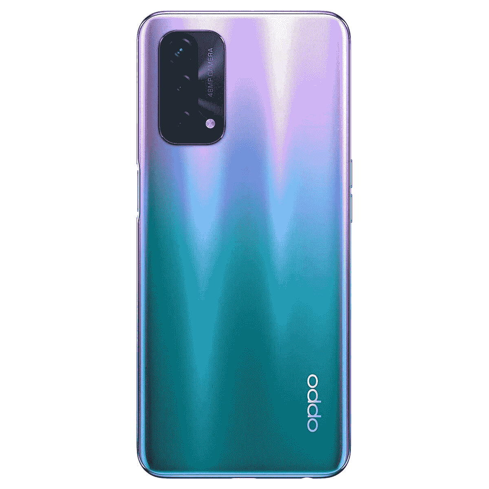

# OPPO A74 5G 是 OPPO 在印度最便宜的 5G 手机

> 原文：<https://www.xda-developers.com/oppo-a74-5g-launch-india/>

就在[在印度发布经济型手机 OPPO A54](https://www.xda-developers.com/oppo-a54-india-launch/) 一天后，OPPO 又在该地区发布了另一款设备。该公司最新的手机名为 OPPO A74 5G，是一款价格实惠的 5G 设备，采用高通的[骁龙 480 SoC](https://www.xda-developers.com/qualcomm-snapdragon-480-cheap-5g-phones-2021/) ，90Hz FHD+显示屏，5,000mAh 大电池，背面有三摄像头设置。以下是您需要了解的关于来自中国 OEM 厂商的新型平价 5G 设备的所有信息:

## OPPO A74 5G:规格

| 

规格

 | 

OPPO A74 5G

 |
| --- | --- |
| **尺寸&重量** | 

*   162.9 x 74.7 x 8.4mm 毫米
*   188 克

 |
| **显示** | 

*   6.48 英寸 FHD+打孔液晶屏
*   2400 x 1080p405 PPI
*   90Hz 刷新率
*   180Hz 触摸采样速率
*   480 尼特
*   4096 亮度等级
*   90.5%的屏幕与机身比例

 |
| **SoC** | 

*   高通骁龙 480
    *   8 纳米
    *   2x ARM Cortex-A76 @2.0GHz
    *   6x ARM Cortex-A55 @1.8GHz
    *   肾上腺素 619

 |
| **风筒&储存** | 

*   6GB + 128GB
*   用于扩展的 microSD 卡插槽

 |
| **电池&充电** | 

*   5000 毫安时
*   18W 有线快速充电

 |
| **安全** | 侧装式指纹扫描仪 |
| **后置摄像头** | 

*   48MP 主摄像头
*   2MP 深度传感器
*   2MP 微距相机

 |
| **前置摄像头** | 800 万像素 |
| **港口** | 

*   USB 类型-C
*   3.5 毫米耳机插孔

 |
| **连通性** | 

*   5G (SA/NSA)
*   无线网络 802.11ac
*   蓝牙 5.1
*   全球（卫星）定位系统

 |
| **软件** | 基于 Android 11 的 ColorOS 11.1 |

OPPO A74 5G 与最近推出的 OPPO A54 分享了其设计，后置摄像头模块是两者之间唯一明显的区别。然而，新设备提供了更好的硬件选择。这款手机采用 6.48 英寸 FHD+液晶面板，左上角有一个打孔的切口，用于自拍相机。该显示器的分辨率为 2400 x 1080 像素，像素密度为 405PPI。这是一个 90 赫兹的刷新率面板，提供 180 赫兹的触摸采样率，480 尼特的峰值亮度和 4096 个亮度级别，以及 90.5%的屏幕与机身比率。

在背面，它的左上角有一个大型矩形相机模块，内置三个相机传感器和一个闪光灯。这款手机的后面板相对边缘上有 OPPO 品牌，右边缘有侧装式指纹扫描仪，左边缘有音量摇杆。USB Type-C 端口、3.5 毫米耳机接口和扬声器格栅可以在底部边缘找到。

OPPO A74 5G 采用高通的骁龙 480 5G 芯片，这是一款基于 8 纳米工艺的八核芯片。该 SoC 包括两个主频为 2.0GHz 的 ARM Cortex-A76 内核和六个主频为 1.8GHz 的 ARM Cortex-A55 内核。对于图形密集型任务，该 SoC 封装了 Adreno 619 GPU。该芯片还具有骁龙 X51 调制解调器-RF 系统，用于 5G 连接。OPPO 在设备上为骁龙 480 配备了 6GB 的内存和 128GB 的存储空间，可以使用附带的 microSD 卡插槽进一步扩展。

在摄像头方面，OPPO A74 5G 提供了背面的 48MP 主摄像头，2MP 深度传感器和 2MP 宏观传感器。在正面，它有一个 800 万像素的自拍相机。硬件由一个巨大的 5000 毫安时电池支持，支持使用随附的充电器进行 18W 快速充电。在软件方面，该设备开箱即可运行基于 Android 11 的 ColorOS 11.1。Android 皮肤提供了许多独特的功能，如空闲时间优化器、私人保险箱、应用程序锁、截屏隐私保护等等。您可以在我们的[深度 ColorOS 11 评测](https://www.xda-developers.com/coloros-11-android-11-oppo-review/)中了解更多关于软件功能的信息。

## 定价和可用性

OPPO A74 5G 的价格为₹17,990 (约 240 美元)，将于 4 月 26 日开始在印度销售。该设备将通过亚马逊网站和该国所有主要的线下零售商提供两种配色——液体黑和梦幻紫。如果你选择通过亚马逊购买设备，如果你使用指定银行的信用卡或借记卡，你将有资格获得 10%的即时折扣。购买者还可以以₹1,299、₹2,499 和₹2,499 的折扣价购买 OPPO Enco W11 TWS 耳机、OPPO Band 和 OPPO W31。感兴趣的买家还可以选择购买该设备的两年延长保修。

 <picture></picture> 

OPPO A74 5G

##### OPPO A74 5G

OPPO A74 5G 采用骁龙 480 SoC、90Hz 显示屏和 4800 万像素摄像头，是印度最实惠的 5G 智能手机。