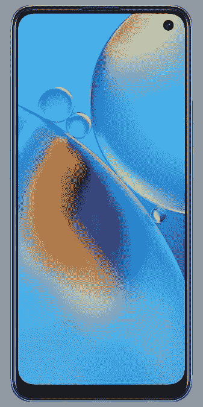

# OPPO F19 在印度发布，配备 5000 毫安时电池和三摄像头

> 原文：<https://www.xda-developers.com/oppo-f19-india-launch/>

继上个月推出 [OPPO F19 Pro 和 F19 Pro+](https://www.xda-developers.com/oppo-f19-pro-f19-pro-oppo-band-style-launched-india/) 之后，OPPO 正在为阵容增加一款设备。该公司刚刚在印度发布了 OPPO F19。这种标准型号的插槽低于 F19 Pro 和 F19 Pro+,并将联发科芯片换成骁龙芯片，同时保持其他大部分部件完好无损。尽管 OPPO F19 可能不会吸引那些非常重视规格表的发烧友社区，但这款设备注定会在线下市场获得巨大反响，而线下市场一直是 OPPO 的大本营。

## OPPO F19:规格

| 

规格

 | 

OPPO F19

 |
| --- | --- |
| **尺寸和重量** |  |
| **显示** | 

*   6.43 英寸 AMOLED
*   全高清+ (2400 x 1080)
*   60Hz 刷新率
*   135Hz 触摸采样率(游戏模式下高达 180Hz)

 |
| **SoC** | 

*   高通骁龙 662:
    *   4 倍性能和 4 倍效率的 Kryo 260 CPU 内核(最高 2.0GHz)
    *   11 纳米
*   Adreno 610 GPU

 |
| **RAM 和存储器** | 

*   6GB 内存
*   128GB 闪存存储
*   MicroSD 卡支持

 |
| **电池&充电** | 

*   5000 毫安时电池
*   33W 快速充电器(包装盒内)

 |
| **后置摄像头** | 

*   初级:4800 万华氏度/1.7
*   辅助:2MP 宏 f/2.4
*   第三级:2MP 散景 f/2.4

 |
| **前置摄像头** | 1600 万像素 f/2.4 |
| **端口** | 

*   USB 类端口
*   3.5 毫米耳机插孔

 |
| **连通性** | 

*   4G LTE
*   蓝牙 5.0
*   C 型端口
*   双 SIM 卡
*   WiFi 802.11 . b/g/n/AC(2.4 GHz+5 GHz)

 |
| **安全** | 显示指纹扫描仪 |
| **软件** | 搭载 ColorOS 11.1 的 Android 11 |

OPPO F19 在内部硬件方面和同行没有太大区别。这款手机采用 6.4 英寸 AMOLED 全高清+显示屏，触摸采样率高达 180Hz。为该设备提供动力的是骁龙 662 芯片，配有 6GB 内存和 128GB 闪存。

 <picture></picture> 

OPPO F19 - Midnight Blue

在背面，我们有一个三摄像头设置，标题是一个 48MP 主传感器，两侧是两个 2MP 宏观和深度传感器。OPPO F19 明显错过了 8MP 超广角传感器，该传感器在 F19 Pro 和 F19 Pro+上都有。

与同类产品的 4350 毫安时电池相比，这款手机配备了更大的 5000 毫安时电池，并通过包装盒内的 33W SuperVOOC 2.0 快速充电器充电。

软件方面，OPPO F19 开箱运行 Android 11，顶部是该公司的 [ColorOS 11.1](https://www.xda-developers.com/coloros-11-android-11-oppo-review/) UI。这款手机的其他显著亮点包括显示指纹扫描仪、蓝牙 5.0、3.5 毫米音频插孔、双频 Wi-Fi 和双 SIM 卡支持。

### 定价和可用性

OPPO F19 有棱镜黑和午夜蓝两种颜色，只有一种型号，价格在₹18,990(约 259 美元)。这款手机将于 4 月 9 日开始在印度各地销售，销售渠道包括亚马逊印度、Flipkart 和主要的线下零售商。HDFC 信用卡和借记卡持有人在 EMI 交易中可享受高达₹1500 的即时折扣

 <picture></picture> 

OPPO F19 - Midnight Blue

##### OPPO F19

OPPO F19 采用 6.43 英寸 AMOLED 显示屏，设计惊艳，提供强大的三摄像头系统和 5000 毫安时大电池，支持 33W 快速充电。