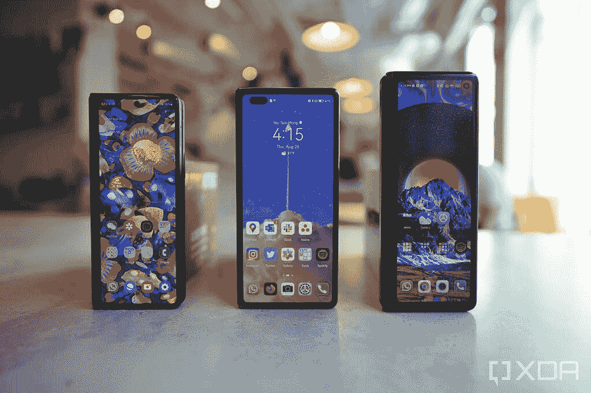
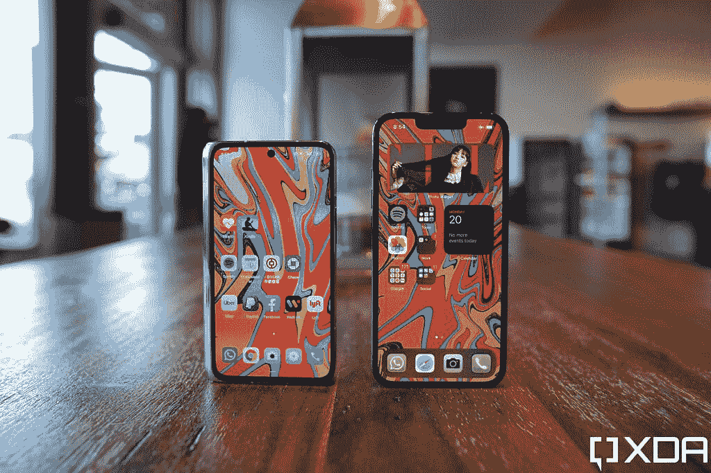
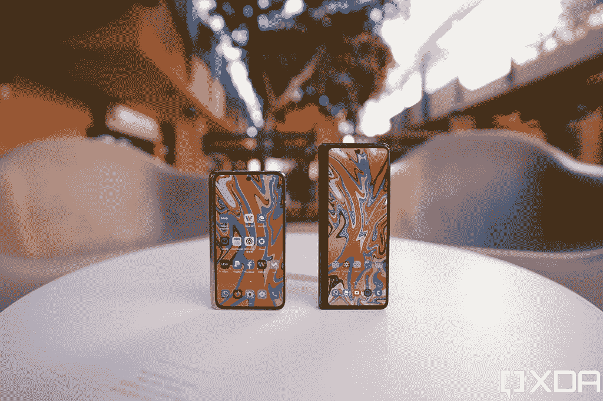
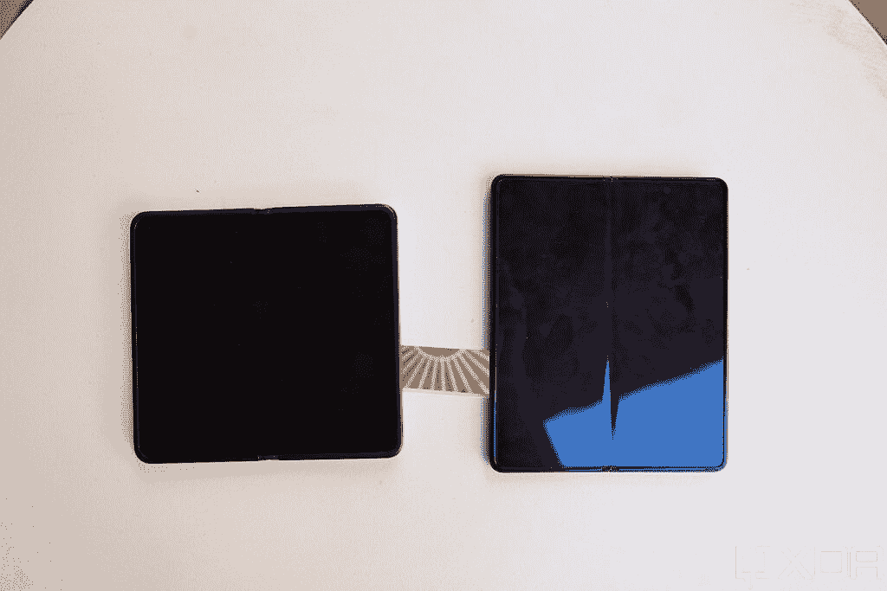
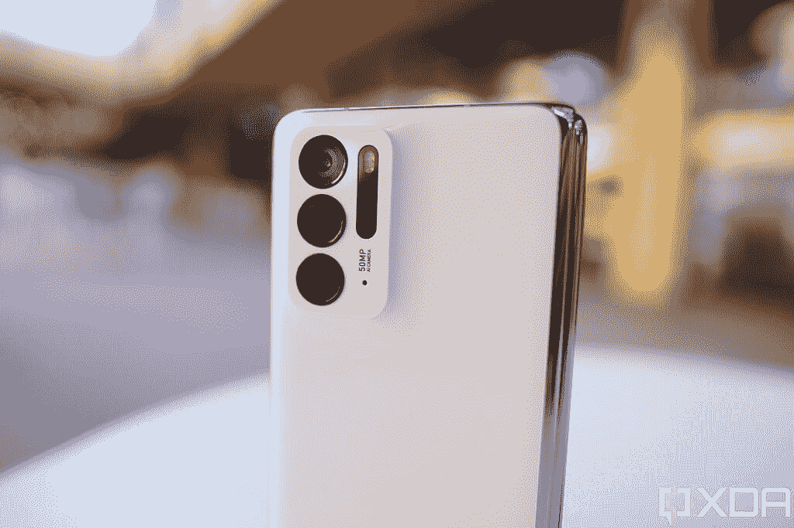
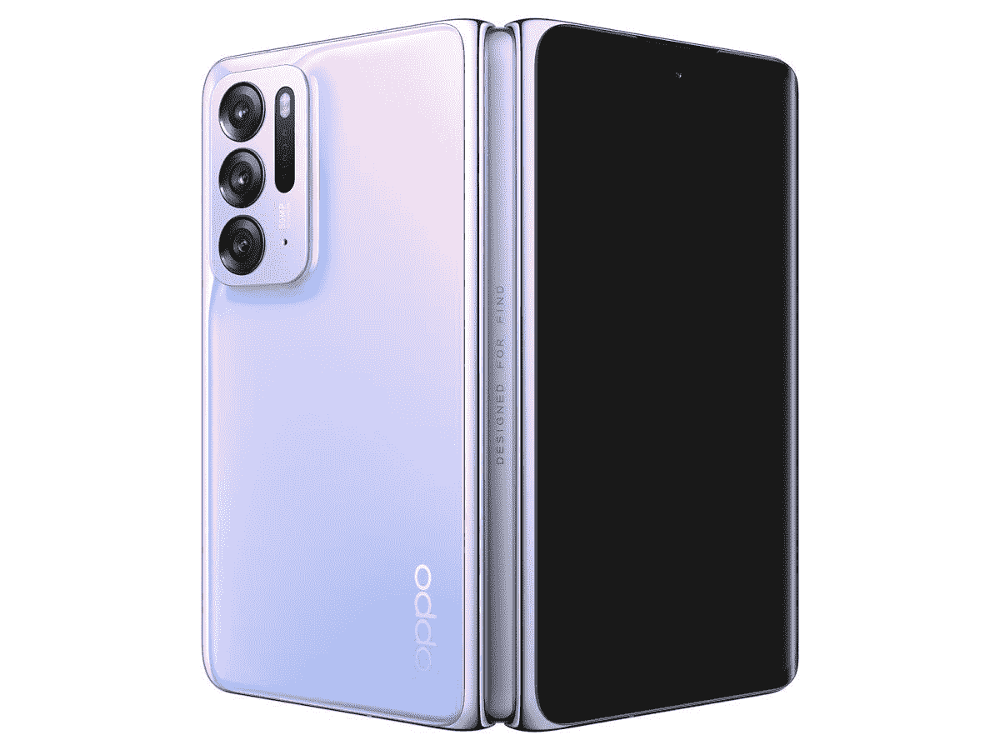

# OPPO Find N 评测:结合了三星和华为可折叠产品的优点

> 原文：<https://www.xda-developers.com/oppo-find-n-review/>

OPPO 可能在可折叠智能手机游戏中姗姗来迟——[三星](https://www.xda-developers.com/samsung-galaxy-z-fold-3/)，[华为](https://www.xda-developers.com/huawei-mate-x2-review/)，[小米](https://www.xda-developers.com/xiaomi-mi-mix-fold-hands-on/) [摩托罗拉](https://www.xda-developers.com/motorola-razr-5g-specs-features-pricing-availability/)，甚至，嗯， [Royole](https://www.xda-developers.com/royole-flexpai-2-preview/) 都已经用[可折叠手机](https://www.xda-developers.com/best-foldable-phones/)上市了。但据该公司首席产品官皮特·刘(Pete Lau)称，这一迟到并非因为缺乏能力。事实上，OPPO 在过去四年里已经制作了六款可折叠原型——在与 Lau 的媒体发布会上，我们甚至瞥见了这些设备，包括蛤壳式、内折式和外折式。但最终，该公司决定等到技术成熟。

事后看来，OPPO 也可以检查其他公司做得对与错。因此，该公司的第一款可折叠手机 Find N 似乎吸收了三星的 Galaxy Z Fold 3 和华为的 Mate X2 的精华，形成了一个平衡的套装。事实上，这是我的新宠可折叠硬件。

### OPPO Find N 规格:点击展开

## OPPO Find N:规格

| 

规格

 | 

OPPO Find N

 |
| --- | --- |
| **构建** | 

*   大猩猩玻璃 Victus 正面和背面
*   铝制框架和铰链

 |
| **尺寸&重量** | 

*   折叠后:132.6 x 73 x 15.9 毫米
*   展开时:132.6 x 140.2 x 8.0 毫米

 |
| **显示** | 

*   主要的
    *   带 UTG 的 7.1 英寸灵活有机发光二极管
    *   1792 x 1920
    *   120 赫兹刷新率
*   副手
    *   5.5 英寸 AMOLED 屏幕
    *   988 x 1972
    *   60Hz 刷新率
    *   18:9 宽高比

 |
| **SoC** | 

*   高通骁龙 888
    *   中央处理器
        *   1x ARM Cortex-X1 @ 2.84GHz
        *   3 个 ARM Cortex-A78 @ 2.4GHz
        *   4x ARM Cortex-A55 @ 1.8GHz
    *   GPU: Adreno 660

 |
| **风筒&储存** | 

*   12GB LPDDR5 内存+ 256GB UFS 3.1 存储
*   12GB LPDDR5 内存+ 512GB UFS 3.1 存储

 |
| **电池&充电** | 

*   4500 毫安时电池
*   33W 有线快速充电
*   15W 无线充电

 |
| **安全** | 

*   侧装式指纹读取器

 |
| **后置摄像头** | 

*   **初级:** 50 兆像素，f/1.8，24 毫米(宽)，1/1.56 英寸
*   **次要:** 16 MP，f/2.2，14mm(超宽)，123
*   **三级:** 13 MP，f/2.4，52mm(长焦)，1/3.4”

 |
| **前置摄像头** | 

*   32MP，f/2.4(主屏幕)
*   32MP，f/2.4(副屏幕)

 |
| **端口** | 

*   USB 类型-C
*   没有 3.5 毫米耳机插孔

 |
| **音频** |  |
| **连通性** | 

*   高通骁龙 X60 4G LTE 和 5G 集成调制解调器
    *   5G:n1/n3/n5/n7/n8/n20/n28/n38/n40/n41/n77/n78/n79
    *   4G:LTE FDD:B1/2/3/4/5/7/8/12/17/20/28/32/66
    *   4G: LTE TDD: B38/40/41/42
    *   3G: WCDMA: B1/2/4/5/8
    *   2G: GSM: 850 900 1800 1900 MHz
*   双 SIM 卡，双 5G 待机
*   蓝牙 5.2
*   Wi-Fi 6E
*   NFC 和红外增强器

 |
| **软件** | 基于 Android 11 的 ColorOS 12 |

***关于这个动手:** OPPO 给我提供了一个 Find N unit 来测试。这个评测是用了一周后的。OPPO 在这篇文章中没有任何投入。*

## OPPO Find N 硬件:可折叠的金发女孩

迄今为止，可折叠手机要么非常小，要么非常大。像 Galaxy Z Flip 3 或摩托罗拉 Razr 这样的蛤壳式可折叠手机只是普通大小的手机，对折后变得很小——在高度和宽度上甚至比一个饮料杯垫还小。三星的 Fold 系列、华为的 Mate X 系列或小米的 Mix Fold 等更大的可折叠平板电脑基本上是 iPad 迷你平板电脑，可以转变为现代旗舰平板电脑，这意味着即使是这种形式，它们也相对较大。三星和小米确实把可折叠手机的宽度做得更窄了，但它们仍然是比标准 iPhone 还要高的手机。

 <picture></picture> 

The Samsung Galaxy Z Fold 2, Huawei Mate X2, and Xiaomi Mix Fold

OPPO Find N 是第一款在两种方法之间找到平衡的可折叠产品。它的外部辅助屏幕只有 5.5 英寸，具有更传统的 18:9 纵横比，由于薄边框和边缘的微妙弯曲，这使得 Find N 在折叠形式下看起来非常紧凑。事实上，它比一部 [iPhone 13 Pro](https://www.xda-developers.com/iphone-13-pro/) 要小得多，按照现代平板电脑的标准，iPhone 13 Pro 本身就不算大。

 <picture></picture> 

The Find N with an iPhone 13 Pro

而且它明显比 Galaxy Z Fold 3 更短更紧凑。

 <picture></picture> 

Find N and Galaxy Z Fold 3

OPPO Find N 是第一款在太大和太小之间找到平衡的可折叠产品

由于 Find N 的屏幕采用了 18:9 的宽高比，而 Galaxy Z Fold 3 的宽高比为 24.5:9，因此它可以以更“正常”的方式显示智能手机内容，而不会像 Z Fold 3 那样有局促和拉长的感觉。这在打字时尤为重要——三星 Fold 手机的外层屏幕总是感觉屏幕键盘局促，小米 Mix Fold 更是如此，导致更多的错别字。在 Find N 上，我能以我通常的速度啄来啄去。

前后玻璃的曲率以及更圆的铰链区域也比 Galaxy Z Fold 3 更舒适，Galaxy Z Fold 3 的铰链角仍然略尖(这个问题在 Galaxy Z Fold 2 之前更严重)。

你可能会从上面的照片中注意到，Find N 也是完全平折的，而 Galaxy Z Fold 3 的折叠是有角度的，并留有轻微的缝隙。这是因为 Find N 的铰链有一个小空腔，屏幕可以塞进去，折叠起来没有 Galaxy Z Fold 3 的设计那么粗糙。

这种设计也意味着 Find N 的内部屏幕不会出现太多折痕(由于宽松的折叠弯曲，它实际上有双重折痕)。如果你在特定光线下从极端角度看屏幕，你可以发现双重折痕，但它远没有 Galaxy Z Fold 3 中的折痕明显。

 <picture></picture> 

Find N (left), Galaxy Z Fold 3 (right).

Find N 的主屏幕是一块 7.1 英寸、1792 x 1920、120Hz 的面板，外观和手感都很棒。它被超薄玻璃覆盖，所以感觉不如小米和华为的可折叠手机那么塑料，更像三星的可折叠手机——事实上，屏幕来自三星。动画非常流畅，尽管跳回只有 60Hz 的外部屏幕时很不和谐。

上周，Find N 收到了科技媒体对这种铰链设计的大量溢美之词，这种设计基本上消除了折痕和间隙。我必须补充一些背景知识。虽然这是一个非常棒的设计，但 Find N 不是第一个提供这种设计的*。我们在摩托罗拉的 Razr foldables 中看到了这一点，在更直接的对比中，华为 Mate X2 也是如此。就外观和感觉而言，Find N 的铰链与华为 Mate X2 中的铰链非常相似。*

但 OPPO 通过增加三星首创的一个技巧对这种铰链进行了改进:铰链能够在任何角度保持打开。三星称之为“Flex 模式”，OPPO 称之为“FlexForm 模式”，但它们的工作方式相同。目前，只有三星和 OPPO foldables 可以做到这一点——这是一个非常实用的功能，进一步证明了可折叠产品的重要性。

铰链能够保持半折叠，这使得 Find N 可以用作迷你笔记本电脑，因为屏幕宽高比比 Galaxy Z Fold 3 更宽，键盘也不那么拥挤。实际上，在笔记本电脑模式下，我用多个手指打字比只用两个拇指打字要稍微快一点。

这种形式还可以让用户不用手就能拍照、录像或观看媒体。例如，我可以在涂鸦墙前给自己拍这张照片，而不需要三脚架。

**电池和内存**

尽管 OPPO Find N 体积小巧，但它配备了 4，500 毫安时的电池，比 Galaxy Z Fold 3 的 4，400 毫安时电池略大。由于外部屏幕只是一个 60Hz 的面板，而且 OPPO 的中文 ROM 软件有一些积极的电池管理(在软件部分有更多关于这一点的信息)，Find N 的电池寿命一直很出色。在使用的前两天，我会在上午 9 点拔掉电源插头，一整天都在大量使用，15 个小时后的午夜仍然有大约 40%的电池。但这是由于 OPPO 过于激进的电池优化产生了意想不到的副作用(同样，在软件部分有更多关于这一点的内容)。在我禁用了积极的电池微管理后，我仍然在剩余 25%电池的情况下完成了 15 小时的工作。这款手机应该可以为任何人使用一整天。可以通过随附的 30W 快速充电砖或无线充电来完成充值。

Find N 配备了 12GB 内存和至少 256GB 的存储空间(我的设备有 512GB)，与许多现代旗舰产品一样出色。在我频繁使用的一周里，我没有遇到过应用程序启动不稳定或崩溃的情况。

**硬件挑剔**

对硬件也有一些挑剔:Find N 只有两个扬声器(三星、小米和华为的大屏幕可折叠扬声器有四个)，而且它们都位于 Find N 的底部，所以你无法获得身临其境的立体声。虽然铰链感觉非常坚固，构造良好，但也没有像三星的 Galaxy Z Fold 3 那样的官方 IP 评级。这款手机的骁龙 888 SoC 也将在几周内正式成为“最后一代”，因为与[骁龙 8 Gen 1](https://www.xda-developers.com/qualcomm-snapdragon-8-gen-1/) 的旗舰产品将会公布。尽管如此，考虑到 Find N 相对较低的价格(7699 元人民币，约合 1206 美元)，这些只能被称为吹毛求疵。

* * *

## OPPO Find N:相机

OPPO Find N 上有五个摄像头:两个 32MP 自拍摄像头(每个屏幕一个)，一个 50MP、f/1.8、1/1.58 英寸传感器的三摄像头主系统，以及一个 16MP 超宽和一个 12MP 长焦镜头，可以进行 2 倍光学变焦。虽然主摄像头与 Find X3 中使用的摄像头相同，因此它非常强大，但后两个镜头不如 Find X3 中看到的镜头，这再次意味着，一部可折叠手机使用了一个折衷的摄像头系统，不是该公司最好的光学系统。

 <picture></picture> 

The Find N's triple-lens array consists of a 12MP telephoto (top), 50MP main (middle), and 16MP ultra-wide (bottom)

在很大程度上，Find N 仍然可以拍摄出精彩的照片——这款相机肯定比 Galaxy Z Fold 3 的相机好——但对于像我这样被在 [Vivo X70 Pro Plus](https://www.xda-developers.com/vivo-x70-pro-plus-first-impressions/) 和 [Google Pixel 6 Pro](https://www.xda-developers.com/google-pixel-6-pro-camera-review/) 中看到的令人瞠目结舌的世界一流相机宠坏的人来说，我不能说 Find N 相机真的让我惊叹。例如，OPPO Find X3 有一个非常棒的超宽摄像头，拍摄的照片几乎和主摄像头一样清晰。由于超宽传感器降级，Find N 无法做到这一点，所以如果你像素窥视，你可以清楚地看到超宽照片更柔和，细节更少，尤其是在晚上。

在下面的照片中，我们可以看到 Find N 的主摄像头与 iPhone 13 Pro 的照片相比有点突出。超宽战斗更加接近，Find N 的镜头看起来更加有力和生动，但在像这样逆光拍摄的场景中，一些对比度(阴影)可能是首选。

OPPO Find N 的长焦变焦镜头可以拍摄 2 倍光学变焦和高达 20 倍的数码变焦。如果我们坚持 2 倍，拍摄是干净和清晰的。

但如果我们达到 10 倍变焦，这是纯粹的数字裁剪，拍摄效果明显不如 Galaxy S21 Ultra 或 Pixel 6 Pro，然而，如果我们将 Find N 与 Z Fold 3 进行比较，OPPO foldable 的数字变焦仍然比 Galaxy Z Fold 3 的 10 倍变焦好一点(噪点更少)。

由于结合了像素宁滨和相对较大的传感器，Find N 的主摄像头在夜间表现出色。颜色和动态范围在下面两个镜头中都很到位。

自拍和人像拍摄都相当不错——总体而言，Find N 的相机系统非常好，除非你已经被绝对最好的相机宠坏了(同样是 Vivo X70 Pro Plus 和谷歌 Pixel 6 Pro)。

* * *

## OPPO Find N 软件:令人敬畏的手势和定制，但需要一些润色

Find N 在 Android 11 上运行 ColorOS 12，当手机折叠起来时，该软件的行为就像任何其他最近的 OPPO 手机一样，在我看来这是一件伟大的事情——因为 ColorOS 与 OxygenOS 非常相似，大多数人都会同意这是一个非常光滑和有用的 Android 皮肤。ColorOS 和 OxygenOS 一样，在美观和使用手机方面都是高度可定制的。我们不仅可以选择改变 UI 配色方案、图标形状和大小以及动画速度，而且我们还有无数的快捷手势，从可以通过滑动进入主屏幕的快速启动侧栏，或者屏幕关闭手势，这允许我们通过在睡眠屏幕上绘制形状*(*而不需要唤醒屏幕*)来触发操作或启动应用程序。*我非常喜欢关闭屏幕的手势，并希望其他手机也能采用它们:例如，我可以通过画一个 V 来打开手电筒，或者通过画一个箭头来跳过音乐曲目(>)，所有这些都不需要唤醒屏幕。OPPO 甚至让我们定制这些手势，所以我可以，比如说，通过画一个 m 来启动谷歌地图。

说到谷歌，因为 Find N 官方仅在中国销售，它没有附带谷歌应用程序，但这些可以非常容易地安装。OPPO 自己的 app store 有谷歌 Play 商店，所以下载安装就行了。

我绝对喜欢 ColorOS 的屏幕关闭手势，并希望其他手机也能采用它们。

然而，像大多数只在中国市场销售的手机一样，电池优化过于激进，以至于手机会破坏推送通知——这意味着当有人向你发送 WhatsApp 消息时，你可能不会收到通知，因为 Find N 已经将 WhatsApp 置于睡眠状态。我可以通过进入设置并关闭 WhatsApp、Slack 和 Gmail 等重要应用的电池优化来解决这个问题，但我们必须这样做，这真的很烦人。中国品牌-请停止激进的电池优化！ ***没人*** 喜欢打开一个聊天应用程序，才意识到有 12 条几个小时前发送的消息等待阅读。为了能够及时得到通知，我们会很乐意牺牲一些电池寿命。说真的，请停止这样做！

这就是 ColorOS 作为普通平板手机使用的效果。OPPO 对 Find N 展开时的用户界面做了进一步的更改——在平板电脑模式下。最大的增加是快速手势，以帮助多任务。在任何打开的应用程序中，用两个手指向下滑动中间以激活分屏模式。这个手势感觉就像你把屏幕切成两半，动画增加了这种异想天开的感觉。你也可以用三个或四个手指在应用上滑动，应用会缩小成一个浮动窗口，然后可以调整大小。

并不是每个应用都有效:例如，Instagram 拒绝分屏或浮动。但我使用的 90%的应用都运行良好。由于 Find N 的内部屏幕具有更宽的横向纵横比，因此与狭窄的 Galaxy Z Fold 3 屏幕相比，它可以以更自然的格式并排显示两个应用程序。注意下面的照片，XDA 的主页在 Galaxy Z Fold 3 的分屏上看起来非常局促。

 <picture></picture> 

Find N (left); Galaxy Z Fold 3 (right).

然而，Find N 作为平板电脑的软件需要更多的润色。由于 Android 平板电脑的场景如此令人难过，应用程序开发人员并不真的费心为 Android 平板电脑优化应用程序(至少不像他们为 iPad 做的那样)，因此一个主要问题是一些应用程序会以错误的方向打开。这通常发生在横向方向的 Android 平板电脑上，但这个问题中的应用程序只在纵向方向上运行。这也是我在小米、华为和三星的平板电脑上遇到的问题。

例如，在 Find N 上，YouTube 工作室和优步必须侧向打开——它们拒绝适应横向。但是 Instagram，另一个只能在纵向打开的应用程序，将在 Find N 上直立打开，但有很大的柱状框。

三星的前几款可折叠手机也存在这个问题，但 Galaxy Z Fold 3 几乎不存在这个问题。这部分是因为 Galaxy Z Fold 3 的主屏幕即使在展开时也是纵向的。但这也是因为三星显然对其用户界面进行了微调，以确保应用程序可以在任何方向旋转。三星的 Fold UI 还可以迫使任何应用程序在整个屏幕上伸展，我觉得这对于 Instagram 这样的视觉密集型应用程序来说非常可取。支柱拳击只是把沉浸感带走了。

许多第三方应用程序，从 Spotify 到 Telegram 到 Gmail，都通过显示两个窗格的布局来自动利用 Find N 的更大画布。

总体而言，考虑到这是 OPPO 的第一款可折叠产品，Find N 的软件体验可以称得上不错——它只需要再多一点打磨，以适应一些广泛使用的应用程序与横向纵横比不匹配的情况。

* * *

## OPPO Find N:结论

如果我们将 OPPO Find N 与竞争对手进行比较，Find N 在大多数情况下都会胜出。Find N 的屏幕明显优于小米 Mix Fold 的屏幕，小米 Mix Fold 的屏幕有更厚的边框，更慢的刷新率，内部显示屏有明显的褶皱。尽管 Mix Fold 已经开始打折，但如果我们按照官方零售价计算，Find N 要便宜 1000 多元，约合 200 美元。

如果我们将 OPPO Find N 与竞争对手进行比较，Find N 在大多数情况下都会胜出

华为 Mate X2 的外形、屏幕和折痕都可以与 OPPO Find N 相媲美，Mate X2 至今仍是唯一一款可折叠的潜望镜变焦镜头。但其 2700 美元的价格和缺乏谷歌移动服务使其毫无争议。你必须不在乎钱，才会愿意花 2700 美元而不是 1200 美元买一部相似型号的手机。

当然，大多数人会把 Find N 拿来对比的设备是三星的 Galaxy Z Fold 3，这款更接近。正如我已经说过的那样，我认为 Find N 的硬件在手里看起来和感觉都比 Galaxy Z Fold 3 更好，但后者的软件更精致。我们也不能忽视 Z Fold 3 拥有官方 IP 防水评级、触控笔支持和三星 DeX 的事实。这些额外的功能有多重要取决于个人——我个人从未因水损坏而损坏过手机，折叠处的手写笔体验如此大打折扣，以至于我的评测单元 S-Pen Pro 一直在某个抽屉里积灰。所以我唯一“错过”的 Fold 3 额外功能是三星 DeX。但是你的里程会有所不同。

从我的使用情况来看，我更喜欢 Find N 的外形和长宽比。从我从科技媒体同行和读者那里看到的许多评论来看，我想很多人都赞同我的观点。但最终，是价格让 Find N 成为赢家。两年来，可折叠产品的批评者一直在嘲笑可折叠产品的价格。现在，OPPO 已经推出了一款可折叠手机，比顶级旗舰手机贵不了一分钱。我知道这是中国定价，如果 Find N 在国际上发布，价格肯定会跳得更高。但即使它达到了 1500 美元，这仍然离三星 Ultra 或苹果 Max 手机不远。

可折叠的时代已经到来

关键是，我认为 2022 年是可折叠手机最终成为主流的一年，因为如果可靠的传言是可信的，OPPO Find N 只是一个开始。我们很快就会从 Honor，Vivo 获得 foldables，小米肯定会有后续。由于 OPPO 已经将定价定在 1200 美元，Honor 和小米不可能将他们的产品定价高得多。

一旦多个品牌相互竞争并试图超越对方，技术突破就会发生。三星将别无选择，只能带来他们的一流游戏。可折叠的时代已经到来。

 <picture></picture> 

OPPO Find N

##### Oppo Find N

OPPO Find N 是一款不太大也不太小的可折叠手机，它的屏幕几乎没有褶皱。