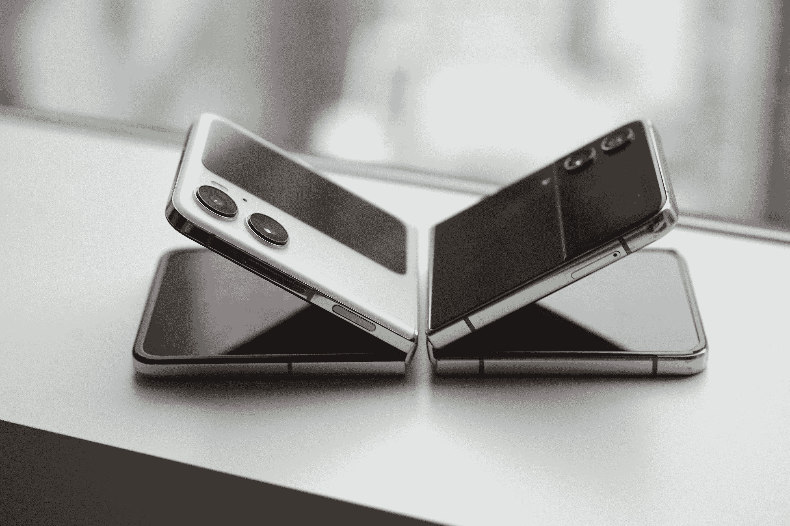
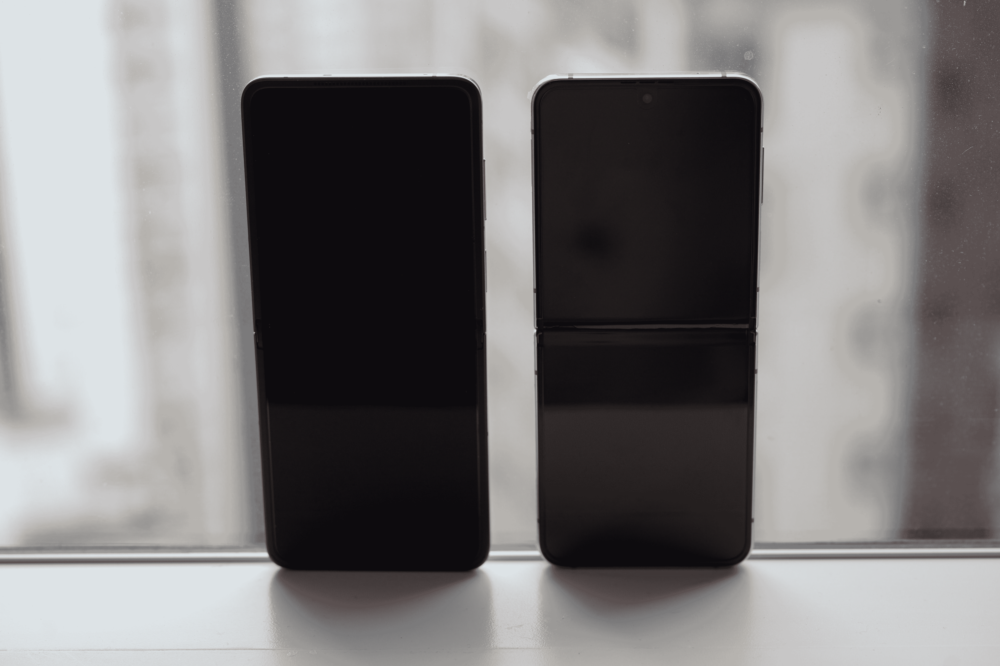
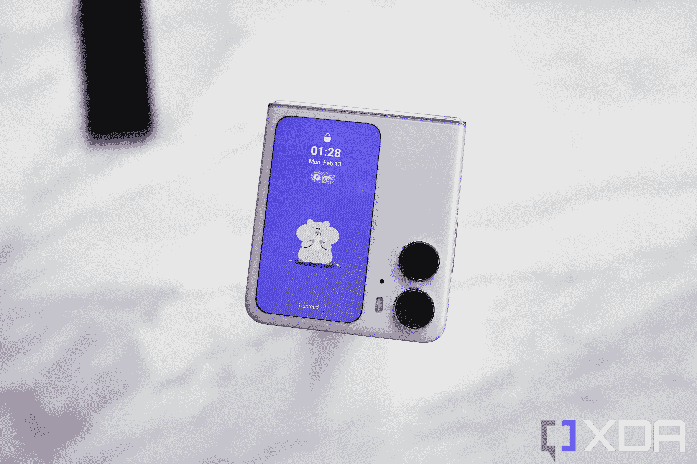
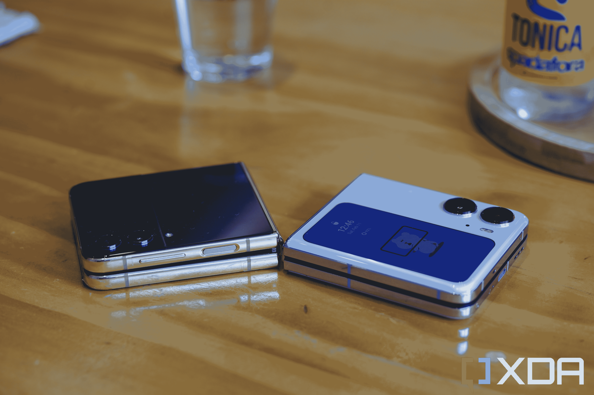

# Oppo Find N2 翻盖评测:Z Flip 4 的有力挑战者

> 原文：<https://www.xda-developers.com/oppo-find-n2-flip-review/>

如果你在过去几年里想要一部可折叠手机，你唯一的选择可能是 T2 三星 Z 折叠手机或 Z 翻盖手机。不管出于什么原因，其他品牌(都是中国品牌)的可折叠手机一直坚持只在中国销售。这造成了一种奇怪的情况，即可折叠手机在一个国家竞争非常激烈。在其他任何地方，三星都是垄断者。

好消息是，中国品牌终于准备在国际上推出可折叠手机。Honor 将很快这样做，有可靠的传言说一加也可能加入这一行列。但第一个正式在中国以外“推出”的是 Oppo 的 Find N2 翻盖手机。虽然它不会在美国上市，但它将在欧洲和东亚的大部分地区销售这一事实很重要，因为[最好的手机](https://www.xda-developers.com/best-android-phones/)只会随着竞争的加剧而变得更好。

我一直在测试这款手机，硬件令人印象深刻，几个关键硬件都战胜了[三星的 Z Flip 4](https://www.xda-developers.com/samsung-galaxy-z-flip-4-review/) 。但是，我们不要忘记，三星发明了这种翻盖可折叠外形，Oppo 只是采用了现有的公式，并添加了更多的抛光和精致。但是，正如我一年多来一直在[撰写/评论](https://www.xda-developers.com/samsung-mobile-cruise-control-competition/)的那样，三星最近似乎已经放开了油门，因为 Find N2 Flip 做对的一些事情让你看着 Flip 4 问道:“为什么三星没有这样做？”

***关于这篇评测:**这篇评测是在测试了 Oppo 提供的 Oppo Find N2 翻盖 10 天后写的。该公司没有参与此次审查。*

##### Oppo 找 N2 翻盖

Oppo Find N2 翻盖手机是一款可折叠的翻盖手机，主摄像头强劲，外壳屏幕比三星的 Flip 4 更大。

**Brand**

3.26 inches, 382 x 720 pixels OLED

**SoC**

MediaTek Dimensity 9000+

**Display**

6.8-inch, 1080 x 2520, 120Hz LTPO OLED (main); 3.26-inch OLED (secondary cover display)

**RAM**

8GB LPDDR5

**Storage**

256GB UFS 3.1

**Battery**

4,300 mAh

**Ports**

USB-C

**Operating System**

ColorOS based on Android 13

**Front camera**

32MP

**Rear cameras**

50MP IMX890 (main), 8MP IMX355 (ultra-wide)

**Dimensions**

Unfolded: 166.2 x 75.2 x 7.5 mm Folded: 85.5 x 75.2 x 16 mm

**Colors**

Purple, Black

**Weight**

191g

**Charging**

44W wired (charger included)

**Pros**

*   显示器折痕很难看到和感觉到
*   更大的纵向覆盖屏幕比 Flip 4 的小屏幕更实用
*   主摄像头性能相当不错

**Cons**

*   更大的覆盖屏幕只能显示小工具，而不是真正的应用程序
*   尺寸芯片现在和骁龙芯片一样强大
*   弱超宽相机

## Oppo 寻找 N2 翻转:价格和可用性

*   国际市场只有一种配置(8GB/256GB)
*   有紫色和黑色可选

Oppo Find N2 Flip 在英国的售价为 849 英镑，8GB 内存，256GB 存储型号，今天开始在英国预订。该产品将在未来几周内推广到欧洲和亚洲的其他地区。在中国，这款手机已经开始销售，零售价约为 5999 元(折合 850 美元)。

## 设计和硬件:光滑，没有巨大的折痕

*   时尚、紧凑、时尚
*   更大的外部屏幕相当引人注目
*   主显示屏折痕只有在极端角度才能看到——比 Flip 4 的折痕好得多

Oppo Find N2 翻盖手机本质上是一款非常薄的 6.8 英寸“平板”手机，可以在中点折叠。当它打开时，它的操作就像任何其他 Android 智能手机一样。如果你看过三星 Galaxy Z Flip 3 或 4，你几乎完全知道 Oppo Find N2 Flip 会有什么样的效果。从显示屏大小到音量摇杆和电源按钮的位置，一切都非常相似。

Find N2 翻盖手机在折叠时略宽但更薄，但如果你闭上眼睛只是拿起它们，你可能无法区分它们，除非你知道如何感受相机镜头的放置或三星折叠点的细微差距。(如果你想知道为什么下面照片中的 Flip 4 有一个不寻常的配色方案，那是因为它是中国独有的型号，名为 W23 Flip。)

 <picture></picture> 

The Oppo Find N2 Flip next to the China-exclusive variant of the Galaxy Z Flip 4 (its official name in China is actually Samsung W23 Flip)

是的，我知道，一个产品几乎抄袭了另一个品牌的整个硬件配方，这是很不合适的。这就是为什么在这篇评论的开始，我特意称赞三星发明了这整个外形。但我想 Oppo 可以说三星的 Ultra 手机使用了 Oppo 首次向世界推出的潜望镜变焦镜头技术。这种“互相抄袭”的事情是全方位的。

不过，Z Flip 4 和 Find N2 Flip 之间最大的区别之一是铰链。与更大的 [Find N2](https://www.xda-developers.com/oppo-find-n2-hands-on/) 一样，这款翻盖采用了 Oppo 第二代“弯曲铰链”Oppo 表示，它已经大幅减少了体积，这是 Find N2 能够大幅减重的主要原因。Oppo 表示，薄铰链节省的空间允许该公司在电池中放置比通常更大的电池(4300 毫安时)。

铰链感觉构造良好，需要一点力才能打开，它也可以在任何角度保持不动。当 Find N2 翻盖被折叠成 L 形时，Oppo 称之为“FlexForm”，并设计了软件功能来利用这种形状因素。稍后将详细介绍。

在设备的右侧有一个音量摇杆和电源按钮，可以兼作指纹扫描仪，当折叠时，它位于手机的上半部分。Find N2 翻盖手机重 191 克，重量很轻，光滑的表面摸起来优雅而柔软，尽管有点滑。

## 显示器:以可折叠标准衡量非常棒

*   6.8 英寸的有机发光二极管屏幕与其他可折叠屏幕形成鲜明对比
*   中间有一条小折痕
*   相对较大的 3.76 英寸辅助显示屏

如果我们按照最新的优质平板旗舰产品设定的高标准来看，Find N2 Flip 的有机发光二极管屏幕不是像素密度最高的(1080 x 2520)或最亮的(持续 500 尼特或峰值 1600 尼特)。但与可折叠屏幕相比，特别是 Galaxy Z Flip 4 中的屏幕，Find N2 Flip 的 6.8 英寸有机发光二极管表现良好。最大亮度仍落后于三星，但作为回报，屏幕没有深槽，Oppo 的软件有更多流畅的动画。1-120Hz 之间的可变刷新率有助于屏幕保持高效，视角极佳，色彩偏移非常小，即使在偏角观看时也是如此。

几乎没有折痕的另一个主要好处是，当你在屏幕上上下移动手指时，你只会感觉到轻微的凹痕，而不是像 Galaxy Z Flip 4 上那样的粗糙沟。这里没有糖衣:相比之下，这些中国可折叠产品的微弱折痕让三星可折叠产品的粗糙折痕看起来很丑。然而，三星对此的推理可能是，其可折叠产品有官方防水评级。目前还没有中国的折叠式手机有这样的评级。但是没有任何证据或官方声明表明折痕在那里是因为防水。

 <picture></picture> 

The Find N2 Flip screen (left) and Galaxy Z Flip 4 screen with the harsh crease (right). 

与三星的 Flip 4 相比，辅助显示屏可能是这款手机最大的卖点。它的尺寸为 3.76 英寸，纵横比为 17:9，非常接近普通手机屏幕，能够吸引注意力，通常比 Flip 4 较小的 1.9 英寸横向屏幕显示更多信息。

从技术上来说，辅助显示器很好，产生强烈的色彩，对触摸和点击有足够的反应。但它不是最高分辨率的屏幕。事实上，在上面拍摄的产品中，您可以分辨出单个像素，尽管这不是什么太糟糕的事情。

## 处理器和电池:相对较大的电池和快速充电

*   在联发科的 dimension 9000+上运行
*   拥有更大的 4300 毫安时电池
*   可以 44W 的速度充电

## 

有趣的是，Flip N2 运行在联发科的[dimension 9000+](https://www.xda-developers.com/mediatek-dimensity-9000-plus/)SoC 上，而不是高通骁龙芯片上。联发科的芯片完全有能力，4 纳米 Dimensity 9000+是一款可以赶上高通骁龙 8 Plus Gen 1 的旗舰产品，但它没有[骁龙 8 Gen 2](https://www.xda-developers.com/snapdragon-8-gen-2-vs-mediatek-dimensity-9000-plus/) 那么强大。更重要的是，Android 手机领域的看法是，只有预算或中端手机使用联发科芯片。

在内存方面，Find N2 翻盖手机只有一种配置:8GB 内存和 256GB 存储空间。8GB 内存很好，但存储使用 UFS 3.1，而不是最近几个版本中出现的最新 UFS 4.0。

如前所述，Find N2 翻盖手机有一个 4，300 毫安时的大电池，可以用附带的充电砖以 44W 的速度充电。然而，无线充电和官方 IP 等级(三星 Flip 4 提供的两样东西)在这里却不见了。在其他地方，对于这样薄的设备来说，这款手机有坚固的触觉和立体声扬声器。总的来说，硬件包非常好——如果不是原创的话。

## 相机:来自可折叠相机的自然照片

*   带有 1/1.56 英寸图像传感器的 50MP 主摄像头非常适合可折叠
*   超宽相机和自拍相机很坚固，但并不引人注目
*   拍照体验不是简单的光学技术，而是你使用手机的各种有趣方式

Oppo Find N Flip 2 的主摄像头是 IMX890 传感器，1/1.56 英寸传感器，f/1.8 光圈。这与[一加 11](https://www.xda-developers.com/oneplus-11-review/) 和 Oppo Find N2 使用的传感器相同，这意味着这是一个非常好的小型可折叠手机传感器，传感器比 Galaxy Z Flip 4 的主射手更大。

IMX890 的新功能之一是全方位对焦，这意味着传感器中的每个像素都可以锁定焦点，并在照片中产生看起来有点自然的散景，主体和背景之间有明显的分离。下面是用这款手机的主摄像头拍摄的照片。

根据上面的例子，我想指出几件事。首先，颜色，尤其是在白天，看起来非常令人愉快。相比之下，它们略微向上突出，但保持了自然的外观。如果你一直在关注 Oppo 或一加的手机，你可能知道这是由于该公司与德国相机制造商哈苏的合作，这创造了所谓的“哈苏调色”

第二种是前景中有主体的一些照片中的散景。但是由于硬件和软件欺骗的结合，这可能是偶然的。在第一张中国干香肠的照片中，散景和对焦衰减很自然，但在我朋友拿着相机的第六张照片中，散景异常强烈，好像我是用人像模式拍摄的(我没有)。你还会注意到最后一张照片是自拍，但它仍然是用主相机拍摄的，因为 Find N2 翻盖的可折叠外形允许主相机兼作自拍相机。

其他镜头在硬件方面没有那么令人印象深刻，但仍然受益于 Oppo 出色的色彩调节和完善的软件，包括像响应式快门这样的东西。例如，超宽相机只是一个 800 万像素的镜头，所以图像通常在细节上更柔和，特别是在弱光下，但只有当你像素窥视时。

32MP 自拍相机很好，但当主相机好得多，副屏幕大到足以成为一个功能性取景器时，为什么要使用它呢？下面是两组自拍，第一个图像由主摄像头捕捉，然后是实际的前置摄像头。前置摄像头可以产生更好的曝光和更详细的图像。

视频性能高于平均水平，如果使用主摄像头，则具有稳定和实时曝光调整。Oppo 的定制成像芯片 MariSilicon X 有助于保持低噪声水平。视频录制分辨率/框架在 4K/60 时达到最大值，但有一个奇怪的错误，它一直将默认设置切换到 1080/30(在软件部分有更多信息)。视频样本可以在下面的视频中看到。

总的来说，Find N2 翻盖手机的相机系统非常适合翻盖折叠手机，但不会很快威胁到高端平板手机的地位。但有了这些翻盖手机，它们的外形和完全铰接的铰链增加了体验。你可以进行免提自拍，在没有陌生人帮忙拿相机的情况下拍摄集体照，或者将屏幕倾斜到一个角度，这样你就可以在不伸长脖子的情况下拍摄非常高或非常低的照片。外形增加了整体体验。是的，Oppo 的相机应用软件也利用了这种形式。

## 软件:外部屏幕利用不足

*   Android 13 的 ColorOS 版本
*   出色的动画和定制功能
*   目前覆盖屏幕的可用性非常有限

Find N2 翻盖手机运行在基于 [Android 13](https://www.xda-developers.com/android-13/) 的 [ColorOS 13](https://www.xda-developers.com/oppo-coloros-13-beta-hands-on/) 上，当它展开时，表现完全像一台典型的 Oppo 旗舰手机。动画流畅，感觉比大多数其他 Android 用户界面更流畅(三星的 OneUI 最近才在 S23 系列中赶上这一点)，ColorOS 充满了快捷手势和定制选项。事实上，Oppo/一加开创了许多用户界面定制选项，谷歌在 2021 年底推出了 Material You 主题，比如从通知面板到应用程序托盘改变整体用户界面配色方案的能力。一旦你用三个手指向下滑动抓取了一个屏幕截图，回到同时按下电源和音量按钮会感觉不必要的复杂。

ColorOS 针对这种外形进行了很好的优化。与更大的 Find N2 不同，这里没有应用缩放问题需要担心，因为应用不需要在屏幕之间跳转。相机 UI 将利用手机的可折叠特性，一旦手机开始折叠，相机取景器就会移动到屏幕的上半部分。YouTube 还会自动将视频移到屏幕的上半部分。这些软件技巧都不是新的，因为三星从第一天起就在 Flip 系列中提供它们。

然而，有一个明显的缺陷:每当我激活封面时，相机的视频录制分辨率总是默认回到 1080p，即使我反复将分辨率设置为 4K。这个问题需要尽快解决。

Oppo 对于外屏的软件也需要改进。当我在翻盖的外面看到这样一个(相对)大而直立的屏幕时，我很兴奋，因为我认为这款手机可以让我们把它用作一款功能齐全的智能手机，我可以直接在 Twitter 上滚动。然而，到目前为止，外部屏幕只能运行小工具，更糟糕的是，只能运行第一方的小工具。现在的选择非常少:有日历、时钟、录音机和照相机的小部件。我只能阅读收到的通知的片段，回复短信仅限于从固定的回复中挑选。

我预计这种有限的互动会出现在较小的屏幕上，比如智能手表或 Flip 4 狭小的屏幕上。坦白地说，在“寻找 N2”相对较大的画布上，这是对空间的浪费。Oppo 确实需要至少开放对第三方 widgets 的支持，理想情况下只是让我们在外屏运行任何 app。

## 性能:良好的通用设备

*   联发科天玑 9000+作为一个生产力或多媒体设备表现非常好
*   作为游戏机低于平均水平
*   翻盖可折叠电池续航时间长

在我作为普通智能手机进行测试期间，联发科天玑 9000+芯片处理这款手机绰绰有余。我必须承认我不是一个重度游戏玩家，我不会坐在任何手机上玩两个小时的 Genshin Impact(T1 ),更不用说一个不是为该任务设计的小而薄的翻盖了。但我和另外两家热衷于手机游戏的媒体同行聊过，他们说《寻找 N2》的翻转版不错，但不太好。例如，它可以以 60f FPS 处理 *PUBG* ，但不能以最高图形设置处理。

我用这款设备完成了更主流的智能手机任务，比如拍照、滚动社交媒体、发短信和阅读文字，这款手机显然没有受到任何影响。没有延迟，没有应用程序崩溃，在 10 天的使用中没有任何异常(除了视频错误不断恢复到 1080 分辨率)。我在应用 PowerDirector 上编辑了几个 30-45 秒的 Instagram 视频剪辑，渲染时间是可以接受的:没有骁龙 8 Gen 2 快，但也不比 Pixel 7 Pro 的 Tensor G2 慢。

我也运行了一些基准测试，发现 N2 翻转得分相当不错，数字明显低于骁龙 8 代 2。这款手机能够在应用程序 3D Mark 上完成 20 分钟的“野外生活极限压力测试”，而几款运行高通骁龙 8 Gen 1 的 2022 旗舰由于过热而无法完成。

对于翻盖可折叠手机来说，电池续航时间非常长。这款手机一次充电可以让我坚持一整天 13-14 个小时，大约 4-5 个小时的屏幕时间，这是三星的翻盖手机无法做到的。缺乏无线充电会让许多人感到困扰，但我对这一省略没什么意见，考虑到手机充电速度也比三星的可折叠手机快得多，44W。这款手机轻巧而坚固的扬声器使其成为长途乘车和机场排队等候时非常好的媒体消费设备。

总的来说，我对性能没有真正的抱怨。如果你是一个重度游戏玩家，你可能会。但是你应该知道不要使用折叠式的翻盖手机。

## 你应该买 Oppo Find N2 翻盖手机吗？

**您应该购买 Oppo Find N2 翻盖手机，如果:**

*   你想要一部可以折叠成一个紧凑的尺寸，并能轻松放入任何口袋的手机
*   你想要一个没有明显折痕的折叠式翻盖和一个更大的显示屏
*   你喜欢色彩

**你应该买 Oppo Find N2 翻盖 if:**

*   你看不出有一个折叠成两半的平板手机有什么好处
*   你希望你的可折叠产品具有 IP 防水等级
*   你想玩电子游戏

像更大的 Find N2 一样，Oppo Find N2 翻盖手机也是一款制作精良、设计精良的可折叠手机，具有硬件结构和抛光功能，可以与三星制造的任何产品针锋相对。如果你是翻盖式外形的粉丝，Find N2 翻盖不一定会将其提升到一个新的水平，但由于更有用的覆盖屏幕尺寸和长宽比，它确实稍微提升了*。*

然而，最大的问题是，寻找 N2 翻转是否比 Z 翻转 4 更好。Oppo 的蛤壳屏幕更好看，主摄像头更强，但三星的设备具有 IPX8 防水等级，无线充电，软件更完善，没有任何大的漏洞。

 <picture></picture> 

The China verison of the Galaxy Z Flip 4 and the Oppo Find N2 Flip. 

Oppo 本可以让自己与众不同的地方是 Z Flip 4 拥有更大的外部屏幕。我对 Flip 4 这样的翻盖式可折叠手机最大的不满之一是，为了回复短信或查看 Twitter，我不得不每天打开手机 80-100 次。Oppo 制造了可以解决这个问题的硬件，但没有提供软件。如果 Oppo 稍后通过软件更新解决这个问题，它会立即将手机提升到 Z Flip 4 之上。我仍然会选择 Find N2 翻盖手机，因为它的显示屏没有折痕，但对于可能更了解三星品牌的普通消费者来说，这是一个更接近的选择。

无论如何，光是 Oppo 在英国、葡萄牙、新加坡和日本等国家销售这款手机这一事实就很重要，因为它有效地结束了三星在翻盖可折叠领域的垄断。人们现在可以走进商店，看到各种小的可折叠物品。这是一件大事。

##### Oppo 找 N2 翻盖

Oppo Find N2 翻盖手机是一款可折叠的翻盖手机，主摄像头强劲，外壳屏幕比三星的 Flip 4 更大。