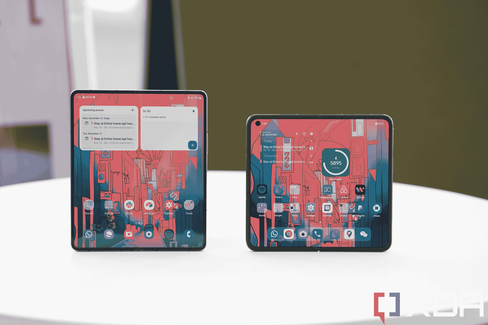

# Oppo 亲身体验 N2:最轻的可折叠手机值得在中国以外发布

> 原文：<https://www.xda-developers.com/oppo-find-n2-hands-on/>

可折叠场景在中国竞争如此激烈，似乎每个新版本都必须设定一个新的可折叠硬件基准，以便有一个营销角度。今年夏天的[小米 Mix Fold 2](https://www.xda-developers.com/xiaomi-mix-fold-2-review/) 是“有史以来最薄的可折叠手机”。最近推出的 Honor Magic Vs 拥有“可折叠手机中最大的电池”。现在是 Oppo Find N2，其 233 克的重量使其成为迄今为止“最轻的水平可折叠手机”(蛤壳除外)。

将这些硬件突破仅仅视为噱头是不尊重的，因为它们确实是可折叠领域的重大发展:谁不想要一部机身更薄、电池更大或重量更轻的手机？三星肯定会记下一两笔。

不过，尽管中国品牌正全力以赴进行硬件创新，但我希望他们能解决一些困扰其可折叠产品一段时间的软件问题。不要误会我的意思，Oppo 在改进和完善 Find N2 的软件方面取得了长足的进步，但还没有完全实现，因为最初 Find N 的一些软件问题仍然存在。

然而，部分软件问题也仅仅是因为 Find N 运行的是专门针对中国市场的软件。是的，这是另一款目前只在中国销售的可折叠手机。但有一个好消息:Oppo 宣布了一款更小的翻盖可折叠手机，与 Find N2 一起，将在中国以外销售。这意味着 Oppo 对这个想法持开放态度，其代表表示，该公司将在决定是否将在全球发布之前，评估人们对《寻找 N2》的兴趣。

| **规格** | **Oppo 找到 N2** |
| **显示** | 

*   120 赫兹 5.54 英寸 AMOLED(翻盖显示屏)
*   120 赫兹 7.1 英寸 LTPO AMOLED(主显示屏)

 |
| **处理器** | 高通骁龙 8 加第 1 代 |
| **摄像机** | 

*   50MP，1.8 英寸，1/1.56 英寸(主/宽)
*   48MP，f/2.2，1/2 英寸(超宽)
*   32MP，f/2.0(2 倍长焦)
*   32MP 前置摄像头 x2(每个屏幕一个)

 |
| **内存** | 12GB LPDDR5 内存+ 256/512 UFS 3.1 存储 |
| **电池** | 

*   4520 毫安时
*   67W 有线充电(含充电器)

 |
| **软件** | 基于 Android 13 的 ColorOS 13 |
| **尺寸** | 

*   展开后:132.2 毫米×140.5 毫米×7.4 毫米
*   折叠后:132.2 毫米×72.6 毫米×14.6 毫米

 |

## 设计和硬件:最轻的可折叠，但部分原因是它的体积小

*   Find N2 重 233 克，比最初的 Find N 轻 42 克，也是市场上最轻的“大号”可折叠手机
*   5.5 寸外显；7.1 英寸主显示屏

中国品牌有一代又一代彻底改造设计的习惯，但 Find N2 显然看起来像是最初 Find N 的延续。整体尺寸、形状，甚至手感都是一样的，唯一显著的区别是 Find N2 轻了 42 克。Oppo 设法减轻了这么多重量，同时保持了设备的大部分尺寸，这是一个令人难以置信的工程壮举。该公司表示，大多数体重减轻来自重新设计的铰链，它更小，移动部件更少。

尽管如此，Oppo 的营销声称铰链更坚固，经 TÜV 实验室测试可以承受 40 万次折叠。我显然不能对铰链是否更耐用发表意见，但它确实感觉非常好，而且与小米和 Honor 最近的可折叠产品不同，Oppo 的铰链可以在中间折叠，允许设备像笔记本电脑一样放在桌面上。

Find N2 比原来的略薄，展开时为 7.4 毫米，折叠时为 14.6 毫米。这是一个进步，但我已经被小米 Mix Fold 2 不可思议的薄(5.4 毫米展开；11.2 毫米折叠)的 Find N2 在我手中仍然感觉有点厚。它比三星的 Galaxy Z Fold 4 更薄，主要是因为它可以折叠平整。在这一点上，一个新的中国可折叠手机*没有比三星的折叠手机更时尚的外形*会比其他方式更有新闻价值。

像最初的设备一样，Find N2 有一个相对较小的 5.5 英寸外屏幕，纵横比几乎为 18:9。这是一个比几乎所有现代平板手机都小的屏幕，除了现在停产的 iPhone Mini 系列。去年当我回顾最初的 Find N 时，我非常喜欢这个尺寸，但在 2022 年末，我发现这个屏幕尺寸有点太小。仅仅一年时间，是什么导致了这种观点的改变？我认为这是过去 12 个月来垂直视频变得越来越重要(我必须创建和消费它们)和我现在看到的可折叠手机的结合，这些手机在小 Find N 尺寸和三星折叠尺寸之间找到了一个更令人满意的中间点。

外部屏幕(和设备的整体形状)的短特性意味着当它水平展开时，显示器的宽度大于高度。Oppo 在这方面是个异数，三星的可折叠展开成直立的长方形，其他中国的可折叠展开大多是正方形。

 <picture></picture> 

The Find N2 (right), next to the Z Fold 4. 

显示器看起来大多很棒:较小的外部屏幕是一个 2120 × 1080，120Hz 的面板；而较大的主显示屏具有 1920 × 1792 的分辨率，并使用 LTPO 技术，因此刷新率可以在 1Hz 到 120Hz 之间变化。唯一的抱怨是 500 尼特的最大亮度无法与最好的平板屏幕或三星的 Galaxy Z Fold 4 竞争。

Oppo 广告称，Find N2 拥有业内“最微弱”的折痕，我同意这一说法。这里的凹槽在大多数角度下几乎看不到，你的手指也不会感觉到。同样，这是对三星穿过折叠点的深槽的巨大升级。三星的辩护是，Fold 4 有官方防水等级，而这些折痕较浅的中国可折叠手机没有。然而，我不确定粗糙的折痕是否是防水所需要的。

Find N2 有三种颜色可供选择，绿色和白色采用传统玻璃表面(Gorilla Glass Victus ),黑色采用纯素皮革。我喜欢黑色单元的皮革质感。总的来说，我喜欢用纯素皮革作为手机的背面材料。

Find N2 运行在高通骁龙 8 Plus Gen 1 芯片上，从技术上讲，对于世界上大多数地区来说，这仍然是最新和最好的 Android 手机 SoC。但更新的骁龙 8 代 2 处理器已经在一些亚洲专用设备中使用，并将在几个月内进入西方市场。尽管如此，这里的处理器足够强大。Oppo 还使用了自己自主研发的 MariSilicon X 成像芯片来处理图像处理。稍后将详细介绍。

4，520 mAh 电池可以使用随附的充电砖以 67W 的速度快速充电，但没有无线充电。在其他地方，常见的 12GB 内存和 256GB 或 512GB 的存储也可以在这里找到。

## 相机:适合可折叠相机

*   三摄像头系统覆盖通常的超宽、广角和长焦焦距
*   两个 32MP 自拍相机——每个屏幕一个
*   定制成像芯片处理图像处理

“寻找 N2”配备了一个三摄像头主系统，由一个 50MP 索尼 IMX 890 传感器组成，具有 f/1.8 光圈和 1/1.56 英寸传感器尺寸。该镜头两侧是 48MP 超宽和 32MP 2x 远摄变焦镜头。在每个屏幕的一个穿孔内还有两个 32MP 自拍相机。这些光学元件对于可折叠手机来说非常好，由于 Oppo 的专用成像芯片(MariSilicon X)，产生的图像非常好，具有出色的 HDR 和动态范围。

但如果我用我不可思议的高标准来评判这个相机系统(我测试了所有最新的旗舰手机)，那么我知道这仍然是 Oppo 的第二代相机系统，其即将发布的 Oppo Find X6 Pro 将使用 1 英寸的 SonyIMX989 传感器，并由第二代 MariSilicon Y 驱动。

这是可折叠的最大缺点，在我看来。或许由于空间限制或制造成本，可折叠仍然没有获得真正的顶级旗舰相机系统。我当然是吹毛求疵了。如果我将 Oppo Find N2 拍摄的照片与其他可折叠手机进行比较。它保持得很好。我是 Oppo 受哈苏启发的对比色科学的粉丝。

## 软件:令人敬畏的动画和手势，但应用程序的兼容性问题仍然存在

*   Find N2 运行的是基于 Android 13 的 ColorOS 13
*   许多有用的快捷手势和定制选项
*   主屏幕的横向方向会导致一些应用程序缩放问题

由于大多数 Android 应用程序是为纵向而不是横向设计的，这导致了去年 Find N 的许多应用程序缩放问题。或者应用程序会侧向打开，因为它拒绝适应横向屏幕。

这里已经修复了许多问题，但仍有一些问题存在。例如，Gboard 仍然没有为所有设备提供分屏键盘(例如，它为 Galaxy Z Fold 4 提供分屏键盘，但不为小米 Mix Fold 2 提供分屏键盘)，不幸的是，Find N2 是设备之一。这意味着当 Find N2 展开时，Gboard 会扩展整个宽屏宽度，使打字非常不舒服。对我来说，唯一的选择是安装 SwiftKey，谢天谢地，它为所有设备提供了一个分离键盘。但是我用 Gboard 已经很多年了，比起 SwiftKey 我更喜欢它。

在其他地方，YouTube 仍然不能水平分割屏幕，这意味着如果我想用另一个应用程序运行 YouTube，它必须垂直分割，这限制了视频的屏幕空间。更令人恼火的是，这里的软件确实提供了水平分屏选项，但只是针对 Oppo 自己的应用程序，我猜还有一些中国应用程序。

这些问题的一个主要原因是因为这里运行的 ColorOS 是中国版本，没有内置的谷歌支持。YouTube 和 Gboard 是谷歌应用，这可以解释为什么他们不能很好地使用这个软件。如果“寻找 N2”运行全球版本的 ColorOS，这些问题可能会自行解决。

这是一个扫兴的人，因为我通常喜欢色彩。我认为它拥有一些最流畅、最流畅的动画，它充满了可定制的手势，比如在锁定的屏幕上画一个形状来启动应用程序，或者用两个手指在屏幕中间向下滑动来触发分屏。许多需要在另一部手机上点击两到三次的动作，ColorOS 都可以让你用手指手势来完成。

## 早期想法:请在中国之外推出这个！

我使用这款手机的时间还不够长，无法给出最终结论，但迄今为止，我对 Oppo Find N2 的硬件工艺和手感印象深刻。我唯一现实的抱怨是我发现外面的屏幕有点太小(也许 5.7 英寸会更好？)，以及软件问题。是的，我也希望它拥有 Oppo 真正的旗舰相机系统，但对可折叠相机的要求有点不切实际，尤其是在中国售价仅相当于 1100 美元的相机。

与那些认为折叠线太长太窄的人相比，Find N2 较小的尺寸对他们有很大的吸引力。即使它不可避免地在国际市场上涨价，只要它不比 Fold 4 贵，我认为它仍有很大的吸引力。