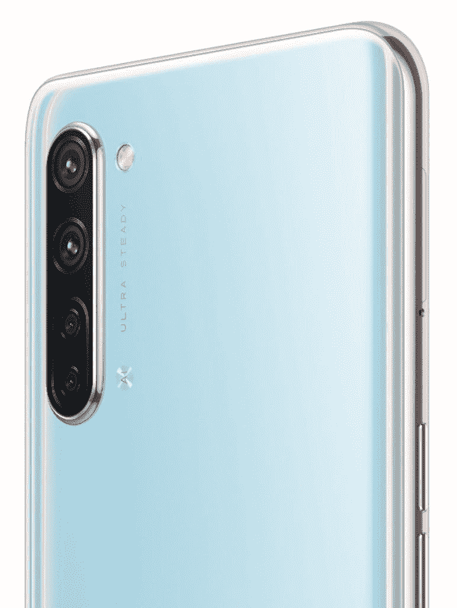
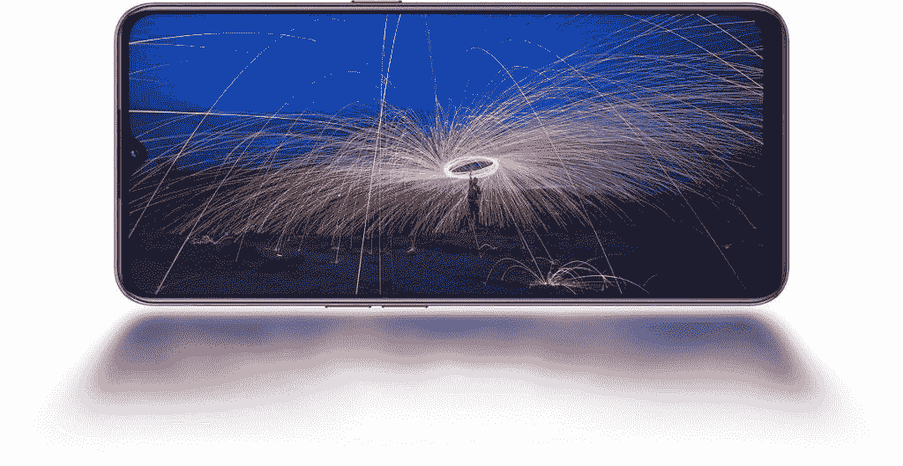

# OPPO Find X2 Lite 作为更名的中国 Reno3 活力版发布

> 原文：<https://www.xda-developers.com/oppo-find-x2-lite-launches-rebranded-chinese-reno3-vitality-edition/>

去年年底，OPPO 在中国推出了 Reno3 和 Reno3 Pro。该公司的中端设备分别采用了[联发科的 Dimensity 1000L](https://www.xda-developers.com/mediatek-dimensity-1000-7nm-soc-integrated-5g/) 芯片组和[高通的骁龙 765G](https://www.xda-developers.com/qualcomm-snapdragon-765-processor-specifications-features/) SoC。然而，今年 3 月早些时候推出的这些设备的国际版本具有完全不同的规格。 [OPPO Reno3 (global)](https://www.xda-developers.com/oppo-reno3-launches-internationally-with-the-mediatek-helio-p90/) 封装在联发科的 Helio P90 芯片中，而 [Reno3 Pro (global)](https://www.xda-developers.com/oppo-reno3-pro-international-launch-dual-front-cameras-quad-rear-cameras-mediatek-helio-p95/) 采用了 [Helio P95](https://www.xda-developers.com/mediatek-helio-p95-soc-apu-20-ai-accelerator-hyperengine-game-technology/) ，而不是 Dimensity 1000L 芯片。然后，上个月底， [OPPO Find X2 Lite 和 Find X2 Neo](https://www.xda-developers.com/chinese-oppo-reno3-pro-rebrand-global-find-x2-lite-neo/) 的渲染图在网上出现，其设计和规格与中国的 Reno3 活力版和 Reno3 Pro 相同，这让我们相信这些设备可能会以 Find X2 Lite 和 Find X2 Neo 的名字在全球推出。

本月初，OPPO Reno3 [获得了 FCC 认证](https://www.xda-developers.com/chinese-oppo-reno3-pro-certified-fcc-find-x2-neo/)，这进一步增加了我们的猜测，即该设备可能会作为 Find X2 Neo 推出。此后不久，该设备[出现在另一份认证文件](https://www.xda-developers.com/oppo-find-x2-neo-confirmed-global-reno3-pro-5g-oppo-a72-revealed/)中，该文件确认即将推出的 Find X2 Neo 确实是中国 OPPO Reno3 Pro 的更名产品。然而，我们还没有确认找到 X2 建兴至今。现在，该公司已经在 OPPO Portugal 网站上正式发布了 Find X2 Lite over，其规格证实了它只是一个更名的中国 OPPO Reno3 活力版。

| 规格 | OPPO Find X2 Lite |
| --- | --- |
| **尺寸和重量** |  |
| **显示** |  |
| **SoC** |  |
| **RAM 和存储器** |  |
| **电池&充电** |  |
| **后置摄像头** | 图片:视频: Video:

*   **初选:** 48MP，f/1.7
*   **辅助:**800 万像素广角摄像头，f/2.2
*   **第三级:** 2MP，f/2.4 单色传感器
*   **四元:** 2MP，f/2.4 深度传感器

Video:

*   4K @ 30fps
*   1080p @ 60fps/30fps
*   720p @ 60fps/30fps

 |
| **前置摄像头** | 32MP，f/2.0 |
| **其他特性** |  |
| **安卓版本** | 基于 Android 10 的 ColorOS 7 |

新款 OPPO Find X2 Lite 采用高通的骁龙 765G 芯片，外加 8GB lpddr 4x 内存和 128 GB UFS 2.1 板载存储。它的背面有一个四摄像头设置，一个 48MP 主摄像头，一个 8MP 广角摄像头，一个 2MP 单色摄像头和一个 2MP 深度感知摄像头。

在正面，该设备配有一个 32MP 自拍相机，位于 6.4 英寸 FHD+ AMOLED 显示屏的水滴风格凹槽内。为该设备供电的是 4,025mAh 电池，支持 OPPO 的 VOOC Flash 4.0 快速充电技术，可以以 30W 的功率为设备充电。

该列表进一步透露，该设备将有两种颜色可供选择——月光黑和珍珠白——但该公司尚未公布任何定价或可用性细节。但由于产品页面已经上线，我们预计 OPPO 将很快发布这些细节。

* * *

**Source: [OPPO Portugal](https://www.oppo.com/pt/smartphone-find-x2-lite/)**