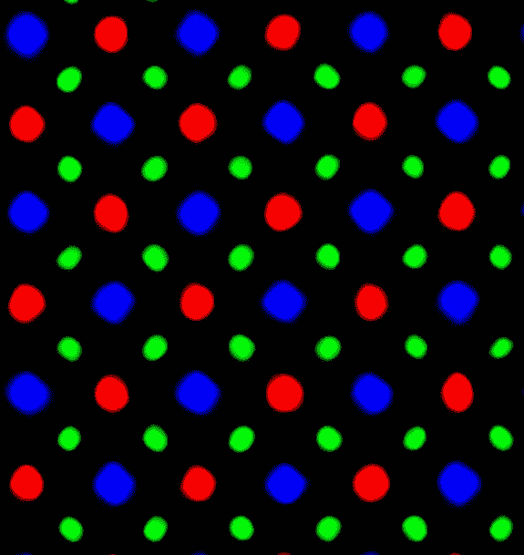
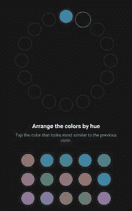
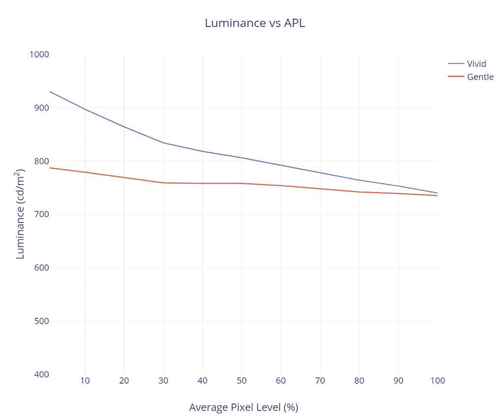

# OPPO Find X3 Pro 显示器评测:全面可靠的质量

> 原文：<https://www.xda-developers.com/oppo-find-x3-pro-display-review/>

在去年*“行业领先的色彩准确度”*的壮举的基础上，OPPO 继续将目光放得更远。凭借其新的*全路径色彩管理系统*,[OPPO Find X3 Pro](https://www.xda-developers.com/oppo-find-x3-pro-launch/)进一步实现了 OPPO 提高从相机到画廊的图像保真度的目标。Find X3 Pro 还添加了新的 LTPO 自适应刷新率面板，这将有助于为高分辨率、高刷新率面板节省额外的电池寿命。

在对 OPPO Find X3 Pro 的评论中，XDA 的本辛(Ben Sin)称其屏幕“近乎完美”，并且“如同他在[三星 Galaxy] S21 Ultra 或小米 11 中看到的面板一样，令人身临其境，光彩照人。”OPPO Find X3 Pro 采用 6.7 英寸 3216 x 1440 分辨率的大型 AMOLED 面板，集高级显示技术于一身，价格也同样优惠。在这篇评论中，我将采取定量的方法来分析 OPPO 最新旗舰机的显示屏。

**[OPPO 找 X3 Pro 论坛](https://forum.xda-developers.com/f/oppo-find-x3-pro.12111/)**

*本次评测使用的 OPPO Find X3 Pro 单元是 OPPO 借给我们的。然而，OPPO 并没有为这一审查提供任何投入或补偿。*

## **显示回顾亮点**

*   出色的峰值亮度
*   在校准的色彩模式中，具有出色的 sRGB 和 P3 色彩准确度
*   柔和轮廓中出色的灰度精度
*   整个配置文件中一致的对比度和色调映射
*   自适应刷新率解决方案不会产生颜色偏移
*   通过自动“降低对比度”功能变得超级暗淡

*   生动轮廓中阴影的轻微色调
*   校准颜色配置文件中的默认暖白点
*   失去 MEMC 和 DC 变暗

#### **软件显示功能**

 <picture></picture> 

Subpixel layout for Find X3 Pro, ~20% fill factor

OPPO Find X3 Pro 配备了 OPPO 称之为其 ***O1 超视觉引擎*** ，由“视频图像锐化器”和“视频色彩增强器”组成。从它们的标题来看，这些特性是不言自明的。在这篇评论中，我没有亲自测试它们的功效，但需要注意的是，它们都声称会增加电池的使用量，并且不能同时启用。

该显示器还能够通过 ***自然色调**显示* 功能进行自动白平衡，其工作原理类似于苹果的 True Tone 功能。不幸的是，这一功能不能与屏幕色温调节协同工作，所以如果你喜欢比自动白平衡设置更冷或更热的白点，你就不走运了。

OPPO 与一家名为 Pixelworks 的公司合作，专门从事视频和图像处理，以实现这些功能。我们有[一篇单独的文章](https://www.xda-developers.com/pixelworks-iris-5-visual-processor-android-display-experience-oppo-find-x2/)介绍 Pixelworks 其他软件和处理器的功能。Pixelworks 还负责查找 X3 专业版的工厂显示颜色校准。

与去年的旗舰相比，OPPO Find X3 pro 实际上缺少了一些功能。也就是说，它缺少视频运动插值功能(MEMC)和 DC 调光功能。今年缺少 MEMC 的原因是由于省略了 Pixelworks X5 芯片，[Find X2 Pro 去年](https://www.xda-developers.com/oppo-find-x2-pro-display-review/)使用该芯片来实现其一些显示功能。

继续，OPPO Find X3 Pro 的另一个显示功能是黑暗模式设置中的自动 ***降低对比度*** 选项。当系统亮度较低和处于黑暗模式时，此功能会进一步降低显示器亮度，使白色级别从 2.1 尼特降至 0.9 尼特。它在睡前使用手机时非常有用，已经成为我最喜欢的手机显示功能。

***色彩视觉增强*** 是一项辅助功能，可为色调不足的用户校正色彩。它允许你首先进行色觉测试来检查你是否真的有缺陷，除了这个功能，测试本身也很有趣。

 <picture></picture> 

Color vision test

最后， ***全路径色彩管理系统*** 是 OPPO 的解决方案，可在生动的配置文件中准确渲染 sRGB 和显示 P3 内容。该系统与 OPPO Find X3 Pro 在更宽的显示器 P3 色彩空间中捕捉照片的功能相匹配。这似乎是对 Android 自己的颜色管理系统的彻底检查，从我的发现来看，这有点与 Android 的解决方案相反。OPPO 的解决方案不是让 Android 在 sRGB 的色彩空间之间切换并显示 P3 的内容，而是将显示器保持在显示 P3 色彩空间中，并让 Gallery 应用程序将图像解码为 sRGB 或显示 P3。

**收集数据的方法论**

为了从 OPPO Find X3 Pro 获得定量的色彩数据，我准备了特定于设备的输入测试模式，并使用 X-Rite i1Display Pro 测量显示器的最终发射，X-Rite i1Pro 2 分光光度计在其高分辨率 3.3 纳米模式下进行测量。我使用的测试模式和设备设置针对各种显示特性和可能改变我所需测量的潜在软件实现进行了修正。除非另有说明，我的测量通常是在禁用显示相关选项的情况下进行的。我使用

*constant power*

模式(有时称为

*equal energy*

图案)，与大约 42%的平均像素水平相关，以测量传递函数和灰度精度。测量发射型显示器时，不仅要测量恒定的平均像素水平，还要测量恒定的功率模式，这一点很重要，因为它们的输出取决于平均显示器亮度。此外，恒定的平均像素水平并不固有地意味着恒定的功率；我使用的模式满足这两者。我使用更高的平均像素水平(接近 50%)来捕捉较低像素水平和许多白色背景的应用程序和网页(像素水平较高)之间的中点。我使用最新的色差度量δ

*E[TP]*   [(ITU-R BT.2124)](https://www.itu.int/dms_pubrec/itu-r/rec/bt/R-REC-BT.2124-0-201901-I!!PDF-E.pdf)

，这是一个

[overall better measure for color differences](https://www.ibc.org/publish/specifying-colour-tolerances-for-hdr-and-wcg-displays-/2449.article)

比δ

*E* [00]

这在我早期的评论中使用过，目前仍在许多其他网站的展示评论中使用。那些还在用δ的

*E* [00]

对于颜色误差报告，鼓励使用δ

*E[ITP.]*

Δ

*E[ITP]*

通常在计算中考虑亮度(强度)误差，因为亮度是完整描述颜色的必要组成部分。然而，由于人类视觉系统分别解释色度和亮度，我将我们的测试模式保持在恒定亮度，并且在我们的δ中不包括亮度(I/强度)误差

*E[ITP]*

价值观。此外，在评估显示器的性能时，将这两种错误分开是有帮助的，因为就像我们的视觉系统一样，它们属于显示器的不同问题。这样，我们可以更彻底地分析和理解显示器的性能。我们的颜色目标是基于 ITP 颜色空间，它比 CIE 1976 UCS 具有更好的色调线性，在感知上更均匀。我们的目标以 100 cd/m 的基准在整个 ITP 色彩空间中大致均匀地间隔开

²

白色级别，以及 100%、75%、50%和 25%饱和度的颜色。颜色是在 73%的刺激下测量的，假设伽马功率为 2.20，这相当于约 50%的亮度。对比度、灰度和颜色精度在显示器的整个亮度范围内进行测试。在 PQ 空间中，亮度增量均匀分布在最大和最小显示亮度之间。图表和图形也绘制在 PQ 空间中(如果适用),用于正确表示对亮度的实际感知。δ

*E[TP]*

值大约是δ的 3 倍

*E* [00]

相同色差的值。测得的颜色误差δ

*E[TP]*

1.0 表示对于测量的颜色来说刚刚可察觉的差异的最小值，而该度量假定对于观察者来说是最关键的适应状态，从而不会低估颜色误差。颜色误差δ

*E[TP]*

小于 3.0 是参考显示器的可接受精度水平(建议见 ITU-R BT.2124 附录 4.2)，δ

*E[TP]*

大于 8.0 的值一眼就能看出来，这是我根据经验测试过的。HDR 测试模式是针对

[ITU-R BT.2100](https://www.itu.int/dms_pubrec/itu-r/rec/bt/R-REC-BT.2100-2-201807-I!!PDF-E.pdf)

使用感知量化器(ST 2084)。HDR sRGB 和 P3 图案与 sRGB/P3 原色均匀间隔，HDR 参考白色水平为 203 cd/m

²   [(ITU-R BT.2408)](https://www.itu.int/dms_pub/itu-r/opb/rep/R-REP-BT.2408-2017-PDF-E.pdf)

，并且对于其所有模式，PQ 信号电平为 58%。所有 HDR 模式都是在 HDR 平均 20% APL 下用恒定功率测试模式测试的。

### **颜色配置文件**

OPPO Find X3 Pro 有四种不同的颜色配置文件，每种都可以改变屏幕的颜色特征。

**生动**配置文件是手机的默认颜色配置文件，其特点是增加了颜色饱和度，蓝白色点，对比度略高于标准。更具体地说，该配置文件将颜色扩展到显示 P3 颜色空间(除了在股票图库应用程序中)，白点测量值约为 7000 K，目标灰度系数约为 2.30(与标准的 2.20 相比)。OPPO 放弃了 Android 的原生色彩管理系统，转而使用自己的“全路径色彩管理系统”，我发现该系统只在 OPPO Gallery 应用程序中有效。根据此配置文件中的“全路径色彩管理系统”，在图库应用程序中查看的照片将默认在 sRGB 色彩空间中渲染，以实现色彩准确的照片查看，而 P3 标记的照片(如 OPPO Find X3 Pro 的相机拍摄的照片)将显示在配置文件的原生 P3 色彩空间中。

**柔和**配置文件是针对 sRGB 色彩空间的工厂校准的色彩配置文件，该色彩空间是互联网的默认色彩空间和大多数内容的原始色彩空间。该配置文件的目标伽马功率为 2.20 *(而不是*原始的 sRGB 传递函数)，配置文件的白点旨在针对行业标准的 D65 光源，这对应于 6504 K 的色温。然而，我测得的温和配置文件的值更接近约 6200 K，稍微温暖一些。在发布时，这个配置文件目前不支持 Android 的色彩管理，但 OPPO 告诉我们，他们计划在 3 月底的系统更新中添加色彩管理。

**Cinematic** 配置文件是另一种工厂校准的颜色配置文件，类似于柔和配置文件，但它的目标是显示器 P3 颜色空间。该配置文件*不*准确，只是因为它被校准到一个色彩空间；它仍然会将 sRGB 的颜色延伸到 P3，并且只有在查看正确编码的 P3 内容时才是准确的。它是所有配置文件中最合适的，只有当颜色准确性是查看实际 P3 内容的最高优先级时，或者如果您只是喜欢颜色模式的外观，才应该使用它。

**辉煌**配置文件是 OPPO Find X3 Pro 可用的最饱和的颜色配置文件。该配置文件与生动的配置文件共享一个类似的蓝白色点，并针对其红色和绿色原色显示 P3。此外，它还进一步增加了蓝色的饱和度，根据内容的平均像素级别(APL ),通过增加颜色的亮度，配置文件可以变得稍微更亮。

所有配置文件还提供调整白点色温的选项，但仅当*自然色调显示*功能未激活时，因为它会根据环境照明自动调整白点。理想情况下，这两个选项应该一起工作，色温滑块充当自动白平衡功能的偏置。但是，据我所知，还没有具备这种功能的设备。

### **亮度**

 <picture></picture> 

Peak luminance vs content APL

OPPO Find X3 Pro 的峰值亮度非常出色，通常在其高亮度模式下达到约 750-800 尼特。像大多数其他机器人一样，只有当手机从其环境光传感器检测到大量光线时，才能达到这种亮度，比如在阳光明媚的日子里把它带到外面。

由于 OPPO Find X3 Pro 使用 OLED 面板，像素的亮度会根据当前显示内容的平均像素级别(APL)而变化。对于全屏白色，这是 OLEDs 消耗最多电力的地方，OPPO Find X3 Pro 能够输出大约 740 尼特。当手机处于默认的生动模式时，手机会随着 APL 适度改变其白色亮度，在中值-50% APL 时，生动模式可以输出高达 800 尼特的亮度，这是一种更轻的亮度。柔和的和电影般的轮廓控制它们的亮度变化，并且它们的亮度几乎不随内容 APL 而变化。

这些亮度值与去年的 Find X2 Pro 大致相同，尽管它们不如三星最新的旗舰产品亮，但在 2021 年，这些仍然是令人尊敬的数字。

在低端，Find X3 Pro 的最暗亮度设置产生的白色水平约为 2.1 尼特，不像其他一些 OLEDs 那样暗，可以降至约 1.7 或 1.8 尼特。然而，OPPO Find X3 Pro 在其黑暗模式显示设置中有一个名为“*降低弱光条件下的对比度”*的设置，这使得白色水平下降到大约 0.9 尼特，这对夜间观看非常有利。这项功能特别有用，因为它只会在黑暗模式下和显示器亮度足够低时激活。

“在低光照条件下降低对比度”设置在睡前使用手机时非常有用，它已经成为我最喜欢的手机显示功能。

### **对比度和色调映射**

*在 40% APL (~27%目标 ADL)时测量*

默认的鲜艳度配置文件被测量为相当精确到标准的 2.20 灰度系数，尽管它在整个亮度范围内渲染阴影和中间色调只是稍微暗一点(除了最小亮度)。这使得生动的轮廓呈现出略高的对比度，这与其充满活力的本质相得益彰。大多数其他手机也在各自的生动配置文件中增加了对比度，但这只是因为它们允许配置文件随着该配置文件中的 APL 改变其亮度，从而增加了对比度*，但只是在更高的亮度设置下*。让 OPPO 发现 X3 Pro 有些不同的是，即使在较低的亮度设置下，它似乎也与它增加的对比度一致。这使得侧面增加的对比度看起来是有目的的，而不仅仅是有机发光二极管特征的结果，这很好。一般来说，在显示器的整个亮度范围内，相对感知对比度的一致性是理想的，它显示了熟练的校准控制和周到。

*在 40% APL 时测量(~27%目标 ADL)*

对于手机的校准颜色模式(柔和和电影)，OPPO 展示了出色的色调控制。这些配置文件在其整个亮度范围内完美而紧密地跟踪标准的 2.20 伽马功率，从而实现精确的*和*一致的显示对比度，这是许多显示器都无法做到的。

在最低亮度下，两个轮廓的阴影和中间色调都有轻微的提升，这样黑暗的细节就不会完全消失。这是对细节的良好关注，但我个人认为，为了在弱光下获得更舒适的观看体验，需要更多一点的提升。OPPO Find X3 Pro 能够呈现 1/255 的灰色，即使在最低亮度下也是如此，但除非你的眼睛适应黑暗，否则暗色调仍然会出现破碎。

没有多少显示器能够同时实现精确的*和*一致的显示对比度，但 OPPO Find X3 Pro 展示了出色的色调控制。

当 Find X3 专业版以最大亮度在阳光下时，以较低的伽玛功率而不是配置文件的标称目标为目标将有助于提高显示器在这些较亮条件下的清晰度。在高亮度模式下查看照片时，确实存在一些增强阴影和中间色调的动态色调映射，但它似乎只在 OPPO 的股票画廊应用程序中激活。去年的“寻找 X2”专业版为整个“温柔轮廓”做了这个，所以在“寻找 X3”专业版中没有看到它有点令人惊讶。不过，新手机上生动轮廓的清晰度是一个进步，因为去年型号的高亮度下，其伽马值实际上太高了。

### **白平衡和灰度色彩精度**

 **灰度曲线为生动的轮廓，120 Hz**

在手机的默认颜色配置文件中，在较低的亮度级别(低于大约 25%的系统亮度)下，可以观察到暗灰色调带有轻微的绿色。这不是很明显，但那些对色彩敏感的人可能会受到它的困扰，特别是在黑暗模式界面中。除此之外，对于此配置文件，白点在不同的亮度设置下看起来是一致的。但是，白点的平均色温(~7000 K)确实与整个灰度的平均色温(~6700 K)略有不同。

 **灰度曲线为柔和的&电影轮廓，120 Hz**

相反，柔和的和电影般的色彩配置文件通过出色的灰度控制进行校准。我发现并测量了没有明显的色调变化，即使在低亮度下。渐变非常平滑，没有任何条纹或色彩。我唯一的抱怨是，配置文件的白点校准过于温暖，始终测量约 6200 K。色温调节滑块可供使用，但我没有测量它是否可能影响校准的精度。

...柔和的电影色彩配置文件通过出色的灰度控制进行校准。我没有发现并测量到这些轮廓的色彩有明显的变化...

### **色彩准确度**

尽管 OPPO 在其生动的配置文件中采用了“全路径色彩管理系统”，但任何优先考虑色彩准确性的人都应该分别为 sRGB 和显示 P3 内容使用离散柔和和电影色彩模式。因此，我将不包括 sRGB 和显示 P3 的生动的个人资料，只有校准温柔和电影的个人资料。

**sRGB 色彩准确度图用于柔和轮廓**

sRGB 柔和轮廓的色彩准确度总体来说非常出色。在最大亮度时有一些轻微的过饱和，这是抵消一些眩光的理想行为。在最低亮度附近，颜色有点不饱和，但这不是一个大问题。在大约 25%的系统亮度下，颜色似乎比平时更暖，导致显示器亮度范围内最高的平均颜色误差。

**显示电影简介的 P3 色彩准确度图**

显示器 P3 颜色的准确性甚至更好。最小亮度下的欠饱和并不普遍，而亮度范围的其余部分通常更精确。这个*真好*。

总体而言，柔和的电影般的轮廓提供了令人尊敬的色彩和色调准确度。与大多数其他手机和非专业显示器相比，OPPO Find X3 Pro 可以更有信心地执行非关键的颜色和设计工作，尽管需要记住稍微偏暖的白点。

与大多数其他手机和非专业显示器相比，OPPO Find X3 Pro 可以更有信心地执行非关键的颜色和设计工作...

### **HDR10 回放**

*在 20% APL 时测得≈ 2* *00 nit 帧-平均光照水平(HDR10 1000)*

对于 HDR10 内容，您可能希望在显示设置下激活“*明亮 HDR 视频模式*”，以改善高亮显示。没有它，OPPO Find X3 Pro 的峰值亮度将被限制在 500 尼特以下，这不足以提供一系列引人注目的镜面高光。

在我们进入任何其他观察或测量之前，我发现在股票图库应用程序中观看 HDR 内容与在其他应用程序中相比有着巨大的差异。这是因为股票图库应用程序似乎正在进行自己的 HDR 色调映射，而不是切换到手机的 HDR 颜色模式，这是其他所有应用程序播放 HDR 内容时都会做的。这本身并不是一件坏事，但它的一个问题是，在股票图库应用程序中，HDR 内容的峰值亮度被限制在 500 尼特(即使启用了“*明亮的 HDR 视频模式*”)，除非查找 X3 专业版处于高亮度模式，这种情况只发生在非常明亮的条件下，HDR 内容不应该被观看。因此，我的测量将基于手机的 HDR 颜色模式，这将反映大多数消费者如何在手机上观看 HDR 内容。

HighDdynamicR安歌内容的整点都在*对比*中。OPPO Find X3 Pro 以较暗的色调渲染 HDR10 内容，以便它们看起来更亮。这降低了 HDR 内容的对比度，尤其是在较暗的场景中。另一方面，中间色调和高光看起来很棒，75% PQ 的测量亮度约为 750 尼特(预计为 1，000 尼特)，对于 1，000 尼特的内容来说是可以接受的。Find X3 Pro 实际上可以在 100%的强度下达到约 900 尼特，但与许多其他 Android 手机一样，它缺乏对内容最大亮度的滚降色调映射(在内容的元数据中列出)。这使得在观看 1000 尼特的内容(包括大多数 HDR 内容)时，无法获得额外的约 150 尼特亮度。

就灰度而言，白色(或灰色)的精度对于 HDR 内容来说是很好的和一致的。色温保持接近 D65 标准，平均约为 6430 K，色调无明显变化，与亮度无关。

在 OPPO Find X3 Pro 上，HDR10 的色彩精度很好，尽管它在红色方面稍微错过了整个 P3 色域，并且在绿色方面略有不饱和。

从纸面上看，OPPO Find X3 Pro 的显示屏与去年相比似乎没有太大的升级。然而，从绝对意义上来说，它*是*的升级，总的来说，它是*出色的*展示，修复了去年模型的许多问题。新的 LTPO 面板提供了一种自适应刷新率解决方案，可节省更多电池，并防止面板在刷新率之间切换时出现色调差异。峰值亮度保持不变，但其色调映射行为的变化使生动的配置文件在外部观看时比 X2 专业版更清晰。此外，在低亮度下，OPPO Find X3 Pro 看起来更干净，色彩更少，几乎没有黑色挤压(而 Find X2 Pro 在这两种情况下都有点乱)，并且“降低对比度”选项也是这款手机夜间观看的最佳可用性选项之一。色彩和色调的准确性全面提高，提供了更加一致和真实的画面，包括生动的轮廓。由于新的“全路径色彩管理系统”，您现在可以在生动的色彩配置文件中查看图库和相机应用程序中更准确的照片描述。

### Oppo Find X3 Pro

在英国 1099 英镑，在欧洲€1149 英镑，OPPO 要求客户在智能手机上花很多钱，但 Find X3 Pro 的显示屏名副其实。

**Affiliate Links**

oppostore

[View at Oppostore](https://oppostore.co.uk/smartphones/find-x3-series.html)

| **规格** | **OPPO 找 X3 Pro** |
| --- | --- |
| **类型** | 灵活的有机发光二极管五边形菱形像素 |
| **制造商** | 三星显示公司。 |
| **尺寸** | 6.1 英寸乘 2.7 英寸6.7 英寸对角线16.7 平方英寸 |
| **决议** | 3216×144020:9 像素宽高比 |
| **像素密度** | 每英寸 372 个红色子像素每英寸 526 个绿色子像素每英寸 372 个蓝色子像素 |
| **像素锐度距离** *视力为 20/20 的可分辨像素距离。典型的智能手机观看距离约为 12 英寸* | < 6.5 英寸为全彩图像< 9.2 英寸为非彩色图像 |
| **黑色削波阈值** *要削波的黑色信号电平* | 0.4% @最大亮度<0.4% @ min brightness |

| **规格** | **温柔/电影化** | **生动** |
| --- | --- | --- |
| **亮度** | **最小值:**2.2 尼特**峰值 100% APL:**735 尼特**峰值 50% APL:**758 尼特**峰值 HDR 20%杀伤人员地雷:** | **最小值:**2.1 尼特**峰值 100% APL:**740 尼特**峰值 50% APL:**806 尼特 |
| **伽玛** *标准是 2.20 的直线伽玛* | 2.00–2.30 | 2.13–2.36 |
| **白点** *标准是 6504 K* | 6230 Kδ*E[TP]*= 3.7 | 7016 Kδ*E[TP]*= 6.5 |
| **色差** | **温柔/sRGB:**平均δ*E[TP]*= 3.4**电影/P3:**平均δ*E[TP]*= 3.1 |  |