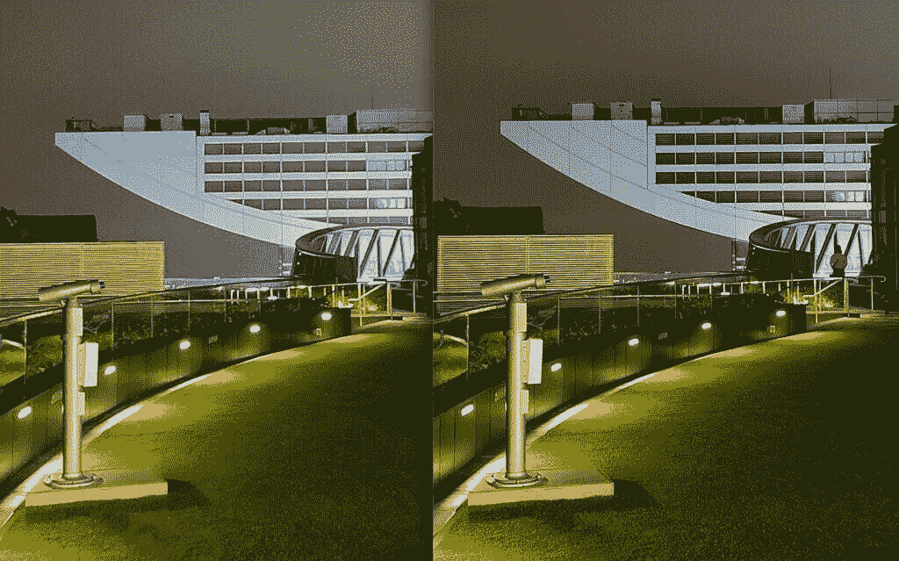
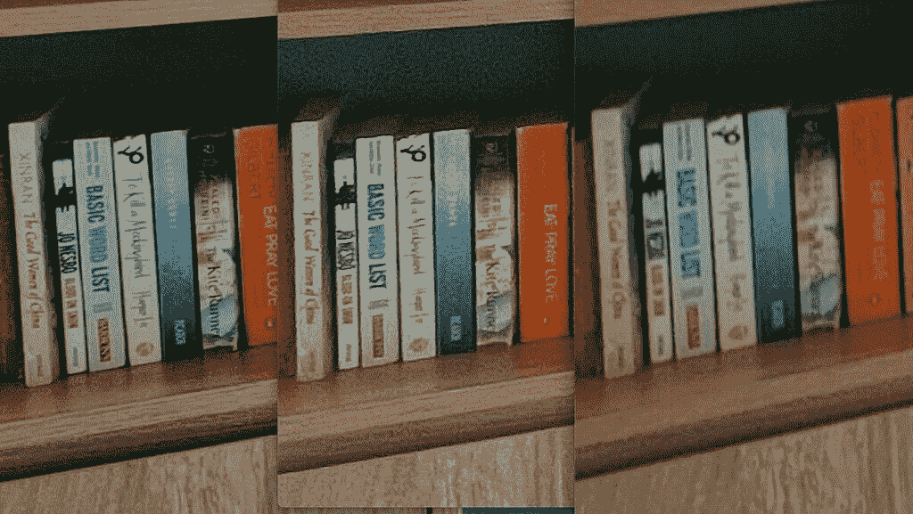

# OPPO Find X3 Pro 拥有我在手机上用过的最好的超宽相机

> 原文：<https://www.xda-developers.com/oppo-find-x3-pro-review/>

就在几年前，你一眼就能看出新款旗舰手机的不同之处。屏幕边框可能已经大幅缩小。或者也许摄像头的数量比去年的手机增加了一倍。在过去几年里，情况不再是这样了，因为智能手机品牌在制造优秀的智能手机方面已经变得如此出色，至少对于平板外形来说，已经没有太多改进的空间了。毕竟，超过 120 赫兹，动画还能流畅多少？挡板不可能再薄了。我们需要的所有基本应用程序在骁龙 855 上都运行良好，更不用说骁龙 888 了。

在过去，任何人都可以拿起一部 Galaxy S10/华为 P20 Pro/一加 7 Pro，立即看到他们在 Galaxy S9/华为 P10/OnePlus 6 上的改进，但你不能用 2021 平板手机做到这一点。这些改进更加微妙，也可以说更加小众，比如，提高超宽镜头的动态范围，或者增加更快的无线充电和自适应刷新率。

刚刚推出的 [OPPO Find X3 Pro 就是这种情况。普通智能手机用户将很难找到比去年的](https://www.xda-developers.com/oppo-find-x3-pro-launch/) [Find X2 Pro](https://www.xda-developers.com/oppo-find-x2-pro-hands-on-first-impressions/) 更好的地方——事实上，Find X3 Pro 在一个领域明显后退了一步——但对于那些关心智能手机每个方面的人来说，那些想要精致产品的人来说，Find X3 Pro 是迄今为止最平衡、最完美和最全面的平板智能手机之一。

## OPPO Find X3 Pro:规格

### OPPO 找到 X3 专业规格。单击或点击以展开。

| 

规格

 | 

OPPO Find X3 Pro

 |
| --- | --- |
| **打造** | 铝合金框架玻璃夹层 |
| **尺寸&重量** |  |
| **显示** | 

*   6.7 英寸 QHD+ AMOLED LTPO
*   3216 x 1440 像素(525 PPI)
*   120 赫兹自适应刷新率(5-120 赫兹)
*   240Hz 触摸采样率
*   1，300 尼特峰值亮度
*   8192 亮度等级
*   5000000:1 对比度
*   10 位颜色
*   HDR10+认证
*   100% DCI-P3 覆盖率，97% NTSC 覆盖率
*   0.4 JNCD
*   康宁大猩猩玻璃 5

 |
| **SoC** |  |
| **闸板&存放** | 

*   12GB LPDDR5 内存
*   256GB UFS 3.1 存储空间

 |
| **电池&充电** | 

*   4500 毫安时
*   65 瓦 SuperVOOC 2.0 快速有线充电(35 分钟内从 0 到 100%)
*   30W AirVOOC 快速无线充电
*   10W 反向无线充电

 |
| **安全** | 

*   显示屏内指纹传感器
*   面部解锁

 |
| **后置摄像头** | 

*   **主:** 50MP 索尼 IMX766 f/1.8，OIS+EIS，全向 PDAF
*   **次要:** 50MP 索尼 IMX766 f/2.2 超宽(110 FoV)，EIS
*   **第三:** 13MP f/2.4 长焦，2 倍光学变焦，5 倍混合变焦，20 倍数码变焦，EIS，AF
*   **四元:**300 万像素 f/3.0 微透镜，60 倍放大，环形灯，FF

**视频:**

*   4K @30/60fps
*   1080p @30/60/240fps
*   720p @30/60/480fps

 |
| **前置摄像头** | 

*   32MP 索尼 IMX615 f/2.4，FF，EIS
*   **视频:** 1080p @30fps，720p @30fps

 |
| **港口** | USB 3.1 类型 C |
| **音频** | 

*   双立体声扬声器
*   杜比 Atomos 和环境声音检测

 |
| **连通性** | 

*   SA/NSA 5G(双卡)
*   Wi-Fi 6，2x2 MIMO
*   蓝牙 5.2
*   国家足球联盟
*   GPS/a-GPS/伽利略/GLONASS/北斗/QZSS

 |
| **软件** | 基于 Android 11 的 ColorOS 11.2 |
| **其他特性** | 

*   IP68 防溅等级
*   蒸汽室和石墨冷却解决方案
*   Google Discover 提要集成

 |

**[OPPO 找 X3 亲 XDA 论坛](https://forum.xda-developers.com/f/oppo-find-x3-pro.12111/)**

* * *

## OPPO Find X3 Pro:设计和内部

OPPO Find X3 Pro 是又一款安卓平板旗舰，所以大多数读者应该知道会有什么期待:最新的高通骁龙 SoC 光滑、弯曲的玻璃和铝夹层设计；弯曲的有机发光二极管屏幕周围几乎不存在边框；背面的多摄像头系统和一个自拍摄像头位于屏幕上的打孔切口内。

这就是 Find X3 Pro 与众不同的地方:玻璃背板也是覆盖相机模块的单片玻璃。相机凸起，而不是像许多手机那样突然突出，通过曲线缓和到手机背面。

我必须承认，当“寻找 X3”Pro[的渲染图第一次泄露](https://www.xda-developers.com/oppo-find-x3-pro-leak-flash-ringed-camera/)时，我认为这个摄像头凸起设计看起来很丑。但本人看起来优雅流畅多了。相机模块的曲线向各个方向和阴影反射光线，类似于电影*终结者 2:审判日中[液态金属 T-1000](http://weirdlystrange.com/wp-content/uploads/2016/08/terminator-1000-03.jpg) 的外观。*

OPPO 声称生产这种玻璃需要 40 多个小时，需要 100 多个步骤才能从 2000 多个点形成曲率。我做记者已经很久了，知道市场宣传应该持保留态度，但我可以肯定手机握起来非常舒服。其 193 克的重量和 8.26 毫米的厚度使其比更重、更笨重的 [Galaxy S21 Ultra](https://www.xda-developers.com/samsung-galaxy-s21/) 更舒适。

去年的 Find X2 Pro 因为没有包括无线充电而受到了一些抨击。查找 X3 专业纠正这一点。这款手机的 4500 毫安时电池可以无线充电，如果使用 OPPO 自己的无线充电器，速度高达 30W。它还可以通过 OPPO 的 65W 充电砖超级快速地充值，充电砖包含在包装盒中。Find X3 Pro 的防水防尘等级也达到了 IP68。

## OPPO Find X3 Pro: 10 位彩色，120Hz 显示屏

Find X3 Pro 是第一款使用 OPPO“全路径色彩管理系统”的设备，该系统支持端到端的 10 位色彩解决方案。这意味着 Find X3 Pro 可以拍摄、存储和显示 10 位颜色的照片，与 8 位照片的 1670 万种可能的颜色相比，它提供了多达 10 亿种可能的颜色。

关心色彩准确性的爱好者应该会找到很多喜欢的东西，XDA 自己的显示专家 Dylan Raga 即将对这款手机的显示进行深入分析。但对我来说，我不确定我能看出 10 位照片和 8 位照片之间的巨大差异。但迪伦在分析显示面板方面比我有资格得多，所以一定要看他的评论。

亲自，寻找 X3 专业看起来更优雅和流畅

然而，这并不是说这次展览没有给我留下深刻印象。Find X3 Pro 的屏幕仍然是 6.7 英寸、120 赫兹的有机发光二极管，分辨率为 QHD+ (3，216 x 1，440)。在我看来，这块屏幕几乎完美无瑕，就像 S21 Ultra 或小米 11 中看到的面板一样身临其境，光彩夺目。与其他两个屏幕一样，Find X3 Pro 的面板也是 LTPO，并以可变速率刷新。然而，它的最大亮度 1300 尼特没有 Galaxy S21 Ultra 的 1500 尼特高。

## OPPO Find X3 Pro:超广角摄像头

Find X3 Pro 的主摄像头非常好，但我过去一年测试的每一款顶级旗舰的主摄像头都很好。反而是其他外设摄像头脱颖而出，先说这些摄像头吧。

先说超宽相机。这是一个 50MP 的索尼 IMX 766 传感器——实际上和主摄像头完全一样。这是迄今为止智能手机上像素密度最高的超广角相机，它可以以 10 位拍摄。

作为一个喜欢休闲风景和城市摄影的人，我喜欢 Find X3 Pro 的超广角相机使用与主相机相同的传感器，因为这意味着超广角照片看起来更接近主相机拍摄的图像。主相机或超宽相机拍摄的照片在色彩科学、图像清晰度和动态范围方面具有一致性。由于传感器有如此多的像素，因此拍摄的照片比其他手机的典型超宽相机更详细、更清晰。

事实上，如果我放大一个超宽的镜头，它看起来足够接近主相机拍摄的同一张照片。

 <picture></picture> 

Ultra-wide cropped in (left); main camera (right).

即使在超宽镜头容易受到影响的较暗场景中，Find X3 Pro 的超宽镜头也表现得相当不错。

再次放大。

 <picture></picture> 

Ultra-wide (left), main camera (right).

在上面的场景中，一旦我放大到超广角镜头，我可以看到与主相机相比，图像质量有所下降:草地的纹理不明显，有更多的噪声，图像周围更柔和。但与其他手机的超宽摄像头相比，这种下降幅度很小。看看完全相同的并排拼贴，但使用 iPhone 12 Pro 的主摄像头和超宽摄像头。图像质量的下降非常明显。

 <picture></picture> 

iPhone 12 Pro ultra-wide (left), main camera (right).

如果我将 Find X3 Pro 的超广角相机与 Galaxy S21 Ultra 和 iPhone 12 Pro 进行对比，Find X3 Pro 的超广角镜头在所有场景下都更清晰。在下面的图片集中，你仍然可以在“寻找 X3”的图片中清晰地看到书架上的书名。另外两个就没那么多了。

 <picture></picture> 

Find X3 Pro (left), iPhone 12 Pro (middle), S21 Ultra (right).

超宽摄像头即使在弱光环境下也能拍摄出干净稳定的视频。当然，质量没有主摄像头的视频高，但这个视频对超宽相机来说非常令人印象深刻。

这里有更多的超宽照片样本。我已经测试了足够多的手机，可以自信地说这是目前市场上最好的超广角相机。

## OPPO Find X3 Pro:微单镜头相机

第二个突出的相机:微型镜头。这基本上是一个宏观镜头，类固醇。你可以把相机靠近一个物体，看到人眼看不到的细节。这里是一系列物体的常规镜头，然后是微镜头的特写镜头。

OPPO 甚至在 300 万像素的微镜头周围建立了一个环形灯来帮助照明，因为当你直接将手机压在表面上进行拍摄时，它会阻挡大部分外部光源。

## OPPO Find X3 Pro:主摄像头、变焦镜头、视频性能、自拍

正如前面提到的，Find X3 Pro 的主摄像头非常好——它可以捕捉到清晰、充满活力的照片，具有出色的动态范围——但它不会像超宽和微镜头那样击败竞争对手。这更证明了智能手机相机已经走了多远:每部旗舰手机都有一个好相机。就连谷歌曾经在 Pixel 系列电脑摄影上的领先优势也已经荡然无存。

1/1.56 英寸的图像传感器小于三星和华为旗舰手机使用的传感器，因此 Find X3 Pro 在像 Galaxy S21 Ultra 或 Mate 40 Pro 这样的极端黑暗场景下无法吸收那么多光线，但打开夜间模式可以解决这个问题。

人像/散景拍摄具有美观的奶油散景和精确的边缘检测。

在我提到的这篇文章的开头，有一个地方，Find X3 专业版明显比 Find X2 专业版和它的变焦相机后退了一步。Find X3 专业版只有一个 1300 万像素的传统长焦变焦镜头，可以产生 5 倍的混合变焦，最大可以达到 20 倍的数码变焦。与市场上几乎所有其他高端旗舰产品相比，这款产品感觉平淡无奇。考虑到 OPPO 是[潜望镜变焦镜头](https://www.xda-developers.com/periscope-camera-vs-telephoto-camera/)技术的先驱之一(与华为一起),这一点尤其令人惊讶，该技术已被证明是产生更清晰变焦图像的卓越解决方案。去年的“寻找 X2”专业版使用了 5 倍光学潜望镜变焦相机，因此“寻找 X3”专业版的变焦镜头是一种倒退。

我向 OPPO 的一名工程师询问了放弃潜望镜相机的决定，他们说他们的研究显示大多数消费者很少需要变焦超过 3 倍或 5 倍，所以长变焦相机不是必要的。这种说法确实有一些道理，但如果我将这款手机与 Android 领域的其他大狗进行比较，它在变焦镜头方面会输。

在真空中，Find X3 Pro 的 5 倍和 10 倍变焦镜头仍然不错，但一旦与潜望镜相机的镜头进行比较，它的缺陷就显而易见了。

这是 Find X3 Pro 的 10 倍变焦镜头与华为 Mate X2 的潜望镜变焦镜头拍摄的 10 倍镜头的对比。

 <picture></picture> 

10x zoom shots side-by-side against Huawei Mate X2.

Find X3 Pro 的主摄像头“只能”拍摄高达 4k/60 的视频，而不是三星和小米最近几款旗舰中看到的 8k/30，但这并没有让我感到太大的困扰。我发现现在 8k 视频录制几乎没有用。我发现 4k/30 是寻找 X3 专业视频的最佳设置，它看起来稳定、平衡，充满了强烈的色彩。

还有一个专业视频拍摄模式，提供精细控制，包括手动切换镜头和调整焦距、快门速度和白平衡的能力，即使在录制视频的过程中也是如此。这是 LG 手机几年来一直提供的功能，但在过去几年中，Find X3 Pro 的相机硬件明显优于任何 LG 相机硬件。

Find X3 Pro 的自拍相机有点断断续续。在很大程度上，照片看起来非常详细和自然(没有过度平滑皮肤)，但如果我在逆光拍摄，自拍可能会非常不一致(见下面的前两张自拍——它们是背靠背拍摄的)。总的来说，我认为无论光线条件如何，三星、谷歌或苹果的手机都更善于找到平衡。

尽管变焦相机相对较弱，自拍相机不一致，但我仍然对 Find X3 Pro 的相机系统整体印象非常深刻。我喜欢超宽相机可以捕捉到与主相机相比清晰度和细节非常接近的照片和视频。而且微镜头是我之前从其他手机上没见过的。

与主摄像头相比，超宽摄像头可以捕捉清晰度和细节非常接近的照片和视频，我很喜欢这一点

## OPPO Find X3 Pro 性能:真实使用、基准测试、电池寿命

OPPO Find X3 Pro 采用骁龙 888 和 12GB 内存，性能不会令人失望。我不太喜欢基准测试，但 Find X3 Pro 在 Geekbench、3D Mark 和 PC Mark 的结果都是最高分。

在实际使用中，我相当用力地推了一下手机。我也在最大设置下运行手机，刷新率为 120Hz，分辨率为 WQHD+,我会一直在浮动窗口中打开 Slack，同时在 Twitter、Instagram、Camera 和 Gmail 之间切换，同时播放 Spotify，手机从未错过任何一个节拍。动画在 120Hz 时看起来也很棒，但我将在下一节中讨论这个问题。

电池寿命，不出所料，并不惊人。由于我把手机调到最大设置，而且我是一个重度用户，我平均只有大约 4.5 个小时的屏幕使用时间，在我完全耗尽电池之前，大约有 12 个小时的实际使用时间。

好消息是，通过随附的 65W 电池充电非常快。今天早些时候，我插上电池电量只有 13%的 Find X3 Pro，去冲了八分钟的澡，等我出来的时候，电池电量只有 44%。

## OPPO Find X3 Pro:软件

多年来，我一直宣称一加的 OxygenOS 是我最喜欢的安卓版本，甚至超过了谷歌在 Pixel 手机上运行的官方版本。我非常喜欢 OxygenOS，因为它有一个像普通 Android 一样简洁的外观，但它也充满了小的定制，如快捷手势，以更快地启动应用程序。OPPO 的 [ColorOS](https://www.xda-developers.com/coloros-11-android-11-oppo-review/) 在过去几年中一直在追赶 OxygenOS，现在随着 ColorOS 版本 11.2 在 Find X3 Pro 中的发布，我准备将它排在 OxygenOS 之前，成为我最喜欢的 Android 皮肤。

其中一个很大的原因是，OPPO 基本上采用了 OxygenOS 所有令人敬畏的快捷方式和定制功能，比如可以在屏幕外画一个形状来打开相机或手电筒，长按指纹扫描仪可以在手机解锁时直接跳转到一个应用程序，或者用三个手指向下滑动来抓取截图。

事实上，ColorOS 比 OxygenOS 更胜一筹，因为它提供了单手模式，以及在浮动窗口中打开应用程序的能力。

随着 10 位颜色成为今年手机的主要卖点，OPPO 甚至在软件中内置了颜色感知测试，要求用户根据他们看到的东西选择一系列颜色。一旦结果出来，OPPO 将根据用户的颜色感知来调整颜色。

## 结论:除了变焦镜头，我没有真正的抱怨

西方文化中有句谚语:“当你把事情做对的时候，人们根本不会注意到你做了什么。”我感觉这适用于平板智能手机的状态。我们，消费者和评论者，已经被平板智能手机宠坏了，检查每个盒子，钉上所有的基本功能，有时我们会认为平板手机很无聊。

我对此感到内疚。最初的 Find X 有着古怪的设计，是一款令人惊讶的设备，与市场上的其他手机不同。我记得我对此非常兴奋，在两天的时间里，我每小时都在刷新我的发货跟踪，期待着它的交付。我对 Find X3 Pro 没有这种感觉，因为从纸面上看，它和我已经拥有的其他六款智能手机一样。

但是你知道吗？最初的 Find X 并不是一个实用的设备。同样的设计让所有人大吃一惊，但最终却成了一个麻烦，因为这款手机没有指纹扫描仪，而是依靠弹出式摄像头通过面部扫描解锁。

**[OPPO 找 X3 亲 XDA 论坛](https://forum.xda-developers.com/f/oppo-find-x3-pro.12111/)**

相比之下，Find X3 专业版要实用得多。它有很棒的显示器、处理器和软件；一个真正强大的主摄像头，可以说是最好的超宽摄像头，以及独特的微镜头，可以做其他手机做不到的事情。它有[快速充电](https://www.xda-developers.com/how-does-fast-charging-work/)，无线充电，立体声扬声器，出色的触觉，IP 防水等级，手感舒适。除了缺乏强大的变焦镜头，我对这款手机没有任何抱怨。

OPPO 手机通常都是这样，市场上的定价差异很大。在英国，它的价格为 1099 英镑(1500 美元)，而在爱尔兰的价格是更合理的€1149 英镑(1375 美元)。我肯定亚洲的价格会更低。在我看来，1500 美元的 Find X3 Pro 很难销售，因为 Galaxy S21 Ultra 的价格更低。如果你能以 1375 美元或更低的价格找到 Find X3 Pro，那么对于一款非常精致的旗舰产品来说，这是一个合理的价格。但是，小米 Mi 11 几乎客观上是更好的价值。