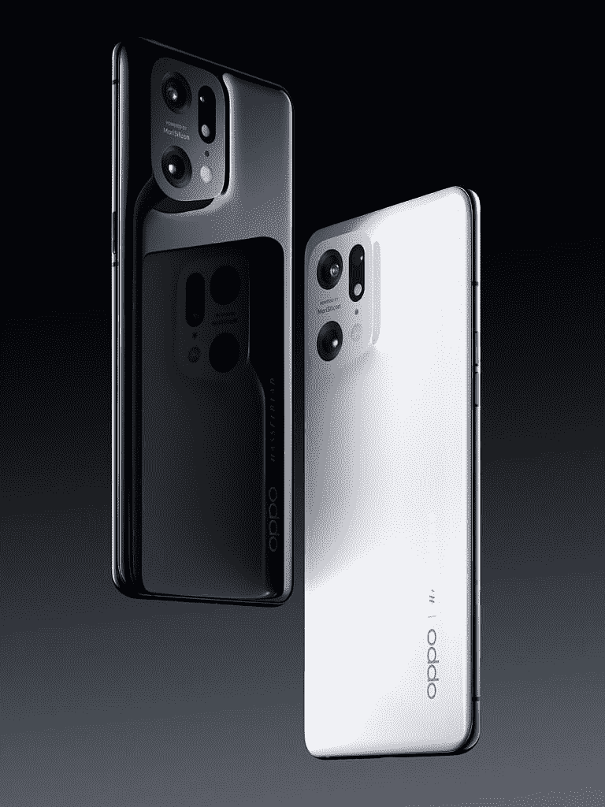
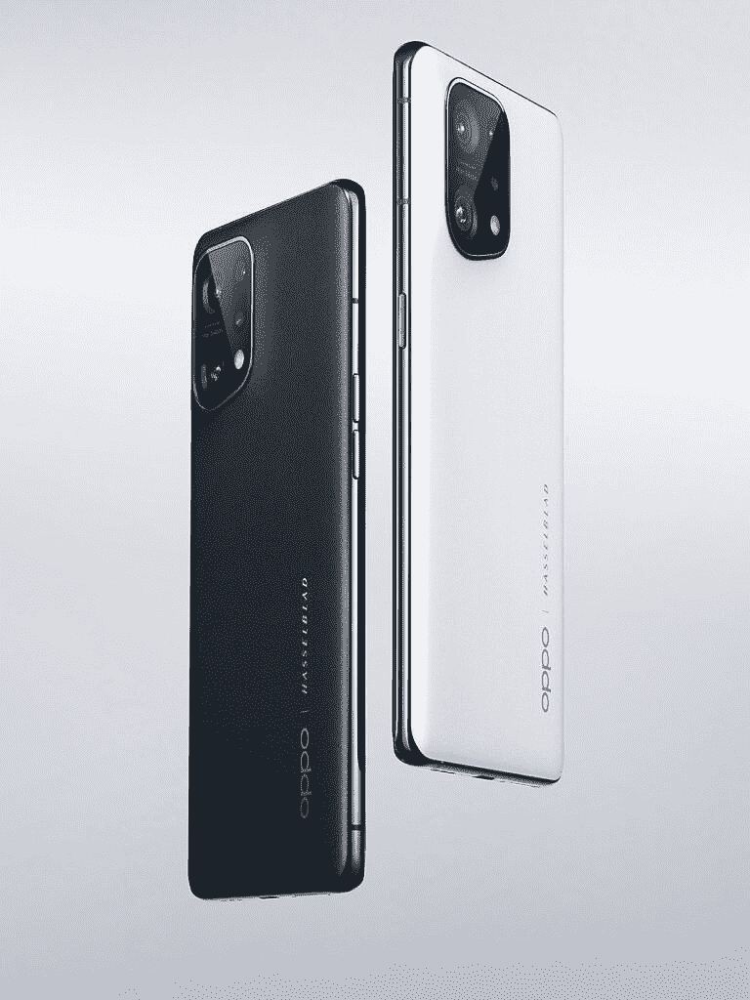

# OPPO Find X5、Find X5 Pro、Enco X2 TWS 全球首发

> 原文：<https://www.xda-developers.com/oppo-find-x5-pro-enco-x2-launch/>

每个主要的 Android OEM 都有一个产品系列，在所有相关领域都有顶级的规格。这些产品系列融合了 OEM 为主流消费者提供的最佳芯片、最佳显示屏、最佳设计、最佳电池技术和最佳相机。OPPO 的 Find X 系列是其旗舰产品，在 MWC 之前，该公司已经发布了 OPPO Find X5 和 OPPO Find X5 Pro，接替 Find X3 系列成为该公司的顶级智能手机。该公司还将推出 OPPO Enco X2 耳机，接替广受好评的 Enco X 成为顶级 TWS。

## OPPO Find X5 和 Find X5 Pro

### 规范

| 

规格

 | 

OPPO Find X5

 | 

OPPO Find X5 Pro

 |
| --- | --- | --- |
| **建造** | 

*   金属框架
*   玻璃背面
*   颜色:黑色、白色

 | 

*   金属框架
*   陶瓷背面
*   颜色:陶瓷白，釉黑

 |
| **尺寸&重量** | 

*   160.3 x 72.6 x 8.7mm 毫米
*   196 克

 | 

*   163.7 x 73.9 x 8.5mm 毫米
*   218 克

 |
| **显示** | 

*   6.55 英寸 FHD+ AMOLED
*   120 赫兹刷新率

 | 

*   6.7 英寸 QHD+ (3216 x 1440) AMOLED LTPO
*   LTPO 2.0 的刷新率为 120 赫兹(1Hz-120 赫兹
*   HDR10+支持
*   康宁大猩猩玻璃 Victus

 |
| **SoC** | 高通骁龙 888 | 高通骁龙 8 代 1 |
| **内存&存储** | 8GB + 256GB | 12GB + 256GB |
| **电池&充电** | 

*   4800 毫安时
*   80W SuperVOOC 有线快速充电
*   30W AirVOOC 无线快速充电

 | 

*   5000 毫安时
*   80W SuperVOOC 有线快速充电
*   50W AirVOOC 无线快速充电

 |
| **安全** | 显示器内光学指纹传感器 | 显示器内光学指纹传感器 |
| **后置摄像头** | 

*   **主要:** 50MP，索尼 IMX766，1/1.56 英寸传感器，1.0 米像素，f/1.8，84 FoV，OIS
*   **次要:** 50MP 超广角，索尼 IMX766，1/1.56”传感器，1.0 m 像素，f/2.2，110 FoV
*   **第三:**1300 万像素长焦，S5K3M5，1/3.4”传感器，f/2.4

 | 

*   **主要:** 50MP，索尼 IMX766，1/1.56 英寸传感器，1.0 米像素，f/1.7，80 FoV，5 轴 OIS
*   **次要:** 50MP 超广角，索尼 IMX766，1/1.56”传感器，1.0 m 像素，f/2.2，110 FoV，自由曲面镜头
*   **第三:**1300 万像素长焦，S5K3M5，1/3.4 英寸传感器，f/2.4

 |
| **前置摄像头** | 32MP 索尼 IMX615，1/2.74 英寸传感器，0.8 米像素，f/2.4，81 FoV | 32MP 索尼 IMX709 RGBW，1/2.74 英寸传感器，0.8 米像素，f/2.4，90 FoV |
| **端口** | USB 类型-C | USB 类型-C |
| **音频** | 带杜比 Atmos 的立体声扬声器 | 带杜比 Atmos 的立体声扬声器 |
| **连通性** | 

*   国家足球联盟
*   乐队:
    *   2G: GSM 850/900/1800/1900MHz
    *   3G: UMTS (WCDMA):频段 1、2、4、5、6、8、19
    *   4G:FDD-LTE 频段 1、2、3、4、5、7、8、12、13、17、18、19、20、25、26、28、32、66
    *   4G:TD-LTE:频段 34、38、39、40、41
    *   5G: SA n1，3，5，7，8，12，13 18，20，26，28，38，40，41，66 (2110-2180)，77，78
    *   5G: NSA n77，78，38，40，41，1，3，5，7，8，20，28 BlockA 和 BlockB，n66

 | 

*   国家足球联盟
*   乐队:
    *   2G: GSM 850/900/1800/1900MHz
    *   3G: UMTS (WCDMA)频段 1、2、4、5、6、8、19
    *   4G: TD-LTE 频段 34、38、39、40、41、42
    *   4G: LTE FDD 频段 1、2、3、4、5、7、8、12、13、17、18、19、20、25、26、28、32、66
    *   5G SA: n1，2，3，5，7，8，12，13，18，20，25，26，28，38，40，41，66 (2110-2180)，77，78，79
    *   5G NSA: n1、3、5、7、8、20、28、38、40、41、66、77、78、79

 |
| **软件** | 搭载 ColorOS 12.1 的 Android 12 | 搭载 ColorOS 12.1 的 Android 12 |
| **其他特色** | 成像 NPU: MariSilicon X | 

*   成像 NPU: MariSilicon X
*   IP68 等级

 |

等等，你问 OPPO Find X4 在哪里？中国的原始设备制造商倾向于跳过数字 4，因为它在中国被认为是不吉利的。在找到 X3 之后，我们有了 Find X5 系列。

 <picture></picture> 

OPPO Find X5 Pro in Glaze Black and Ceramic White

说完这些，我们来谈谈 OPPO Find X5 系列的新功能。该系列有一个形状相当独特的摄像头岛，使其具有目前市场上其他智能手机所没有的某种特征。在 Find X5 Pro 上，摄像头模块通过一个激进的斜面与陶瓷背面相接，使其看起来非常无缝。在普通的 Find X5 上，你会看到不太明显的倾斜和传统的玻璃外壳。这些设备还具有不同的尺寸和重量，因此具有不同的显示器尺寸和电池尺寸。

 <picture></picture> 

OPPO Find X5 in Black and White

### 相机和 MariSilicon X 成像 NPU

两款设备的相同之处在于后置摄像头的设置。两款设备上的主广角和次超广角摄像头都是 50MP 索尼 IMX766 传感器，Pro 的光圈略好，主摄像头是 5 轴 OIS。两款设备上的第三个摄像头是一个 1300 万像素的长焦摄像头，可实现 2 倍变焦。

OPPO 在 Find X5 系列上的一大卖点是以 MariSilicon X 形式出现的新成像 NPU。基于 6 纳米工艺，MariSilicon X 运行人工智能降噪算法，似乎可以逐个像素地检测和降低每一帧中的噪声，同时保留更精细的细节、肤色和颜色精度。正因为如此，OPPO 声称夜间摄像技术提高了 4 倍，承诺用 OPPO 所谓的“4K 超夜间视频”实现更少的颗粒和更好的色彩再现。4K 超夜间视频可用于两种设备上的主摄像头和辅助后置摄像头。你还会注意到设备背面蚀刻的哈苏品牌，这是因为[之前宣布的哈苏合作](https://www.xda-developers.com/oppo-partners-hasselblad/)。这为相机带来了专业模式下的 Hasselblad 自然色彩校准，以及一系列供用户使用的滤镜。

两款手机的前置摄像头有所不同，Pro 采用了 32MP 索尼 IMX709 RGBW 传感器。NPU 也在这里工作，承诺更多的纹理和精确的颜色再现。RGBW 模式让相机捕捉更多的光线，而 NPU 则分别处理 W 和 RGB 信号，从而实现更清晰的焦点、更好的色彩再现和更高的自拍清晰度。

### 显示器，内部，软件

Find X5 Pro 采用 6.7 英寸曲面 AMOLED，具有 120Hz 可变刷新率(LTPO 2.0，可降至 1Hz)，10 位颜色，100% DCI-P3 覆盖，以及 8192 级屏幕调光。常规的 X5 获得了 120Hz 刷新率的 FHD+ OLED 面板。这两款设备都获得了多亮度颜色校准，OPPO 声称这是同类产品中的第一款，有望在不同的照明条件下保持一致的颜色。

至于内部，OPPO Find X5 配有骁龙 888，而 Pro 则配有骁龙 8 Gen 1。分别有 4800 mAh 和 5000 mAh 的电池，但两款手机都有 80W 的快速充电功能。Pro 将充电器放在盒子里，它还可以进行 50W 无线充电，而普通的 Find X5 则可以进行 30W 无线快速充电。

这两款智能手机都运行在 Android 12 之上的 ColorOS 12.1。OPPO 还宣传了一种新的多屏连接功能，可以在 Windows PC 和手机之间无缝工作。

### 定价和可用性

OPPO Find X5 系列今天可以预订，从 3 月 14 日起开始销售。

*   查找 X5: €999
*   查找 X5 Pro:
    *   欧盟的€1，299
    *   英国 1049 人
*   50W AirVOOC 充电器:€79

* * *

## OPPO Enco X2

OPPO Enco X2 是该公司最新的 TWS，采用了新的同轴双驱动设计。第一个驱动器是一个四磁体平面高音扬声器，其频率响应范围为 20Hz 至 40kHz。第二个驱动器是一个 11 毫米动态驱动器。TWS 还具有主动噪音消除功能，最大深度为 45dB，最大宽度为 4kHz。OPPO Enco X2 还支持蓝牙 5.2 和 LHDC 4.0，承诺高达 900kbps 的码率。OPPO 承诺总共 14 小时的电池寿命。

Enco X2 支持快速配对，让用户可以与 Android 设备即时连接。OPPO 还与杜比音频合作，使这成为第一个支持双耳录音的 TWS 耳塞。

TWS 有两种颜色，黑色和白色。你可以在 4 月中旬以 199€的价格买到它。

* * *

您对新款 Find X5 和 Find X5 Pro 以及 Enco X2 有何看法？请在下面的评论中告诉我们！