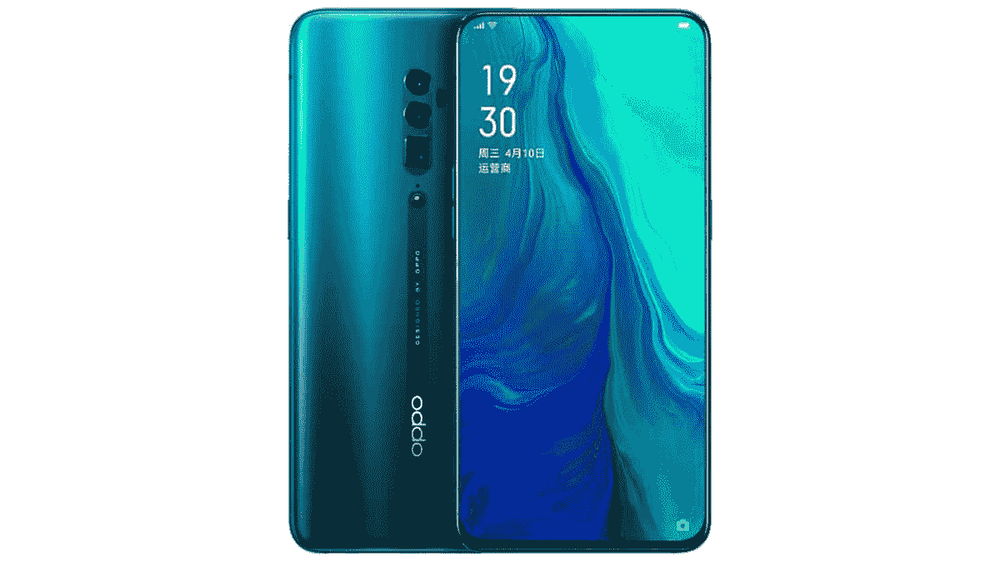
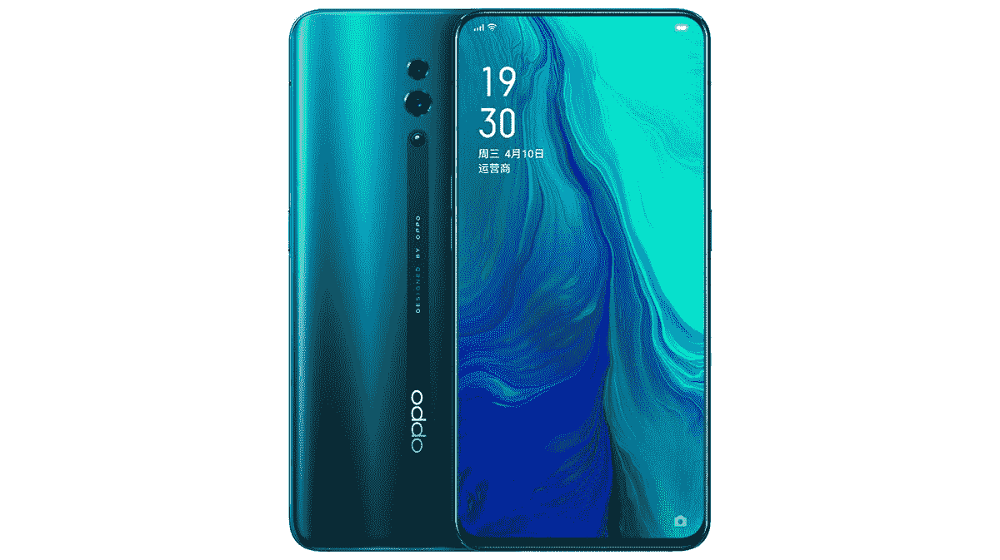

# OPPO 为₹39,990 带来了 10 倍混合变焦的 OPPO Reno

> 原文：<https://www.xda-developers.com/oppo-reno-10x-zoom-launch-india/>

OPPO 于 2017 年在 MWC 巴塞罗纳首次展示了其原始的光学变焦概念。经过两年的默默迭代和改革，该公司在今年的贸易展上再次展示了其 [10X 无损变焦技术](https://www.xda-developers.com/oppo-10x-lossless-optical-zoom-smartphone/)，几个月后， [OPPO Reno 10X 变焦版](https://www.xda-developers.com/oppo-reno-10x-zoom-launch/)作为该公司第一款具有抛光光学变焦功能的功能智能手机亮相。除了创新的变焦功能，这两款智能手机还配备了一个古怪的侧举自拍相机和令人惊叹的 93.1%的屏幕与身体的比例。上个月在中国发布的 OPPO Reno 系列现在正在进入印度，其起始价格肯定会让华为感到担忧。

## OPPO Reno 10X 变焦版

OPPO Reno 10X 变焦版是这两款机型中的佼佼者，顾名思义，它支持 5X 光学、10X 无损混合变焦和高达 50X 的数码变焦。这款智能手机采用三摄像头设置，包括 48MP 索尼 IMX586 传感器，f/1.7 光圈作为主要传感器，以及 8MP f/2.2 传感器，用于 120°宽视野。对于光学变焦，智能手机使用类似于华为 P30 Pro 的潜望式设置。该模块使用一个 1300 万像素的传感器，光圈为 f/3.0。有了这些规格，可以期待 OPPO Reno 10X 变焦版给华为旗舰来一场硬仗。在视频方面，Reno 支持最高 4K 60fps 的录制，并使用多个麦克风实现立体声环绕音效。

 <picture></picture> 

Reno 10x Zoom

在正面，有一个无凹槽的 6.6 英寸有机发光二极管全高清+显示屏，而 1600 万像素的自拍相机位于一个楔形凹槽中，对我来说，这就像一片馅饼或比萨饼。固定在一端，槽口从另一端升起，大概是随着旋转，开始时看到这种情况会很有趣。不用说，这也是引人注目的。弹出式还隐藏了前面和后面的闪光灯以及耳机。同时，显示屏下面还有一个指纹扫描仪。

在硬件方面，OPPO Reno 10X 由骁龙 855 和高达 8GB 的 RAM 驱动，这使其在对抗华为领先的芯片组海思麒麟 980 时有了坚实的基础。此外，这款智能手机还配备了 4065 毫安时电池，支持 VOOC 3.0 快速充电。

在软件方面，这款智能手机运行基于 Android 9 Pie 的 [ColorOS 6](https://www.xda-developers.com/oppo-announces-coloros-6-coming-to-the-r17-r15-r11-and-more/) ，是第一款运行该公司定制 Android 皮肤最新版本的 OPPO 手机。它也将是 OPPO 首批获得 Android Q 更新的智能手机之一。

| 

规范

 | 

OPPO Reno 10X 倍变焦

 | 

OPPO 雷诺标准

 |
| --- | --- | --- |
| 显示 |  |  |
| 社会学 | 高通骁龙 855

*   1 个 2.84GHz Kryo 485
*   3 个 2.42GHz Kryo 485
*   4 个 1.8GHz Kryo 485

 | 高通[骁龙 710](https://www.xda-developers.com/tag/qualcomm-snapdragon-710/)

*   2 个 2.2GHz Kryo 360 金
*   6 个 1.7GHz Kryo 360 银

 |
| 随机存取存储 | 6GB/8GB | 6GB/8GB(在印度只有 8GB) |
| 储存；储备 | 128GB/256GB | 128GB/256GB(印度只有 128GB) |
| 电池 | 4065 毫安时 | 3765 毫安时 |
| 指纹传感器 | 光学显示 | 光学显示 |
| 后置摄像头 |  |  |
| 前置摄像头 | 1600 万像素，带前置 LED，f/2.0 | 1600 万像素，带前置 LED，f/2.0 |
| 安卓版本 | 基于 Android 9 Pie 的 ColorOS 6 | 基于 Android 9 Pie 的 ColorOS 6 |
| 颜色；色彩；色调 | 雾海绿，极夜黑 | 雾海绿，极夜黑，星云紫，粉雾 |

## OPPO 雷诺标准版

OPPO Reno Standard Edition 也可以被视为 OPPO Reno 的精简版，它与另一款设备有许多相同的特点。两款智能手机背面都有相同的 48MP 主传感器，相同的 RAM 和存储选项，以及带有相同自拍相机的类似弹出窗口。

 <picture></picture> 

Standard Reno

将 OPPO Reno Standard 与 10X Zoom edition 区分开来的功能包括其较小的 6.4 英寸显示屏有机发光二极管，该显示屏还具有一个内置指纹传感器。此外，它的背面有双摄像头，包括一个 500 万像素的辅助传感器，以补充主 480 万像素的传感器，以及一个骁龙 710 SoC。这款智能手机不支持光学变焦功能。

## 价格和可用性

至于 OPPO Reno 10X 变焦版，6GB/128GB 的版本在₹39,990 上市(约 575 美元)，而 8GB/256GB 的版本在₹49,990 上市(约 720 美元)。

另一方面，标准版在印度只能获得 8GB/128GB 的配置，价格在₹32,990(约 475 美元)。

这两款设备将通过 Flipkart 在印度独家发售，预购从今天开始，即 5 月 28 日，并将于 6 月 7 日开始销售。