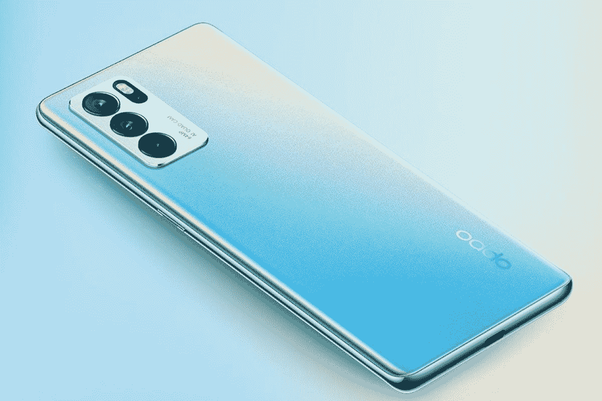

# OPPO Reno 6 Pro 5G 第一印象:翻新前代产品

> 原文：<https://www.xda-developers.com/oppo-reno-6-pro-5g-first-impressions/>

OPPO 推出 Reno 系列是为了展示其在智能手机领域的最新创新。第一个雷诺设备有一个潜望镜相机，一个边到边的显示器，一个鲨鱼鳍形状的弹出式相机，以及最新的骁龙芯片组。然而，随着后续的迭代，OPPO 偏离了 Reno 系列的最初理念，走上了一条主要关注设计和多媒体体验的路线。

随着今年年初的 Reno 5 Pro，OPPO 再次修改了其策略，并加入了旗舰级内部部件，并像最初的 Reno 系列一样为该设备定价，极具竞争力。雷诺 6 Pro 5G 遵循同样的脚步，感觉几乎像是一个改进的，或者为了文字游戏，一个*雷诺*的前身版本。它遵循相同的核心原则，即添加联发科天玑 1200 形式的强大 SoC、曲面有机发光二极管显示屏、6400 万像素四摄像头和超快充电，最终实现整体优质体验。

*关于此次评测:用于评测的设备由 OPPO India 提供给我们，我们在两周的大部分时间里使用了 OPPO Reno 6 Pro 5G，然后对我们使用该设备的体验进行了简要总结。OPPO 对此次审查的内容没有任何意见。*

## OPPO Reno 6 Pro 5G:规格

| 

规格

 | 

OPPO 雷诺 6 Pro 5G

 |
| --- | --- |
| **尺寸&重量** |  |
| --- | --- |
| **显示** | 

*   6.5 英寸 FHD+ 3D 曲面有机发光二极管
*   2400 x 1080p 像素
*   20:9 宽高比
*   90Hz 刷新率
*   HDR 10+认证

 |
| --- | --- |
| **SoC** | 

*   联发科天玑 1200
*   马里 G77 MC-9

 |
| --- | --- |
| **闸板&存放** | 

*   12GB 内存，支持扩展
*   256GB UFS 3.1 存储空间

 |
| --- | --- |
| **电池&充电** | 

*   4500mAh 电池
*   65W SuperVOOC 2.0 快速充电

 |
| --- | --- |
| **安全** | 显示指纹扫描仪 |
| --- | --- |
| **后置摄像头** | 

*   6400 万像素 f/1.7 主摄像头，PDAF
*   800 万像素 f/2.2 超宽摄像头
*   2MP f/2.4 微距相机
*   2MP f/2.4 复古人像相机

 |
| --- | --- |
| **前置摄像头** | 32MP f/2.4 |
| --- | --- |
| **端口** | USB 3.1 类型 C |
| --- | --- |
| **音频** | 杜比全景声支持 |
| --- | --- |
| **连通性** | 

*   蓝牙 5.2
*   802.11 a/b/g/n/ac/ax 双频 Wi-Fi
*   全球定位系统，A-GPS，GLONASS，BDS，伽利略，QZSS
*   双 SIM 卡插槽
*   5G

 |
| --- | --- |
| **软件** | 色彩 11.3 |
| --- | --- |

## 设计:典型 OPPO

OPPO 通常依靠线下市场来实现其销售目标，在这个市场上，消费者优先考虑设备的设计和整体外观。由于你可以在购买之前亲自去商店体验这些设备，所以背板的质地或手机的重量和厚度等因素非常重要。因此，OPPO 多年来在这方面一直做得很好，Reno 6 Pro 5G 也不例外。

背面有一个很好的喷砂纹理，增加了手持电话时的抓握力。然而，除了纹理，背面还因其闪亮的色彩而闻名，OPPO 称之为*极光*。它的设计方式是根据光线落在背面的方式从多个角度反射光线，然后从中创造出多种不同的颜色。

很难描述它的外观，但如果你在 Reno 6 Pro 上选择这种颜色，你的手机每次看起来都会有所不同。

背面是弯曲的，就像显示屏一样(我们稍后会谈到)，正面和背面都与框架无缝融合，使设备看起来比实际更薄。考虑到手机的整体尺寸，它确实感觉很轻，重量分布也做得很好。将 Reno 6 Pro 拿在手中会感觉像是拿着一部高级手机，并且该品牌已经密切关注了这款设备的设计。

## 显示:平滑曲线，但刷新率为 90Hz

不管你喜欢与否，3D 曲面显示器肯定会给手机增添一丝高端气息，OPPO Reno 6 Pro 5G 正是如此。全高清+有机发光二极管显示屏的左上角有一个穿孔，曲线非常轻微，溢出来与画面融合。由于弯曲，手势导航，尤其是在手机两侧，感觉一如既往地流畅。即使拿着手机滚动浏览社交媒体订阅源，也比平时感觉更顺畅，因为你的手可以轻松地绕过曲线。

感觉平滑的第二个原因是显示器以 90Hz 刷新。是的，有 120 赫兹显示屏的手机在同样的价格范围内，甚至更低，这也是我们在这里扣掉一些分数的原因之一。无论你是随意使用手机还是在 OTT 平台上观看 HDR 内容，面板本身的质量都是一流的。Reno 6 Pro 还配备了一个显示指纹扫描仪，既快速又准确。

就像设计和制造质量一样，即使是手机显示屏的质量也是显而易见的，这就是 OPPO 没有在 Reno 6 Pro 上使用的面板上妥协的原因。它足够大，可以欣赏内容，同时仍然感觉相对紧凑，易于导航。

## OPPO Reno 6 Pro:性能

OPPO Reno 5 Pro 配备了联发科天玑 1000+,这是当时联发科提供的最好的芯片。Reno 6 Pro 用 Dimensity 1200 取代了它，这是他们目前的旗舰 SoC。伴随它的是 12GB 的内存，可以...(要说出令人吃惊或高兴的事情)听着...借助虚拟内存“扩展”到 19GB。不，这并不意味着 Reno 6 Pro 有 19GB 的实际内存，只是意味着多任务处理在手机上可能会感觉稍微流畅一些。有 256GB 的板载 UFS 3.1 存储。

Dimensity 1200 是一款久经考验的产品，能够出色完成日常任务。这款芯片组可以轻松处理更重的负载，如游戏和视频渲染。对于那些不太熟悉联发科芯片组的人来说，Dimensity 1200 介于高通骁龙 870 和 888 之间，这两款处理器都是旗舰处理器。无论你是 BGMI 的征服者，还是只想拥有一部可以运行社交媒体应用程序而不会出现问题的手机，Reno 6 Pro 5G 都将满足你的所有需求。如果你不是特别在乎你的手机运行什么处理器，只要它能运行良好，这是一款值得考虑的手机。

就像所有的 OPPO 手机一样，Reno 6 Pro 运行在 ColorOS 11 上。ColorOS 作为一种定制皮肤，这些年来已经非常成熟，并且有很多您可能会觉得有用的特性。它很稳定，UI 看起来很好，并且提供了一些很好的实用功能。当然，它也有自己的缺点，比如预装的膨胀软件，股票应用程序的垃圾邮件通知等，但总的来说，Reno 6 Pro 的软件体验在很大程度上是好的。

## 照相机

Reno 6 Pro 保留了与 Reno 5 Pro 相同的摄像头设置，只是对外部摄像头模块/外壳进行了一些更改。主摄像头是一个 6400 万像素的摄像头，能够在大白天捕捉一些好镜头。照片看起来很详细，OPPO 甚至利用更高的分辨率来允许数字变焦，这在 5X 看起来非常有用。

我们注意到在户外拍摄时曝光水平略有不一致，动态范围可以改善。当你试图捕捉光线较弱的场景时，照片会有轻微的噪音。

在这个价格范围内，超宽没有我们预期的那么锐利。800 万像素的相机拍摄的照片高于平均水平，当然是可用的，但不可靠。另一方面，自拍相机在捕捉正确的肤色方面做得很好。这里的动态范围也可以更好，因为背景中的高光有时会过度曝光。

OPPO 正在营销作为 Reno 6 Pro 5G 亮点之一的*散景风格人像模式*，它在使背景看起来像用自然景深拍摄时一样方面做得很好。

在视频方面，OPPO Reno 6 Pro 可以以 30fps 的速度拍摄 4K，但如果你想拍摄 60fps 的视频，你必须将分辨率降至 1080p。鉴于 SoC 的强大，4K 60fps 应该出现了。前置摄像头上限为 1080p 30fps。有像 *AI 高亮视频*这样的功能，可以改善色彩并降低夜间的噪声水平，我们之前谈到的*散景风格人像模式*也适用于视频。

## 充电:使用 SuperVOOC 进行超快速充电

OPPO 的 VOOC 充电技术已经存在了一段时间，经历了大量的发展，达到了目前的阶段。在 Reno 6 Pro 5G 上，它接受高达 65W 的输入瓦数，可以在大约半小时内为 4500mAh 电池充电。65W 充电并不是什么新鲜事，Realme 甚至在 sub-₹20k 的手机上也有，但它只是一个很好的东西，当然值得一提。

在 Reno 6 Pro 上，电池寿命本身非常稳定。睡觉前剩余约 20%的电池，可以轻松完成一天的使用。你不需要通宵充电，尽管早上快速充电可以保证你的手机一整天都用得着。

## 多方面的

手机上的振动马达非常好，尤其是打字时的触觉反馈与其他旗舰手机相当。这款手机有两个 SIM 卡插槽。您不能通过 microSD 卡来扩展存储空间。这个设备的一个缺点是它只有一个底部发射扬声器。

虽然它确实很吵，而且支持杜比全景声，但在这个价格上，我们期待立体声扬声器。如果你想知道，也没有耳机插孔。这款手机通过了 L1 wide vine 认证，支持载波聚合。

还有一点值得记住的是，OPPO 并没有正式提供 bootloader 解锁选项。因此，对于喜欢开箱即用的用户来说，OPPO Reno 6 Pro 5G 并不是一个好的选择，因为你将无法通过引导程序解锁你的设备。

## 最后的想法

OPPO Reno 6 Pro 已经在印度上市，价格为₹39,990(约 536 美元)，比其前代产品在₹35,990 的价格还要贵。您将获得更强大的 SoC、更多的 RAM 和存储，而封装的其他部分基本保持不变。在这个价格类别中，当然有其他选择可以提供更好的价值，但 Reno 6 Pro 并不与小米、Realme 或 iQOO 等公司竞争。

 <picture></picture> 

Oppo Reno 6 Pro 5G

##### OPPO 雷诺 6 Pro 5G

Oppo Reno 6 Pro 5G 主要面向线下市场的普通消费者，他们正在寻找一款拥有良好显示屏和可靠性能的全面手机。

OPPO 作为一个品牌在线下市场更普遍，并强调设计、显示和优质体验等内容。考虑到这些因素，OPPO Reno 6 Pro 5G 可能是你考虑的一个好选择，如果它在你的优先列表上选中了正确的框。如果你在寻找智能手机的最佳性能和最大价值，你需要评估你的其他选择。虽然 OPPO Reno 6 Pro 5G 在这些方面做得很好，但它提供的功能组合在线下市场比在线市场的规格爱好者更受普通用户的重视。