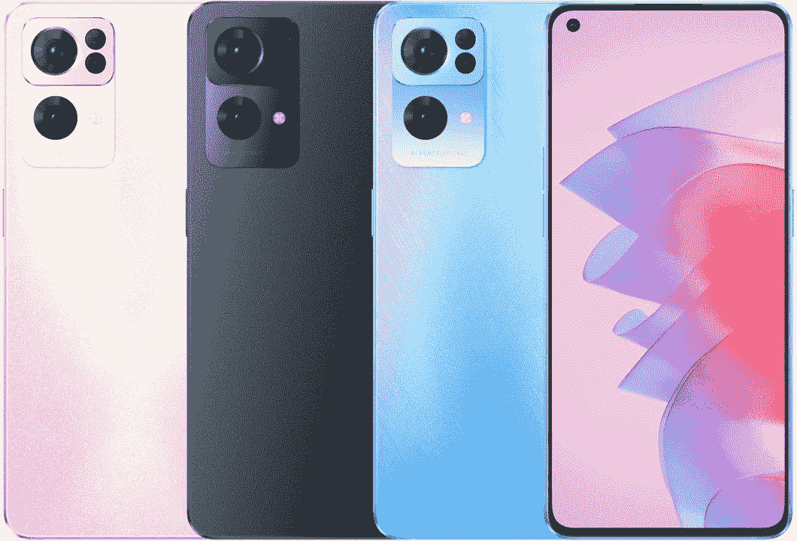

# OPPO Reno 7 Pro 评测:新瓶装旧酒

> 原文：<https://www.xda-developers.com/oppo-reno-7-pro-review/>

OPPO Reno 5 Pro 是 2021 年我最喜欢的品牌智能手机之一。它提供了强大的硬件、华丽的显示屏和吸引人的设计——所有这些都以 OPPO 的标准来看相当具有侵略性的价格。那年晚些时候，OPPO 还推出了雷诺 6 Pro T1，我称之为其前身的 T2 雷诺 T3 版本。这是因为 Reno 6 Pro 带来了迭代升级，但没有产生太大的差异。

大约 6 个月后，我们现在有了遵循完全相同理念的 OPPO Reno 7 Pro。是的，有一种闪亮的新设计，边缘是平的，因为这是 Android 世界的新趋势。但除此之外，雷诺 7 Pro 没有太多变化。就其核心而言，它仍然是一辆雷诺 6 Pro，只是重新包装成一个新的底盘，并进行了一些小的改动。不过，终端消费者并不担心这一点。重要的是知道你是否应该购买 OPPO Reno7 Pro，这也是我在这篇评论中想要做的。

## OPPO Reno 7 系列:规格

| 

规格

 | 

OPPO 雷诺 7 Pro

 | 

OPPO 雷诺 7 5G

 |
| --- | --- | --- |
| **尺寸&重量** | 

*   158.2 x 73.2 x 7.5mm 毫米
*   180 克

 | 

*   156.8 x 72.1 x 7.8 毫米
*   173g

 |
| **显示** | 

*   6.55 英寸 AMOLED
*   FHD+ (1080 x 2400)
*   90Hz 刷新率
*   180Hz 触摸采样速率
*   HDR10+支持
*   99.94%的 DCI-P3 覆盖率
*   920 尼特峰值亮度

 | 

*   6.43 英寸 AMOLED
*   FHD+ (1080 x 2400)
*   90Hz 刷新率
*   180Hz 触摸采样速率
*   HDR10+支持
*   DCI-P3 宽色域
*   800nit 峰值亮度

 |
| **SoC** | 

*   联发科 1200-最大
*   ARM G77 MC9 GPU

 | 

*   联发科尺寸 900
    *   2x ARM Cortex-A78 @最高 2.4GHz
    *   6 倍 ARM Cortex-A55 @最高 2GHz
*   ARM Mali-G68 MC4 GPU
*   6nm 纳米工艺

 |
| **闸板&存放** | 

*   12GB 内存
*   256GB UFS 3.1 存储空间

 | 

*   8GB 内存
*   256GB UFS 2..2 存储

 |
| **电池&充电** | 

*   4500 毫安时电池
*   65W 快速充电

 | 

*   4500 毫安时电池
*   65W 快速充电

 |
| **安全** | 显示指纹扫描仪 | 显示指纹扫描仪 |
| **后置摄像头** | 

*   **主** : 50MP 索尼 IMX766 主摄像头
*   **二级** : 8MP f/2.2，超宽
*   **第三级** : 2MP 宏

 | 

*   **主** : 64MP f/1.7 主摄像头
*   **二级** : 8MP f/2.2，超宽
*   **第三级** : 2MP 宏

 |
| **前置摄像头** |  |  |
| **端口** |  | 

*   USB 类型-C
*   3.5 毫米音频插孔

 |
| **连通性** | 

*   5G NR
*   国家足球联盟
*   无线网络 6
*   蓝牙 5.2
*   USB 型

 | 

*   5G NR
*   国家足球联盟
*   无线网络 6
*   蓝牙 5.2
*   USB 型

 |
| **软件** | 

*   安卓 11 配 ColorOS 12

 | 

*   安卓 11 配 ColorOS 12

 |

***关于这篇评测:** OPPO India 给我们发来了 OPPO Reno 7 Pro，在写这篇评测之前，设备使用了十天的时间。OPPO 没有对此次审查的内容提出任何意见。*

* * *

## 设计

OPPO 在让手机看起来和感觉上都非常棒

OPPO 的大多数智能手机在设计方面得分很高，Reno 7 Pro 也不例外。Reno 6 Pro 有一个弯曲的显示屏，合并到一个也以类似方式弯曲的背部。这使得手机看起来光滑，握起来很舒服。这一次，OPPO 在 Reno 7 Pro 上选择了平边，灵感来自我们都知道谁。虽然设计不是独一无二的，但 OPPO 在让手机看起来和感觉上都很棒。

Reno 7 Pro 是目前感觉最好的平边安卓手机

最近有几家原始设备制造商采用了平边设计，但我觉得 OPPO 已经在 Reno 7 Pro 上采用了这种设计。手机不是太大，这使得它更容易拿着，倒角边缘也不锋利，所以它们不会咬到你的手掌。金属底盘感觉很好，当放在平坦的表面上时可以独立站立。当然，OPPO 也对手机的背面和正面进行了扁平化处理，以符合整体审美。我真的很喜欢 OPPO Reno 7 Pro 的外观。重量管理也以这样的方式完成，当你长时间使用它时，手机感觉很轻。Reno 7 Pro 是目前感觉最好的平边 Android 手机。

玻璃后盖非常普通，因为我们在 Reno 系列的以前的设备上看到过类似的设计。这里没什么特别的。但特别的是相机模块周围的照明环。它整齐地塞在相机模块的周围，每次收到通知或给设备充电时都会发光。如果你还记得几年前，通知 led 在智能手机的正面很常见，但很快就被淘汰了，因为显示屏尺寸越来越大，导致空间不足和各种借口。

这枚戒指以优雅的方式重现了这一特征。因为 LED 在背面，所以你必须把手机正面朝下才能看清楚。如果您使用包装盒中提供的外壳，您仍然可以在手机的顶部边缘看到一丝照明，因为外壳会扩散 LED。有些人可能会觉得这是噱头，但我个人喜欢这个 LED。这大概是 OPPO 唯一做了一些*新*的部门。

## 显示

如前所述，Reno 7 Pro 的显示屏以及边框和背面也变平了。Reno 6 Pro 的显示屏两侧都有弯曲的边缘，这是我个人喜欢的。我知道很多人由于各种原因不喜欢弯曲的显示屏，但我喜欢显示屏融入手机框架的美感。然而，现在没有了，你得到的是一个平面显示器，左上角有一个打孔的切口。

它仍然是 AMOLED 显示器，分辨率为 1080p，刷新率为 90Hz，就像 Reno 6 Pro 上的显示器一样。色彩非常棒，视觉体验与其他配备有机发光二极管显示屏的高端手机不相上下。6.55 英寸的显示屏相对方便，因此手机不会感觉太大而无法握持或使用。一些人对这种显示器的一个抱怨是，刷新率上限为 90Hz，而竞争对手在这个价格范围内提供 120Hz 的显示器。

就我个人而言，我无法区分 90Hz 显示器和 120Hz 显示器之间的区别，所以这并没有太困扰我。如果你是一个能区分这两者的人，或者你只是想要一个更高的刷新率来炫耀，这是一个会困扰你的方面。手机上有一个显示指纹扫描仪，用于生物识别，既快速又准确。手机上有 HDR 10+支持，所以如果你在 OTT 平台上观看大量内容，你会有一个愉快的体验。是的，OPPO 终于给了我们一个立体声扬声器设置，进一步增强了媒体观看体验。

就像这款手机的平面边缘一样，我也喜欢平面显示器，纯粹是因为它的外观。OPPO 将显示屏周围的边框保持在最低限度，这实际上在查看设备正面时产生了很大的差异。尽管我是曲面显示器的粉丝，但我更喜欢 Reno 7 Pro 的平板设计。这款手机从正面看是一款 looker。

## 性能和软件

我在这里没有太多要说的，因为 OPPO Reno 7 Pro 使用了与 Reno 6 Pro 相同的 Dimensity 1200 芯片组。OPPO 提到，Reno 7 Pro 使用了与 OPPO 共同开发的联发科天玑 1200 *Max* SoC。然而，CPU 或 GPU 的工作方式没有任何区别，并且这种 CPU 的时钟速度也是相同的。联发科和 OPPO 合作的唯一区别是，与前代产品相比，Reno 7 Pro 在显示屏上显示了更好的视觉效果，或者至少 OPPO 是这么声称的。

联发科天玑 1200 是一款久经考验的产品

在现实生活中，我找不到任何明显的差异或因素，让我觉得 Max 版本的芯片组产生了影响。然而，联发科天玑 1200 是一个成熟的表演者。Reno 7 Pro 运行您经常使用的各种应用程序和游戏都没有问题。就性能而言，它感觉像是一部旗舰手机，这也是你对价格在₹40,000(约 530 美元)的手机的期望。对于那些想知道的人来说，BGMI 可以以 60fps 的速度播放，在大多数情况下没有任何问题。我确实偶尔注意到一些滞后，尤其是在热降期间。如果你玩的是 Genshin Impact 这类比较重的游戏，会时不时看到一些掉帧的情况。

一个更新的芯片组会让 Reno 6 Pro 的升级感觉更充实

虽然 Dimensity 1200 是去年的 SoC，但我更希望看到更新的芯片组，尽管它有自己的方式。在我看来，更新的芯片组会使 Reno 6 Pro 的升级更具实质性。尽管如此，你在 OPPO Reno 7 Pro 上不会有任何性能问题。就像每部 OPPO 手机一样，你可以从盒子里取出 ColorOS 12，不幸的是，它仍然运行在 Android 11 上。旧芯片组，旧软件。这是可行的，但是继任者除了更新的设计之外，还需要更新的元素。

不过，ColorOS 12 在这款设备上运行得很好，我在整个使用过程中没有遇到任何延迟或打嗝的情况。你可以得到一些常见的功能，比如双应用程序、游戏模式、可调整大小的多窗口和一堆可供选择的主题。如果你喜欢使用能给你提供大量功能的自定义用户界面，你会觉得使用 ColorOS 就像在家里一样。如果你想要一个更接近 AOSP 的简单用户界面，你需要一些时间来适应这个界面。

## 摄像机

让我直入主题。Reno 7 Pro 上的 50MP 主摄像头在大多数光线条件下都能拍摄出令人愉悦的照片。在日光下，颜色看起来很棒，动态范围也很棒。当点击特写镜头时，自然的散景看起来也很有吸引力。有些人可能喜欢稍微偏冷的照片，尤其是你喜欢高对比度的照片。即使在光线较暗的情况下，手机也可以通过内置的夜间模式拍摄好照片。细节层次有明显的损失，白平衡可能会有点混乱，但我想说 OPPO 在 Reno 7 Pro 上的主摄像头方面做得很好。

雷诺 7 专业点击图片，在大多数照明条件下看起来很舒服

超宽相机比不上主相机的性能，是个败笔。这个价格的 800 万像素传感器似乎是一种削减成本的措施。与主摄像头相比，细节缺乏，颜色似乎很暗。背面的第三个射手是一个 200 万像素的微距相机，这也是非常没有意义的。

不过好的是 32MP 自拍器。饱和的色彩和令人印象深刻的动态范围让自拍看起来很清晰。肤色稍微偏暗，因为它会让脸稍微亮一点，但不会太明显。人像模式下的边缘检测看起来也很棒。如果你自拍很多，或者你为社交媒体制作简短形式的内容，你会喜欢 OPPO Reno 7 Pro 上的前置摄像头。

## 电池和充电

Reno 7 Pro 上有一个 4500 毫安时的电池，可以毫无问题地运行一整天的社交媒体应用程序，浏览，点击一些照片，在 Google Duo 上进行 20 分钟的视频通话，以及狂看几集《鲨鱼坦克印度》(Shark Tank India)。我大部分时间都是 6-6.5 小时的开机时间，我认为这已经足够了。这款手机轻薄，但不影响电池寿命。

这款手机轻薄，但不影响电池寿命

当你快没电的时候，Reno 7 Pro 可以通过盒子里提供的充电器以 65W 充电。从 5%到 100%通常需要 35 分钟，这确实令人印象深刻。这些结果再次与我们在 Reno 6 Pro 上看到的结果完全相似。一点变化都没有。

## 该不该买 OPPO Reno 7 Pro？

我选择这个特别的标题是有原因的。OPPO Reno 7 Pro 本质上是 Reno 6 Pro 在新的机箱中重新包装，并进行了一些小的改进。还记得在史酷比的每一集的结尾，他们会把坏人头上的面具摘下来，结果会是一个他们已经认识的人？雷诺 7 Pro 正是如此。去掉平边和显示屏，你就有了一台 Reno 6 Pro。

对于₹40,000 的起价(～530 美元)，OPPO Reno 7 Pro 并没有提供最好的价值，除非一款好看的手机在你的优先考虑名单上。Reno 7 Pro 拥有漂亮的设计、超薄边框的显示屏、稳定的性能、可靠的摄像头、良好的电池续航时间和快速充电。你看，这是一部完美的手机。然而，没有什么真正突出的，特别是当你考虑到上一代 Reno 6 Pro 上的旧芯片组以及手机仍然运行 Android 11 的事实。OPPO 的更新记录也不太好，所以记住这一点。

 <picture></picture> 

OPPO Reno 7 Pro

##### OPPO 雷诺 7 Pro

Reno 7 Pro 是 Reno 系列的最新手机，采用了全新的设计。

除非你真的对这个设计印象深刻，否则在这个价格范围内，市场上会有更好的手机。OPPO Reno 5 Pro 以极具竞争力的₹34,999 价格推出，如果他们能够与 Reno 7 Pro 媲美，我相信他们很有可能，因为他们使用的是旧硬件，我的判断会有所不同。