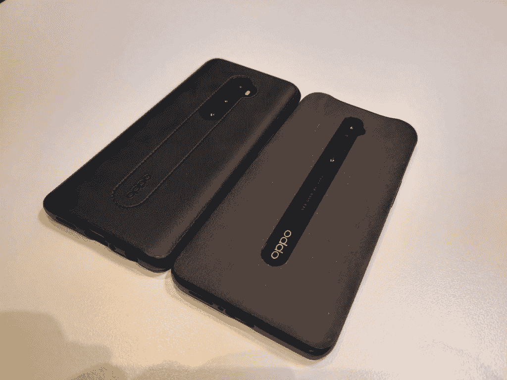

# OPPO Reno2 评论——一款稳定的中端智能手机

> 原文：<https://www.xda-developers.com/oppo-reno2-review-a-solidly-mid-range-smartphone/>

2019 年是 OPPO 在全球智能手机市场上关键的一年。OPPO Reno 10x Zoom 实际上是我那一年最喜欢的手机,这要归功于它令人印象深刻的触觉和出色的图像质量，以及全方位的出色包装。该公司承诺在 2020 年成为不仅仅是智能手机品牌的，我很期待他们接下来会推出什么。他们的最新智能手机之一 Reno3 上月底刚刚发布，但鉴于它尚未在中国以外推出，它实际上是一款 2020 年的设备。在我们检查该设备之前，我们想测试它的前身 Reno2。中端产品 OPPO Reno2 于 10 月在欧洲[发布，我们有相当多的时间来收集我们对它的想法。](https://www.xda-developers.com/oppo-reno-2-series-europe-launch/)

在深入研究这篇评论之前，重要的是要注意，我对 ColorOS 的想法将反映在我们的 OPPO Reno Z [评论](https://www.xda-developers.com/oppo-reno-z-review-great-despite-the-software/)中 Zachary Wander 的想法。我真的不是 ColorOS 的粉丝，但根据我所看到的，OPPO 似乎很重视社区反馈。基于 Android 10 [的 ColorOS 7 看起来接受度要高很多](https://www.xda-developers.com/oppo-announces-coloros-7-based-android-10/)，我也跃跃欲试想亲自体验一下。但中端产品 OPPO Reno2 已经上市，它运行的是 ColorOS 6.1。在 Reno3 国际上市前值得考虑吗？OPPO 的下一款手机还有很多需要改进的地方吗？以下是我对雷诺 2 的看法。

 **关于本次评测:2019 年 10 月 16 日收到 OPPO 发来的 OPPO Reno2。OPPO 是 XDA 的赞助商，但他们对这篇评论的内容没有任何意见，也没有在它上线前阅读它。*

## OPPO Reno2:设备规格

| 

**规格**

 | 

**OPPO 雷诺 2**

 |
| --- | --- |
| **尺寸** |  |
| **显示** | 

*   6.55 寸 FHD+动态 AMOLED
*   第六代大猩猩玻璃

 |
| **SoC** | 高通骁龙 730G |
| **风筒&储存** | 

*   6GB + 128GB UFS 2.1
*   8GB + 256GB UFS 2.1

 |
| **电池** | 4000 毫安时，带 VOOC 3.0 快速充电 |
| **USB** | USB 类型-C |
| **连通性** | 

*   WiFi 802.11 a/b/g/n/ac 支持
*   蓝牙 5.0
*   国家足球联盟

 |
| **指纹扫描仪** | 展示中 |
| **后置摄像头** | 

*   48MP 索尼 IMX586，f/1.7，0.8μm，OIS PDAF
*   1300 万像素，f/2.4，长焦，5X 混合变焦
*   800 万像素，116 广角摄像头
*   2MP 单声道传感器

 |
| **前置摄像头** | 16MP，鲨鱼鳍上升设计 |
| **安卓版本** | Android 9 Pie 之上的 ColorOS 6.1 |

## 硬件和构建质量

OPPO Reno2 采用了独特的设计，全玻璃弧形背面。它的每个边缘和中心都有蓝色的微光，根据光线照射的方式，这种微光会变得更加突出。三摄像头设置与玻璃齐平，一个“O-Dot”有助于设备在桌子上保持水平，避免了弯曲手机背面的常见投诉。虽然从实用的角度来看，玻璃可能是制作手机的最差材料，但 OPPO 充分利用了这一点，将设计做得尽可能漂亮。玻璃也增加了重量，虽然没有你想象中的那么多，因为它感觉非常缺乏重量。

OPPO Reno2 是*非常*像一个指纹磁铁，如果你使用它没有外壳，你将每隔几分钟擦拭它的背面。除此之外，它看起来*棒极了*，令人遗憾的是，附带的外壳掩盖了设计中所有美好的事物。OPPO Reno 10x Zoom 的随附外壳为设备的中间部分留了一个切口，但 OPPO Reno2 的没有。包括人造革案件掩盖了几乎所有的蓝色微光。它也不是一个非常好看的外壳——我更喜欢透明的硅胶外壳或砂岩外壳，就像 Reno 10x Zoom 附带的那种。

 <picture></picture> 

Left: OPPO Reno2 // Right: OPPO Reno 10x Zoom

手机的边框采用硬塑料，底部有 USB Type-C 口、扬声器格栅、麦克风、**和耳机插孔**。你没看错，是耳机插孔。OPPO 为此加分。顶部还有另一个麦克风，以及手机的弹出式摄像头。手机的右边是电源键，而左边是两个音量键。

显示器本身是一个 6.5 英寸的 AMOLED 1080p 面板，由于弹出式摄像头，这是一个完全无缺口的体验。内容不会被缺口或切口打断，显示完全是边对边的。这款手机很难单手使用，尽管这款手机很轻，所以你可能能够应付。这款手机的轻便也有助于它确实感觉有点便宜，尽管这更多是我的个人偏好。

从外观上看，这款手机装在一个很长的盒子里，里面有 VOOC 充电器、电缆和耳机。随附的耳机只是您的标准 3.5 毫米耳机，质量较低。

### 弹出式摄像机

https://www.youtube.com/watch?v=jXp5JzgENYk

OPPO Reno2 在设备顶部有一个“鲨鱼鳍”弹出式相机，其中包含自拍相机。它在轴上向上滑动，而不是直接向上或向下。它看起来很酷，感觉很耐用，而且它有一点令人惊叹的因素，成功地吸引了多个朋友的注意。这是我最喜欢的弹出式相机，这是肯定的。没有像 Redmi K20 那样突出边缘的花哨颜色，也不是世界上最快的弹出窗口，但它很有效，很突出。你也可以用它来进行面部解锁，尽管这显然比显示指纹传感器慢。

* * *

## OPPO Reno2 显示屏

OPPO Reno2 的卖点之一是其完全无边框、无凹口的体验显示屏。我们已经简要地谈到了这一点，但是这一经历值得单独列出来。虽然我不认为*真的*有严重的刻痕问题，但总比*没有刻痕要好。在不间断的显示器上观看网飞或玩游戏是不可低估的，尽管请记住，这种特殊的屏幕宽高比几乎没有真正的原生内容。至少在网飞和 YouTube 上，你可以用手指来放大和填充屏幕，尽管结果会切掉你正在观看的内容的顶部和底部。至于游戏，我还没有发现任何游戏在调整大小以适应显示器方面有问题。*

就亮度而言，OPPO Reno2 在温和的阳光下完全可用，这是它在爱尔兰得到的最好的结果。就像它变亮一样，它也会变暗，因为它是 AMOLED，所以暗是真正的*暗。这不是一个特殊的 HDR 体验，任何其他你可能已经习惯了的铃声和哨声，如 90 赫兹的刷新率，但在这个价格范围内，它不需要。*

更好的是，OPPO Reno2 配有预贴塑料屏幕保护器。请注意，这不是最高质量的，但它保护了屏幕，所以我在这里没有真正的抱怨。它没有什么明显的瑕疵，摸起来也很舒服。

* * *

## OPPO Reno2 上的 ColorOS 6.1

ColorOS 6 是可能拥有 OPPO 智能手机的 Android 爱好者的眼中钉，对我来说也不例外。ColorOS 6.1 对我来说用起来并不过瘾，看起来很丑，还有些*真的*奇怪的怪癖。它的设计非常不一致，有时功能没有意义，如果你想远离它，你不能解锁引导加载程序和闪存另一个 rom。不过，在我进入之前，值得注意的是，OPPO 已经承诺通过 [ColorOS 7](https://www.xda-developers.com/oppo-coloros-7-review/) 来大幅改善其 Android 体验。它采用了一种更传统的 Android 方式，我相信很多人会喜欢这种方式。

但除此之外，ColorOS 6.1 实际上在硬件方面做得不错，即使它看起来不是最漂亮的。电池续航时间长，性能和旗舰手机差不多。应用程序不会真正滞后，动画流畅，游戏运行非常好。奇怪的软件行为确实有点破坏体验，但如果你能克服这一点，那么 OPPO Reno2 是非常有用的。我个人一拿到 Nova Launcher 就换成了它，这让我不用再处理一大堆 ColorOS 了。我没有注意到 ColorOS 6.1 和 6 之间的许多差异，尽管我*确实*注意到了一个事实，即在 ColorOS 6.1 上截图是即时的——也就是说，你不需要按住音量按钮和电源。只需同时轻敲它们就会截图。

ColorOS 7 被[确认为 OPPO Reno2](https://www.xda-developers.com/oppo-coloros-7-android-10-announced-global-markets/) ，我只能希望它比这个好很多。

* * *

## 在 OPPO Reno2 上玩游戏

OPPO Reno2 并没有真正作为游戏智能手机进行营销，尽管为其提供动力的芯片组高通骁龙 730G 是这样的。730G 具有更高的时钟 GPU，支持反作弊扩展，支持 HDR 游戏，以及支持 Wi-Fi 6 的 X15 LTE 调制解调器。从[使命召唤手机](https://www.xda-developers.com/tag/callofduty-mobile/)，到 [PUBG](https://www.xda-developers.com/tag/playerunknown-bg/) ，甚至到[安卓版雪铁龙](https://www.xda-developers.com/nintendo-3ds-emulator-android-unofficial-citra-port/)，OPPO Reno2 处理你将扔给它的许多东西。诚然，你不会玩太多 3DS 游戏，但是你可以在谷歌 play 商店上玩几乎任何东西，也许在某些游戏中图形保真度会略有下降。《动物穿越:新叶》的可玩性令人惊讶，老实说，这比我对中端芯片组的预期要高。如果你能忍受偶尔的延迟，口袋妖怪 X 和 Y 也是可以玩的。

总的来说，我在 OPPO Reno2 上运行游戏没有任何问题。没有什么是真正无法播放的，因为一切运行顺利，即使图形需要降级一点点。每当你启动一款游戏，OPPO 的游戏空间就会开始行动，旨在优化性能，让游戏时更容易接听电话，等等。在 OPPO Reno2 上玩游戏总的来说是一种愉快的体验，而且令人惊讶的是，几乎所有你可以用它玩的游戏都是可行的。它不是业内最好的，但它的起价不必比旗舰游戏竞争对手低得多。

* * *

## OPPO Reno2 电池和应用管理

ColorOS 6.1 的另一个新增功能是一个大大改进的功耗分析菜单。在以前版本的 ColorOS 中，自从上次充电以来，你甚至不能按时查看总屏幕，所以这个变化来得晚总比没有好。OPPO Reno2 上的电池相当不错，ColorOS 似乎说对了一点。OPPO Reno2 中的 4,000 mAh 电池加上高能效芯片组，意味着您将拥有或多或少的全天电池续航时间。我从早到晚都没有遇到任何问题，盒子里的 20W VOOC 快速充电器可以在大约 30 分钟内让我从 0%到 50%。

我的典型用例由许多 Snapchat、Facebook Messenger、Reddit、Twitter 和其他典型应用组成。我有时用我的手机代替笔记本电脑，但我在 Reno2 上度过一天没有任何问题。在最坏的情况下，我可能不得不在晚上补充一点，但在前面提到的快速充电器的帮助下，这真的不是问题。

不过，这不仅仅是我的经历。看看下面的一些电池统计数据，Zachary Wander 也有这款设备，他与我分享了这些数据。

如您所见，他的设备使用率也有些高。他对该设备电池寿命的体验是，它比 Reno Z 更差，但仍然不错。由于 ColorOS 公认的极端应用程序管理，电池续航时间很长，我发现它经常在后台关闭应用程序。对我来说有趣的是，每当我试图登录 OPPO Reno2 时，我实际上都设法获得了 Steam Guard 通知，这是 Honor 20 Pro 和一加 7/7T Pro 都在努力解决的问题。虽然它似乎在后台关闭了很多应用程序，但我很高兴地说，我没有错过任何重要的通知，也没有遇到我的消息应用程序被完全关闭的情况。这在 OPPO Reno2 的书籍中是一个坚实的优势。

* * *

## OPPO Reno2 摄像头

OPPO Reno2 的营销驱动力是它的摄像头，当我从拥有这款设备的同行那里听说它的拍照功能时，我被激起了兴趣。这可能是 OPPO 对谷歌 Pixel 3a 的回答吗？不太可能在照片质量上完全竞争，但尽管如此，这是我的设备挂钩的努力。可悲的是，我错了，虽然它可以拍出像样的照片，但我发现它经常会错过目标。严格来说，背面有四个摄像头，但只有三个可用。主要传感器是一个 4800 万像素的摄像头，然后是一个 1300 万像素的 2 倍光学变焦长焦，最后是一个 800 万像素的广角摄像头。还有一个 2MP 黑白传感器，只是为了获得图像处理中使用的额外数据。总的来说，OPPO Reno2 的摄像头很好，但不是很好，我觉得你可以在类似价格的其他智能手机上获得更好的拍照体验。看看下面的图片库，了解我的意思。

我对 OPPO Reno2 的摄像头最大的不满是它在弱光下似乎很难拍照。在光线充足的环境中，照片大多数时候看起来都很不错，尽管也有一些例外。白天拍摄看起来不错，照片有很多细节。你也可以拍摄广角镜头——如果你不能后退很远，这对于在一帧中捕捉群体或许多事物非常有用。OPPO Reno2 在视频方面有一个超越竞争对手的主要卖点，那就是其超级稳定的视频拍摄。它结合了 OIS 和 EIS 来稳定最不稳定的视频。从我的测试来看，它做得非常好。看看下面的视频，在录制的过程中，我或多或少地剧烈摇晃着我的手。

至于相机的用户界面，我发现它很容易导航，使用起来很有吸引力。

* * *

## 多方面的

总的来说，OPPO Reno2 是一款不错的智能手机，但仍有一些其他特征可能会进入智能手机，但不一定值得拥有自己的部分。一个是细胞连接。OPPO Reno2 的信号强度明显比 OPPO Reno 10x Zoom 差，但它比一加 7 Pro/7T Pro 好得多，而且比 Honor 20 Pro 有明显的改善，尽管很小。底线是，你真的不应该有任何问题的信号对 OPPO Reno2 -如果有可能拿起一个信号，它很可能会。对于打电话来说，这完全没问题，电话那头的人会听到你，你也会听到他们。

在音频方面，这款手机配备了一个底部发射扬声器，可以很好地完成工作，但它不会让你大吃一惊。耳机插孔也可以完美地驱动我的森海塞尔 Momentum 2.0 耳机。杜比全景声有四个主要的音频均衡选项:智能、电影、游戏和音乐。智能模式试图猜测你正在听什么样的声音，并应用其他三种模式中最相关的一种。我不倾向于触摸均衡器，所以我在使用耳机时关闭了它。

触觉方面，这个特殊的设备是相当中间的。在听到它而不是感受它的层面上，这不太像是 T2，但也接近于越过那条线。很显然，这款设备中的振动引擎是 OPPO 为了降低价格而在设计中偷工减料的一个角落。OPPO 能够制造更好的振动马达，OPPO Reno 10x Zoom 就是这样。结果我对这个部门有点失望。

* * *

## 结论

如果你想要稍微不那么强大的旗舰体验，OPPO Reno2 是一款中端智能手机，值得一试。这并不是说 OPPO Reno2 在某个特定的部门做出了重大妥协——相反，该公司采取了将设备的每个方面都减少一点的方法。稍微差一点的摄像头，稍微差一点的触觉，低端芯片组，以及€499 的价格标签意味着这款设备是一款可靠的中端智能手机，即使它不是最好的。随着 ColorOS 7 [也即将面世](https://www.xda-developers.com/oppo-coloros-7-android-10-announced-global-markets/)，许多与之相关的软件问题应该有望被根除。

**OPPO Reno 2 论坛 **

将 OPPO Reno2 与类似价位的其他智能手机进行比较，如谷歌 Pixel 3a XL。谷歌 Pixel 3a XL 拥有卓越的软件和相机体验，但 OPPO Reno2 在其四摄像头阵列中提供了更多*多功能性*，以及更快的 SoC 和存储。你也可以选择像 Honor 20 这样的产品，但随着与华为的持续贸易崩溃，你不会因为回避这一选择而受到指责。类似价位的替代设备有很多选择，但没有一个能在几乎所有层面上提供近乎旗舰的体验。

OPPO Reno2 的底线是，它是一款中端产品。使用这款设备时，你不需要忍受任何疯狂的妥协，这在很大程度上是一种愉快的体验。我没有遇到任何妨碍我使用它的重大问题。OPPO Reno2 在几乎任何市场都是一款可行的中端产品，如果你正在寻找一款新的智能手机，那么它值得一试。你可以在英国的运营商商店买到它，如果你的朋友或亲戚感兴趣的话，可以更容易地向他们炫耀。*