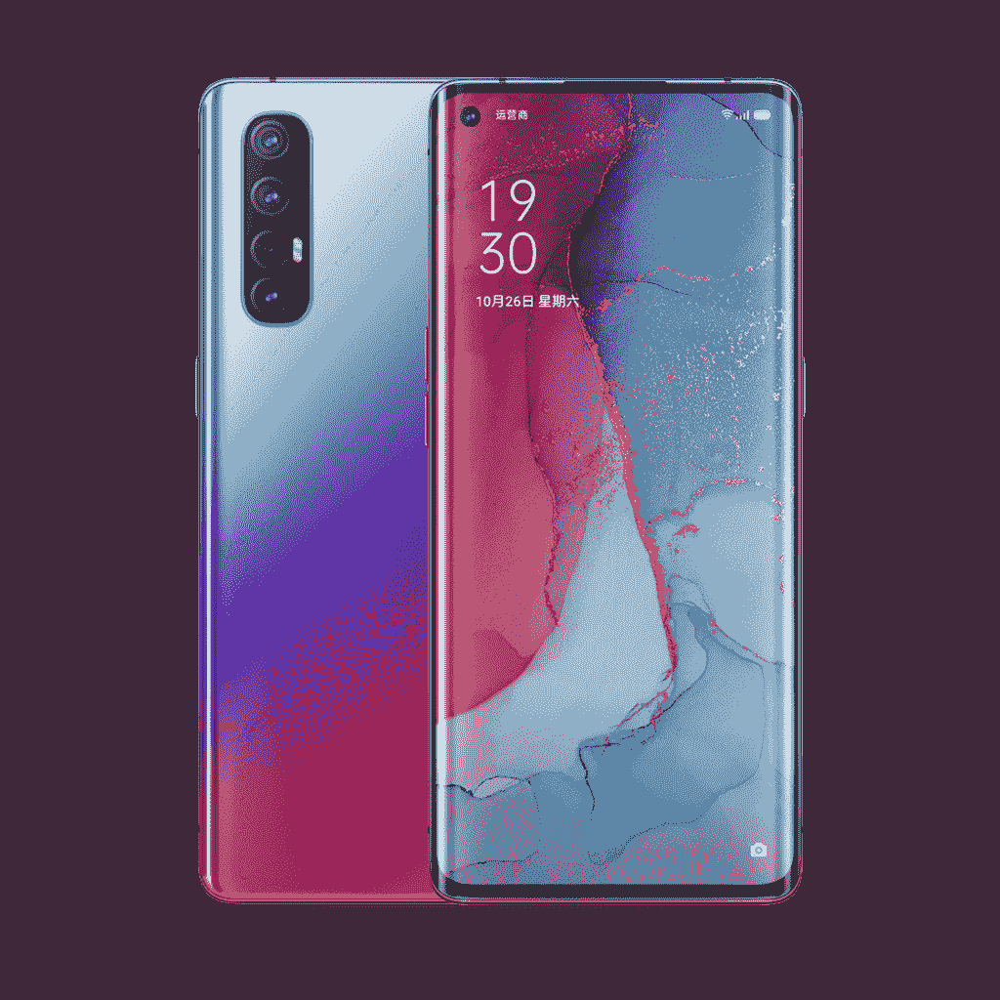

# OPPO Reno3 和 Reno3 Pro 在中国推出，支持 5G 连接

> 原文：<https://www.xda-developers.com/oppo-reno3-pro-5g-quad-rear-camera-china-launch/>

**更新(12/30/2019 @ 01:00 AM ET):** 在一份新的新闻稿中，OPPO 提到 Reno3 配备了索尼 IMX686 传感器，而 Reno3 Pro 配备了索尼 IMX586 传感器。这篇发表于 2019 年 12 月 26 日的文章被保存如下。

OPPO 希望在 2020 年不仅仅成为智能手机品牌[，但智能手机仍然是其愿景的中心点，与 5G 并列。未来肯定是 5G，OPPO 正在储备新的 5G 智能手机，如 OPPO Reno3 和 OPPO Reno3 Pro。OPPO Reno3 Pro 被戏称为](https://www.xda-developers.com/oppo-smartphone-brand-2020/)[世界上最薄的双模 5G 手机](https://www.xda-developers.com/oppo-reno3-pro-5g-teaser-shows-thinnest-dual-mode-5g-phone/)，内置[高通骁龙 765G](https://www.xda-developers.com/qualcomm-snapdragon-765-processor-specifications-features/) ，而 [OPPO Reno3 将由](https://www.xda-developers.com/oppo-reno3-mediatek-dimensity-1000l-soc/)[联发科天玑 1000L](https://www.xda-developers.com/mediatek-dimensity-1000-7nm-soc-integrated-5g/) 5G SoC 驱动。[两款手机的现场图片](https://www.xda-developers.com/leaked-live-images-show-oppo-reno3-reno-3-pro/)在发布前已经浮出水面，现在，两款手机已经在中国的一个活动上发布。

**OPPO Reno 3 XDA 论坛 **

## OPPO Reno3 和 OPPO Reno3 Pro:规格

| 

规格

 | 

OPPO Reno3

 | 

OPPO Reno3 Pro

 |
| --- | --- | --- |
| **尺寸和重量** | - | 

*   159.4 x 72.4 x 7.7mm 毫米
*   171g

 |
| **显示** | 

*   6.44 英寸 FHD+平板 AMOLED
*   康宁大猩猩玻璃 5
*   水滴凹口
*   显示屏内指纹传感器

 | 

*   6.5 英寸 FHD+弧形 AMOLED
*   90Hz 刷新率
*   康宁大猩猩玻璃 5
*   180Hz 触摸检测
*   100% DCI-P3 覆盖率
*   HDR 10+支持
*   打孔前置摄像头
*   显示屏内指纹传感器

 |
| **SoC** | 联发科天玑 1000L:

*   4x ARM Cortex-A77“大”内核@ 2.6GHz
*   4x ARM Cortex-A55“小”内核@ 2.0GHz

马里-77 国集团 | 高通骁龙 765 克:

*   1 个 Kryo 475(基于 ARM Cortex-A76)Prime core @ 2.4 GHz
*   1 个 Kryo 475(基于 ARM Cortex-A76)性能内核@ 2.2GHz
*   6 倍(基于 ARM Cortex-A55)效率内核@ 1.8GHz

肾上腺素 620 |
| **风筒&储存** |  | 

*   8GB + 128GB UFS 2.1
*   12GB + 256GB

 |
| **电池&充电** | 

*   4025 毫安时
*   30W VOOC 充电 4.0

 | 

*   4025 毫安时
*   30W VOOC 充电 4.0

 |
| **后置摄像头** | 

*   **主:** 64MP 索尼 IMX686，f/1.8
*   **次要:** 8MP，超广角
*   **三级:**单色
*   **四季:**人像

 | 

*   **主:** 48MP 索尼 IMX586，f/1.7，OIS PDAF，EIS
*   **辅助:**1300 万像素，长焦，f/2.4，2x
*   **第三:** 8MP，超广角，f/2.2，116 FoV
*   **四进制:** 2MP，单色，f/2.4

视频:

*   4K @30fps
*   1080p @60fps
*   1080p @120fps，720p @240fps

 |
| **前置摄像头** | 32MP | 32MP，f/2.4 |
| **其他功能** |  |  |
| **安卓版本** | 基于 Android 10 的 ColorOS 7 | 基于 Android 10 的 ColorOS 7 |
| **网络频段** | <information not="" provided=""></information> | 

*   2G:GSM 850/900/1800/1900 MHz
*   2G:CDMA BC0(800 MHz)
*   3G:CDMA 2000 BC0(800 MHz)
*   3G:WCDMA 频段 1/2/4/5/6/8/19
*   3G:TD-SCDMA 1900(f)/2000(a B7C/B1A+B3A/B3A+B41A/B8A+B41A

 |

OPPO Reno3 和 OPPO Reno3 Pro 都有几个设计特点，但两者之间最大的区别是常规 Reno3 上有一个平面显示屏，而 Pro 上有一个曲面显示屏。显示器对角线尺寸会因此而改变，但由于我们无法找到常规型号的尺寸细节，因此我们无法评论这些设备的尺寸是否有任何不同。第二个区别是前置摄像头 Pro 采用打孔摄像头，而普通型号采用水滴摄像头。在背面，没有明显的设计变化，但相机规格有所变化。

## OPPO Reno3

 <picture></picture> 

OPPO Reno3

OPPO Reno3 被定位为 Pro 的低级兄弟。不幸的是，OPPO 的 Reno3 产品页面无法找到，并且 [OPPO 的官方微博](https://www.weibo.com/oppo)也对几个细节保持沉默。

我们所知道的关于 OPPO Reno3 的事实是，它配备了联发科天玑 1000L SoC，这是一款来自联发科的 7 纳米高端 SoC，集成了 5G。你可以在我们的专门报道中读到更多关于[dimension 1000 的信息，尽管我们还无法找到 1000 和 1000L 之间的区别。船上有 30W 的 VOOC 充电 4.0，只需 20 分钟就能给手机充电 0-50%。](https://www.xda-developers.com/mediatek-dimensity-1000-7nm-soc-integrated-5g/)

Reno3 还配备了一个四后置摄像头，主要拍摄者是一个 64MP 传感器。OPPO 没有详细说明它采用了哪种传感器，但我们猜测它是~~三星 ISOCELL GW1 而不是~~T4 索尼 IMX686 。第二个摄像头是 8MP 超广角拍摄器，第三个是单色摄像头，第四个是辅助人像照片的专用摄像头。

### 定价和可用性

Oppo Reno3 在 CNY 的 8GB+128GB 版本价格为 3399 英镑(约 485 美元)，在 CNY 的 12GB/128GB 版本价格为 3699 英镑(约 530 美元)。

这款手机将提供日出印象、星空蓝、月光黑、雾白四种颜色，并将于 2019 年 12 月 31 日起在中国上市。

* * *

## OPPO Reno3 Pro

 <picture></picture> 

OPPO Reno3 Pro

顾名思义，Reno3 Pro 是老大哥，它显然得到了优惠待遇，这从弯曲的边缘显示屏以及 90Hz 的刷新率和 HDR 10+支持中可以看出。OPPO 还声称，这款设备是市场上最薄的双模 5G 手机，尽管它很薄，但仍能装入 4025 毫安时的电池。

OPPO Reno3 Pro 配备了高通骁龙 765G，这是高通首款集成 5G 的 SoC，与带有独特调制解调器的 SoC 相比，功耗更低。然而，骁龙 765 上的骁龙 X52 调制解调器在 5G 连接方面不如骁龙 865 上的骁龙 X55 调制解调器。尽管如此，你可以期待手机在流畅性和连接性方面有一些不错的表现。

Pro 上的相机设置不是很刺激，但还是很独特。你可以使用经过测试的 48MP 索尼 IMX586 作为主摄像头，13MP 长焦摄像头用于 2 倍变焦，8MP 超广角摄像头和 2MP 单色摄像头。

Reno3 Pro 还支持 30W VOOC 充电 4.0。

### 定价和可用性

Oppo Reno3 Pro 在 CNY 的 8GB+128GB 版本价格为 3999 英镑(约 570 美元)，在 CNY 的 12GB/256GB 版本价格为 4499 英镑(约 640 美元)。

基本存储版本将从 2019 年 12 月 31 日起在中国接受预购，而更高存储版本将从 2020 年 1 月 10 日起提供。

### 潘通 2020 特别版

还有一款 OPPO Reno3 Pro Pantone 2020 特别版，它使用了 2020 年的经典蓝色。Pantone 2020 特别版的整个包装和包装盒内容将为蓝色和白色。

这款 8GB + 128GB 特别版的价格将为 CNY 4199 英镑(约合 600 美元)。

* * *

## 更新:OPPO Reno3 自带 64MP 索尼 IMX686 传感器

在一份新的[新闻稿](https://www.oppo.com/en/about-us/press/oppo-reno3-series-officially-launched-a-new-era-unfolding-for-5g-video-smartphones/)中，OPPO 提到 Reno3 配备了 64MP 索尼 IMX686 传感器，而不是我们最初猜测的三星 ISOCELL GW1。再加上规格更好的联发科天玑 1000L SoC，Reno3 的几个关键规格都优于 Reno3 Pro。

* * *

**你对 OPPO Reno3 和 OPPO Reno3 Pro 有什么看法？请在下面的评论中告诉我们！**