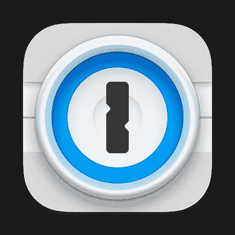

# 注册密码管理器之前，我希望有人告诉我的 6 件事

> 原文：<https://www.xda-developers.com/password-manager-beginner-guide/>

是的，我在这里面无表情地告诉你，我以前从来没有用过密码管理器。我又不是没考虑过报名参加。我不断被诱惑去尝试不同的选择，但我的一部分总是觉得把所有鸡蛋放在一个篮子里很痒，尤其是当数据泄露不断提醒我们这可能是一个坏主意的时候。我知道我在这条船上并不孤单，因为，好吧，旧习难改。我想，如果我记得我的密码或者把它们写在某个地方，我会“更安全”。但是随着网上账户越来越多，我终于开始努力为每个账户创建唯一且强有力的密码。因此，我的 2023 年技术决议是给密码管理人员一个机会，所以我们在这里。

选择一个好的密码管理器可能会很棘手，而且大量的选项并没有让它变得更容易。我在旅途中学到了不少东西，我希望这些建议也能帮助你。

## 寻找您想要的功能

大多数密码管理器不仅仅是在登录表单上填写密码。例如，Keeper 是一个超级功能丰富的密码管理器，它还可以存储您的信用卡信息，将文件和照片锁定在一个安全的保险库中，帮助您共享您的密码，等等。1Password 还附带许多附加功能，它可以执行额外的任务，例如从剪贴板中删除机密，并提醒您存在安全漏洞。

 <picture></picture> 

1Password

重要的是要明白你想从你的密码管理器中得到什么，除非你想走一条充满选项的永无止境的路。毕竟，如果你不打算用这些额外的东西，为它们支付额外费用是没有意义的。你的智能手机上可能已经有一个安全的文件夹来锁定重要的文件和照片，或者你不需要为黑暗网络监控和警报等新奇的东西付费。相反，寻找对你有用的功能。

以下是我推荐寻找的重要特性:

*   **跨平台支持**在任何设备或平台上访问和管理您保存的密码
*   **多重身份认证**保护您的密码库
*   **离线访问**确保您即使不在线也能保留密码
*   **浏览器扩展支持**确保无论您使用何种网络浏览器，都可以访问您的密码

例如，我在寻找一个密码管理器来帮助我避免在不同的帐户上重复使用相同的密码。我开始重复使用我的一些密码，从而为坏人闯入多个账户打开了大门。长话短说，我优先考虑一个简单安全的密码生成器，而不是一个具有花哨功能的，以避免花费超过我作为一个新客户想要的任何东西。不过，您的里程可能会有所不同。

## “零知识”加密很重要

大多数密码管理器还使用安全加密，如 AES 256 位和 XChaCha20，在密码离开您的设备之前锁定密码。因此，即使你使用密码管理器服务将你的密码保存在远程服务器上，试图窃取密码的黑客也可能无法立即获取。所有可靠的密码管理器都使用复杂的加密技术来保护你的保险箱，所以当你交出重要信息时，你不会被蒙在鼓里。

例如，Bitwarden 使用 AES-CBC 256 位加密来加密您的保险库数据，并使用 PBKDF2 SHA-256 来导出您的加密密钥。你所有的数据在发送到远程服务器之前都会被加密或散列，并且只能用从你的主密码中得到的密钥来解密。另一方面，NordPass 使用 XChaCha20，它比标准方法更快、更容易实现。

我建议只选择使用零知识加密解决方案的，这意味着它们无法读取或共享您的敏感信息。当然，没有办法在网上保持 100%的安全，但是如果你掌握了基本知识，这是有帮助的。

## 选择具有安全备份的密码管理器

选择密码管理器也很重要，它可以让你创建所有加密密码的备份，以防包含所有密码的远程服务器崩溃。一些密码管理器创建加密密码的备份，而另一些则允许您以人类可读的格式创建解密数据的备份。无论哪种方式，重要的是要创建一个备份，以防您最终由于一些服务器错误而无法访问您的保管库，并发现自己处于无法再在线访问您的帐户的情况。

看着最近的 LastPass 事故和它如何处理这种情况，我知道我永远不会在网上留下我的密码备份，即使它是加密的。你可以随时创建一个手动备份，并卸载所有密码的副本，但要确保安全地移动和存储它，以防止它落入坏人之手。

## 检查生物识别和其他登录方式

正如我前面提到的，多因素身份验证(MFA)是密码管理器中最重要的特性之一。您应该将强密码与双因素身份验证(2FA)甚至生物特征身份验证(如指纹或面部扫描)结合起来。生物特征保护通常作为一个附加层，因此您仍然需要使用您的主密码和任何已启用的两步登录。没有太多的安全层，尤其是当一个密码/钥匙就可以打开一个装满敏感数据的保险箱时。

同样值得注意的是，设置 MFA 或生物认证*并不是*主密码的替代方案。在通过其他层之后访问 vault 数据之前，您仍然需要主密钥来解密 vault 数据。从技术上讲，您只需为每台设备输入一次主密码，因为服务器上的 vault 数据会自动下载并存储在本地。这也让我想到了我的下一点——可能也是最重要的一点。

## 不要忘记您的主密码！

几乎所有的现代密码管理器都是零知识加密操作，所以它们无法读取或检索您的主密码。其中一些为你提供工具，以防你忘记密码，但你不能真正使用它们，除非你预先授权这些选项。这些选项包括:

*   **密码提示:**你的密码管理员会通过电子邮件向你发送密码提示(如果你有设置的话)。
*   **使用紧急联系人**访问:如果你的账户启用了紧急访问选项，你可以联系你的紧急联系人来重新访问你的金库。
*   管理员密码重置:拥有企业帐户的用户可以联系他们的管理员重置并重新获得对他们帐户的访问权限。

上述恢复选项只有在您事先授权的情况下才有效。一些密码管理器，如 Dashlane，也允许您使用生物认证来检索主密码，但即使这样，也只有在您忘记主密码之前启用了它才有效。

所有现代密码管理器都是零知识加密操作，所以它们无法读取或检索您的主密码。

如果这些选项都不能让你访问，那么你别无选择，只能删除你的帐户，并开始一个新的。这也意味着您将丢失储存在保管库中的项目，因此您必须重置每个帐户的登录信息。

## 初学者入门

在通读完所有内容后，我可能和你现在一样不知所措。如果你不习惯为你所有的账户设置密码管理器，那么为什么不开始为一些基本的或者临时的账户使用它呢？你知道，你可能创建了一些免费试用或阅读付费墙后面的文章。

我还建议在订阅高级服务之前，使用免费的密码管理器进行测试。作为密码管理领域的新手，我已经开始使用 Bitwarden 来熟悉低风险账户。Bitwarden 提供了所有的必需品，并且不会将任何重要的东西锁在付费墙下。它也是完全开源的，这意味着你可以在 GitHub 上审查、审计和贡献 Bitwarden 的代码。

我也感到平静，因为我知道我可以在我选择的平台上忽略 Bitwarden 的云存储和主机的整个基础设施堆栈。同样，这取决于您想要的功能，因此请务必寻找不同的选项，并选择您认为最适合您的用例的选项。一旦你知道来龙去脉，并准备好加入，你可以随时查看我们收集的最好的密码管理器。