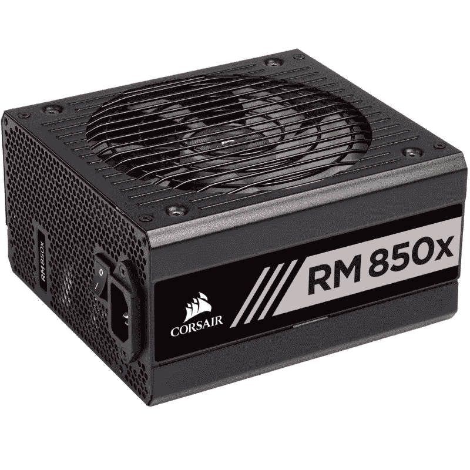
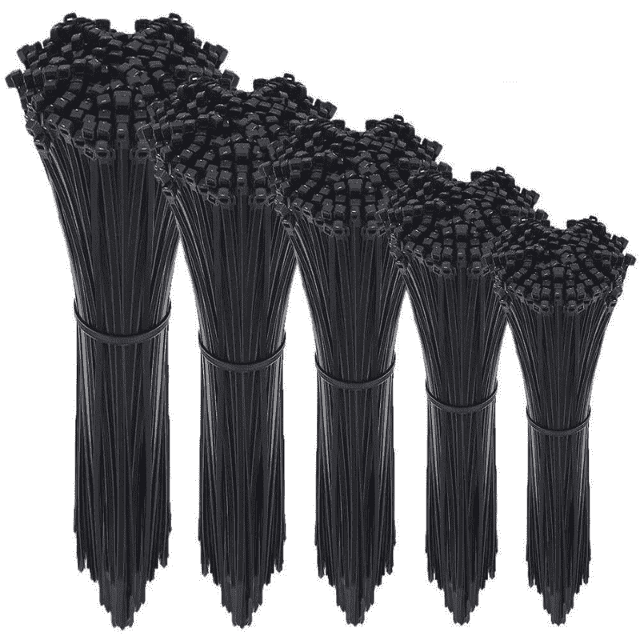
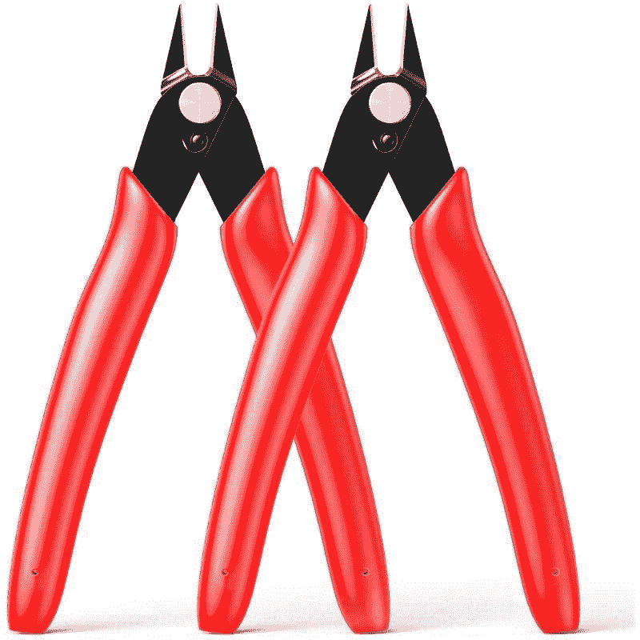
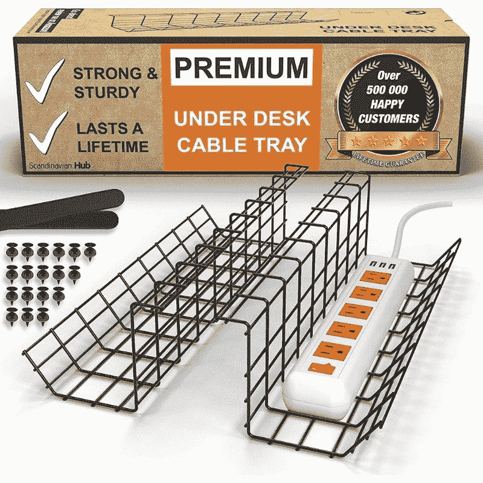
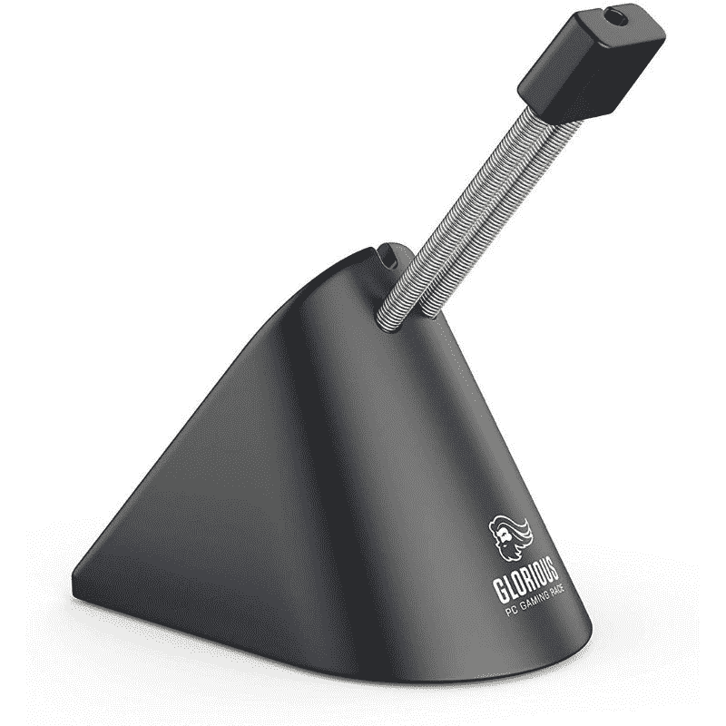

# 完美管理电脑线缆的逐步指南

> 原文：<https://www.xda-developers.com/pc-cable-management-guide/>

电脑内部和周围的电脑电缆管理是制造和维护电脑的重要组成部分。一个干净的电脑机箱或一个没有杂乱线缆的桌面会让整个系统看起来更好。虽然电缆管理是一个治疗过程，一旦完成后会让你对设置感觉良好，但它通常不像吸尘或简单地将东西放入内部那么容易。适当的线缆管理涉及很多方面，您需要一个适当的计划来解决线缆混乱的问题。

在这篇文章中，我将带你一步一步地完善电脑电缆管理指南。这不会对所有人都一样，但我会尽力解释我如何管理我的设置的电缆，你也可以这样做。下面是我当前设置的大致情况:

在一些建设性的批评之后，我对这个设置做了一些改变，但是电缆管理基本上保持不变。显然，你的设置会看起来完全不同，但你可以随时使用这些电缆管理技巧来改善它。我们的目标是找出什么能让你在使用你的设置做日常工作时感到舒服。

## PC 电缆管理技巧

线缆管理的整体理念是将所有线缆隐藏在视线之外。你可以把它们安全地藏起来，或者简单地把它们堆起来藏在桌子下面。每个人都有自己的想法，但想法是将它们安全地隐藏起来，这样电缆就不会被损坏。我们首先来看看机箱内部的 PC 电缆管理。

## 电脑机箱内的电缆管理

即使您没有带透明侧面板的电脑机箱，妥善管理机箱内的线缆也不失为一个好主意。这是 [PC 构建](https://www.xda-developers.com/how-to-build-a-computer-beginners/)过程不可或缺的一部分。总是有一个选项可以把你所有的电缆都塞到盒子里，但是这有一些问题。首先，电缆会阻碍机箱内部的正常气流。其次，将线缆塞在外壳内会让你在需要的时候极难找到合适的。想象一下，当您想在将来某个时候更换某个特定的组件时，必须穿过成堆的电缆？对我来说听起来像一场噩梦。

有几种方法可以解决这种情况。如果您仍处于规划新构建的早期阶段，那么我强烈建议您考虑在机箱内提供专用电缆布线通道的 PC 机箱。例如，所有 NZXT 电脑机箱都有一个电缆管理条。许多海盗船电脑案件来与适当的电缆通道和主板后面的所有电缆宽敞的空间。我的酷酷的主机箱 MB511 ARGB 没有，所以这里有一张照片的海盗船 5000D 个人电脑的情况下，我设法找到 Reddit 从一个同伴的电脑制造商。这幅图有点令人沮丧，但它是一个很好的例子，可以确切地说明我在说什么。

或者，您也可以购买双室设计的外壳，为潜在的电缆管理选项提供更多空间。连李 O11 动态将是一个很好的选择。您还可以查看我们收集的[最佳电脑案例](https://www.xda-developers.com/best-pc-cases/)，从中找到一些不错的选择。

##### 联立 PC-O11 动态

联立 PC-O11 Dynamic 可以说是目前市场上最好的 PC 机箱之一。

您可以购买扎带或拉链带，以便在机箱内妥善整理线缆。每种情况下的电缆数量和布线选项各不相同，因此这不是“一种解决方案适用于所有情况”的事情。总的想法是从你的风扇，后 IO，前面板连接器等收集所有的小电缆；把它们放在你的箱子后面。你可以把多余的长度绑起来，安全地塞在 PSU 盒里或主板后面。弄清楚把它们塞在哪里相当简单，因为几乎所有的电缆都有不显眼的口袋。

值得注意的是，您还应该考虑投资模块化电源，而不是非模块化电源。模块化电源设备将允许您只安装您需要的电缆。选择您可以插入的插件简化了流程，并为您节省了大量时间。您可以查看我们收集的[最佳电源设备](https://www.xda-developers.com/best-power-supply-pc/)，在市场上找到一些好的选择。这是我脑海中的一个链接:

 <picture></picture> 

Corsair RM850x PSU

##### Corsair RM850x

Corsair RM850x 是一款可靠的 PSU，适合那些希望构建新 PC 的人，无论是游戏机还是视频编辑工作站。这是一款完全模块化的 PSU，能效等级为 80 Plus。

如果您的电脑机箱没有合适的布线通道或任何电缆管理功能，那么您可以购买电缆扎带甚至电缆套管，将它们整合到一个通道中并隐藏起来。

 <picture></picture> 

Cable Zip Ties

##### NewMainOne 500 包电缆拉链带

电缆扎带对于电脑电缆管理至关重要。它们可以可靠地将电缆收集在一起，并安全地将它们从视线中移开。

此外，不要忘记剪断任何额外的电缆扎带长度。你可以用剪刀来做这个，但是钢丝钳会让你做起来超级简单。它也可以用来切断电缆扎带，以防你搞砸了一些布线。使用 velcro 胶带将风扇和 RGB 控制器贴在主板后面也是您可能要考虑的事情。Velcro 磁带适合那些喜欢不停移动东西而不是永久固定东西的人。

 <picture></picture> 

Cable/wire cutter

##### 博恩富微型平齐钢丝钳

在组装电脑时，电缆/电线切割器是一个很重要的工具。这将有助于切断额外的电线，或者在你弄乱东西的情况下摆脱拉链。

也就是说，我建议在组装电脑后花大量时间来确保机箱内的所有电缆都得到妥善管理。

## 针对您的设置的 PC 电缆管理

管理电脑机箱外杂乱的线缆同样重要，甚至更重要。拥有一张没有不必要的杂物的干净的桌子可以让你有一个良好的精神空间来提高效率——无论是办公室工作还是一场精彩的游戏。我个人认为，在电脑机箱外管理线缆比在机箱内更困难。也就是说，所有相同的建议在这里也适用。你的主要目标是收集所有的电缆，将它们安全地放在盖子后面。

电缆的杂乱程度完全取决于您正在使用的外围设备的数量。我建议使用电缆扎带制作一捆您可能不需要的电缆。这包括[显示器](https://www.xda-developers.com/best-monitors/)和系统的电源线、HDMI 和 DisplayPort 电缆、以太网电缆、[网络摄像头](https://www.xda-developers.com/best-webcams/)电缆等等。您也可以使用电缆套管隐藏一束在户外敷设的电缆。使用电缆套管的最大好处是，你可以根据特定通道的长度来切断它们，并使用剩余部分来隐藏更多电缆。正如你所看到的，我使用了许多电缆套管来隐藏从我的显示器、电脑机箱等后面露出来的大量电缆。

与有线外设相比，使用无线外设显然是一种节省大量工作的方法。或者，如果你不想走无线路线，你也可以用定制的电缆代替普通电缆，增加一点个性化。我个人使用有线外设，包括有线键盘、游戏鼠标和有线耳机。我在我的设置中使用了黑色桌布，它很好地融合了这些外围设备的所有黑色电缆。更不用说，黑色表面上的白色外设看起来令人难以置信。

你可以把这些电缆放在桌子下面，让它们远离你的视线。许多游戏桌和办公桌现在都配有电缆管理架，你可以把它们塞到桌子下面。你也可以从亚马逊购买一个，在你现有的桌子上使用。

 <picture></picture> 

Cable management rack

##### 斯堪的纳维亚集线器桌下电缆管理托盘

电缆管理架非常适合放置额外的电缆，甚至是电源板。

或者，你也可以买一个线缆管理盒来隐藏所有线缆。这些盒子可以放在桌子上，也可以放在地板上。这也可以保护你的电源板和电缆免受你毛茸茸的朋友的伤害。

 <picture></picture> 

Cable management box

##### YaeCCC 电缆管理组织者

线缆管理盒非常适合隐藏线缆，甚至电源板。这是一种安全的方法来隐藏它们，并使它们免受宠物的伤害。

你也可以用 velcro 袖将线缆系在桌下。这也是一个很好的方法，不要把你的 USB 接口和电源板留在地板上无人看管。我个人并不使用，但我在 Reddit 上找到的一张图片完美地展示了我所说的内容:

不过，最好将鼠标线和键盘线分开。不建议将它们系紧或掖好，因为它们会限制活动。相反，我建议你购买定制电缆，骄傲地放在你的桌子上，而不是藏起来。

对于有线游戏鼠标，你可以买一个鼠标蹦极来防止它被缠住。这是我在亚马逊上找到的一个好例子:

 <picture></picture> 

Glorious Gaming Mouse Bungee

##### 光荣游戏老鼠蹦极

鼠标蹦极是一个方便的配件，为您的设置。它有助于您妥善管理鼠标电缆，防止其缠绕在一起。

我使用的另一个简单的方法是在装饰后面隐藏一些电缆。我把 UPS 的电源线藏在了我从亚马逊上买的假宜家植物后面。您可以使用任何装饰，甚至是电脑机箱本身，隐藏一些不需要的线缆。目标是让他们远离视线，记得吗？整齐地铺设每根电缆，确保一路上不会产生任何缠结。

正确布线还可以让您记住每根电缆的位置。作为一个长期从事个人电脑开发的人，我可以告诉你它有多重要。良好的电缆管理不会神奇地提高你的电脑性能。然而，它会让你安心地知道你所有的电缆都安全地插好了。

我很想听听你们每一个阅读这篇关于管理电缆的文章的人的意见。正如我前面提到的，根据设置和所涉及的组件，电缆管理会有所不同，所以我很想看看您的设置是什么样的。我也鼓励你分享我可能错过的任何其他技巧。您也可以加入我们的 [XDA 计算论坛](https://forum.xda-developers.com/c/xda-computing.12289/)，与其他 PC 制造商进行讨论，并从他们那里获得建议。