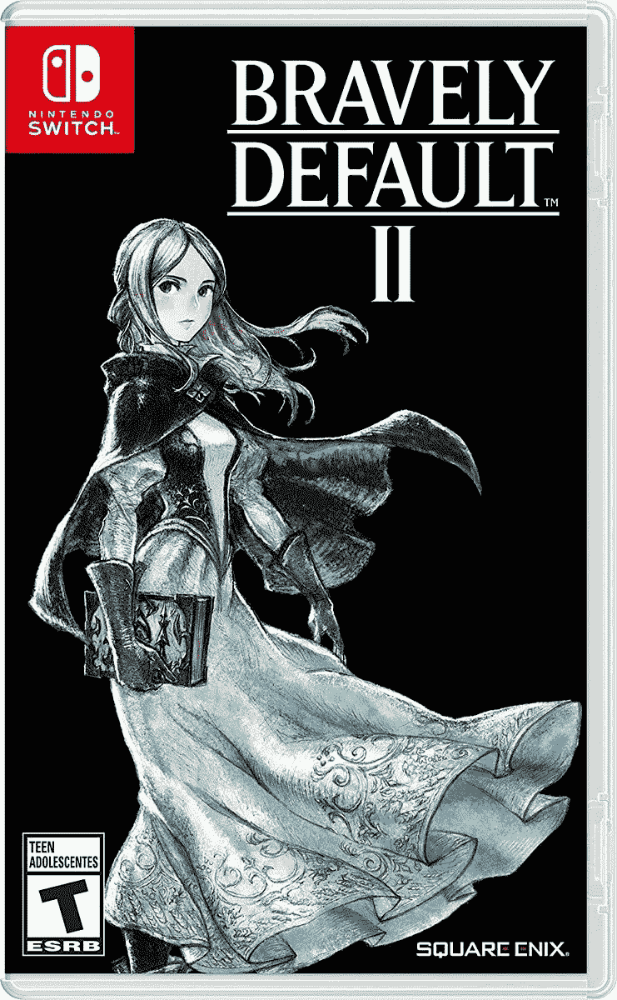
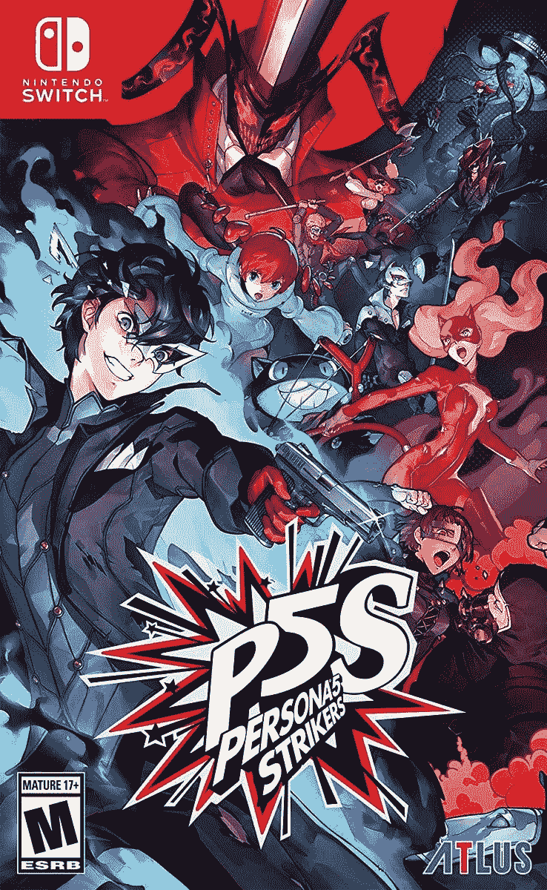

# 角色 5 前锋和勇敢的违约 2 现在为任天堂 Switch 出售

> 原文：<https://www.xda-developers.com/persona-5-strikers-and-bravely-default-2-for-nintendo-switch-are-on-sale-right-now/>

# 任天堂 Switch 的角色 5 前锋和勇敢的内定 2 现在正在出售

两款优秀的任天堂 Switch 动作冒险游戏《假面 5 前锋》和《勇敢违约 2》现在在亚马逊打折。

我们可能仍然在等待传说中的“任天堂 Switch 专业版”硬件升级，但现有的交换机仍然是这一代最好的游戏的家园。人物角色 5 前锋和*勇敢默认 2* 都是任何人的游戏库的优秀补充，现在你可以以折扣价获得任天堂 Switch 版本。*角色 5 射手*已降至 37.60 美元(优惠 22.39 美元)，而*勇敢默认 2* 现以 29.99 美元(优惠 30 美元)发售。

*勇敢默认 2* (通常拼写为勇敢默认 II)于 2 月发布，作为 3DS 上*勇敢默认*和*勇敢第二:结束层*的后续。不过这个游戏有自己独立的故事和演员阵容，不需要玩之前的参赛作品就能了解一切。*勇敢默认 2* 设定在激基朗大陆，四个主角试图取回从其中一个主角那里偷来的水晶。该游戏在 Metacritic 上的平均评分为 [76/100。](https://www.metacritic.com/game/switch/bravely-default-ii)

 <picture></picture> 

Bravely Default 2

##### 勇敢默认 2

这是 Switch 上最好的 JRPGs 之一，设定在虚拟的激基剂世界。只出售实体版本，不出售数字代码。

 <picture></picture> 

Persona 5 Strikers

##### 角色 5 罢工者

这个角色扮演/动作 RPG 是 Persona 和王朝勇士系列的交叉，非常有趣。

《假面 5 射手》一年前发布，但这是我们见过的最低价格之一。这是《王朝战士》系列和《人物角色 5》的交叉，小丑(不是 DC 漫画的小丑，另一个)和幽灵偷心者调查发生在日本的神秘事件。这种型号的交换机在 Metacritic 上有一个 [80/100。](https://www.metacritic.com/game/switch/persona-5-strikers)