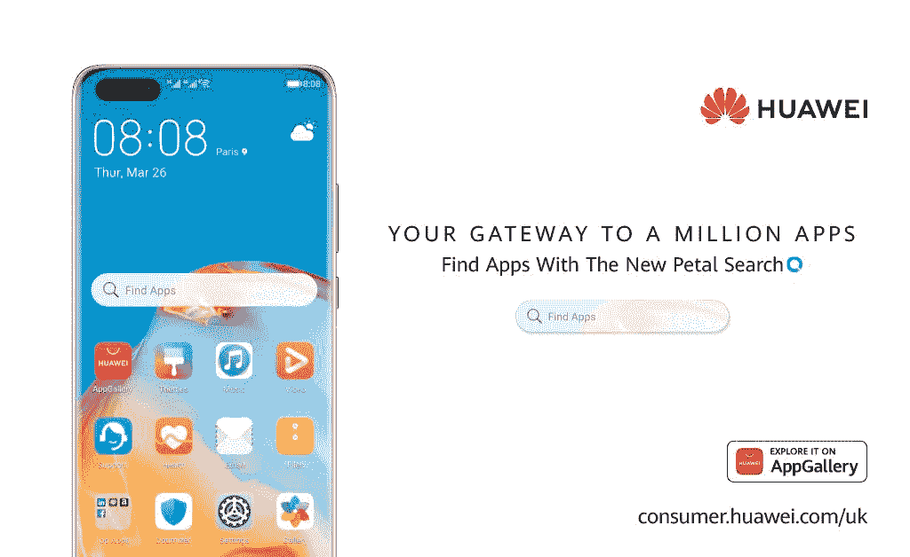
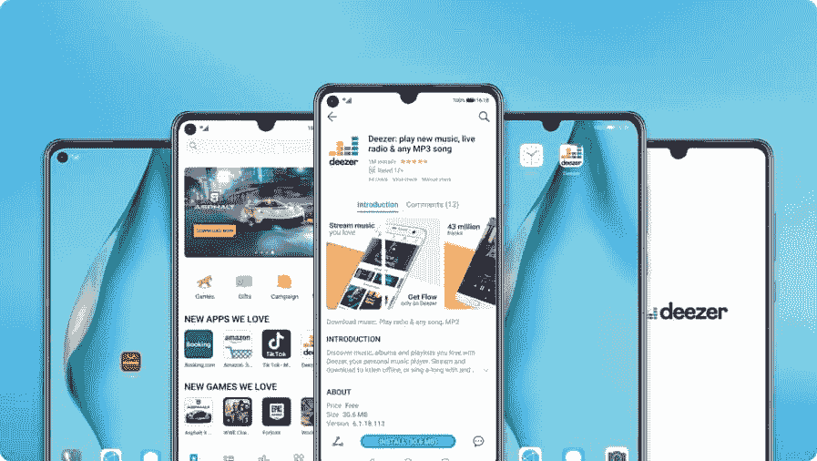

# 花瓣搜索帮助您在华为智能手机上查找和下载应用程序

> 原文：<https://www.xda-developers.com/petal-search-download-apps-huawei-honor-smartphones-hms/>

**更新 1 (07/06/2020 @ 05:52 AM ET):** 华为花瓣搜索最新更新增加了 APKMirror 作为源选项，并增加了安装拆分 apk 的功能。滚动到底部了解更多信息。下面保留了 2020 年 7 月 2 日发表的文章。

自从[美国总统唐纳德·特朗普签署行政命令](https://www.xda-developers.com/google-revoke-huawei-android-ban-blacklist/)限制美国公司向华为提供产品和服务以来，中国智能手机品牌的道路一直很艰难。该行政命令最具破坏性的后果是，华为不能再推出带有 Google Play 服务的新智能手机和平板电脑，进而也不能推出谷歌 Play 商店。自 2019 年 5 月以来，华为一直致力于说服开发者和用户关于其基于 Android 的替代软件生态系统。这个难题的一些部分包括[至关重要的 HMS 核心](https://www.xda-developers.com/huawei-hms-core-android-alternative-google-play-services-gms/)和[华为应用程序库](https://www.xda-developers.com/appgallery-huawei-alternative-google-play-store-android/)，它们分别是 Google Play 服务和谷歌 Play 商店的替代品。但华为知道仍有改进的余地，特别是在减少客户试图寻找和下载他们熟悉的应用程序时的摩擦方面。我们每天都听到新的应用程序和服务被添加到 AppGallery，但仍有许多应用程序(如 WhatsApp)尚未在商店中提供。这就是花瓣搜索的用武之地。这是一个搜索引擎，也是华为最新的应用解决方案，旨在增强华为 AppGallery 的应用分发和发现。

 <picture></picture> 

Petal Search Banner. Source: Huawei.

## 花瓣搜索为什么会存在？

为了理解华为为什么要做花瓣搜索，我们先退几步，了解一下该公司到底想解决什么问题。

特朗普总统去年签署的行政命令导致美国公司被禁止向华为出售某些商品和服务。因此，谷歌无法与华为达成任何新的移动应用程序分发协议，阻止这家中国公司在新的移动设备上分发谷歌移动服务(GMS)，这是一套专有的谷歌应用程序。这些专有的谷歌应用程序包括流行的服务，如 YouTube、谷歌搜索、谷歌浏览器，更重要的是，谷歌 Play 商店和 Google Play 服务。

### AppGallery -华为 Play Store 替代方案

鉴于谷歌对安卓应用分发的垄断，缺乏谷歌 Play 商店意味着普通用户失去了最大的应用来源。如果没有 Play Store，用户要么不得不在有围墙的花园里凑合，要么不得不求助于各种不同的应用程序来源来下载应用程序。没有品牌不可知的“下一个领导者”可以替代 Play Store，因此这些选择在质量和信任度方面有很大差异。华为对其新设备没有谷歌 Play 商店的回应是以华为应用程序库的形式出现的。AppGallery 已经获得了开发者、用户和机构的大量关注——华为告诉我们，他们已经签约了土耳其的 15 家主要银行，并提供了多个流行的应用程序，如 AccuWeather、BBC News、Booking.com、抖音、Viber、[和更多的](https://consumer.huawei.com/uk/community/details/Explore-AppGallery-to-find-all-your-Apps/topicId_21934/)——但 app store 仍有一点点增长，以赶上 Play Store 在一些地区的覆盖范围。

 <picture></picture> 

Huawei's AppGallery app store. Source: Huawei

### HMS 核心-华为的 Play 服务替代方案

Google Play 服务提供了一系列开发者 API，被 Google Play 上的应用广泛使用。因此，即使有人从 Google Play 之外找到并下载了一款应用，也不能保证它能完美运行。一些应用程序可能完全拒绝打开，而其他应用程序只会失去推送通知等辅助功能。华为对谷歌 Play 服务缺席的回应是[华为移动服务(HMS)](https://www.xda-developers.com/huawei-hms-core-android-alternative-google-play-services-gms/) 。值得称赞的是，早在贸易禁令生效之前，华为就一直在研发 HMS。贸易禁令只是提高了华为替代解决方案的重要性，迫使华为提升 HMS 与 GMS 的竞争力。我们之前已经更详细地探索了 HMS 核心，并且[我们建议查看一下](https://www.xda-developers.com/huawei-hms-core-android-alternative-google-play-services-gms/)。

### 弥合应用差距

不管有没有谷歌，华为都在全力以赴开发安卓系统。为此，HMS Core 和 AppGallery 的组合是该公司投入大量开发精力的地方。中国原始设备制造商已经在这些解决方案上工作了几年，随着每一次迭代，它们变得更加健壮。这些解决方案应该提供公司未来发展所需的覆盖范围。

然而，尽管如此，当涉及到用户的需求时，仍然存在差距。许多流行的应用程序仍然无法在 AppGallery 上使用，包括像 WhatsApp 这样非常流行的应用程序。这种情况的独特之处在于，这些应用可能不一定需要 Google Play 服务来提供其主要功能。因此，理论上，它们可以被加载到华为和荣誉智能手机上，而不会在核心功能上出现任何问题。但是，这些信息并不是常识，华为已经看到这种知识差距阻碍了它的发展。

虽然该公司坚定地认为未来属于自己的服务生态系统，但它仍然需要一个能够协调当前需求和未来愿景的桥接解决方案。理想情况下，热门应用应该由开发者自己托管在 AppGallery 上，但这是一个过程，而不是一夜之间的解决方案。另一方面，用户的需求是即时的，他们不能无限期地等待一个应用程序出现在官方 AppGallery 商店中。

一些用户已经求助于安装来自其他来源的应用程序作为替代，其中一些列举如下:

*   [**手机克隆**](https://play.google.com/store/apps/details?id=com.hicloud.android.clone)——这款华为制造的应用程序备份你旧手机中的数据，包括大多数已安装应用程序的 APK 文件，并将它们传输到你的新设备上。这仅适用于将现有应用从一台设备转移到另一台设备。
*   [**亚马逊 app store**](https://www.amazon.com/gp/mas/get/amazonapp?tag=xda-8qsnmge-20&ascsubtag=UUxdaUeUpU28885&asc_refurl=https%3A%2F%2Fwww.xda-developers.com%2Fpetal-search-download-apps-huawei-honor-smartphones-hms%2F&asc_campaign=Short-Term)——这是亚马逊历史悠久的应用商店。它有一些有用的应用程序，但在覆盖流行应用程序方面，它仍然需要赶上 Play Store。
*   **第三方 APK 网站**:如 [APKMirror](http://apkmirror.com/) 、 [Aptoide](https://www.aptoide.com/) 、 [APKMonk](https://www.apkmonk.com/) 和 [APKPure](https://apkpure.com/) 等网站都属于这一大类，因为它们托管了大量 Android APKs。然而，这些应用程序是由用户上传的，而不是由开发者自己上传的。有些应用，比如 APKMirror，手动批准每一次提交，并将应用的签名与上传到 Google Play 的同一应用进行匹配，从而提高提交的质量——这可能不是其他商店的标准。
*   [**F-Droid**](https://f-droid.org/):F-Droid 托管开源 Android 应用，使其成为一个受欢迎的替代品。然而，并不是很多开发者首先喜欢他们的应用程序是开源的，所以它的覆盖面非常窄。

但正如我们所看到的，用户需要在各种解决方案的迷宫中导航，以偶然找到一个可信和可靠的来源来下载应用程序。[华为自己的网站提到了 4 种不同的方法](https://consumer.huawei.com/uk/campaign/favourite-apps/)你可以在他们的设备上获得应用程序，他们列出的第三种方法是花瓣搜索。华为的口号是“你通向一百万个应用的门户”，它将花瓣搜索作为一种“新的搜索工具”，让用户“找到他们需要的一切”。但实际上，这款应用本质上是安卓应用的搜索引擎。

## 花瓣搜索-安卓应用的搜索引擎

华为和 Honor 智能手机用户目前的情况是，他们在 Play Store 之外的各种应用商店解决方案中搜寻自己喜欢的应用，然后将它们下载到手机上。华为知道这一点——事实上， [Honor India 的 Twitter 账户定期教育用户](https://twitter.com/HiHonorIndia/status/1273174041696796674)在哪里可以下载 WhatsApp，因为该应用尚未在 AppGallery 上正式发布。即使你无法访问谷歌 Play 商店，这款流行的消息应用也可以侧装，但许多用户并不知道该应用在 Play Store 之外的官方发行。

同样，即使你的手机没有安装 Google Play 服务，大多数 Android 应用程序也能正常运行。虽然有些应用程序会拒绝运行，但这些应用程序实际上很少，正如 XDA 主编米沙·拉赫曼从他在华为 P40 Pro 上的体验中指出的那样。然而，常见的是，应用程序中的某些功能将无法工作。许多像 Discord 和 Slack 这样的应用程序都利用谷歌的 Firebase 云消息来实现推送通知，因此这些通知将不起作用。同样，利用 Google Drive 的应用程序也不会工作，所以你无法在 WhatsApp 中恢复存储在 Drive 中的消息，也无法在 KeePass2Android 中打开存储在 Drive 中的 KeePass 数据库。一些像 ProtonMail 和 Reddit 这样的应用程序很有趣，甚至有礼貌地告诉你他们的推送通知不起作用，尽管并不总是这样。令人惊讶的是，Google Nest 似乎在没有 Play 服务的情况下也能正常工作，尽管它抱怨缺乏 Play 服务。然而，Pushbullet 和 Lyft 一推出就崩溃了。

这些烦恼中的一些会成为一些用户的绊脚石，但是对于大多数用户来说，他们应该能够*过得很好*。然而，问题是要有一种便捷的方式来下载应用程序。

这就是花瓣搜索的用武之地。

花瓣搜索是华为制作的一款应用，作为不熟悉替代应用分发解决方案的用户的权宜之计，直到 AppGallery 可以成为华为智能手机上应用的主要分发商。花瓣搜索可以被最好地描述为一个应用分发聚合器或一个专注于寻找 Android 应用的搜索引擎。事实上，华为[甚至在欧洲为花瓣搜索申请了商标](https://euipo.europa.eu/eSearch/#details/trademarks/018238698)作为搜索引擎。花瓣搜索的体验围绕着一个搜索小工具，用户可以在主屏幕上点击，打开搜索栏，在线查找应用程序和游戏。应用程序中的“为你”标签向你显示当地新闻，尽管花瓣搜索的主要目的不是显示新闻或在线寻找答案——它只是找到并下载 Android 应用程序和游戏。如果你对这个名字有疑问，[在华为内部的“华”大致翻译成花瓣](https://consumer.huawei.com/uk/community/details/%5BHMS-Android%5D-Search-for-apps-the-new-way-with-Huawei-app-Petal-Search/topicId_29113/)，因此得名花瓣搜索。

在最近的 EMUI 更新中，花瓣搜索正在向华为智能手机推出。大多数西欧国家的华为智能手机用户，包括英国、法国、德国、西班牙、意大利、比利时、荷兰、爱尔兰、葡萄牙和瑞士，将在未来的更新中获得该应用。例如，华为 P40 系列获得了花瓣搜索[，作为 EMUI 10.1.0.131 更新](https://www.xda-developers.com/emui-10-1-0-131-update-huawei-p40-adds-petal-search-picture-in-picture-frame-zoom-past-15x/)的一部分，新购买的华为 P40 系列设备将预装该应用。

或者，用户也可以[立即从 AppGallery 安装花瓣搜索，而不是等待应用程序在 OTA 更新中推出。该应用程序甚至可以安装在非华为智能手机上，尽管你必须手动侧装](https://appgallery5.huawei.com/#/app/C100995735)[华为移动服务](https://www.apkmirror.com/apk/huawei-internet-services/huawei-mobile-services/)才能让它工作。

**设置、隐私和权限**

当你第一次打开花瓣搜索时，你会看到几个设置屏幕，通知你应用程序的隐私政策和权限使用。如果您已经使用您的华为帐户登录，那么您将被告知该应用程序可以收集一些使用信息，包括您的帐户信息(包括相关的华为帐户详细信息)、设备信息(包括屏幕大小和时区)、网络信息(包括您的 IP 地址)和服务使用信息(包括广告点击、搜索查询、搜索关键字、搜索语言和点击的 URL)。)所有的数据都被发送到华为在爱尔兰的子公司 Aspiegel Limited，这意味着这些数据收集受到欧盟严格的 [GDPR](https://www.xda-developers.com/what-is-gdpr-developers-users-eu/) 的管制。华为表示，收集这些数据是为了“*向您提供搜索建议、广告和个性化新闻...以及用于产品信息和分析的目的*该政策披露，这款应用的搜索数据与“新闻合作伙伴”共享，其中可能包括华为合作开发花瓣搜索的两家欧洲搜索引擎(稍后会有更多信息。)华为声称，搜索查询数据永远不会与个人联系或关联，这表明它甚至不会同步到你的账户。事实上，当我们注销然后重新登录我们的华为 ID 时，我们的搜索历史记录就不见了。

但花瓣搜索不会强迫你登录华为账户来搜索应用。如果没有华为账户，你将无法同步你添加到收藏夹的任何页面。花瓣搜索可以要求的许多权限也是可选的。你必须授予的唯一权限是“存储”权限，这是为了让应用程序可以将下载保存到你手机的内部存储。花瓣搜索会在默认的图片、音乐、电影和下载文件夹中创建一个名为“Petal Search”的新文件夹，用于存储下载的文件，因此该应用不会导致存储混乱。应用程序请求的其他权限如下面的截图所示，以及华为对花瓣搜索可能请求这些权限的解释。这些权限中的大部分仅用于花瓣搜索可以从您的日历、电子邮件、消息、记事本等中显示相关条目。当您执行搜索时，但这不是应用程序的主要功能所必需的，可以在应用程序的设置中禁用。

**花瓣搜索手把手**

一旦你安装了花瓣搜索，你要做的第一件事就是查看“搜索”标签。这是您在华为设备上查找和下载 Android 应用程序的地方。如果你没有输入搜索查询，那么花瓣搜索会默认显示一组来自 3 个不同类别的应用:“基本应用”、“热门本地应用”和“趋势应用”显示在这 3 个类别中的应用程序是从您所在地区的流行应用程序列表中编译而来的，可以在应用程序的设置中进行更改。例如，当您的地区设置为英国时，会出现 Zoom、抖音、星巴克、亚马逊、Snapchat、Spotify 等应用程序，如下图所示。

在花瓣搜索的设置中，你可以通过点击“我”标签来访问，你可以查看你的搜索历史，切换匿名模式(这将禁用搜索历史)，查看你下载的应用程序(以及你的文件保存在哪里)，更改你的搜索语言和地区，选择你的安全搜索级别，以及切换应用程序的搜索范围。对于搜索语言和地区，您可以从超过 40 种语言和超过 45 个国家中进行选择。对于安全搜索功能，您可以调整安全搜索过滤级别，以隐藏不合适的应用程序，使其不会出现在搜索中。最后，对于搜索范围，您可以调整范围以限制在您的设备上搜索的内容。

当你准备好找到要下载的应用程序时，只需在“搜索”标签的搜索栏中输入查询即可。为了查找和下载应用程序或游戏，花瓣搜索利用以下来源获得应用程序搜索结果:

*   华为应用程序库
*   Aptoide
*   阿克蒙克
*   APKPure
*   APKCenter
*   向上向下

花瓣搜索优先显示来自华为 AppGallery 的匹配应用列表，前提是与您搜索的内容完全匹配。AppGallery 列表显著显示在结果顶部，应用图标上方有一个“AppGallery”徽章，还有一个“已验证”徽章，表明华为已经验证了该列表的合法性。接下来，如果某个特定的应用程序可以从开发者的官方网站下载，那么花瓣搜索可能会链接到该页面。例如，搜索 WhatsApp 的第一个结果会显示一个链接，指向 Android 的[官方下载页面。至于来自其他在线应用程序库的搜索结果，它们将根据与其查询的相关性、商店的权威性(基于华为的内部指标)、页面的及时性以及其他未披露的因素进行排序。总的来说，似乎 APKPure 和 Aptoide 的搜索结果排名都在 APKMonk 和 APKCenter 之上。在一些罕见的情况下，会显示谷歌 Play 商店链接，尽管这似乎只发生在更不知名的应用程序上，这些应用程序无法从上述任何应用程序商店下载。](https://www.whatsapp.com/android/)

有一些应用程序和服务更适合通过网络浏览器而不是移动应用程序访问(主要是因为它们拒绝在没有 Google Play 服务的情况下运行)，包括 YouTube、Google Photos、Google Calendar、Google Keep、Gmail、Google Drive 等应用程序。对于这些已知的情况，花瓣搜索会提供一个链接，让您在默认浏览器中打开该应用程序的移动网站。即使像优步这样的服务在 AppGallery 中有一个经过验证的应用程序，花瓣搜索仍然显示一个额外的选项来访问移动网站。这里的想法是，在一个解决方案不完全令人满意的情况下，通知用户他们手边的备选方案。

*花瓣搜索中的热门应用列表*

*花瓣搜索热门游戏列表*

如果你注意到，该应用程序还可能通过在应用程序图标上附加一个小的 QuickApps 徽标来通知用户存在 [QuickApps](https://www.xda-developers.com/huawei-quick-apps-alternative-google-instant-apps/) (PWAs)。一些应用程序列表还可能显示“可能不可用”标记(例如 Lyft 和 Newton Mail 应用程序)，这种措辞有点令人困惑，因为它实际上意味着该应用程序可能无法与 HMS Core 一起正常工作。

当你点击任何搜索结果页面上的“安装”按钮时，你要么被带到应用程序的下载页面，要么立即开始下载应用程序。华为似乎已经利用了许多在线应用商店的 API，以跳过许多在线应用商店扔给你的下载等待期，这很好。如果你想了解更多关于这款应用的信息，或者看一些截图，你可以点击搜索结果中“安装”按钮之外的任何地方，打开这款应用的产品页面。

花瓣搜索在有限的应用内浏览器中显示应用的产品页面。您可以选择后退或前进，通过点击花瓣搜索图标“回家”到“为您”标签，共享页面，或从菜单按钮访问一些额外的选项。

正如我们之前提到的，花瓣搜索中的搜索结果是按相关性排序的，但结果也会因位置而异(这就是为什么该应用程序在搜索时会要求您访问位置)。华为在开发花瓣搜索时已经与欧洲搜索引擎 Qwant 和 Yandex 合作。Qwant 在德国、法国、意大利、瑞士和比利时提供搜索结果，而 Yandex 在俄罗斯提供搜索结果。对于西班牙和爱尔兰，华为自己的搜索引擎提供覆盖。因此，在某些地区，搜索结果会考虑当地相关的应用程序体验，因此，例如，你在比利时看到的将与你在西班牙看到的不同。

## 结束语

花瓣搜索去掉了对普通用户来说意义重大的一步；他们不再被迫浏览多个来源来找到一个应用程序。相反，他们有一个易于使用的“一站式”应用解决方案聚合器。

当我们测试应用程序并为本文进行研究时，令我们惊讶的是华为对这种权宜解决方案的必要性的自我意识以及他们吸收反馈的能力。鉴于我们在替代应用分发方法方面的经验，我们尝试的应用初始版本不符合我们的标准，因此我们与华为分享了一些反馈。华为实际上设法解决了这些问题，表现出考虑反馈并努力改进应用程序的倾向。

例如，花瓣搜索的第一个版本无法检查已安装应用程序的更新，也无法知道应用程序安装失败的原因，以及事后反馈，华为实现了这两个功能。此外，某些应用描述的文本呈现问题、APKMonk 的畸形应用下载以及某些列表的应用图标/评级不准确也存在问题，华为也很快解决了这些问题。

不过，花瓣搜索仍有一些可以改进的地方。例如，该应用目前不处理安装 split APKs 或 APK 捆绑文件，所以你需要使用 [Split Apps Installer](https://github.com/Aefyr/SAI) 应用来安装一些应用。奇怪的是，花瓣搜索也没有显示由我们在*和*的朋友运行的 APKMirror 的结果。考虑到 APKMirror 在网站中积累的受欢迎程度和信任度，这是一个奇怪的遗漏，但我们被告知 apk mirror 实际上已经被花瓣搜索抓取，并且根据我们随后的推荐，该网站的结果将开始排名更高。另一个我们希望添加到花瓣搜索的应用程序来源是 F-Droid，我们被告知华为正在研究它。最后，我们希望看到华为解决的一个大问题是盗版:由于用户上传的内容结构，这些在线应用商店中有许多盗版应用。华为不对上传到这些网站的内容负责，但我们对花瓣搜索如何帮助找到这些应用有一些疑虑。

无论如何，我们可以为花瓣搜索付出的努力鼓掌。华为已经认识到用户的一个重大摩擦领域(应用可用性)，然后试图提供一个解决方案，同时他们继续努力改善 AppGallery。App 可用性是短时间内无法修复的问题；毕竟，谷歌 Play 商店的流行是其在 Android 平台上统治了十多年的结果，罗马不是一天建成的。要在应用市场站稳脚跟，需要坚持不懈的努力，华为正在表明，它打算继续投资于其生态系统。

* * *

## 更新:华为花瓣搜索获得 APKMirror 作为源和支持分裂 APK 安装

根据我们的建议，华为已经更新了花瓣搜索，以引入关键功能。首先，花瓣搜索 v10.1.2.301 现在可以无缝安装分裂的 apk。此外，它还开始将 APKMirror 作为一个更优先的来源。这种优先排序目前并不适用于所有应用程序，但我们认为随着更多用户选择 APKMirror 作为源，这种情况将会改变。

很高兴看到华为继续改善应用程序及其功能，特别是后期反馈。