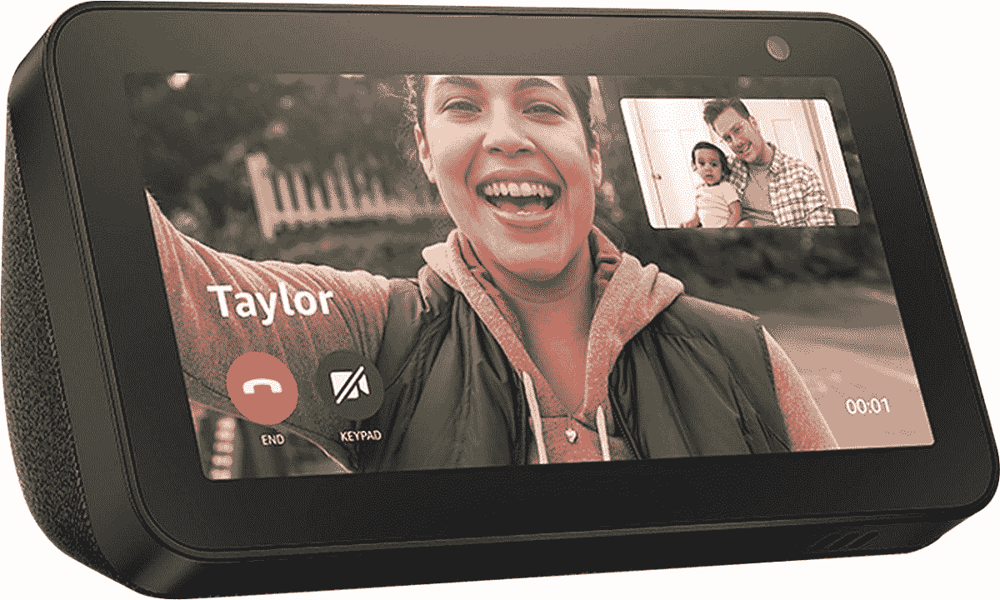

# 现在只需 45 美元就能买到亚马逊 Echo Show 5

> 原文：<https://www.xda-developers.com/pick-up-an-amazon-echo-show-5-for-just-45-right-now/>

# 现在只需 45 美元就能买到亚马逊 Echo Show 5

第一代亚马逊 Echo Show 5 智能显示器现在售价为 44.99 美元，比原价节省了 35 美元。

亚马逊以最初的 Echo Show 开创了智能显示产品类别，此后又有几次升级和新型号。最初的 Echo Show 5 于 2019 年年中发布，是一款更紧凑的智能显示器，具有与更大型号相同的功能。现在你可以在 Buy 花 44.99 美元买到一台，比原价节省了 35 美元。

在售的型号是最初的 Echo Show 5(型号 B07HZLHPKP)，而不是几个月前发布的更新版本。第一款有 5.5 英寸 960 x 480 触摸屏，内置视频通话摄像头(带物理隐私快门)，4W 扬声器和 Alexa 虚拟助手。你可以让它播放音乐，查找信息，控制智能家居设备，以及 Alexa 能够做到的任何事情。

 <picture></picture> 

Amazon Echo Show 5

##### 亚马逊回声秀 5

这是 2019 年发布的原版 Echo Show 5。它与目前的型号几乎相同，百思买以 44.99 美元的价格出售。

尽管最初的 Echo Show 5 在这一点上已经超过两年了，但它几乎与取代它的模型完全相同。2021 年的升级稍微提高了相机质量，也取消了现已打折的原始型号上的 3.5 毫米音频输出。