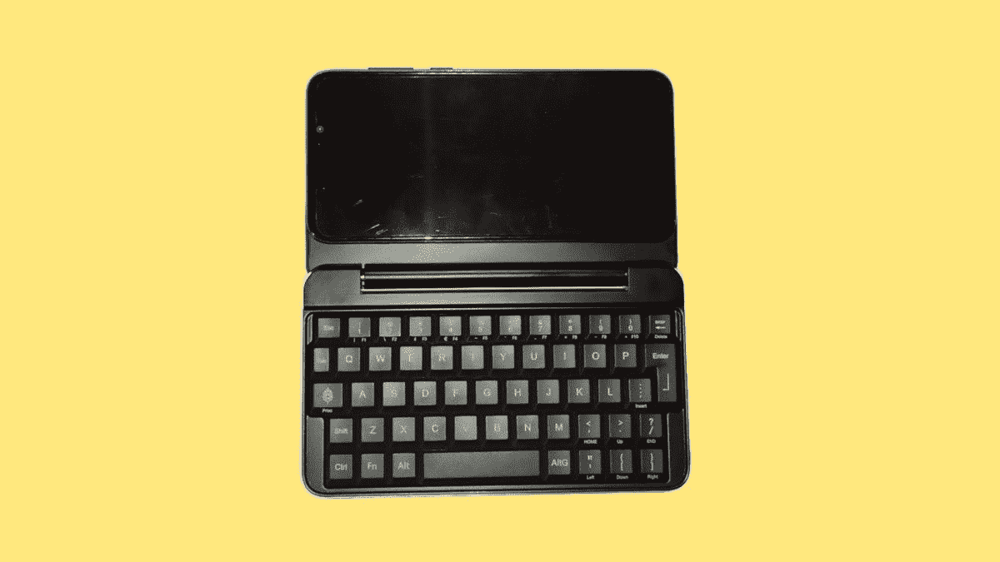
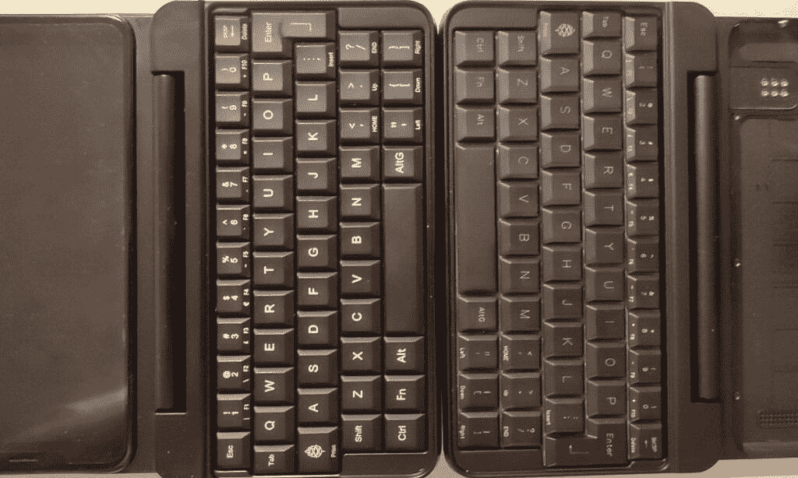

# PinePhone 的官方键盘插件将把它变成一台微型 Linux 个人电脑

> 原文：<https://www.xda-developers.com/pinephones-official-keyboard-add-on-will-turn-it-into-a-tiny-linux-pc/>

# PinePhone 的官方键盘插件将把它变成一台微型 Linux 个人电脑

Pine64 正在对其官方键盘插件 PinePhone 和 PinePhone Pro 进行最后的润色，售价为 49.95 美元。

 <picture></picture> 

binary comment

Pine64 是一家技术公司，多年来一直销售基于 Linux 的硬件，包括入门级的 PinePhone 和即将推出的 PinePhone Pro。PinePhone 和 PinePhone Pro 的官方键盘插件已经开发了几个月，Pine64 和它的社区共同努力实现最佳设计，现在它几乎可以投入生产了。

Pine64 的社区经理 Lukasz Erecinski 在公司 11 月更新的[博客文章](https://www.pine64.org/2021/11/15/november-update-first-impressions/)中透露，PinePhone 键盘将于下月发布，售价仅为 49.95 美元。对键盘薄膜材料的最后一分钟调整导致发布日期推迟到 12 月，但该公司在帖子中表示，“我们希望确保兼顾开发者的反馈，并尽可能提供最好的 PinePhone (Pro)键盘。"

 <picture></picture> 

Prototype keyboard (left) next to final keyboard (right)

键盘的外壳和按键都是哑光黑色，并使用 PinePhone 的内部 pogo 引脚进行连接，因此手机的 USB 连接器仍然可以使用。早期的原型使用了相同的基本设计，但 Pine64 一直在提高构建质量，并在内部电路中添加了额外的压差调节器(以防止 PinePhone 的电池过度充电)。Erecinski 还指出，按键需要“几分钟的磨合时间”，这听起来类似于黑莓智能手机和其他类似设备的行为。

据报道，该键盘可以在 Manjaro Plasma Mobile 和 Arch Phosh Linux 发行版上使用，也可以在其他操作系统上使用(如果不能，开发人员可能只需要实现几个补丁)。有了键盘，PinePhone 就变成了一个更接近 GPD 口袋的东西，或者 T2 双子星 PDA。最初的 PinePhone 肯定比大多数 Windows/Android 键盘便携式设备慢，但它有其他好处，如几十个操作系统可供选择，以及更加注重隐私/硬件控制。一旦 T4 的 pine phone Pro T5 上市，这款键盘也可以使用。