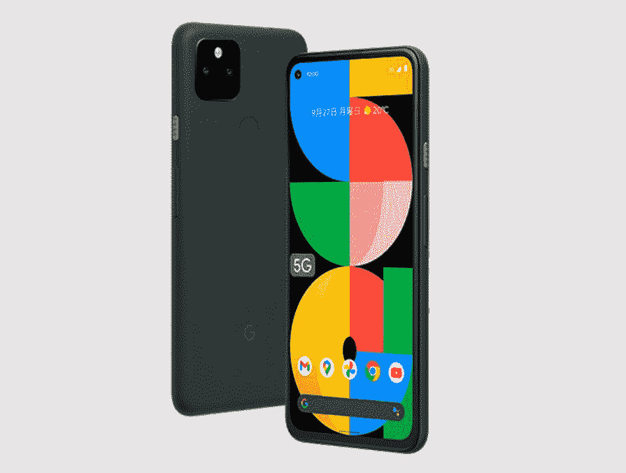

# 谷歌推出支持 5G 和大电池的 Pixel 5a

> 原文：<https://www.xda-developers.com/pixel-5a-specs-features-pricing-availability/>

谷歌去年推出的 Pixel 4a 是一款在全球广受欢迎的智能手机。当然，它实惠的价格标签对它的受欢迎程度起了很大的作用，事实上，消费者得到了一个干净的用户界面和软件支持保证，这对许多人来说是一笔交易。Pixel 4a 有两种版本，一种是 4G 版本，一种是 5G 版本。对于继任者，谷歌已经跳过了 4G 模式，转而采用一种名为 Pixel 5a (5G)的单一模式。经过几个月的猜测和由于全球芯片短缺对手机存在的一些怀疑，Pixel 5a (5G)终于正式发布。

 <picture></picture> 

Google Pixel 5a

## 谷歌 Pixel 5a (5G)规格

| 

规格

 | 

谷歌像素 5a (5G)

 |
| --- | --- |
| **正文** | 

*   156.2 x 73.2 x 8.8mm 毫米
*   183g
*   金属单体
*   IP67 防尘防水等级

 |
| **显示** | 

*   6.34 英寸有机发光二极管
*   2400 x 1080 分辨率
*   直接热轧制
*   60Hz 刷新率
*   穿孔显示器
*   高达 700 尼特
*   大猩猩玻璃 3

 |
| **SoC** | 

*   高通骁龙 765 克:
    *   中央处理器
        *   1 个 Kryo 475(基于 ARM Cortex-A76)Prime core @ 2.4 GHz
        *   1 个 Kryo 475(基于 ARM Cortex-A76)性能内核@ 2.2GHz
        *   6 倍(基于 ARM Cortex-A55)效率内核@ 1.8GHz
    *   国家政治保卫局。参见 OGPU
*   7 纳米 EUV 工艺

 |
| **内存** | 6GB LPDDR4X 内存+ 128GB 内部存储 |
| **电池&充电** | 

*   4680 毫安时
*   18W 快速充电
*   没有无线充电

 |
| **后置摄像头** | 

*   **主:**1220 万像素索尼 IMX363，f/1.7，1.4 m 像素尺寸，双像素自动对焦
*   **次要:** 16MP 超宽，索尼 IMX481，f/2.2，1.0 m 像素尺寸，107 FoV

 |
| **前置摄像头** | 800 万像素，f/2.0，1.12 米像素尺寸 |
| **港口** | 

*   USB 3.1 类型 C
*   3.5 毫米耳机插孔

 |
| **安全** | 后置电容式指纹扫描仪 Titan M 安全模块 |
| **音频** | 立体声扬声器双麦克风 |
| **连通性** | 

*   高通骁龙 X52 5G 调制解调器
*   单个 nanoSIM 卡插槽+集成 eSIM，支持 5G + 4G 或 4G + 4G DSDS(双 SIM 卡，双待机)
*   Wi-Fi:2.4 GHz/5 GHz 802.11 AC(Wi-Fi 5)
*   蓝牙 5.0
*   国家足球联盟
*   GNSS:
    *   全球（卫星）定位系统
    *   GLONASS
    *   “伽利略”号
    *   QZSS
    *   北斗

 |
| **传感器** | 接近传感器、环境光传感器、加速度计、陀螺仪、磁力计、气压计 |
| **软件** | 

*   安卓 11
*   3 年的 Android 操作系统升级
*   3 年每月 Android 安全补丁更新

 |

* * *

如果你熟悉去年的 Pixel 4a 5G，你可能会意识到 Pixel 5a (5G)并没有太大不同。这未必是一件坏事，因为 Pixel 4a 5G 是一款在大多数方面都表现良好的手机。你会看到我们多年来在 Pixel 手机上看到的同样熟悉的构建和设计，这当然会发生变化，这要归功于设计的彻底转变，预计今年晚些时候将推出的 [Pixel 6 和 6 Pro](https://www.xda-developers.com/google-pixel-6/) 。

在内部，像素 5a (5G)也保持与像素 4a 5G 基本相同。中端的骁龙 765G SoC 应该可以满足日常活动和一些休闲游戏的需求。由于该软件直接来自谷歌，它比大多数基于 Android 的定制皮肤都要轻，从而带来更流畅的整体体验。显示器是一个 6.2 英寸的 OLED 面板，带有一个 800 万像素自拍相机的打孔切口。刷新率仍然被限制在 60Hz，这有点令人失望，因为现在大多数 Android 手机即使在这个价格也提供高刷新率显示。

谷歌 Pixel 5a 5G 在设计上的一个微小变化是脊形电源按钮，使电源按钮和音量键更容易区分。虽然这种特殊的变化是微妙的，但电池已经得到了很大的升级，真的。去年的 3885 毫安时电池被 4680 毫安时电池取代，使 Pixel 5a (5G)成为有史以来电池最大的 Pixel 手机。如果耐力是你优先考虑的事情，Pixel 5a (5G)肯定不会让人失望。

鉴于这是一款 Pixel 设备，你将通过 Pixel 5a (5G)获得扩展的软件支持。谷歌承诺 3 年的 Android 版本升级和安全补丁，这在这个价位的其他原始设备制造商的手机上并不常见。除了软件，摄像头也是多年来 Pixel 手机的一大卖点，Pixel 5a (5G)保留了 Pixel 4a 5G 的一套可靠摄像头。有一个 12MP 的主摄像头，谷歌已经使用了很长时间，但由于他们的计算能力，该传感器在 2021 年仍然有效。它配有一个 16MP 超广角镜头。

## 谷歌 Pixel 5a (5G):定价和可用性

与去年的 Pixel 4a 不同，Pixel 5a 只在两个国家推出——美国和日本。这或许可以归因于全球芯片短缺，但肯定会令这两个国家以外的消费者失望。Pixel 4a 由于其干净的软件和简洁的体验，甚至在像印度这样市场高度规范的国家也很受欢迎。然而，Pixel 5a 不会进入中国或世界其他地区，至少不会通过官方渠道。

在美国，Pixel 5a (5G)可以通过[谷歌商店](https://store.google.com/product/pixel_5a_5g?hl=en-US)以 449 美元的价格购买，这比去年的普通 Pixel 4a 高出 100 美元，但比 Pixel 4a 5G 的发布价格低 50 美元。鉴于今年只有一款 Pixel“a”系列设备，Pixel 5a 是 Pixel 4a 5G 的更好版本，价格似乎是合理的。

预购今天开始，手机预计 8 月 26 日到货。你也可以通过 Google Fi 订阅获得 Pixel 5a，并通过每月 15 美元起的设备保护和升级计划节省一些额外的费用。

**[像素 5a (5G)论坛](https://forum.xda-developers.com/f/google-pixel-5a.12359/)**

* * *

你对谷歌 Pixel 5a (5G)有什么想法？如果你不在美国和日本，你会因为这款设备没有在你的国家上市而感到沮丧吗？请在下面的评论中告诉我们！

*更正:Pixel 5a 不支持 mmWave 5G。官方规格表已更新，以修复这一错误，所以我们已作出相应的调整。*