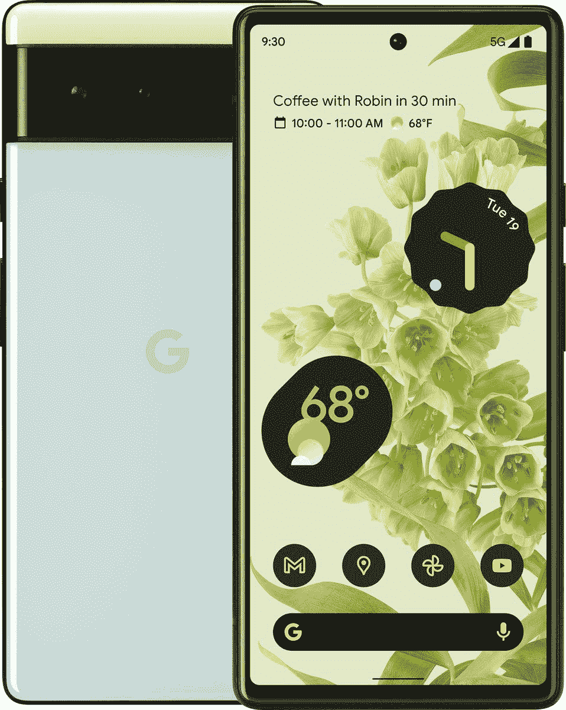

# Pixel 6 的 Live Translate 可以实时翻译信息等

> 原文：<https://www.xda-developers.com/pixel-6-live-translate-messages-captions/>

谷歌 Pixel 6 和 Pixel 6 Pro T1 终于正式发布，作为其核心的 T2 谷歌张量芯片组 T3 也是如此。谷歌新定制的芯片旨在为人工智能提供最佳性能，谷歌确保我们了解这一点。相机有新的独家功能，如[魔法橡皮擦](https://www.xda-developers.com/magic-eraser-pixel-6-erase-objects/)和计算视频，但 Pixel 6 家族的另一大新功能是实时翻译。

谷歌的翻译服务一直是最受欢迎的，现在，Pixel 6 甚至可以实时翻译你的信息。事实上，当你用一种语言输入或说出一条信息时，Pixel 6 可以自动将该信息翻译成接收者的语言。这适用于“信息”应用程序，也适用于多个第三方应用程序，包括 WhatsApp、Instagram、Twitter 等。

根据谷歌展示的演示，该功能似乎与微软今年早些时候添加到其快速键键盘应用中的[非常相似。但是，在这种情况下，性能应该会好很多。此外，这更容易与语音打字配合使用，而语音打字在 SwiftKey 的版本中无法直接使用。](https://www.xda-developers.com/swiftkey-android-instant-translations-microsoft-translator/)

不仅如此，谷歌还支持任何来源的实时音频翻译和字幕。你可以随时随地观看被翻译的 YouTube 视频，以及 Instagram 直播视频、其他国家的体育广播和其他任何内容。如果你想观看不同语言的内容，Pixel 6 可以实时翻译。

其他新功能包括 Pixel camera 应用程序中的实时翻译，可以翻译标志、标签等。谷歌助手的解释器模式在 Pixel 6 上也更快，现在支持 48 种语言。

总的来说，谷歌张量芯片也为翻译提供了更好的性能。谷歌表示，新芯片组将 Pixel 设备的翻译质量提高了 18%。此外，其新的翻译模型在张量芯片上运行时使用的功率不到一半，使这一过程更加高效。

这些翻译功能似乎是 Pixel 6 独有的，如果你对它们感兴趣，你可以在下面预订谷歌手机。如果你想去别的地方看看，我们也有一个预订新款 Pixel 手机的最佳地点列表。

 <picture></picture> 

Google Pixel 6

谷歌 Pixel 6 由新的谷歌张量芯片驱动，支持新的翻译功能。

 <picture></picture> 

Google Pixel 6 Pro

谷歌 Pixel 6 Pro 由新的谷歌张量芯片提供支持，该芯片可以实现额外的翻译功能。