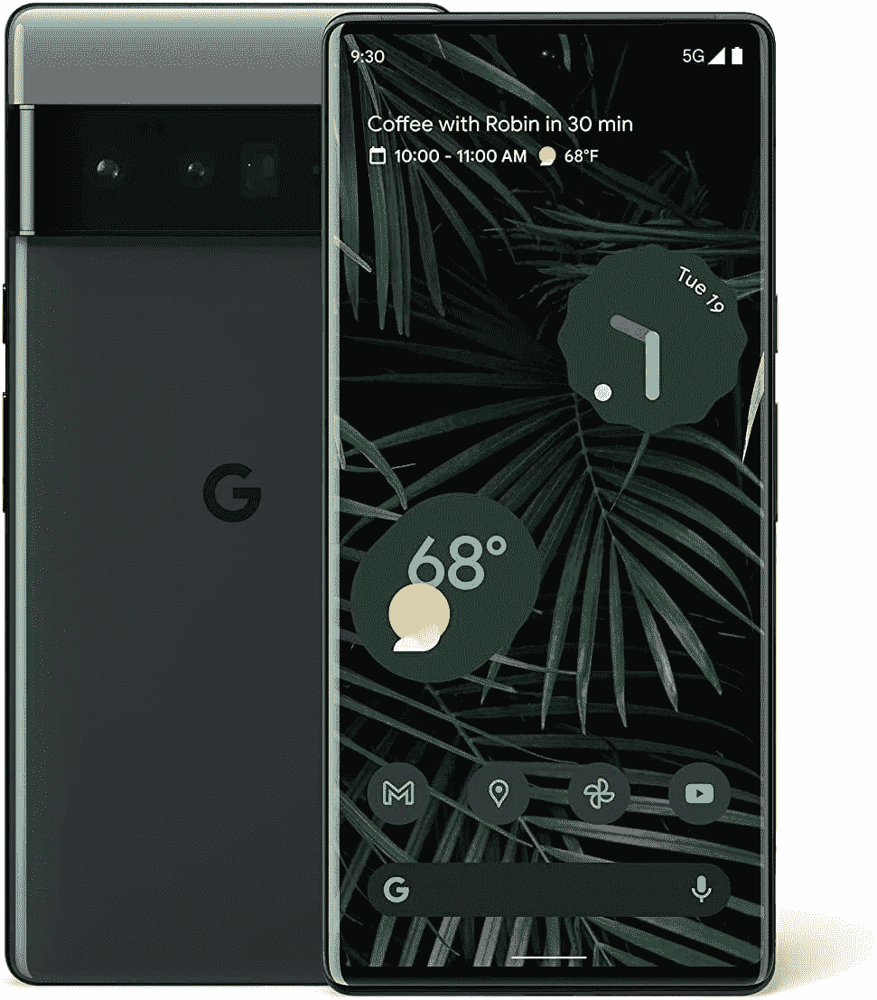

# 在这个亚马逊黄金日，只需 699 美元就能获得谷歌 Pixel 6 Pro

> 原文：<https://www.xda-developers.com/pixel-6-pro-amazon-prime-day-deal/>

# 在这个亚马逊黄金日，只需 699 美元就能获得谷歌 Pixel 6 Pro

谷歌 Pixel 6 Pro 在亚马逊 Prime Day 2022 降至迄今最低价格。这两种型号都可以节省 200 美元。

亚马逊优惠日正在如火如荼地进行，智能手机的交易也在快速增加。如果你一直在等待以优惠的价格购买旗舰智能手机，你会很高兴地知道[谷歌 Pixel 6 Pro](https://www.xda-developers.com/google-pixel-6-pro-review/) 今天在亚马逊上降到了最低价格。

自推出以来，谷歌 Pixel 6 Pro 的价格已经下降了几次，但今天的 Prime Day 交易将价格降至历史最低点。今天，你可以以 699 美元的价格买到 Pixel 6 Pro。这比通常 899 美元的价格低了 200 美元。提供 256GB 存储空间的顶级型号也降价 200 美元，降至 799 美元。128GB 的存储空间对大多数人来说应该是不错的，但如果你是一个重度用户，并计划存储大量媒体，从长远来看，支付 100 美元的额外存储空间可能是值得的，因为手机没有 SD 卡插槽。

Pixel 6 Pro 提供了 6.71 英寸的大型 LTPO AMOLED 显示屏，具有 QHD+分辨率和 120Hz 的刷新率。它由谷歌内部的张量 SoC 提供动力，搭配 12GB 内存。这款手机包含一个多功能的相机系统，具有 50MP GN1 主拍摄器，12MP 超宽相机和 48MP 长焦镜头，具有 4 倍光学变焦。Pixel 6 Pro 的相机硬件可能不是市场上最好的，但它仍然是[最好的相机智能手机](https://www.xda-developers.com/best-smartphone-cameras/)之一，这要归功于谷歌令人惊叹的软件图像处理。

 <picture></picture> 

Google Pixel 6 Pro

Pixel 6 Pro 在亚马逊 Prime Day 降至最低价。

Pixel 6 Pro 保证获得三年的操作系统更新，也是目前少数几款可以运行 [Android 13](https://www.xda-developers.com/android-13/) Beta 的智能手机之一。如果你想保持领先地位，成为第一批试用新 Android 版本的人，这款手机是你的不二之选。要了解更多关于这款手机的信息，请查看我们对 Pixel 6 Pro 的完整[评测。](https://www.xda-developers.com/google-pixel-6-pro-review/)