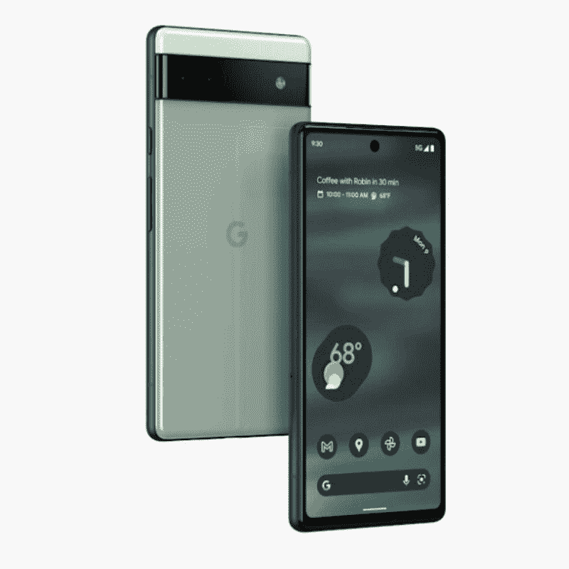

# Pixel 6a 的预购现已在英国和美国启动。

> 原文：<https://www.xda-developers.com/pixel-6a-pre-order-us-uk/>

# 您现在可以在英国和美国预购 Pixel 6a。

你现在可以在英国和美国分别以 449 美元和 399 美元的价格预订谷歌 Pixel 6a。请继续阅读，了解产品发布信息。

在今年早些时候的 I/O 上展示了新的 Pixel 6a 之后，谷歌现在终于开放了该设备的预购。美国的买家现在可以以 449 美元的价格预订这款设备，并在月底前收到。或者，你可以等到 7 月 28 日再去附近的商店拿。在你开始为自己预订 Pixel 6a 之前，这里有一个对其规格的简要概述。

## 谷歌像素 6a:规格

| 

规格

 | 

谷歌像素 6a

 |
| --- | --- |
| **尺寸** | 152.16 x 71.8 x 8.85mm 毫米 |
| **显示** | 

*   6.1 英寸 FHD+有机发光二极管
*   20:9 宽高比
*   60Hz 刷新率
*   康宁大猩猩玻璃 3

 |
| **SoC** | 

*   谷歌张量八核 SoC

 |
| **内存&存储** | 6GB 内存+ 128GB 存储空间 |
| **电池&充电** | 

*   4，306 毫安时电池
*   18W 有线充电支持

 |
| **安全** | 显示指纹扫描仪 |
| **后置摄像头** | 

*   主要:12MP 索尼 IMX363，DP+OIS
*   超宽:12MP 索尼 IMX386

 |
| **前置摄像头** | 800 万像素索尼 IMX355 |
| **端口** | USB 类型-C |
| **音频** | 

*   立体声扬声器
*   2 个麦克风

 |
| **连通性** | 

*   5G(特定型号支持毫米波)
*   4G LTE
*   Wi-Fi 6E
*   蓝牙 5.2
*   国家足球联盟

 |
| **软件** |  |
| **其他特征** | 

*   实时翻译
*   魔法橡皮擦
*   人身安全和汽车碰撞检测
*   面部去模糊
*   真实音调

 |

* * *

虽然谷歌在印度只提供了两种颜色的 Pixel 6a，但该公司在美国提供了三种颜色——粉笔色、木炭色和鼠尾草色。您可以通过下面提供的亚马逊链接预订您最喜欢的颜色的设备。

 <picture></picture> 

Google Pixel 6a

Pixel 6a 是谷歌最新的平价智能手机，具有内部张量 SoC 和一系列高级软件功能。

如果你是威瑞森的用户，你会很高兴知道运营商已经宣布了一些针对早期购买者的促销活动。随着新的 5G Start、5G Do More、5G Play 或 5G Get More 无限计划的激活，您可以免费获得 Pixel 6a，因为威瑞森将在 36 个月内为您提供价值 499.99 美元的促销账单积分。

如果你已经是威瑞森的用户，并希望升级到上述 5G 无限计划之一，你可以在 36 个月内获得 100 美元的促销法案信用。那些对促销账单积分不感兴趣的人可以直接获得 Pixel 6a，威瑞森将提供 Pixel Buds Pro 100 美元的折扣或 Pixel 6a 配件高达 40%的折扣。您可以通过上面提供的百思买链接预购威瑞森变型。

 <picture></picture> 

Google Pixel 6a

Pixel 6a 是谷歌最新的平价智能手机，具有内部张量 SoC 和一系列高级软件功能。

英国用户也能以 399 英镑的价格买到所有三种颜色的 Pixel 6a。它可以通过谷歌商店和亚马逊英国购买，你可以通过上面提供的链接预订。在英国的预购包括一副免费的谷歌平价 TWS 耳塞 [Pixel Buds A 系列](https://www.xda-developers.com/google-pixel-buds-a-review/)。

*你会预订 Pixel 6a 吗？你会得到哪种颜色？请在下面的评论区告诉我们。*