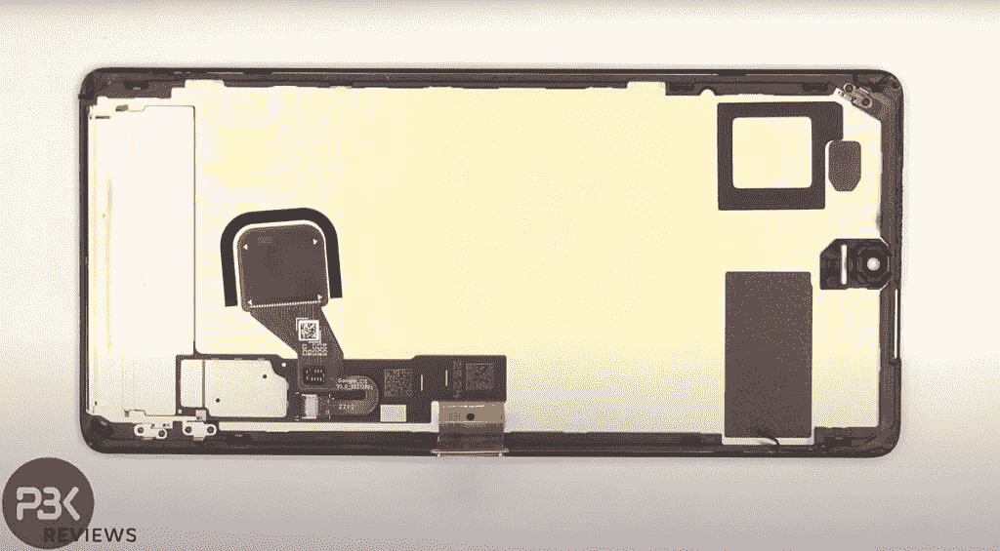

# Pixel 7 Pro 拥有更新的内部布局，具有更好的冷却潜力

> 原文：<https://www.xda-developers.com/pixel-7-pro-teardown/>

谷歌最新的顶级旗舰产品 [Pixel 7 Pro](https://www.xda-developers.com/google-pixel-7-hands-on/) ，相比去年的 [Pixel 6 Pro](https://www.xda-developers.com/google-pixel-6-pro-review/) ，带来了多项硬件和软件改进。这款机型采用了谷歌新的[张量 G2](https://www.xda-developers.com/google-tensor-g2-changes/) 芯片，25%的亮度显示屏，升级的长焦相机，更好的自拍相机，以及一些很酷的软件功能。此外，Pixel 7 Pro 还带来了一些你在任何规格表中都找不到的其他变化。

正如 *PBK 评论*在拆解中发现的那样，谷歌已经改进了 Pixel 7 Pro 的内部硬件布局，这可能会导致更好的散热性能。拆机显示，Pixel 7 Pro 中的毫米波天线绕过电池，为覆盖摄像头、SoC 和电池的一大块石墨胶带腾出了空间。相比之下，去年模型中的毫米波天线电线压过了电池，迫使谷歌使用更小的石墨带进行散热。

鉴于 Pixel 7 Pro 中的石墨带具有明显更大的表面积，它应该比旧款中的小块石墨带提供更好的散热。这可能会导致更好的整体冷却性能。与 Pixel 6 Pro 一样，Pixel 7 Pro 也在屏幕背面配备了一个大型铜散热器，用于相同的目的。

 <picture></picture> 

Copper heatsink behind the screen in the Pixel 7 Pro.

可悲的是，Pixel 7 Pro 上改进的内部硬件布局在使设备更容易维修方面没有太大作用。像它的前辈一样，Pixel 7 Pro 的显示屏应该很容易更换，因为它可以通过加热边缘周围的粘合剂而立即脱落。

该电池还具有像去年型号一样的拉片，但它不会移动，直到一些异丙醇被应用于松开粘合剂。USB Type-C 端口和背面玻璃将像在 Pixel 6 Pro 上一样难以修复，因为端口焊接到主板上，背面玻璃粘在框架上。

更多详情，请点击上面的视频查看 PBK 评论的拆卸。如果你有兴趣购买新的 Pixel 7 Pro，请点击下面的链接立即订购，节省数百美元。

 <picture></picture> 

Google Pixel 7 Pro

##### 谷歌 Pixel 7 Pro

Pixel 7 Pro 是谷歌今年的顶级旗舰产品，具有第二代张量 SoC，120Hz LTPO 显示屏，附加的长焦传感器和更大的电池。

* * *

**Via:**[Ars Technica](https://arstechnica.com/gadgets/2022/10/pixel-7-pro-teardown-shows-better-cooling-cleaner-layout-than-last-years-model/)