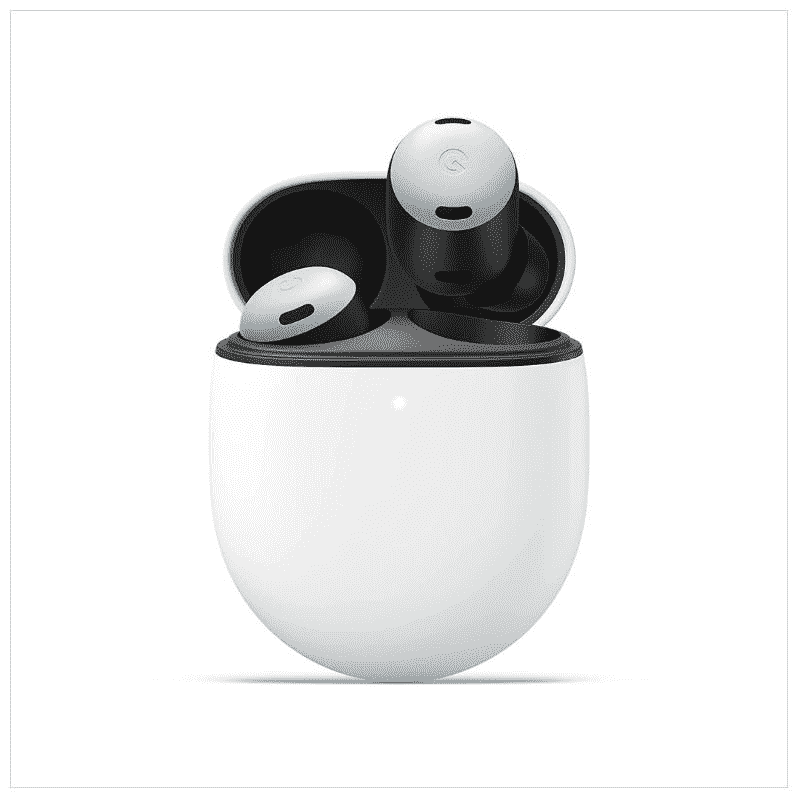
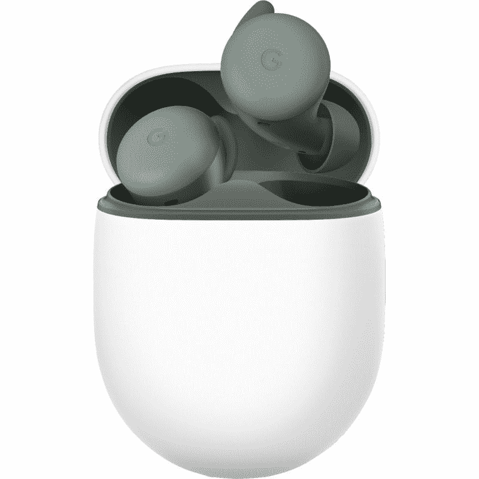

# 谷歌 Pixel Buds Pro 和 Pixel Buds A 在 Prime 早期访问销售期间大幅打折

> 原文：<https://www.xda-developers.com/pixel-buds-pro-pixel-buds-a-prime-early-access-sale/>

亚马逊的 Prime Early Access 特卖在耳机和耳塞上有很多优惠。到目前为止，我们发现的一些最好的交易包括:Galaxy Buds 2 降价 50 美元(T1)，索尼 WH 1000 xm5 获得罕见的 50 美元折扣(T3)，以及 Bose QuietComfort 45 创下历史最低价。此外，谷歌的 Pixel Buds Pro 也在大幅降价。

[谷歌 Pixel Buds Pro](https://www.xda-developers.com/google-pixel-buds-pro-review/) 在 Prime 早期访问销售期间获得了大幅折扣，比零售价低 48 美元。通常售价为 200 美元，谷歌最新的旗舰耳塞目前仅售 152 美元。这是耳塞的历史新低，打破了我们在 8 月份看到的 175 美元的最低价。

 <picture></picture> 

Google Pixel Buds Pro

##### 谷歌像素芽专业版

谷歌 Pixel Buds Pro 降至最低价格。

如果你正在寻找更便宜的东西，并且不介意缺少 ANC，你会很高兴地知道，价格实惠的 [Pixel Buds A](https://www.xda-developers.com/google-pixel-buds-a-review/) 也在出售。这种价格实惠的耳塞通常零售价为 99 美元，但就在今天，你只需花 66 美元就能买到。

 <picture></picture> 

Google Pixel Buds A

##### 谷歌像素芽 A

购买价格实惠的 Pixel Buds A 仅需 66 美元。

Pixel Buds Pro 是谷歌的旗舰耳塞，拥有你期待的一对 TWS 的所有功能，包括强大的 ANC、出色的声音和通话体验、舒适的佩戴和可靠的电池续航时间。它们一次充电可提供长达 11 小时的收听时间，使用充电外壳可提供长达 31 小时的收听时间。耳塞还提供 IPX4 防汗保护、无线充电支持、触摸控制以及与兼容设备的快速配对。你可以在我们的[全面回顾](https://www.xda-developers.com/google-pixel-buds-pro-review/)中了解更多关于耳塞的信息。

说到 Pixel Buds A，它们是不错的耳塞，提供了良好的声音和舒适的设计。就像专业型号一样，它们防水防汗，但你不会在这些上获得主动噪音消除。Pixel Buds A 上的波束成形麦克风可以很好地消除通话过程中的环境噪声，同时还支持自适应声音功能，当您从嘈杂的地方移到安静的地方时，该功能会自动调整音量。