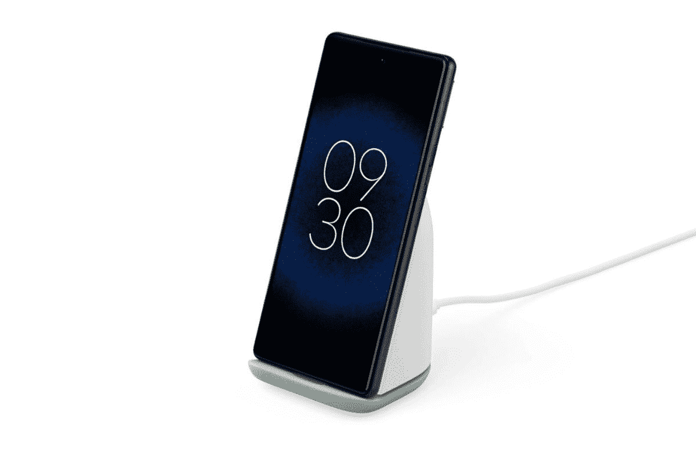

# 谷歌 Pixel 支架第二代现在可以预订

> 原文：<https://www.xda-developers.com/pixel-stand-2nd-gen-available-pre-order/>

# 第二代像素支架现可预购

在 Pixel 6 发布会近一个月后，谷歌 Pixel Stand 第二代终于可以在谷歌商店预订了。

谷歌上个月发布了最新的旗舰设备——Pixel 6 和 Pixel 6 Pro。除了这两款新设备，[谷歌还推出了](https://www.xda-developers.com/google-pixel-stand-2nd-gen-built-in-fan-fast-charging-support/)第二代 Pixel 支架。虽然新的 Pixel 手机在发布会后不久就开始销售，但新的 Pixel 支架尚未上市。谢天谢地，谷歌现在终于开放了 Pixel Stand 第二代的预购，如果你现在下单，下个月就可以拿到你的。

第二代 Pixel Stand 采用了更新的设计，支持 23W 快速充电，并内置冷却风扇。它包括两个充电线圈——上部线圈为纵向智能手机充电，下部线圈为 Pixel Buds 等可穿戴设备充电。它提供三种充电模式——优化、最大和静音——零售价为 79 美元。无线充电器附带 1.5 米的 USB Type-C 到 Type-C 电缆，以及支持 USB PD 3.0 的 30W 充电砖。

如果你刚刚给自己买了一个闪亮的新 Pixel 6 或 Pixel 6 Pro，并且你正在为你的新手机寻找无线充电器，你现在可以从谷歌商店预购 Pixel Stand 2nd-gen。请点击下面的链接下订单，下个月您将会收到新的 Pixel 袖手旁观。*[9 to 5 谷歌](https://9to5google.com/2021/11/18/pixel-stand-pre-order/)* 报道称，在预购时选择最快的运输速度会导致美国的交货日期为 12 月 14 日至 15 日，英国的交货日期为 12 月 15 日至 16 日。

 <picture></picture> 

Google Pixel Stand 2nd-gen

##### 谷歌像素支架(第二代)

Pixel Stand 第二代采用了全新的设计，支持 23W 快速充电，内置冷却风扇。

如果你一直在推迟购买 Pixel 6，现在将是一个点击购买按钮的好时机，因为你将在下个月的同一时间获得新手机和 Pixel 支架。请务必查看我们的[最佳 Pixel 6 和 Pixel 6 Pro 交易综述](https://www.xda-developers.com/best-google-pixel-6-pro-deals/)，这样您就不会错过任何优惠。

 <picture></picture> 

Google Pixel 6

Pixel 6 配备了谷歌新的张量芯片、现代设计和旗舰相机。

 <picture></picture> 

Google Pixel 6 Pro

Pixel 6 Pro 是更大的旗舰产品，配备了谷歌的新张量芯片，现代设计，和一个额外的长焦相机。