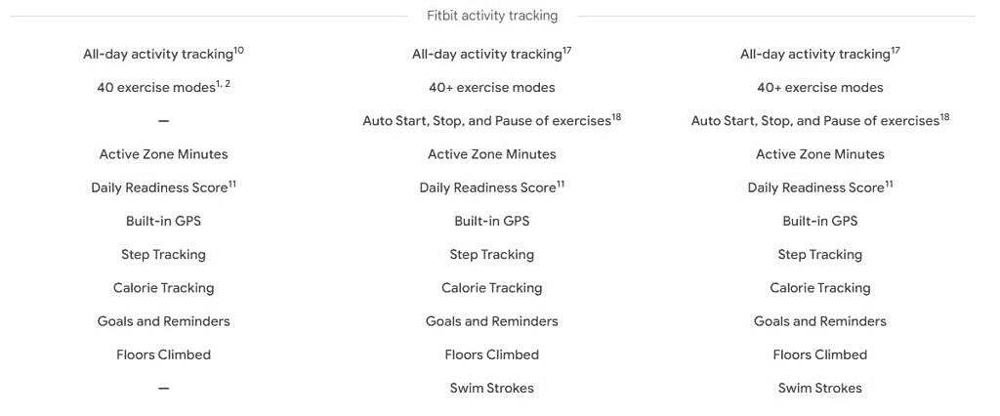
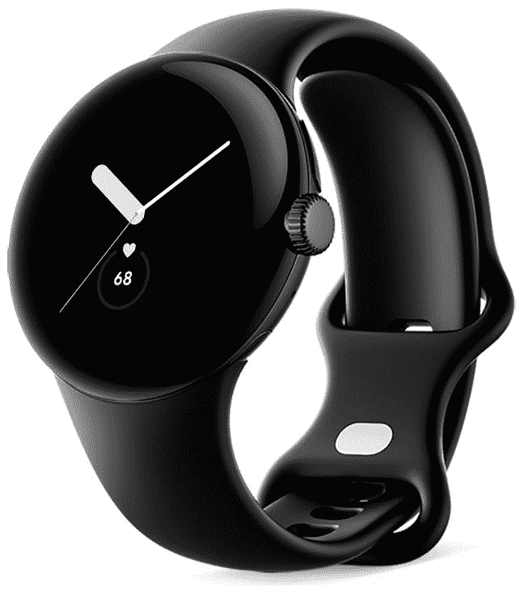

# 据报道，Pixel Watch 错过了一些 Fitbit 功能

> 原文：<https://www.xda-developers.com/pixel-watch-missing-fitbit-features/>

[Pixel 手表](https://www.xda-developers.com/google-pixel-watch-hands-on/)不仅是谷歌的第一款 Wear OS 智能手表，也是第一款提供 Fitbit 集成的非 Fitbit 智能手表。它可以让你访问 Fitbit 智能手表上的许多功能，如最近发布的 [Sense 2 或 Versa 4](https://www.xda-developers.com/fitbit-announces-the-sense-2-inspire-3-and-versa-4/) ，这使它成为现有 Fitbit 用户的一个很好的选择。然而，最近的报告表明，这款智能手表没有其他 Fitbit 智能手表的全套健身跟踪功能。

根据 *ConnectTheWatts* (通过 *9to5Google* )的说法，Pixel 手表缺乏对自动锻炼跟踪、不规则心律通知和 Fitbit 智能手表上发现的其他一些功能的支持。将 Pixel 手表的规格表与谷歌商店上的 Fitbit 智能手表进行比较可以发现，前者不支持锻炼的自动开始、停止和暂停以及游泳泳姿跟踪。然而，Fitbit 网站上的 Pixel Watch 列表和专用的谷歌商店列表表明，这款手表确实提供自动运动跟踪。

 <picture></picture> 

Via: 9to5Google

目前还不清楚哪个列表是准确的，因为我们还没有机会测试 Pixel Watch。我们已经向谷歌寻求澄清，我们会尽快更新这个帖子。

据称，Pixel 手表上缺失的功能不仅仅是自动运动跟踪和泳姿跟踪。 *ConnectTheWatts* 表示，与最新的 Fitbit 智能手表相比，Pixel 手表还缺少高/低心率通知、不规则心律通知、引导呼吸、睡眠模式支持、静音/智能唤醒警报以及血氧夜间平均值、范围和随时间变化的趋势。

此外，据报道，Pixel Watch 也不提供全天身体反应跟踪和 EDA 传感器压力管理。这些功能在 Fitbit Sense 2 上都有。

如果你在市场上购买一款新的智能手表，并希望获得上述功能，你可能需要推迟购买 Pixel Watch，直到谷歌发布声明。但是如果缺少的功能不是交易破坏者，你可以通过下面的链接预购 Pixel Watch。

 <picture></picture> 

Google Pixel Watch

Pixel Watch 是谷歌的第一款 Wear OS 智能手表，具有独特的设计，支持许多健身跟踪功能。

* * *

**来源:** [连接瓦特](https://connectthewatts.com/2022/10/06/the-pixel-watch-reveal/)

**Via:**[9 to 5 Google](https://9to5google.com/2022/10/07/pixel-watch-fitbit-automatic-workout/)