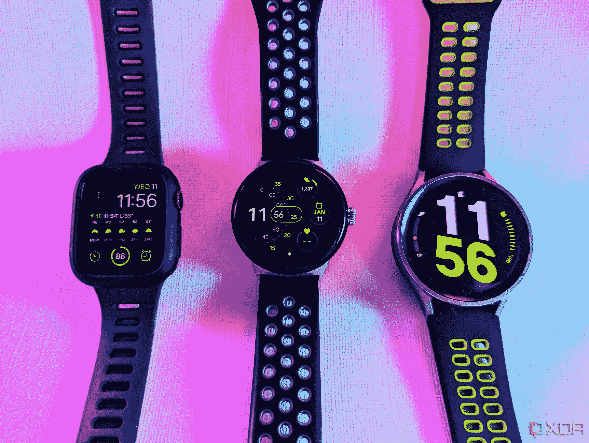

# Pixel 手表如何不顾缺点不断拉我回来？

> 原文：<https://www.xda-developers.com/pixel-watch-pulling-me-back/>

这些年来，智能手表已经有了很大的发展，我已经用过几十只了，从最初的三星 Galaxy Gear 和 MotoActv 开始。然而，我最近在想，当我查看最佳智能手表列表时，我总是选择最大的选项。我的手腕很大，所以我想既然我有空间，我应该用一个更突出的显示器来利用它，这样我就可以一次显示更多的信息。此外，体积较大的手表往往有更大的电池。体积更大的手表不仅屏幕更大，而且电池通常也更大。

因此，虽然我的手腕没有缩水，但我的偏好可能会转向欣赏更小的手表，这主要是因为[谷歌像素手表](https://www.xda-developers.com/google-pixel-watch-review/)及其单一尺寸选项。我现在是一个小手表男，还是更多？什么变了？

## 不知何故，Pixel 手表吸引了我

因为我的工作，我有在设备之间来回跳跃的特权。我仍然喜欢使用我的 TicWatch Pro 3 Ultra，但由于 Wear OS 2 设备的功能越来越落后，而支持新的 Wear OS 3 设备，我通常会在我的 Pixel 手表和[三星 Galaxy 5 Pro](https://www.xda-developers.com/samsung-galaxy-watch-5-pro-review/) 之间切换。我偶尔会将 Amazfit Falcon 和 [T-Rex 2](https://www.xda-developers.com/amazfit-t-rex-2-review/) 混合使用，主要是在我想要长电池续航时间的时候。Pixel 手表给我的感觉和我戴小一号的 [Apple Watch 7](https://www.xda-developers.com/google-pixel-watch-vs-apple-watch-series-7/) 时的感觉类似。(虽然我不喜欢经常使用 Apple Watch，因为我只有一部 iPhone SE (2020)用于集成，我宁愿使用我的旗舰 Android 手机之一。)

总不能只是 Pixel 手表的尺寸让我不断回想吧？至少是很大一部分。我最近完成了对 Fitbit Sense 2 的评测，我最喜欢它的一点是它在我手腕上的感觉。轻薄的外形和重量很容易让人忘记我戴着它。当然，Fitbit 设备的电池寿命很长，但这显然不是 Pixel Watch 的 pro 一栏中的一项。

我认为另一个原因是易用性和我对界面的偏好。当三星 Galaxy Watch 4 向全世界介绍佩戴 OS 3 时，我是如此兴奋，但一旦我使用了这款手表，这种情绪很快就消退了。我对新的操作系统不太失望，因为它是三星的实现。用户界面几乎和我们在基于 Tizen 的 Galaxy Watch 3 上看到的一模一样，只是混合了一些谷歌的味道，并且[硬件让我失望](https://www.androidcentral.com/galaxy-watch-4-letdown)。

同时，Pixel 手表给了我一直想要的 Wear OS 3 体验。我一直更喜欢 Wear OS 设备的用户界面，而不是早期三星智能手表上的 Tizen。我更喜欢你在 Pixel Watch 界面上感受到的卡片般的材料，以及不同页面的滑动位置，比如模仿[最佳安卓智能手机](https://www.xda-developers.com/best-phones/)的通知和磁贴。它还与谷歌服务和应用程序集成得非常好，就像 Apple Watch 与 iOS 的集成一样。

我仍然使用当前的 Galaxy Watch 5 Pro 和我的 [Galaxy Z Fold 4](https://www.xda-developers.com/samsung-galaxy-z-fold-4-review/) ，因此所有可能的功能都可以在两台设备之间工作。它工作得很好，但它不会让我像 Pixel 手表一样回到它身上。虽然我最喜欢的 Wear OS 2 手表 TicWatch Pro 3 Ultra 使用了接近库存的界面，提供了与较新的 Wear OS 3 类似的体验，但 Pixel 手表要干净得多。这两个界面都比三星的 Tizen 或其 Wear OS 手表上的 UI 要好。

## Pixel 手表并不完美，但已经足够好了

# 

谷歌的第一款智能手表一开始就表现出色。Pixel 手表完美吗？差远了。但它已经确定了一款坚固的智能手表的基本要素，具有良好的健康和健身功能，易于使用的界面，以及可靠的应用程序支持。然后，还有硬件和男孩，谷歌在这里赢了。有很多关于 Pixel 手表本质上是圆形苹果手表的讨论，这不是一件坏事。这款设备看起来棒极了，戴起来感觉也不错。这让我相信，更小的智能手表有很多令人喜欢的地方，即使电池仍然有问题。

自发布以来，谷歌已经对 Pixel Watch 进行了几次更新，这让我对公司在设备本身和平台上的长期投资抱有希望。然而，一旦更多的设备运行 Wear OS 3，更大的画面将得到更好的关注。我希望 Pixel 手表的电池寿命更长，设备切换也不那么痛苦。但在我有除了谷歌和三星之外的选择之前，我会继续回到我的 Pixel 手表。

谷歌 Pixel Watch 是谷歌 Pixel 品牌下的首款智能手表。它在某些方面已经过时了，但就其本身而言还是很有魅力的。