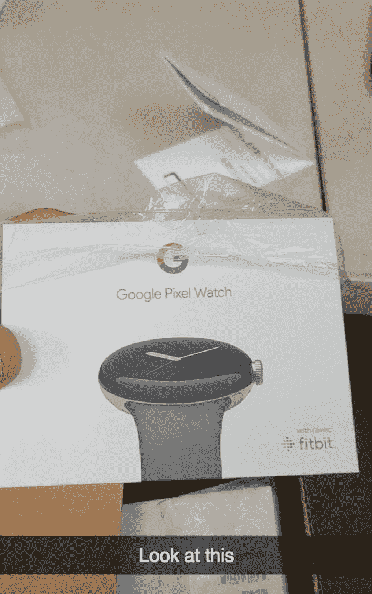

# 你可能不用等太久就能买到 Pixel 手表

> 原文：<https://www.xda-developers.com/pixel-watch-retail-box-leak/>

谷歌将在下月初的硬件发布会上正式展示其旗舰产品 [Pixel 7 系列](https://www.xda-developers.com/google-pixel-7-pro/)和 [Pixel 手表](https://www.xda-developers.com/google-pixel-watch/)。然而，该公司正在努力在发布会之前保密其首款智能手表。在过去的几周里，我们已经看到了几份强调 Pixel 手表关键细节的报告。现在，一个新的泄漏给了我们第一次看到它的零售盒。

最近 *Reddit* 上的一个帖子展示了一张 Pixel 手表零售盒的图像，据报道是在一个目标配送中心拍摄的。正如你在附图中看到的，Pixel 手表将装在一个小矩形盒子里，不像三星和苹果最近推出的智能手表的零售盒子。它的正面将带有一个彩色的“G”标志，以及谷歌 Pixel Watch 品牌和智能手表本身的图像。此外，包装盒上还印有“with Fitbit”的商标。

 <picture></picture> 

Credit: u/xXavi3rx

由于谷歌在过去已经确认了所有这些细节，零售盒子本身并没有告诉我们任何新的东西。但鉴于这张照片是在一个配送中心拍摄的，我们认为 Pixel 手表可能会在下个月的谷歌制造活动后不久上市。相比之下，最近的泄露表明，Pixel 7 系列将于 10 月 18 日上市，比官方宣布晚 12 天。

如果你想在下个月发布后买一块 Pixel 手表，你应该知道，据报道，它将配备一个 [Exynos 9110 芯片组](https://www.xda-developers.com/google-pixel-watch-older-chipset/)，一个[300 毫安时电池](https://www.xda-developers.com/google-pixel-watch-charge-time-battery-life-report/)，以及 [LTE 连接](https://www.xda-developers.com/google-pixel-watch-fcc-listings-lte-model-usb-c-cable/)。有消息称，谷歌将提供三种外壳颜色，黑色、银色和金色，以及一系列第一方的表带。此外，我们还了解到，Pixel 手表的基本蓝牙型号零售价为 349.99 美元，LTE 型号为 399.99 美元。

*下个月谷歌发布会后，你会订购 Pixel 手表吗？为什么或为什么不？请在下面的评论区告诉我们。*

* * *

**来源:** [Reddit](https://www.reddit.com/r/PixelWatch/comments/xo1z0l/pixel_watch_in_target_dc/)