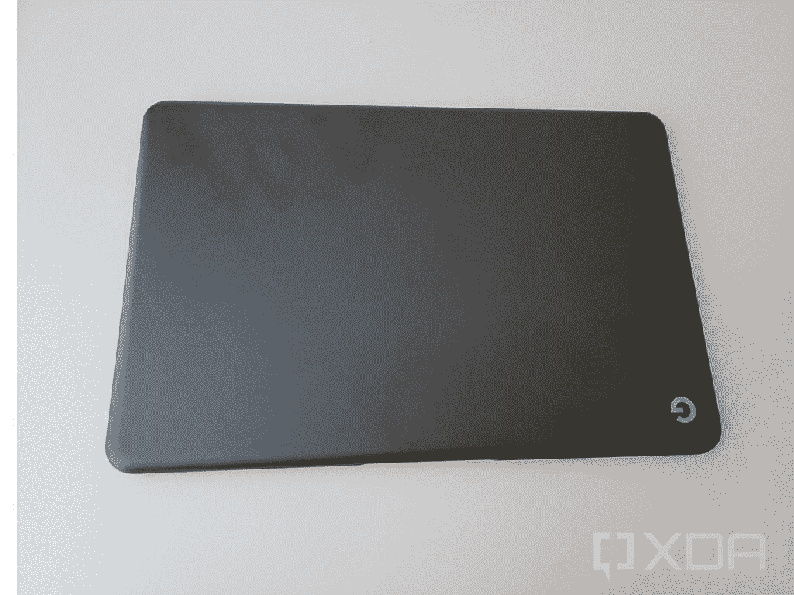
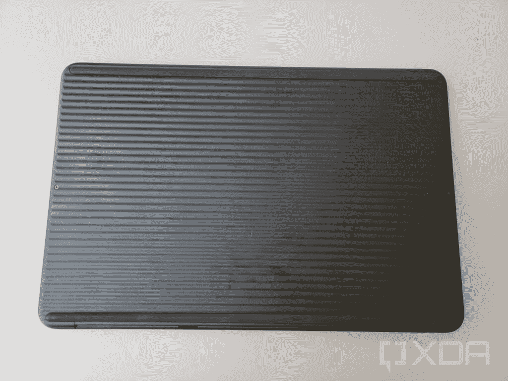
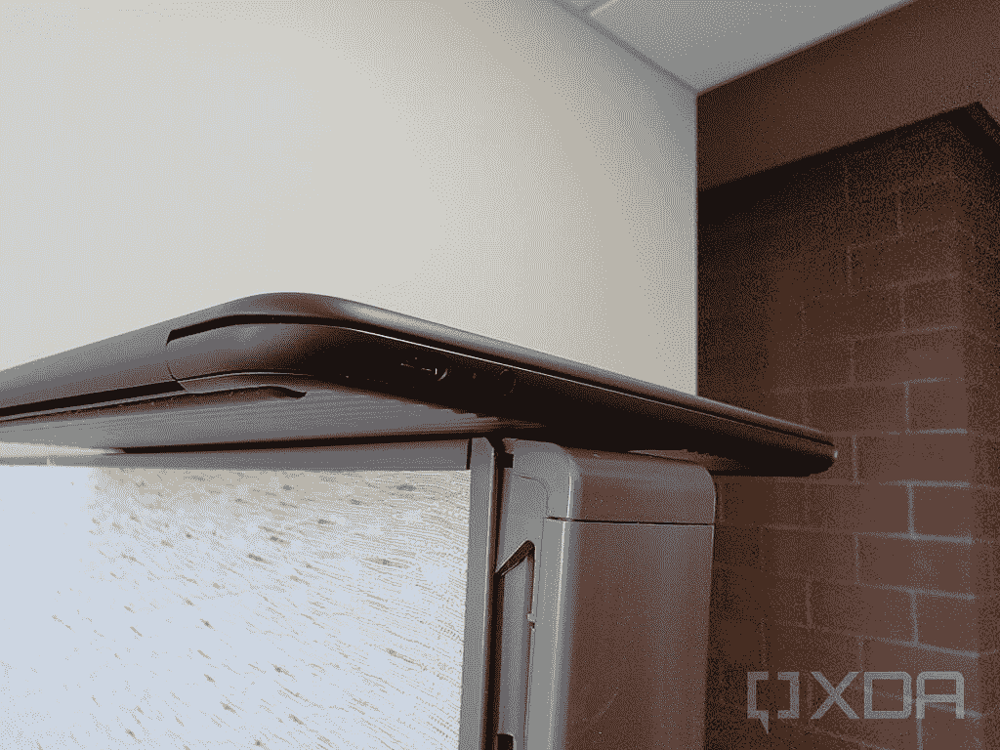
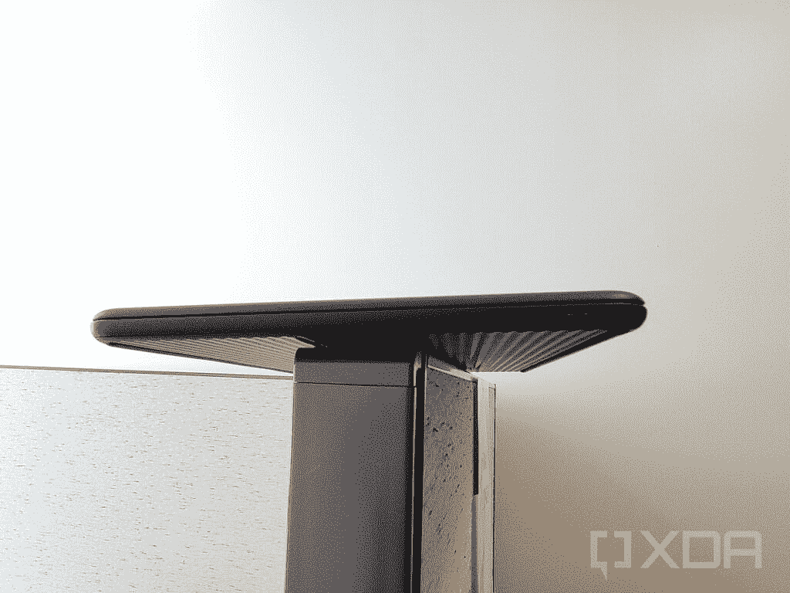
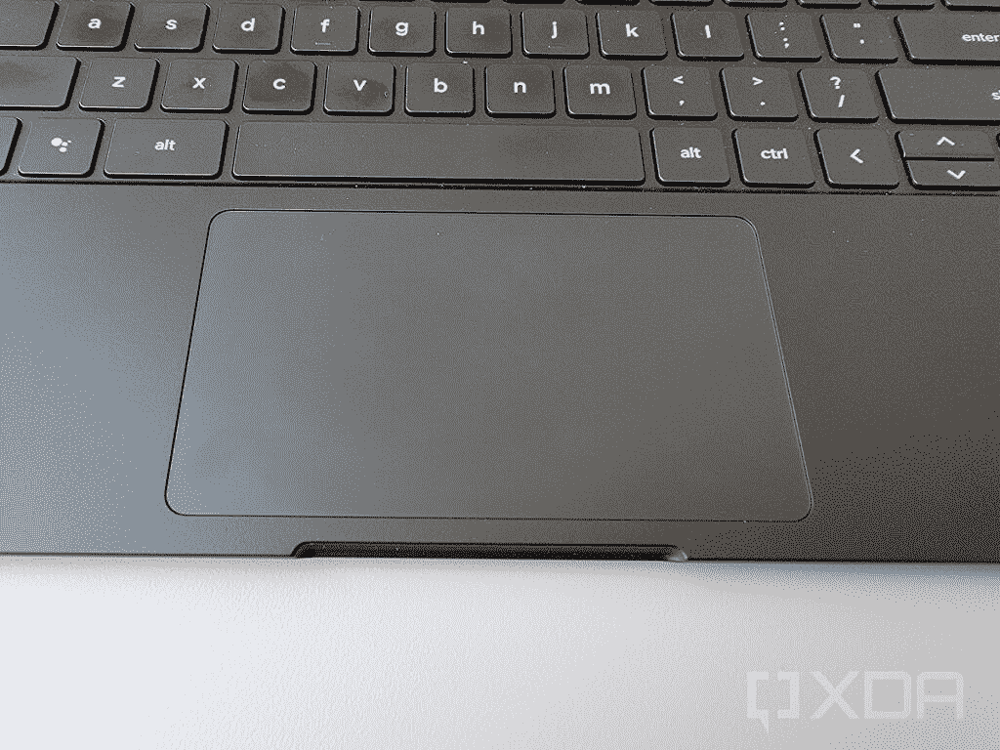
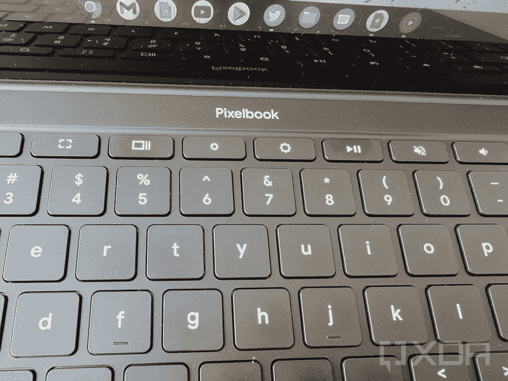
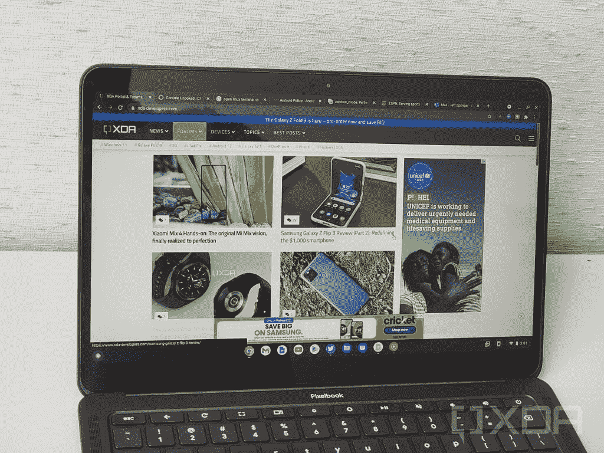
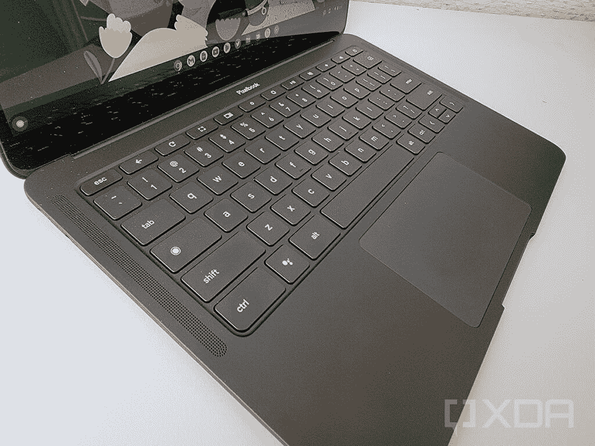
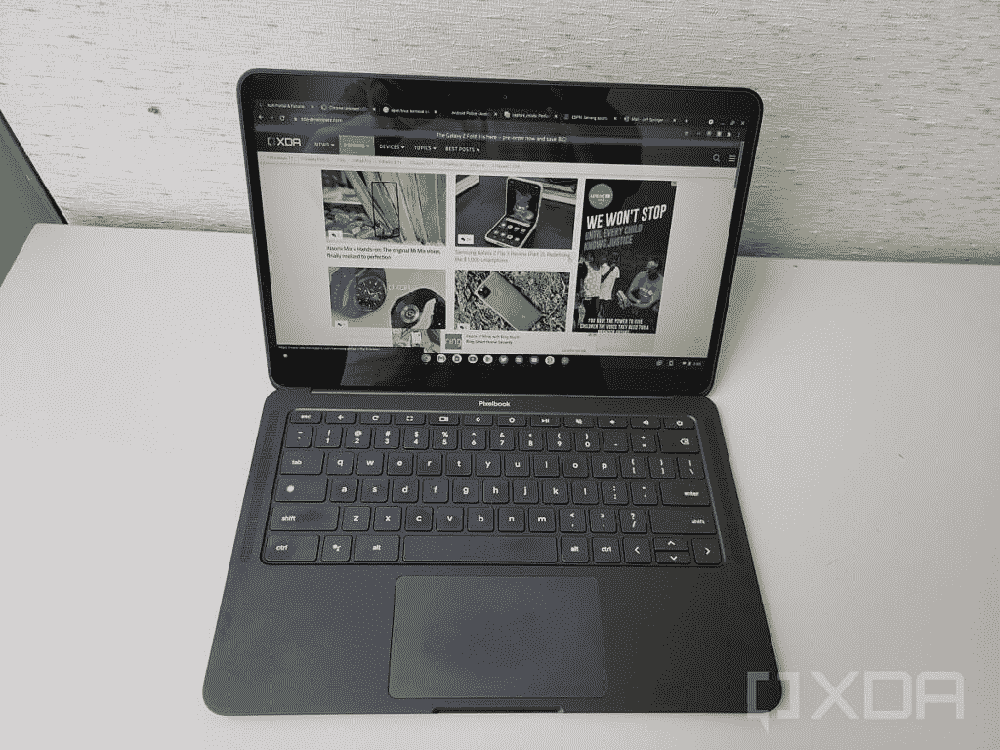

# Pixelbook Go 长期回顾:经受时间的考验

> 原文：<https://www.xda-developers.com/pixelbook-go-long-term-review/>

谷歌在近两年前，即 2019 年 10 月推出了 Pixelbook Go。当时，它在 Chrome 操作系统领域引起了不小的轰动，并且是目前最好的 Chromebooks 之一。大多数谷歌产品都倾向于这样做，但 Pixelbook Go 在许多方面都有所不同。它不仅具有典型的谷歌设计美学，还具有许多吸引各种用户的配置。与过去的谷歌 Chromebooks 一样，Pixelbook Go 也以昂贵的价格推出。然而，考虑到所提供的规格和体验，发布时的普遍共识是谷歌凭借 Pixelbook Go 取得了成功。

快进到今天，Pixelbook Go 仍然是谷歌制造的最新 Chromebook。当然，其他 OEM 厂商也有很多更新的 Chromebooks。但如果你想在 Chrome 操作系统上体验谷歌，你可以看看 Pixelbook Go。这就引出了一个问题——2021 年，Pixelbook Go 还值吗？在过去的几年里，我每天都在使用 Pixelbook Go。在这篇 Pixelbook Go 长期评论中，我将讨论 Chromebook 的各个方面在今天的表现。

| 规格 | Google Pixelbook Go |
| --- | --- |
| **尺寸&重量** | 

*   12.2 英寸 x 8.1 英寸 x 0.5 英寸
*   2.3 磅

 |
| **显示** | 

*   13.3 英寸液晶触摸屏显示器
*   全高清 1920x1080 (166ppi)或 4K (331 ppi)，仅 i7 机型支持 4K
*   16:9 宽高比
*   72% NTSC 彩色

 |
| **处理器** | 

*   第八代英特尔酷睿 m3、i5 或 i7 处理器

 |
| **内存&存储** | 

*   8GB 或 16GB 内存
*   64、128 或 256 GB 固态硬盘存储

 |
| **电池&充电** | 

*   全高清:47 瓦时电池
*   4K 超高清分子显示器:56 瓦时电池
*   长达 12 小时使用。
*   含 45W 充电器。

 |
| **安全** | 

*   泰坦 C 安全芯片
*   内置 FIDO 认证器

 |
| **前置摄像头** | 

*   双凸轮
*   200 万像素，2.0 光圈，1.4μm 像素尺寸
*   视频录制:1080p 高清，60fps

 |
| **面向世界的摄像头** |  |
| **端口** | 

*   USB-C 充电和显示输出(2)
*   3.5 毫米耳机插孔

 |
| **音频** | 

*   双前置扬声器带来更好的环绕声
*   2 个麦克风，用于改善噪音消除

 |
| **连通性** | 

*   Wi-Fi: 802.11 a/b/g/n/ac，2x2 (MIMO)，双频(2.4 GHz，5.0 GHz)
*   蓝牙 4.2

 |
| **软件** | Chrome OS |
| **其他特征** | 

*   背光键盘
*   巨型触控板
*   环境光和磁传感器

 |

***About this review:** Google gifted me the Core i5/8GB RAM/128GB storage model of the Pixelbook Go at launch, as part of their Team Pixel influencer program. I've been using that device for the past 22 months. Google didn't have any input in this review.*

## Pixelbook Go:设计、构建和耐用性

Pixelbook Go 简单而低调的设计确实是永恒的，所以它今天看起来仍然很棒也就不足为奇了。事实上，在我看来，接近符合谷歌设计美学的 Chromebook OEMs 厂商并不多。我的 Pixelbook Go 的“纯黑色”模型在使用两年后看起来仍然非常漂亮。我倾向于对我的技术相当小心，但我肯定让这款 Chromebook 撞了几次，至少有一次掉到了我办公室的地毯上。

线条简洁的漂亮圆形机箱和角落里简单的“G”标志使这款笔记本电脑非常吸引人。如果您想随身携带 Pixelbook Go，而不使用保护套或保护套，带纹理的底部也更容易抓握。此外，这是目前最轻的 13 英寸 Chromebooks 之一，非常适合旅行时携带。

镁合金框架非常坚硬，即使连续使用两年也几乎没有弯曲。我可以在任何角落拿起 Pixelbook Go，而不用担心机箱发出吱嘎声。在耐用性方面，Pixelbook Go 令人钦佩地经受住了时间的考验。

回想我使用 Chromebook 的时候，我对设计只有一个主要的抱怨。我真的希望谷歌包括一个指纹扫描仪。实际上，任何类型的生物安全对我来说都没问题。在过去的几年里，高端 Chromebooks 在这个高价位上越来越多地采用了生物识别安全选项。虽然不是一个交易破坏者，但我希望谷歌将在下一次旗舰 Chromebook 发布中添加生物识别安全选项。

## Pixelbook Go:键盘和触摸板

如果你调出 Pixelbook Go 的任何初步评论，你可能会发现作者对键盘和触摸板的质量赞不绝口。我很高兴地告诉大家，这两个因素都经受住了时间的考验。

Pixelbook Go 键盘确实是任何笔记本电脑上最好的键盘之一。它提供了一个安静的按键，良好的反馈和按键行程的惊人组合。考虑到这是一台 13 英寸的 Chromebook，键盘的间距也令人难以置信，以最大限度地提高打字舒适度。当我在 Pixelbook Go 和 Macbook Pro 之间切换时，我总是渴望回到 Pixelbook 上打字。

随着时间的推移，钥匙已经有点磨损，这导致了旅行的减少。不过，这不是一个大问题，我仍然认为 Pixelbook 将成为最好的 Chromebook 键盘之一。键盘唯一令人讨厌的地方是缺少一个专用的背光开关。使用键盘快捷键来调整背光不是很直观，谷歌也应该考虑在下一款 Chromebook 中改进这一点。

至于触摸板，跟新的一样。我手腕所在的触控板周围有一些明显的磨损，但这种情况在任何笔记本电脑上都可能发生，而且没有那么麻烦。这种触摸板的大目标区域和令人印象深刻的触觉点击令人难以置信地满意。如今，几乎不可能在 Chromebook 上找到更好的键盘/触摸板组合。这个令人印象深刻的组合使 Pixelbook 成为一个伟大的

[Chromebook for students](https://www.xda-developers.com/best-laptops-for-students/)

.

## Pixelbook Go:显示屏、网络摄像头和音频

Pixelbook Go 有两种不同的显示选项。我的个人单元以 166 ppi 的 FHD 面板为特色。Pixelbook Go 的 Core i7 型号也有 4K 显示屏。我不能对 4K 模型发表评论，但我的 1080p 面板今天仍然表现很好。不过，我确实对它有一些不满，主要是在亮度和 16:9 的宽高比方面。

虽然 Pixelbook Go 显示器可以产生准确而充满活力的颜色，但与 2021 年发布的高端 Chromebooks 相比，它有点暗淡。与我的华硕 Chromebook CX9 和三星 Galaxy Chromebook 2 相比，Pixelbook Go 显示器在阳光直射下很难观看。在室内，情况很好，但这绝对是谷歌可以改进的地方。

16:9 的宽高比对每个人来说都不是问题，但它确实让工作效率变得更具挑战性。我总是更喜欢 16:10 甚至 3:2 的纵横比来书写，只是为了获得更多的垂直空间来放置文档。显然，如果一些用户主要将 Pixelbook Go 用于媒体消费，他们会更喜欢 16:9。很高兴看到谷歌在某个时候同时提供 16:9 和 3:2 旗舰 Chromebook，但这在不久的将来似乎不太可能。通常，我不会在评论中挑出网络摄像头，但 Pixelbook Go 值得拥有。在过去的 18 个月里，每个人都开始更多地使用网络摄像头。大多数 Chromebooks 都配备了相当普通的 720p 网络摄像头，很少考虑 OEM 厂商。这里的情况并非如此，因为 Pixelbook Go 配备了一个 1080p 网络摄像头，可以以 60fps 的速度拍摄视频。事实上，谷歌甚至在疫情开始之前就包括了这一点，这使得 Pixelbook Go 成为一款更引人注目的 Chromebook，尽管它已经过时了。

音频是 Pixelbook 击败竞争对手的另一个领域。大多数较小的 Chromebooks 都配有底部发射扬声器，声音不会很大，很难充满整个房间。与此同时，Pixelbook Go 有两个前置扬声器，它们会靠近你的脸，发出相当大的低音。即使两年后，Pixelbook Go 也拥有 Chromebook 中绝对最好的扬声器。

## Pixelbook Go:性能和电池寿命

当一台笔记本电脑用了几年后，性能和电池寿命是你期望看到的最大变化。由于 Chrome 操作系统的轻量级特性，Pixelbook Go 的性能不会受到太大影响。我的 Core i5 型号仍然突突前进，处理我目前扔给它的几乎所有东西。我仍然可以轻松地进行多任务处理，甚至可以流畅地玩一些高端 Android 游戏，如沥青 9。

当然，展望未来是一个不同的故事。Pixelbook Go 上的第八代英特尔处理器将无法应对 Chrome OS 和 Borealis 带来的游戏革命。如果你真的对今年晚些时候 Chrome OS 上的 Steam 游戏感到兴奋，Pixelbook Go 将不会是目前投资 Chromebook 的最佳选择。相反，请查看

[ASUS Chromebook CX9 I recently reviewed](https://www.xda-developers.com/asus-chromebook-cx9-review/)

。我注意到的另一个持续的性能问题是从笔记本电脑中间发出的相当明显的线圈呜呜声。线圈呜呜声是由充当电感器或变压器的电磁线圈引起的高音调噪声。我的 Pixelbook Go 单元在我的整个使用过程中都出现了这种现象，但它并没有太多地困扰我，因为我经常在工作时听音乐。从好的方面来说，Pixelbook Go 上使用的处理器是无风扇的，所以你不会处理任何风扇噪音。正如你所料，电池寿命当然会随着时间的推移而下降。当我在 2019 年 10 月第一次拆箱时，我能够从 Pixelbook Go 中获得大约 8 小时的舒适工作使用。这些天，我可以挤出大约 6.5 小时的使用时间，然后才需要充值。这不是一个可怕的容量下降，也不是我反对 Pixelbook Go 的原因，因为所有电池都遭受这种命运。

## 结论

2021 年该不该买 Pixelbook Go？这实际上取决于您的预期用例。那些寻找一款功能强大、配置惊人的键盘、触摸板和扬声器的 Chromebook 的人绝对应该考虑 Pixelbook Go。你仍然可以找到销售

[Pixelbook Go at Best Buy](https://www.xda-developers.com/best-chromebooks-best-buy/)

或者偶尔来自谷歌自己。另一方面，如果你在焦急地等待 Chrome OS 上的 Borealis 和 Steam 游戏的到来，你可能应该寻找一款更新的设备。Pixelbook Go 内置相当旧的英特尔处理器，没有像华硕 Chromebook CX9 那样改进的显卡。总的来说，Pixelbook Go 与今天更新的 Chromebooks 相比，给我留下了深刻的印象。我已经等不及要看谷歌的下一个 Chromebook 项目了——赶快上山景城吧！

### Google Pixelbook Go

谷歌的 Pixelbook Go 经受住了时间的考验。对于长时间的打字和高质量的扬声器来说，这仍然是最好的 Chromebook。

**Affiliate Links**

Amazon

[View at Amazon](https://www.amazon.com/dp/B07YMGQYP6?tag=xda-7c56br5-20&ascsubtag=UUxdaUeUpU3748&asc_refurl=https%3A%2F%2Fwww.xda-developers.com%2Fpixelbook-go-long-term-review%2F&asc_campaign=Short-Term)