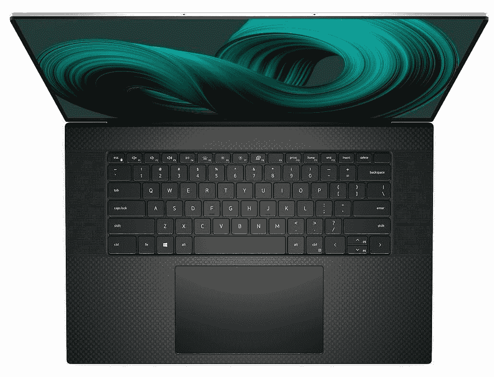

# 哪里是购买戴尔 XPS 17 的最佳地点？

> 原文：<https://www.xda-developers.com/places-to-buy-dell-xps-17/>

戴尔 XPS 17 是您现在可以买到的[最好的笔记本电脑](https://www.xda-developers.com/best-laptops/)之一，过去几年中的每个型号都非常棒。戴尔有几款[知名产品](https://www.xda-developers.com/best-dell-laptops)，但 XPS 家族可能是最著名的，至少对普通消费者来说是这样。这也有很好的理由，特别是 Dell XPS 17，对于一台配备 17 英寸显示屏的笔记本电脑来说，它的功能和体积都令人难以置信。如果您想要一台，我们绝对理解；如果您不确定哪里是购买戴尔 XPS 17 的最佳地点，我们随时可以提供帮助。

与其他一些主要品牌不同，戴尔 XPS 17 可能有点难以在主要零售商处找到。但是，仍然有几个地方可以买到最新的型号(XPS 17 9710)。我们还包括百思买，如果你想找一个可以在商店里买到笔记本电脑的地方。

作为快速复习，以下是最新型号的戴尔 XPS 17 的规格:

### 戴尔 XPS 17 规格

|  | 

戴尔 XPS 17

 |
| --- | --- |
| **处理器** | 

*   英特尔酷睿 i5-11400H(最高 4.5GHz，6 核)
*   英特尔酷睿 i7-11800H(最高 4.8GHz，8 核)
*   英特尔酷睿 i9-11900H(最高 4.9GHz，8 核)
*   英特尔酷睿 i9-11980HK(最高 5GHz，8 核)

 |
| **图形** | 

*   英特尔 UHD 显卡
*   NVIDIA GeForce RTX 3050 4GB gddr 6(60W)
*   NVIDIA GeForce RTX 3060 6GB gddr 6(70W)

 |
| **撞锤** |  |
| **存储** |  |
| **显示** | 

*   17 英寸，全高清+ (1920 x 1200)，InfinityEdge，防眩光，非触摸，500 尼特
*   17 英寸，超高清+ (3840 x 2400)，InfinityEdge，防眩光，触摸屏，100% Adobe RGB，94% DCI-P3，500 尼特

 |
| **音频** | 

*   四声道立体声扬声器(两个 2W 低音扬声器，两个 2.5 瓦高音扬声器)

 |
| **网络摄像头** | 

*   2.25 毫米 720p 高清 30fps 红外摄像头

 |
| **生物认证** | 

*   Windows Hello 红外摄像头+指纹识别器

 |
| **电池** |  |
| **端口** | 

*   4 个 Thunderbolt 4(USB C 类)端口
*   SD 读卡器
*   3.5 毫米耳机插孔
*   包括 USB Type-C 至 Type-A、USB Type-C 至 HDMI 2.0 适配器

 |
| **连通性** | 

*   黑仔 Wi-Fi 6 AX1650 (2x2)，蓝牙 5.1

 |
| **颜色** | 

*   铂金银外观+黑色内饰

 |
| **尺寸(WxDxH)** | 14.74 x 9.76 x 0.77 英寸(374.45 x 248.05 x 19.05 毫米) |
| **重量** | 4.87 磅(2.21 千克)(非触控)，5.34 磅(2.42 千克)(触控) |
| **起始价格** | $1,599.99 |

## 亚马孙

亚马逊可以说是你可能想要购买的几乎任何东西的首选目的地，戴尔 XPS 17 也不例外。您可以找到这款配备英特尔酷睿 i7-11800H、16GB 内存、512GB 固态硬盘和 60W NVIDIA GeForce RTX 3050 的笔记本电脑。它缺乏一些配置选项，但这是一个恒星机器的权利。这种配置最大的缺点可能是 RAM 和存储，但作为一个奖励，你可以在 XPS 17 上自己升级它们。此外，这款机型还配备了超高清+触摸屏显示器选项，非常适合创意工作。

笔记本电脑由亚马逊销售和运输，因此您可以对整个过程充满信心，包括您需要的退货政策。在撰写本文时，它也比戴尔的官方价格低几美元，所以这可能是购买 XPS 17 的最佳地点。

 <picture></picture> 

Dell XPS 17 (9710)

##### 戴尔 XPS 17

这款戴尔 XPS 17 配备英特尔酷睿 i7-11800H 和 60W NVIDIA GeForce RTX 3050，已经非常适合创意工作，尤其是其 4K 显示屏。它还配备了 16GB 的内存和 512GB 的存储空间，您可以在以后升级。

## （里面或周围有树的）小山谷

如果您专门寻找最新一代的戴尔 XPS 17，现在唯一可以找到它的其他地方就是戴尔。这有一些显而易见的好处-因为你直接与戴尔打交道，你可以完全按照你的喜好定制它。你可以选择任何你想要的处理器或 GPU，以及 RAM 和存储量。Dell XPS 17 的价格从 1，599.99 美元到超过 4，000 美元不等，因此您可以定制所有规格，以获得最大价值来满足您的需求。

如果您想要为您量身定制的产品，这里是购买 Dell XPS 17 的最佳地点。戴尔也是一家声誉良好的公司，所以你不必与挑剔的客户服务打交道，如果你需要，有很多方法可以联系。

 <picture></picture> 

Dell XPS 17 (9710)

##### 戴尔 XPS 17

戴尔 XPS 17 最高可配英特尔酷睿 i9-11980HK 处理器和 NVIDIA GeForce RTX 3060 显卡，相对于其尺寸而言，这是一款非常强大的笔记本电脑。您还可以获得高达 64GB 的内存和 4TB 的存储空间。

## 百思买集团

我们中的一些人不太喜欢在网上购买笔记本电脑，这是一种可以理解的心态。如果您不需要绝对最新最好的产品，上一代戴尔 XPS 17 可以在百思买买到，并提供店内提货选项。这款机型配备了英特尔酷睿 i7-10875H，已经是非常强大的 CPU 了。它还包括一个 NVIDIA GeForce RTX 2060，这仍然是一个强大的显卡，适用于各种工作负载。这款还配备了超高清+显示屏，清晰度令人难以置信。此外，它配备了 16GB 的 RAM 和 1TB 的存储，但就像最新一代一样，这两个方面都可以轻松升级。

 <picture></picture> 

Dell XPS 17

##### 戴尔 XPS 17

它可能不是最新一代的产品，但这款戴尔 XPS 17 仍然是一款强大的机器，配有英特尔酷睿 i7-10875H 和 NVIDIA GeForce RTX 2060。此外，它还配有超高清显示屏。

这些是我们现在能推荐的所有选择。Dell XPS 17 9710 在许多零售商处并不常见，但这些选项应该是您所需要的。如果你还在考虑其他选择，为什么不看看我们在百思买列出的[款最佳笔记本电脑呢？](https://www.xda-developers.com/best-laptops-available-at-best-buy/)