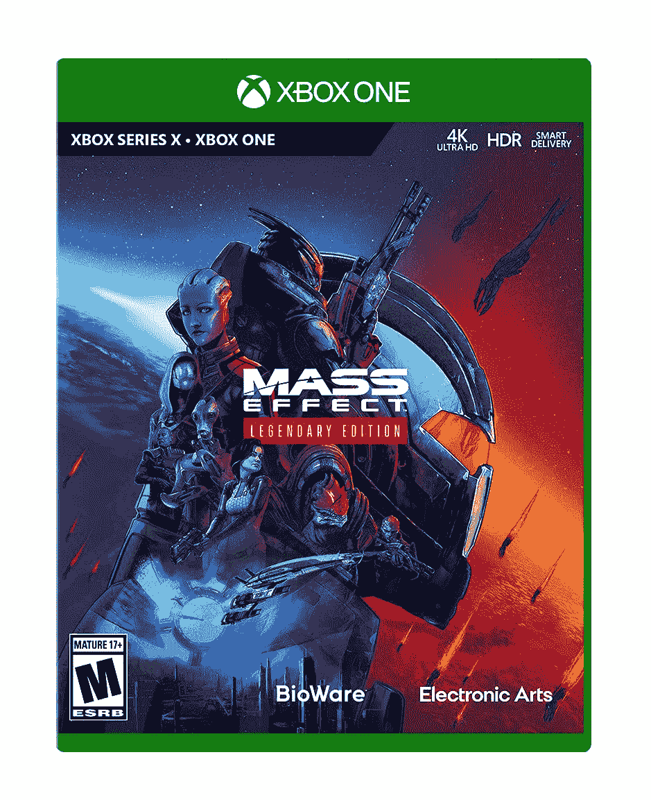
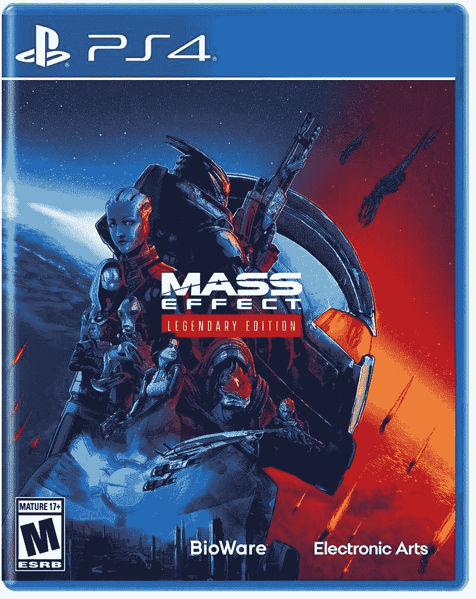

# 在 PS4/5 和 Xbox 上只需 40 美元(折 20 美元)就可以玩完整部《质量效应三部曲》

> 原文：<https://www.xda-developers.com/play-the-entire-mass-effect-trilogy-for-only-40-20-off-on-ps4-5-and-xbox/>

# 在 PS4/5 和 Xbox 上只需 40 美元(折 20 美元)就可以玩完整部《质量效应三部曲》

质量效应传奇版是前三个质量效应游戏的更新版本，现在以低于通常价格 20 美元的价格出售。

*质量效应*是最有影响力的(也是最有趣的！)有史以来的科幻游戏系列，大多数人都认为前三个游戏是最好的。最初的三部曲在今年早些时候被重新灌制，并作为一个单独的包发行，*质量效应传奇版*。现在你可以在几家零售店花 39.99 美元买到*传奇版*——比通常价格节省 20 美元。

质量效应游戏发生在 22 世纪的另一个宇宙中，在那里你扮演精英士兵指挥官谢泼德，他帮助对抗“收割者”合成星际飞船。这不仅仅是另一个太空射击游戏，因为有 RPG 元素和大量对话。新的*传奇版*版本包括视觉更新，感觉更像后来的质量效应游戏的战斗，改进的瞄准辅助，更频繁的自动保存，以及其他生活质量的改善。

 <picture></picture> 

Mass Effect Legendary Edition (Xbox)

##### 质量效应传奇版(Xbox)

这个 Xbox One 版本的传奇版在较新的主机上运行良好，但没有 X/S 系列特有的改进。

 <picture></picture> 

Mass Effect Legendary Edition (PS4)

##### 质量效应传奇版(PS4)

这款 PS4 版传奇版在 PS5 上也很好用。

*PlayStation 4 的 Mass Effect 传奇版*在 Metacritic 上有一个 [86/100，而 Xbox 版本的得分为](https://www.metacritic.com/game/playstation-4/mass-effect-legendary-edition/critic-reviews) [90/100](https://www.metacritic.com/game/xbox-one/mass-effect-legendary-edition/critic-reviews) 。这些游戏与 Xbox Series X/S 和 PlayStation 5 向前兼容，但目前没有充分利用新主机硬件的更新计划。