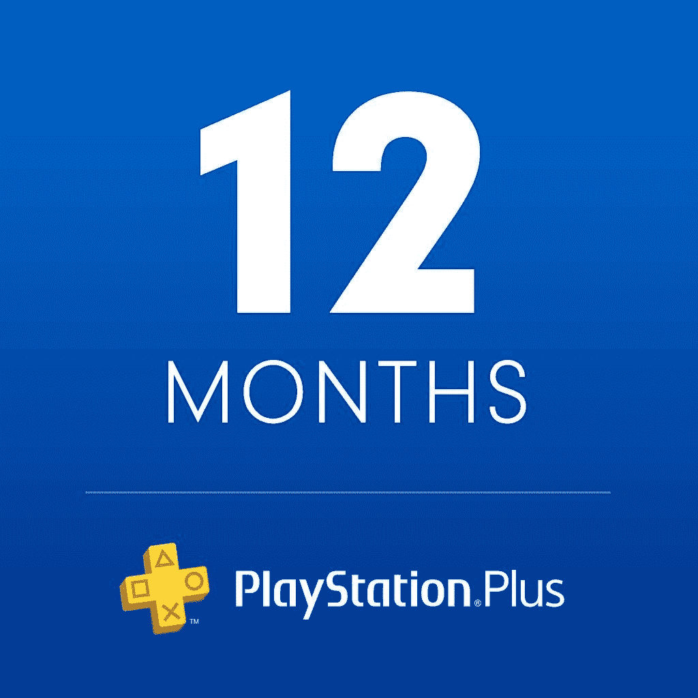
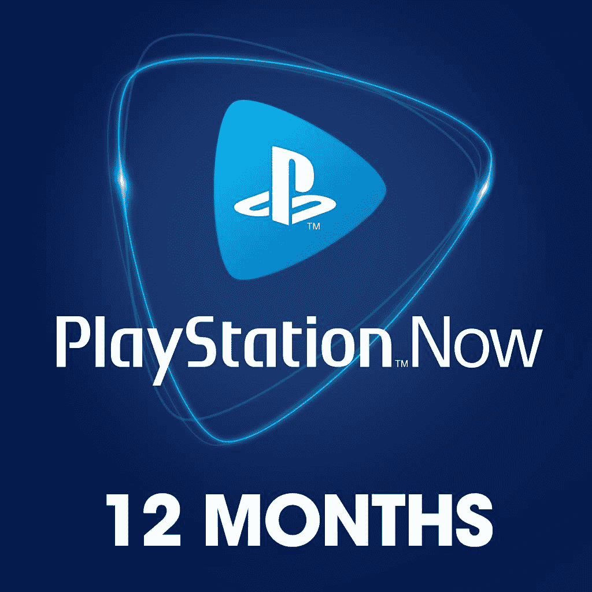

# PlayStation Plus 和 PlayStation Now 正在为亚马逊黑色星期五促销

> 原文：<https://www.xda-developers.com/playstation-plus-now-amazon/>

你可能听说过亚马逊的黑色星期五促销已经提前开始了。有成千上万的商品在出售，要找到你想要的东西可能有点难。好吧，这里有一个交易你不需要搜索- 12 个月的 PlayStation Plus 和 PlayStation Now 订阅是打折的！你可以以每张 45 美元的价格买到它们。

通常为 60 美元，这使您每次订阅节省了 15 美元。这种数字订阅代码不经常在亚马逊上出售，所以如果你有 Prime Rewards Visa，这是少数几次你可以从在线零售商那里买到它并赚取一些现金返还的机会之一。

但是，了解这两种订阅之间的差异很重要。PlayStation Plus 是游戏玩家希望获得的更常见的订阅，它提供了你想要的 PlayStation 4 或 PlayStation 5 的大多数好处([，如果你碰巧有一个](https://www.xda-developers.com/playstation-5-restocks/))。PlayStation Plus 让你能够在线玩游戏，所以这很重要，但你也可以获得其他好处。您可以每月获得免费的 PlayStation 4 和 5 游戏，利用云备份保存您的游戏，并获得特殊的 PS+销售折扣。

 <picture></picture> 

PlayStation Plus (12 months)

##### 索尼游戏机增强版

有了 PlayStation Plus，您可以获得免费游戏、销售、在线多人游戏等等。享受亚马逊 12 个月订阅的优惠！

PlayStation Now 是索尼的订阅服务，用于播放和玩游戏。只要你有订阅，你就可以在 PlayStation 5、PlayStation 5 和 PC 上玩 PlayStation Now 库中的任何游戏。这类似于 [Xbox 游戏通行证](https://www.amazon.com/Xbox-Game-Pass-Ultimate-Membership/dp/B07TGNFVWV?tag=xda-qhumnq8-20&ascsubtag=UUxdaUeUpU30723&asc_refurl=https%3A%2F%2Fwww.xda-developers.com%2Fplaystation-plus-now-amazon%2F&asc_campaign=Short-Term)服务！

 <picture></picture> 

PlayStation Now (12 months)

##### 索尼游戏站现在

有了 PlayStation Now，你可以随时在你想要的服务上播放任何游戏。立即在亚马逊上享受 12 个月订阅的优惠！

你想看看更多亚马逊黑色星期五的优惠吗？他们有一个完整的登陆页面！你甚至可以[在一些流行的 PlayStation 4 游戏上节省高达 75%的费用](https://www.amazon.com/b/ref=gbps_tit___41c0231f?tag=xda-qhumnq8-20&ascsubtag=UUxdaUeUpU30723&asc_refurl=https%3A%2F%2Fwww.xda-developers.com%2Fplaystation-plus-now-amazon%2F&asc_campaign=Short-Term)...你可以在 PlayStation 5 上升级播放。但这只是亚马逊商店里许多许多印章中的几个，所以一定要查看他们的交易，寻找更多的好东西！