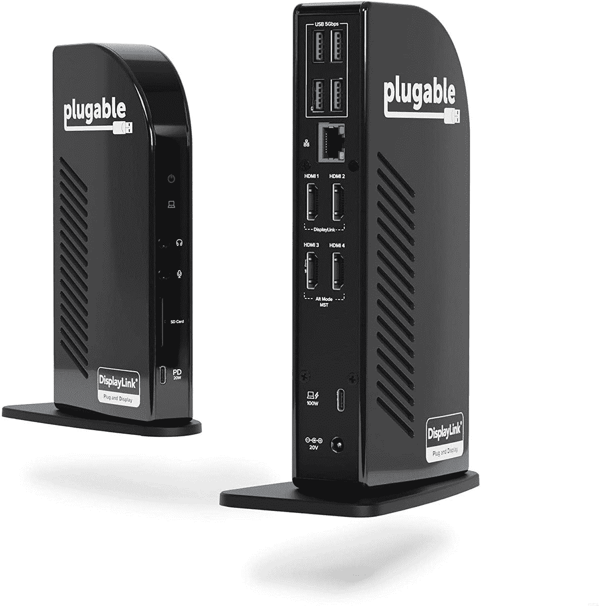

# Plugable 的新 USB-C 坞站支持多达四台显示器

> 原文：<https://www.xda-developers.com/plugable-usb-c-dock-four-displays/>

Plugable 宣布了新的 UD-3900C4 USB-C 坞站，宣传可以同时连接多达四个显示器到你的 PC。当然，它也有其他端口，包括 USB Type-A 和以太网。该坞站通过标准的 USB-C 端口连接，而不是 Thunderbolt，这意味着它可以与大多数现代电脑兼容。

该坞站配有四个 HDMI 端口，当所有端口同时插入时，您可以使用多达四台 60Hz 的全高清显示器。在 Windows 上，所有四个显示器都是独立的，但如果你使用的是 Mac，则只能连接三个独特的外部显示器，第四个显示器将镜像第三个显示器。这是因为 dock 对前两个屏幕使用 DisplayLink 技术，并通过 DisplayPort Alt 模式使用多流传输(MST)来连接第三个和第四个屏幕。MAC 不支持 MST，因此除了 DisplayLink 连接之外，只支持一种独特的显示器。

除了四个 HDMI 端口，可插拔的 UD-3900C4 坞站还包括四个 USB Type-A 端口(速度均为 5Gbps)和背面的千兆以太网，外加一个 SD 读卡器，一个带有 20W 充电功能的 USB-C 端口，以及前面的分离式音频插孔。主机连接也是 USB-C，在背面，它也支持 100W 的功率传输，所以你可以毫无问题地为大多数笔记本电脑充电。

可插拔的 UD-3900C4 现在售价 349 美元，在价格上与许多迅雷坞站不相上下。然而，这肯定是更先进的 USB-C 坞站之一，甚至大多数 Thunderbolt 坞站在一个封装中也没有这么多显示输出，所以价格是合理的。如果你想要一次连接多个显示器的便捷方式，你可以抓住下面的 dock。

 <picture></picture> 

Plugable UD-3900C4 USB-C Docking Station

##### 可插拔 USB 3.0 通用笔记本电脑坞站

可插拔的 UD-3900C4 是一个坞站，可以连接多达四台全高清显示器，以及其他外围设备到您的笔记本电脑。