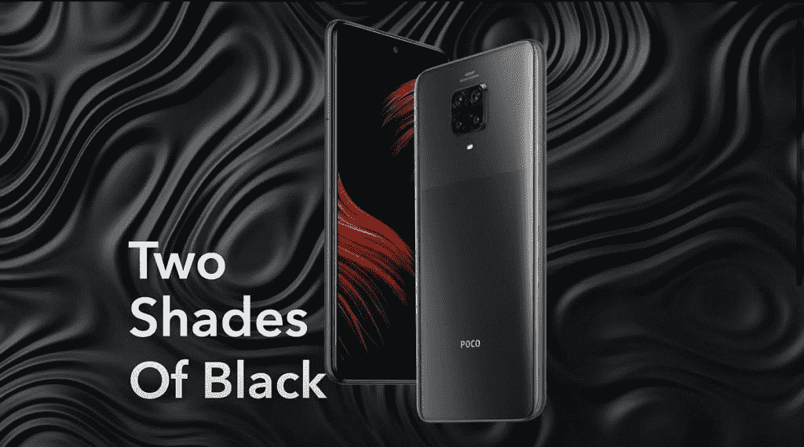

# POCO M2 Pro 宣布推出骁龙 720G 和 33W 快速充电器

> 原文：<https://www.xda-developers.com/poco-m2-pro-launched-india-snapdragon-720g-5000mah-battery-33w-fast-charger/>

POCO，[小米的一个独立分支，](https://www.xda-developers.com/xiaomi-india-spins-off-poco-independent-brand/)刚刚在印度发布了一款新的智能手机。被称为波科 M2 专业，最新进入波科阵容是面向预算部分。这款手机的价格非常有竞争力，并提供了优质的设计，四摄像头设置，大容量电池和 33W 快速充电器。

## POCO M2 专业版:规格

| 

规格

 | 

波科 M2 专业版

 |
| --- | --- |
| **尺寸和重量** | 

*   165.7 x 76.6 x 8.8 毫米
*   大猩猩玻璃 5 正面和背面
*   塑料框架
*   209 克

 |
| **显示** | 

*   6.67 寸 FHD+ (2400 x 1080) IPS 液晶屏；
*   中心加权穿孔显示
*   HDR10 支持

 |
| **SoC** | 高通骁龙 720G:

*   2 个 Kryo 465 金(基于 Cortex-A76)内核@ 2.3GHz
*   6 个 Kryo 465 银 Cortex-A76 内核@ 1.8GHz

肾上腺素 618 |
| **RAM 和存储器** | 

*   6GB RAM LPDDR4
*   64GB/128GB UFS 2.1

 |
| **电池&充电** | 

*   5000 毫安时电池
*   33W 快速充电器(包装盒内)

 |
| **后置摄像头** | 

*   **初级:** 48，f/1.8，0.8 μ
*   **二级:** 8MP 广角，f/2.2，119
*   **第三:**500 万像素超级微距，自动对焦
*   **四元:** 2MP 深度传感器，f/2.4

 |
| **前置摄像头** |  |
| **其他特征** | 

*   3.5 毫米耳机插孔
*   蓝牙 5.0
*   印度星座导航
*   双频全球定位系统
*   无线网络 802.11a/b/g/n/ac
*   USB 类型-C，USB 2.0
*   侧装式指纹扫描仪
*   红外线增强器

 |
| **安卓版本** | Android 10 配 MIUI 11 for POCO |

POCO M2 专业版采用 6.67 英寸全高清+液晶显示屏，中央打孔，用于放置前置摄像头。显示器支持 HDR10 内容。背面和正面由 Gorilla Glass 5 保护，而框架由塑料制成，其中还包含指纹扫描仪。与 POCO X2 不同，这里的显示器没有提供更高的屏幕刷新率。

为 POCO M2 Pro 提供动力的是[高通骁龙 720G 八核 SoC](https://www.xda-developers.com/qualcomm-snapdragon-720g-662-460-navic/) ，它具有 2 个主频为 2.3GHz 的 ARM Cortex-A76 内核和 6 个主频为 1.8GHz 的 ARM Cortex-A55 内核，再加上 Adreno 618 GPU、高达 6GB 的 LPDDR4 RAM 和 128GB 的 UFS 2.1 存储。谈到相机，该设备具有四摄像头阵列，包括 48MP 主传感器、8MP 超广角镜头、5MP 深度传感器和 2MP 微距镜头。与此同时，前置摄像头是一个 16MP 的射手。

POCO M2 Pro 配备了 5000 毫安时电池，并支持通过包装盒内的 33W 快速充电器进行快速充电。在软件方面，这款手机搭载了基于 Android 10 的 MIUI 11 for POCO。POCO M2 Pro 的其他值得注意的亮点包括 IR blaster，3.5 毫米音频插孔，底部发射扬声器，蓝牙 5.0，支持 VoWiFi 的双 VoLTE，以及支持印度星座导航(NavIC)。

**[POCO M2 职业 XDA 论坛](https://forum.xda-developers.com/poco-m2-pro)**

如果 POCO M2 专业听起来很熟悉，那是因为它是。POCO 的所有设备都是小米设备的品牌，这是相同的。POCO M2 Pro 是 [global Redmi Note 9 Pro](https://www.xda-developers.com/xiaomi-launches-redmi-note-9-globally-alongside-mi-note-10-lite/) 的近亲，后者又是 [Redmi Note 9 Pro Max](https://www.xda-developers.com/xiaomi-redmi-note-9-pro-max-snapdragon-720g-33w-fast-charging/) 的近亲——区别在于 48MP 摄像头与 64MP 摄像头的形式。为了更好地理解这一点，POCO M2 Pro 位于印度红米 Note 9 Pro 和印度红米 Note 9 Pro Max 之间，这两款设备一开始就非常相似。奇怪的是，这是 POCO 首次在印度推出已经以某种形式存在的设备。那么 POCO 和小米的区别在哪里呢？[在之前的采访和互动](https://www.xda-developers.com/new-poco-phone-coming-india-july-2020-but-not-f2-pro/)中，POCO 总经理 C. Manmohan 先生承认 POCO 确实与小米共享一个集中的产品研发部门。是业务的其他腿，比如上市策略和销售是独立的，和小米有区别的。POCO 的优势显然在于社区及其反馈，这是团队可以工作和发展的地方。还有待观察如何 POCO 将利用其优势与 POCO M2 亲。

## 定价和可用性

POCO M2 Pro 将于 7 月 14 日通过 Flipkart 开始销售，4GB + 64GB 版本的起价为₹13,999(187 美元)。6GB + 64GB 的型号将花费你₹14,999(200 美元)，而 6GB + 128GB 的顶级型号将花费₹16,999(227 美元)。该设备将有三种颜色可供选择。