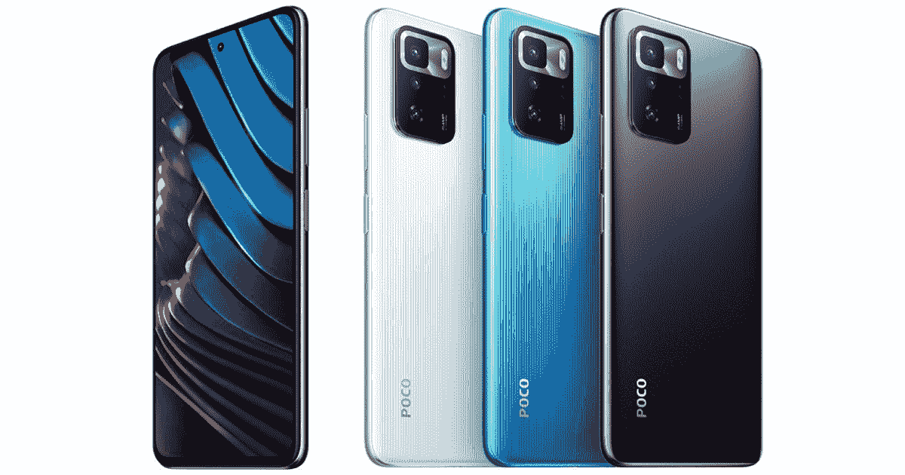

# POCO X3 燃气轮机手动操作:120 赫兹和更低的顶级触觉

> 原文：<https://www.xda-developers.com/poco-x3-gt-hands-on/>

POCO 为中东、拉丁美洲、非洲和东南亚市场推出了一款新手机，令人惊讶的是，这是小米已经在其他地方发布的现有设备的更名版本。在这种情况下，混淆因素甚至更高，因为“新”POCO X3 GT 是[红米 Note 10 Pro](https://www.xda-developers.com/redmi-note-10/) 的更名版本，而不是我在 3 月份测试的[全球红米 Note 10 Pro。相反，POCO X3 GT 是中国版红米 Note 10 Pro 的更名。](https://www.xda-developers.com/xiaomi-redmi-note-10-pro-review/)

除了营销诡计，POCO X3 燃气轮机是另一个非常有价值的产品。在我看来，与一加/OPPO/Realme 相比，小米及其子品牌已经找到了正确的妥协方案，在削减成本的同时，仍能提供重要的东西。

***关于这次动手:**小米总部 7 月 24 日送我一辆 POCO X3 GT。小米在这篇文章中没有投入。*

\ r \ nht TPS://www . YouTube . com/watch？v = sdtjN0U _ wRw \ r \ n

### POCO X3 燃气轮机:规格。点击/单击以显示。

## POCO X3 GT:规格

| 

规格

 | 

POCO X3 GT

 |
| --- | --- |
| **构建** | 

*   大猩猩玻璃 Victus 正面；塑料背面和侧面

 |
| **尺寸&重量** | 

*   163.3 x 75.9 x 8.9 毫米
*   193g

 |
| **显示** | 

*   6.6 英寸 IPS 液晶屏
*   1080 x 2400 像素
*   120 赫兹刷新率
*   直接热轧制

 |
| **SoC** | 联发科天玑 1100 |
| **闸板&存放** | 

*   8GB LPDDR4X
*   128GB/256GB UFS 3.1

 |
| **电池&充电** | 

*   5000 毫安时
*   67W 快速充电(含砖)

 |
| **安全** | 侧装式指纹扫描仪 |
| **后置摄像头** | 

*   小学:6400 万，女/1.79
*   二级:800 万像素超宽，f/2.2
*   第三级:2MP 宏，f/2.4

 |
| **前置摄像头** | 16MP |
| **端口** | USB 类型-C |
| **音频** | 立体声扬声器 |
| **连通性** | 

*   5G
*   无线网络 6
*   蓝牙 5.2
*   红外线增强器

 |
| **软件** | 安卓 11 |

## POCO X3 GT:硬件

POCO X3 GT 的硬件对我来说是矛盾的——一个拥有处理所有最新旗舰产品特权的人——因为它同时给人以预算和溢价的感觉。例如，第一次将设备从盒子中取出，我的手和眼睛*立即注意到*带有奇怪指纹磁铁涂层的塑料机身。看着相机镜头，我已经知道它缺少变焦镜头。但当我启动设备时，迎接我的是一个充满活力的、相对薄边框的屏幕，有着流畅的动画。

打字也能带来即时的满足感，因为 X3 GT 使用了小米的“X 轴线性电机”，这在常规术语中意味着非常精确、有力的触觉。我很想说这是顶级旗舰 Android 级别的触觉产品，尽管我确实发现 [Galaxy S21 Ultra](https://www.xda-developers.com/samsung-galaxy-s21/) 稍微好一点。

塑料框架摸起来...plasticky，缺乏当拿起一个有铝(或不锈钢)栏杆的设备时那种令人满意的“摸起来冰凉”的感觉。该框架在设备的顶部和底部装有扬声器格栅，这意味着您可以从两侧获得同等输出的真正立体声。

X3 GT 感觉很轻(193 克)，很容易握持，但作为一个被触摸过[小米 Mi 11 Ultra](https://www.xda-developers.com/xiaomi-mi-11/) 的人，我发现屏幕的边缘很锐利，因为它们不像 Mi 11 Ultra 那样弯曲和无缝融合。我承认我在这里吹毛求疵，但我只是给出了我作为一个处理各种类型手机的人的经验——POCO X3 GT 有一些感觉很好的部分(那些扬声器很棒)，然后一些部分提醒我“*哦，是的，这是一款经济型手机*

该设备内部是联发科天玑 1100，这是一款 6 个月大的芯片，是这家台湾芯片制造商旗舰 SoC 系列的一部分。虽然它的排名低于 Dimensity 1200，但它仍然是一个集成 5G 和令人尊敬的 GPU 的 6 纳米 SoC。您还可以获得 UFS 3.1 存储，但 RAM 是 LPDDR4X，而不是最新的 LPDDR5。

总的来说，我认为 POCO 在削减成本方面做出了正确的决定。当然，像我这样的特权旗舰用户会嘲笑塑料外壳，但大多数人还是会在手机上放一个保护套(这里也有一个保护套)。与此同时，一个出色的触觉引擎和高刷新率屏幕带来了切实可见的好处，优于其他品牌的中端产品。

## POCO X3 GT:软件

POCO X3 GT 运行 Android 11，上面是 MIUI 全球版 12.5.2。这个版本在设置中标记为“MIUI For POCO”，我在我的小米 Mi 11 Ultra 中看到一些与标准 MIUI 12.5 运行的轻微偏差。

最大的变化是软件默认从通知面板中移除了快捷切换按钮。相反，快捷切换现在被放置在它自己的 iOS 控制中心一样的窗格中，需要从屏幕的右上角滑动。从屏幕的中上方或左上方滑动，或者从屏幕中间的任何地方滑动，都会像往常一样打开通知面板，但是当没有通知时，它现在看起来是空的。

我不喜欢这种改变——我认为 Android 的通知面板很好——幸好有一个回到传统面板的选项。

总体而言，该软件具有小米一贯的异想天开和深思熟虑的特点。我特别喜欢只需三指长按就能抓取部分截图(形状由我选择)的功能。但是在设置中仍然存在只与屏幕导航按钮(而不是滑动手势)一起工作的破碎的单手模式。

## POCO X3 GT:相机

POCO X3 GT 的摄像头系统非常耐用，高于中低端设备的平均水平。6400 万像素的摄像头对焦速度很快，白天拍摄的照片也很有冲击力。8MP 超宽在客观上是硬件弱项，但小米的软件智能可以帮助制作出漂亮的照片。尤其是在日落之后；如果在自动模式下拍摄，超宽相机会产生柔和、模糊的照片，但夜间模式会显著改善这种情况。

还有第三个镜头——一个 200 万像素的微距相机——可以拍摄出像样的特写镜头，但你仍然无法像小米 Mi 11 Ultra 或三星 Galaxy S21 Ultra 的微距模式那样接近。这些 2MP 传感器多是营销噱头。在正面，自拍相机做得很好，但在逆光下拍摄很困难。

POCO X3 GT 的相机真正闪耀的地方是在过去几个月小米手机稳定的附加拍摄模式中，出色的克隆照片/视频模式又回来了——允许用户快速捕捉同一个人两次、三次或四次的特技照片/视频。人工智能天空编辑器也回来了。

## POCO X3 GT:一般性能

在我测试的日子里，我没有遇到任何关于 POCO X3 GT 或 Dimensity 1100 的问题。这款手机可以毫无问题地处理图形密集型游戏，如*现代战斗对*。出色的立体声扬声器和平板屏幕使该设备非常适合游戏或观看视频。如前所述，顶级的触觉真的增加了我使用一部制作精良的手机的体验。

电池寿命也很好——它可以持续我一整天 14 个小时，并且剩余超过 20%的电池。

## 最后的想法

虽然手机评论者和科技媒体可能会对导致混淆手机名称的更名策略感到恼火，但毫无疑问，小米目前在市场上制造了一些最好的，如果不是最好的，最有价值的智能手机。

POCO X3 GT 的起价相当于 8GB 内存、128GB 存储型号的 299 美元左右，在这个价格范围内，它拥有最好的屏幕、电池大小和触觉。

 <picture></picture> 

POCO X3 GT

##### POCO X3 GT

POCO X3 GT 提供了 120Hz 屏幕，5,000 mAh 电池，高于平均水平的主摄像头和旗舰级触觉引擎，价格非常实惠。