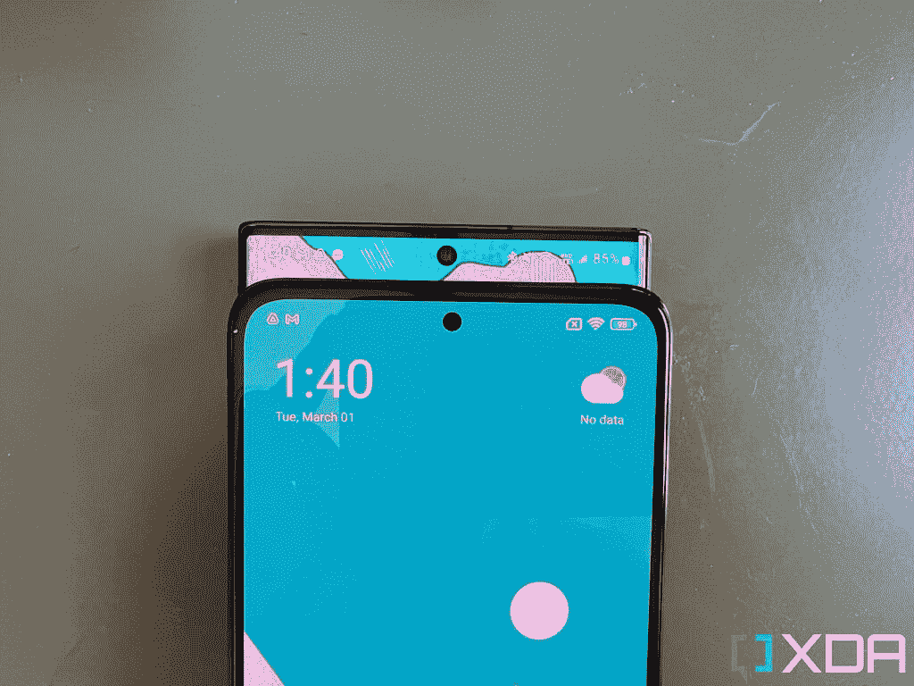

# POCO X4 Pro 动手操作:主摄像头和显示屏远高于其€299 英镑的价格

> 原文：<https://www.xda-developers.com/poco-x4-pro-hands-on/>

小米因许多事情而闻名，但在 XDA 这里经常讨论的两个问题是“*小米是性价比最高的*”和“*小米不断对现有手机进行更名，以另一个名字发布，这令人恼火和困惑。*“在世界移动通信大会的第一天，这家总部位于北京的科技巨头再次做到了这两点，尽管不是直接做到。 [POCO 发布了 POCO X4 Pro](https://www.xda-developers.com/poco-x4-pro-5g-m4-pro-global-launch/) ，这是一款在欧洲销售的令人惊叹的平价中档车，起价仅为€299 英镑(约 335 美元)，比美国销售的大多数 500 美元的手机提供更多功能和更好的组件。但这款手机基本上只是小米上个月在另一个地区宣布的红米 Note 11 Pro 的更名。对了，这个全球版的红米 Note 11 Pro 也和中国版的红米 Note 11 Pro 不一样。[迷茫尚未](https://www.xda-developers.com/opinion-smartphone-branding-out-of-control/)？

但无论如何，也许我们在 XDA 是吹毛求疵的——我们对这些更名感到困惑，因为我们必须跟踪每年在多个地区发布的 36 款小米设备。但对于欧洲的普通消费者来说，他们很快就能买到价格低于€300 英镑的手机，感觉这款手机可以被视为现代旗舰产品。只要手机能发挥应有的作用，手机上的品牌标签说什么并不重要。而 POCO X4 Pro 做到了这一点。

 <picture></picture> 

Poco X4 Pro 5G

##### POCO X4 Pro

POCO X4 Pro 带来了一个 120Hz 的大有机发光二极管屏幕和一个非常好的 108MP 摄像头，价格低廉。

## POCO X4 Pro:规格

| 

规格

 | 

POCO X4 Pro

 |
| --- | --- |
| **构建** | 

*   大猩猩玻璃 5 正面
*   普通玻璃背板
*   塑料中框

 |
| **尺寸&重量** | 

*   164.19 x 76.1 x 8.12mm 毫米
*   205 克

 |
| **显示** | 

*   6.67 英寸 FHD+ AMOLED
*   2400 x 1080p 像素
*   120 赫兹刷新率
*   360Hz 触摸采样率
*   DCI-P3 宽色域
*   1200 尼特峰值亮度

 |
| **SoC** | 

*   高通骁龙 695
*   Adreno 619 GPU

 |
| **闸板&存放** | 

*   6GB LPDDR4X + 128GB UFS 2.2
*   8GB + 256GB

 |
| **电池&充电** | 

*   5000 毫安时
*   67W 有线快速充电支持
*   含 67W 充电器

 |
| **安全** | 侧装式指纹传感器 |
| **后置摄像头** | 

*   主要:108MP 三星 HM@ f/1.9
*   超宽:800 万像素/2.2 英寸
*   宏:2MP f/2.4

 |
| **前置摄像头** | 1600 万像素 f/2.4 前置摄像头 |
| **端口** | USB 类型-C |
| **音频** | 双立体声扬声器 |
| **连通性** |  |
| **软件** |  |
| **其他特性** | 

*   z 轴直线电机
*   国家足球联盟
*   红外线增强器

 |

* * *

## 仅仅€299 就有很多好的硬件

POCO X4 Pro 采用 6.67 英寸、120Hz 的 FHD+ OLED 面板，边框相对较薄，可能是业内最小的打孔机。如果你是一个手机发烧友，你会吹毛求疵，当然，你可以看到这款 OLED 面板不在 Galaxy S22 Ultra 或 OPPO Find X5 Pro 面板的水平上。刷新率不能即时改变，亮度只有 700 尼特，所以在强烈的阳光直射下看起来不太好-但对于大多数不会注意到这些事情的普通消费者来说，这个屏幕看起来很棒。它充满活力，视角极佳，看起来足够现代。

这个前面板被 Gorilla Glass 5 覆盖。背面也有一个玻璃面板——但只是普通的玻璃——虽然我觉得我的单元的黑色有点沉闷，但这里有一层涂层，当光线以特定角度照射时，它会给手机带来这种光条纹图案。尽管如此，黄色和蓝色的模型看起来更引人注目。

顶部有一个大的摄像头岛，容纳了 108MP 主摄像头，8MP 超宽，以及几乎毫无意义的 2MP 宏观传感器，还有一个 LED 闪光灯。在这个价格范围内，主摄像头的性能非常好，甚至在对抗价格范围以上的手机时也很有能力。事实上，我对售价 335 美元的 X4 Pro 和售价 1100 美元的 Galaxy S22 Ultra 的主摄像头进行了一些并排拍摄，老实说，你必须放大、眯眼、仔细观察才能真正确定三星的图像“赢”在哪里。我将在下一节详细讨论这些示例。

手机内部是一个支持 5G 连接的骁龙 695 SoC，一个 5000 毫安的电池，可以以 67W 的速度充电-充电器包含在盒子里-一个出色的触觉引擎，我想说几乎是旗舰手机级别，一个耳机插孔，甚至是 IP53 防水溅。我只使用了这款手机两天，所以这不是关于电池的确切结论，但在这两天中，这款手机一次充电可以轻松坚持整整 13 个小时。

就像我之前说的，小米制造了性价比最高的智能手机。这款手机带来了明显优于在美国销售的类似价格设备的组件(在美国，手机市场的竞争*远不如*),如一加诺德 200 或 Galaxy A42。正是这样的手机使得像印度这样的市场更具竞争力，所以看到它们进入更多像欧洲这样的市场总是一件好事。

* * *

## POCO X4 Pro 的主摄像头可以自己拿，超宽也就可以了

如前所述:这里有一些 335 美元的 POCO X4 Pro 与 1100 美元的 Galaxy S22 Ultra 相比拍摄的主要镜头。这不是一个公平的比较，但无论如何，这就是。

你可以看到 Galaxy S22 Ultra 的拍摄具有更好的动态范围，白天拍摄的阴影更准确地反映了场景的外观，晚上，右侧黑暗的街道照明更好。但考虑到三星旗舰机的价格是其四倍，POCO X4 Pro 的表现令人印象深刻。就主摄像头而言，你必须找到一个像下面这样非常有挑战性的镜头，才能最终看到三星的明显胜利。

POCO X4 Pro 的 108MP 传感器和 1/1.52 英寸的传感器远远超出了其价格范围。由于大型传感器，它可以自然地吸收光线，所以我很少需要夜间模式；有我们与专业相机联系在一起的浅景深；X4 Pro 甚至使用了与三星相同的 9 合 1 宁滨技术。这里有更多的 POCO X4 Pro 样品。

超宽传感器将无法跟上 1000 美元以上的旗舰产品，因为它在细节上明显更软，不再能够实现强大的 HDR，但对于这个价格来说，它仍然是一个相当不错的超宽。

视频性能是这款手机显示其 335 美元价格标签的根源。分辨率最高可达 1080p，而且没有任何稳定性。任何走路和说话的视频看起来都不稳定。

尽管穿孔明显较小，但 X4 Pro 的自拍相机很好；它可以在弱光或恶劣的背光场景下适当地暴露我的脸。

 <picture></picture> 

The POCO X4 Pro's hole-punch compared to the Galaxy S22 Ultra's hole-punch.

尽管有小孔，自拍相机也很坚固，能够在弱光或逆光的情况下适当地曝光我的脸。

除非你经常将它与旗舰相机智能手机和像素偷窥进行比较，否则 POCO X4 Pro 应该可以满足你的休闲摄影需求。

* * *

## POCO X4 Pro 作为一款中端游戏/电影机器也相当不错

在 POCO X4 Pro 上玩游戏或观看视频是一种享受，因为它的屏幕很大，也很平，因此更容易握持。当我在*马克思·佩恩*或*现代战争 5 中升级时，骁龙 695 SoC 和小米的液冷系统让手机不停地运转。*后者，确实看到偶尔帧率口吃，但没有什么不能忍受的。

* * *

## 不过还是在 Android 11 上

POCO X4 Pro 运行于 T4 的 MIUI 13，而不是安卓 11。令人失望的是，这款手机没有升级到 Android 12，因为已经有小米手机运行 Android 12 了。但对于基于小米的智能手机来说，MIUI 版本比底层的 Android 版本重要得多。不过，我们还是希望看到它基于 Android 12。

软件体验很好——如果你在过去几年里用过小米手机，你就会知道会发生什么。小米的用户界面丰富多彩，充满了异想天开的动画，但也有一些怪癖，比如设置页面有过于复杂的图层。例如，手机自带屏幕导航按钮，如果你想切换到手势导航，你必须在设置的“全屏显示”部分找到它，这是与设置的主要“显示”部分分开的*。如果我几个月没有使用 MIUI，我总是会额外花 20-30 秒浏览设置，对每部 Android 手机进行简单的更改。*

很多人确实喜欢 MIUI 提供的所有设置。因此，如果你习惯于看到大量的功能和定制，你应该对 MIUI 感到宾至如归。

* * *

## 很难找到比这个价格更好的了

POCO X4 Pro 的价格约为 335 美元，远远高于其价格范围，市场上任何不能或不想支付超过 400 美元的手机都很难找到比这更好的产品。主摄像头和显示屏尤其令人印象深刻，感觉它们属于一部售价 600 美元或以上的手机。如果小米还没有为你的地区宣布这款手机，不要担心，因为正如我们所说，这只是一款重新包装的 Redmi Note 11 Pro，所以你可以选择购买这款设备，并获得非常相似的性能。

 <picture></picture> 

Poco X4 Pro 5G

##### POCO X4 Pro

POCO X4 Pro 带来了一个 120Hz 的大有机发光二极管屏幕和一个非常好的 108MP 摄像头，价格低廉。