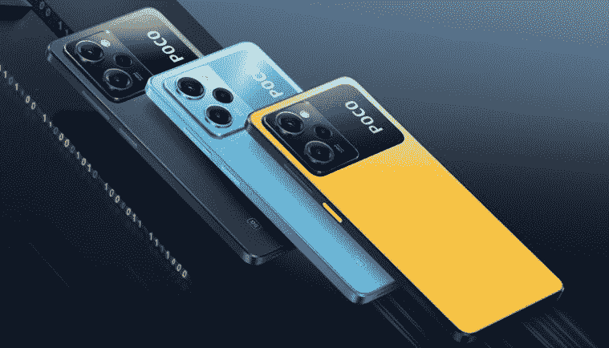
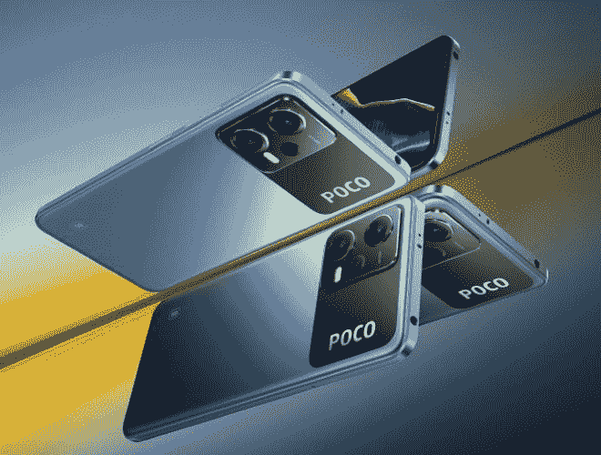

# Poco X5 系列以更新的设计和新的 SOC 首次亮相

> 原文：<https://www.xda-developers.com/poco-x5-series-launch/>

Poco X4 Pro 是我们去年未在美国销售的最佳廉价 Android 手机的选择，所以我们对它的继任者寄予厚望。Poco 似乎已经通过其全新的 Poco X5 系列实现了这一目标。与去年一样，新系列包括两款中端设备:Poco X5 和 Poco X5 Pro。这两款机型都采用了类似于 [Redmi 最新 Note 系列阵容](https://www.xda-developers.com/redmi-note-12-series-launch/)的更新设计，并封装了升级的 SOC 以提高性能。

如果你在市场上寻找一款新的中端智能手机，并且一直在急切地等待 Poco 的最新设备，这里有关于 Poco X5 和 Poco X5 Pro 你应该知道的一切。

## Poco X5 系列:规格

| **规格** | **Poco X5** | **Poco X5 Pro** |
| **尺寸&重量** | 

*   165.88 x 76.21 x 7.98mm 毫米
*   189 克

 | 

*   162.91 x 76.03 x 7.9mm 毫米
*   181g

 |
| **显示** | 

*   6.67 英寸 FHD+ AMOLED 点显示器
*   2400 x 1080p 分辨率
*   120 赫兹刷新率
*   高达 240Hz 的触摸采样率
*   1200 尼特峰值亮度
*   康宁大猩猩玻璃 3
*   DCI-P3 宽色域

 | 

*   6.67 英寸 FHD+ AMOLED 点显示器
*   2400 x 1080p 分辨率
*   120 赫兹刷新率
*   高达 240Hz 的触摸采样率
*   900 尼特峰值亮度
*   康宁大猩猩玻璃 5
*   DCI-P3 宽色域
*   10 位颜色深度

 |
| **SoC** | 高通骁龙 695 | 高通骁龙 778G |
| **闸板&存放** | 

*   6GB 内存+ 128GB 存储空间
*   8GB + 256GB
*   最高可扩展至 1TB

 | 

*   6GB 内存+ 128GB 存储空间
*   8GB + 256GB

 |
| **电池&充电** | 

*   5000 毫安时
*   33W 有线快速充电
*   含 33W 充电器

 | 

*   5000 毫安时
*   67W 有线快速充电
*   含 67W 充电器

 |
| **安全** | 侧装式指纹传感器 | 侧装式指纹扫描仪 |
| **后置摄像头** | 

*   初级:4800 万华氏度/1.8
*   超宽:800 万像素 118 度视野
*   宏:2MP f/2.4

 | 

*   初级:108 百万像素
*   超宽:800 万像素 120 度视野
*   宏:2MP f/2.4

 |
| **前置摄像头** | 1300 万像素 f/2.45 | 1600 万像素 f/2.4 |
| **端口** | 

*   USB-C
*   3.5 毫米耳机插孔

 | 

*   USB-C
*   3.5 毫米耳机插孔

 |
| **连通性** | 

*   5G (sub6)
*   4G LTE
*   蓝牙 5.1
*   802.11 无线网络
*   国家足球联盟

 | 

*   5G (sub6)
*   4G LTE
*   蓝牙 5.2
*   802.11 无线网络
*   国家足球联盟

 |
| **软件** | Poco 的 MIUI 13 | Poco 的 MIUI 14 |
| **其他特性** | 红外线增强器 |  |
| **颜色** |  |  |

由于采用了更强大的高通骁龙 778G 芯片，Poco X5 Pro 的性能比前代产品有了显著提升。它配备了高达 8GB 的内存和 256GB 的存储空间，以及 5000 毫安时的大电池，支持 67W 有线快速充电。它的相机设置保持不变，仍然采用 108MP 主拍摄器，8MP 超宽相机，以及背面的 2MP 微距相机。在正面，它有一个 16MP 自拍相机。

 <picture></picture> 

Poco X5 Pro

Pro 型号采用华丽的 6.67 英寸 FHD+ AMOLED 显示屏，具有平滑的 120Hz 刷新率和 240Hz 触摸采样支持。它有一个用于自拍的打孔切口，10 位颜色深度，以及康宁大猩猩玻璃 5 保护。在连接方面，该手机提供 5G 支持，4G LTE，蓝牙 5.2，NFC 和 Wi-Fi 6。其他值得注意的功能包括可靠的侧装指纹扫描仪、红外发射器、NFC、双扬声器，甚至还有 3.5 毫米耳机插孔。

虽然采用了类似的设计，但非专业型号是一个小小的进步，并配备了高通的骁龙 695 SoC，最高可达 8GB 内存和 256GB 存储。它还配有一个 5000 毫安时的电池组，但快速充电仅限于 33W。就摄像头而言，该设备配备了一个 48MP 主摄像头，一个 8MP 超宽摄像头和一个 2MP 微距摄像头。在正面，它有一个 1300 万像素的自拍相机。

 <picture></picture> 

Poco X5

普通 Poco X5 上的 AMOLED 显示屏与 Pro 型号基本相同，对角线尺寸为 6.67 英寸，分辨率为 2400 x 1080 像素。它以 120Hz 的频率刷新，提供 240Hz 的触摸采样率，以及一个用于自拍相机的打孔切口。然而，它没有采用大猩猩玻璃 5，而是采用了大猩猩玻璃 3 保护。在连接方面，这款手机支持 5G 和 4G LTE，以及蓝牙 5.1、Wi-Fi 5 和 NFC。其他值得注意的功能包括侧装指纹扫描仪、红外发射器和 3.5 毫米耳机插孔。

在软件方面，Poco X5 开箱即可运行 Poco 的 MIUI 13，而 Pro 型号运行 Poco 的 MIUI 14。目前，我们还不确定这些版本的底层 Android 版本。一旦有更多的信息，我们会及时更新这篇文章。

## 定价和可用性

Poco X5 和 Poco X5 Pro 各有三种颜色，普通型号有绿色、蓝色和黑色饰面，Pro 型号有黑色、蓝色和 Poco 标志性的黄色饰面。Poco 还没有分享新设备的定价和可用性细节。我们预计这款设备将在未来几周内面向全球销售，价格在 300€左右。我们将很快更新这个帖子的确切价格细节。