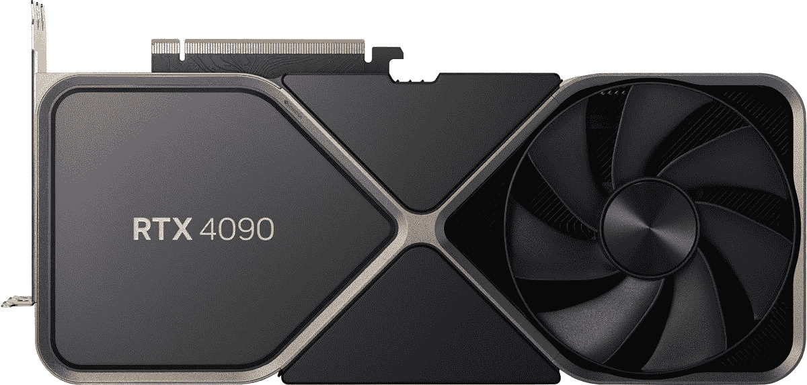
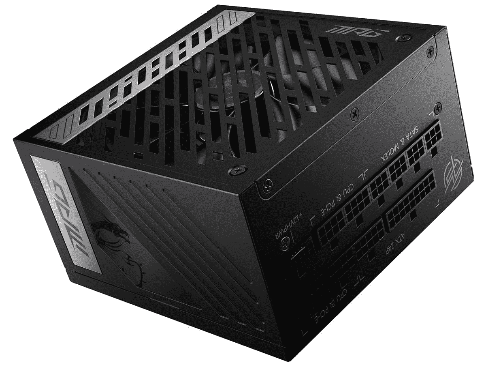

# 英伟达 RTX 4090 需要新电源吗？

> 原文：<https://www.xda-developers.com/power-supply-nvidia-rtx-4090/>

自从 Nvidia RTX 4090 首次亮相以来，人们对它有了更多的了解:它巨大的尺寸，同样巨大的功率，以及实际使用它所需的功率。也有一些人再次关注 Nvidia 在卡本身上使用迄今为止不常见的电源连接器。

在这种情况下，Nvidia 已经选择了一种很快就会(我们希望)变得更加普遍的连接器。随着新的 ATX 3.0 电源标准开始推出，你将能够在 PSU 和显卡之间运行一根电缆，就像你现在可以在大多数情况下一样。但现在，我们大多数人将使用 RTX 4090 包装盒内的适配器。但好消息是你不一定需要一个新的电源。

## 英伟达 RTX 4090 电源要求

英伟达的英伟达 RTX 4090 创始人版额定功率为 450 瓦，该公司建议您的 RTX 4090 电脑至少配备 850 瓦电源。然而，由于您可能会将它与其他一些高端硬件配对，实际上，您将会看到 1000 瓦以上，以给自己一些余量。

你将连接你的 RTX 4090 和基本上所有电源之间的适配器。您还需要将四根 PCIe 8 针(6+2)电源线从电源接入适配器，然后将适配器接入 RTX 4090。很乱，但现在很有必要。至少这意味着你不需要一个在 RTX 4090 发布时几乎不存在的电源。

一些公司将为他们现有的电源提供电缆，从而不再需要这种适配器。例如，海盗船公司(Corsair)已经在 T2 确认了这样做的计划。与你的制造商核实一下，看看他们是否在做同样的事情，从长远来看，这可能是一个更好的解决方案。它当然更整洁。

 <picture></picture> 

Nvidia RTX 4090 Founders Edition

##### 英伟达 RTX 4090 创始人版

作为消费级显卡无可争议的重量级冠军，RTX 4090 无可匹敌

## 连接器和新电源

RTX 4080 上的电源连接器是一个 12 针 12VHPWR。它符合新的 PCIe 5.0 高功率标准，能够在单条电缆上维持 600 瓦的功率，并将在 ATX 3.0 电源上变得更加常见。然而，你现在还不能得到它们，而且还没有发布很多。[微星已经展示了它的第一个 ATX 3.0](https://www.msi.com/blog/msis-meg-ai1300p-pcie5-is-the-worlds-first-atx-30-compliant-psu) 单元，但要得到它还是有点棘手。

最终，这将成为规范，我们将使用 12VHPWR 来连接显卡，而无需任何适配器。目前，我们正处于过渡期。这至少意味着，如果你有一个足够大的电源，你可以享受 Nvidia 的最新和最好的，而不需要额外的费用。但如果你能买到一辆 ATX 3.0 PSU，比如微星 MPG A1000G，那么对未来来说这是一笔值得的投资。

同样值得注意的是，12VHPWR 连接器存在一些争议，特别是 Nvidia 推出的适配器。有[多个关于它们熔化](https://www.xda-developers.com/nvidia-rtx-4090-power-connectors-melting/)的报告，弯曲和质量差的连接是导致熔化的原因之一。专用电缆似乎不太容易受到影响，因此如果可以的话，购买一台 ATX 3.0 PSU 可能会更有价值。

 <picture></picture> 

MSI MPG A1000G

##### 微星 MPG A1000G

RTX 4090 上使用的首批带有 12VHPWR 连接器的 ATX 3.0 PSU 之一。对未来来说，这是一项值得的投资(如果你能得到的话)。